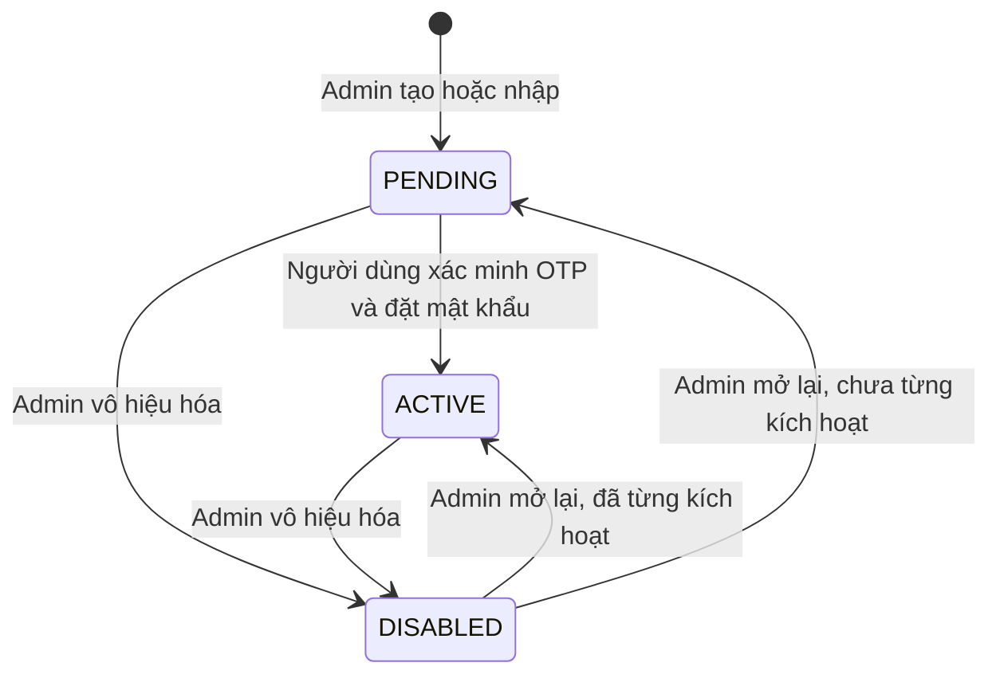

# U01 Account & Access - Domain Entities

Thiết kế độc lập công nghệ. Kiểu dữ liệu ghi ở mức nghiệp vụ; kiểu cột cuối cùng chốt ở Code Generation. Truy vết: `US-IAM-001`…`US-IAM-007`, `UC-IAM-01`…`UC-IAM-12`.

## 1. Tổng quan

| Entity | Loại | Lưu ở | Unit ghi |
|---|---|---|---|
| `Account` | Aggregate root | `accounts` | U01 |
| `PasswordCredential` | Value object của `Account` | `accounts` | U01 |
| `Profile` | Value object của `Account` | `accounts` | U01 |
| `LoginThrottle` | Value object của `Account` | `accounts` | U01 |
| `CreditBalance` | Value object của `Account` | `accounts` | U07 |
| `AppSetting` | Entity cấu hình dùng chung | `app_settings` | U01 tạo bảng; mỗi unit ghi khóa của mình |
| `OtpChallenge` | Entity tạm thời | Redis | U01 |
| `Session` | Entity tạm thời | Redis | U01 |
| `RequestThrottle` | Bộ đếm tạm thời | Redis | U01 |
| `AccountImportResult` | Kết quả trả về | Không lưu | U01 |
| `AuthorizationDecision` | Kết quả trả về | Không lưu | U01 |

U01 **không** sở hữu: phân công môn/lớp (U04), audit (U02), file ảnh (U03), nghiệp vụ credit (U07).

## 2. `Account`

| Thuộc tính | Ý nghĩa | Ràng buộc |
|---|---|---|
| `accountId` | Định danh | Bất biến |
| `schoolEmail` | Email trường, dùng đăng nhập | Bắt buộc; chuẩn hóa chữ thường, bỏ khoảng trắng; duy nhất toàn hệ thống; thuộc tên miền trong `u01.allowedEmailDomains`; **không đổi sau khi tạo** |
| `role` | Vai trò cao nhất | `LEARNER`, `INSTRUCTOR`, `SUBJECT_MANAGER`, `ADMIN` |
| `status` | Trạng thái vòng đời | `PENDING`, `ACTIVE`, `DISABLED` |
| `credential` | `PasswordCredential` | Rỗng khi `PENDING` |
| `profile` | `Profile` | Bắt buộc có `displayName` |
| `throttle` | `LoginThrottle` | Mặc định không khóa |
| `credentialVersion` | Số phiên bản quyền | Tăng khi đổi mật khẩu, đổi role, vô hiệu hóa; mọi phiên có version cũ không làm mới được |
| `credit` | `CreditBalance` | Do U07 ghi; U01 không đọc/ghi |
| `createdAt`, `updatedAt`, `version` | Thời gian và khóa lạc quan | Hệ thống quản lý |

### Trạng thái

**Text alternative**: Tài khoản sinh ra ở `PENDING`. Người dùng xác minh OTP và đặt mật khẩu thì sang `ACTIVE`. Admin có thể chuyển `PENDING` hoặc `ACTIVE` sang `DISABLED`. Khi mở lại, tài khoản đã từng có mật khẩu về `ACTIVE`, chưa từng có mật khẩu về `PENDING`. Không có trạng thái `LOCKED`; khóa tạm do nhập sai là `LoginThrottle`.

## 3. `PasswordCredential`

| Thuộc tính | Ý nghĩa |
|---|---|
| `passwordHash` | Băm bằng thuật toán thích ứng; không bao giờ lưu hay ghi log bản rõ |
| `passwordChangedAt` | Lần đặt/đổi mật khẩu gần nhất |

## 4. `Profile`

| Thuộc tính | Ràng buộc |
|---|---|
| `displayName` | Bắt buộc, 1-150 ký tự sau khi cắt khoảng trắng |
| `phoneNumber` | Tùy chọn; chỉ chữ số, dấu `+` ở đầu, 8-15 chữ số; là dữ liệu cá nhân, không ghi log |
| `avatarRef` | Tùy chọn; tham chiếu ảnh do `AvatarPort` (U03) xác nhận; U01 không lưu byte ảnh |

## 5. `LoginThrottle`

| Thuộc tính | Ý nghĩa |
|---|---|
| `failedLoginCount` | Số lần sai liên tiếp |
| `lockedUntil` | Mốc tự mở khóa; rỗng nếu không khóa |

## 6. `CreditBalance`

| Thuộc tính | Ý nghĩa |
|---|---|
| `freeBalance` | Credit tặng còn lại trong tháng |
| `freePeriod` | Tháng của phần tặng (`yyyy-MM`) |
| `purchasedBalance` | Credit đã mua còn lại |

U07 ghi, khóa dòng tài khoản khi giữ/trừ credit và luôn ghi sổ cái trong cùng transaction. Quy tắc nghiệp vụ ở U07.

## 7. `AppSetting`

| Thuộc tính | Ý nghĩa |
|---|---|
| `key` | Khóa có tiền tố unit, ví dụ `u01.allowedEmailDomains`, `u07.monthlyFreeCredits`, `u13.killSwitch` |
| `value` | JSON |
| `updatedBy`, `updatedAt` | ADMIN sửa gần nhất |

Mỗi unit chỉ đọc/ghi khóa có tiền tố của mình; mọi thay đổi ghi audit. Khóa của U01: `u01.allowedEmailDomains` (danh sách tên miền email trường).

## 8. `OtpChallenge`

| Thuộc tính | Ràng buộc |
|---|---|
| `purpose` | `ACTIVATION` hoặc `PASSWORD_RESET` |
| `accountId` | Tài khoản đích |
| `codeHash` | Băm của mã 6 chữ số; không lưu bản rõ |
| `expiresAt` | Tạo lúc + 10 phút |
| `attemptsLeft` | Bắt đầu 5; về 0 thì xóa challenge |

Mỗi `(accountId, purpose)` có tối đa **một** challenge còn hiệu lực. Tạo mã mới xóa mã cũ.

## 9. `Session`

| Thuộc tính | Ý nghĩa |
|---|---|
| `sessionId` | Định danh phiên |
| `accountId` | Chủ phiên |
| `credentialVersion` | Version lúc tạo; lệch với `Account.credentialVersion` thì không làm mới được |
| `refreshTokenHash` | Băm refresh token; phát hiện dùng lại thì thu hồi phiên |
| `issuedAt`, `lastUsedAt`, `expiresAt` | Idle 2 giờ tính từ `lastUsedAt`, tối đa 7 ngày tính từ `issuedAt`. Access token JWT sống 15 phút, không lưu phía server |

## 10. `RequestThrottle`

Bộ đếm theo `(hành động, email chuẩn hóa)` và `(hành động, client)` cho: đăng nhập, yêu cầu OTP kích hoạt, yêu cầu OTP đặt lại. Ngưỡng cụ thể ở NFR Requirements.

## 11. `AccountImportResult`

Không có use case xem lại lịch sử nhập nên kết quả không lưu. Bước kiểm tra trả kết quả ngay trong response; bước xác nhận gửi lại cùng file, hệ thống kiểm lại rồi tạo các dòng hợp lệ trong một transaction. Nhập lại cùng file không tạo trùng vì email đã tồn tại bị báo lỗi dòng (BR-U01-82). Mỗi lần xác nhận ghi một sự kiện audit (người nhập, checksum file, số dòng tạo/lỗi).

| Thuộc tính | Ý nghĩa |
|---|---|
| `fileChecksum` | SHA-256 của file, ghi vào audit |
| `rows` | Danh sách `ImportRowResult` |
| `createdCount`, `rejectedCount` | Tổng kết |

`ImportRowResult`:

| Thuộc tính | Ý nghĩa |
|---|---|
| `rowNumber` | Số dòng trong CSV |
| `schoolEmail`, `displayName`, `role` | Dữ liệu đọc được |
| `outcome` | `CREATED`, `REJECTED` |
| `reason` | Mã lỗi: `EMAIL_EXISTS`, `EMAIL_DOMAIN_NOT_ALLOWED`, `INVALID_EMAIL`, `INVALID_ROLE`, `DUPLICATE_IN_FILE`, `MISSING_FIELD` |

## 12. `AuthorizationDecision`

| Thuộc tính | Ý nghĩa |
|---|---|
| `allowed` | Có/không |
| `reasonCode` | Mã lý do an toàn cho log, không trả chi tiết cho client |
| `actorId`, `action`, `resourceRef` | Đầu vào đã đánh giá |

Phạm vi môn/lớp đến từ `SubjectScopePort`, `ClassScopePort` (U04 cài). U01 kết hợp role và phạm vi để ra quyết định.

## 13. Contract

### Port U01 cung cấp

| Port | Dùng bởi | Ghi chú |
|---|---|---|
| `AuthorizationPort.authorize(actor, action, resourceRef)` | Mọi unit | Mặc định từ chối; kết hợp role và phạm vi U04 |
| `AccountLookupPort` | U04, U16 | Tìm người học theo email/tên (≤ 20 kết quả), tra theo danh sách email, lấy email/tên hiển thị/role/trạng thái; không trả mật khẩu hay số điện thoại |

### Port U01 dùng

| Port | Cung cấp bởi | Cạnh | Dùng để |
|---|---|---|---|
| `AuditPort.recordAudit` | U02 | `C` | Ghi sự kiện bảo mật/nghiệp vụ |
| `JobPort.enqueue` | U02 | `C` | Tạo job gửi OTP trong cùng giao dịch; U02 gửi sang RabbitMQ sau commit; handler gửi mail do U01 sở hữu, chạy ở worker, retry hữu hạn |
| `AvatarPort` | U01 khai báo, U03 cài | `C` | Xác nhận ảnh thuộc người dùng, đúng mục đích `AVATAR` |
| `SubjectScopePort`, `ClassScopePort` | U01 khai báo, U04 cài | `C` | Đọc phạm vi phân công khi quyết định quyền và khi chặn hạ role |

Trước khi U03/U04 được code, U01 dùng adapter tạm (xem code generation plan).
