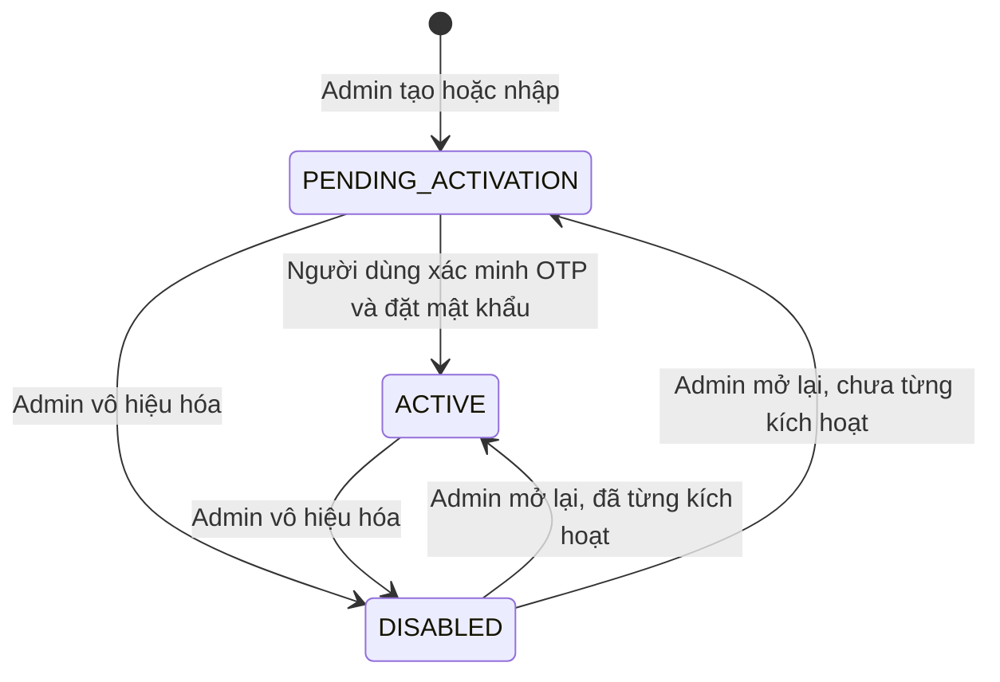

# U01 Account & Access - Domain Entities

Thiết kế độc lập công nghệ. Kiểu dữ liệu ghi ở mức nghiệp vụ; kiểu cột cuối cùng chốt ở Code Generation. Truy vết: `US-IAM-001`…`US-IAM-007`, `UC-IAM-01`…`UC-IAM-12`.

## 1. Tổng quan

| Entity | Loại | Lưu ở | Sở hữu |
|---|---|---|---|
| `Account` | Aggregate root | PostgreSQL `accounts` | U01 |
| `PasswordCredential` | Value object trong `Account` | Cột của `accounts` | U01 |
| `Profile` | Value object trong `Account` | Cột của `accounts` | U01 |
| `LoginThrottle` | Value object trong `Account` | Cột của `accounts` | U01 |
| `OtpChallenge` | Entity tạm thời | Redis, có TTL | U01 |
| `Session` | Entity tạm thời | Redis, có TTL | U01 |
| `RequestThrottle` | Bộ đếm tạm thời | Redis, có TTL | U01 |
| `AllowedEmailDomains` | Cấu hình | `platform_settings` | U01 |
| `AccountImportBatch` | Entity | PostgreSQL | U01 |
| `AuthorizationDecision` | Value object trả về | Không lưu | U01 |

U01 **không** sở hữu: phân công môn/lớp (U04), audit (U02), file ảnh (U03).

## 2. Account

| Thuộc tính | Ý nghĩa | Ràng buộc |
|---|---|---|
| `accountId` | Định danh | Bất biến |
| `schoolEmail` | Email trường, dùng đăng nhập | Bắt buộc; chuẩn hóa chữ thường, bỏ khoảng trắng; duy nhất toàn hệ thống; thuộc `AllowedEmailDomains`; **không đổi sau khi tạo** |
| `role` | Vai trò cao nhất | `LEARNER`, `INSTRUCTOR`, `SUBJECT_MANAGER`, `ADMIN` |
| `status` | Trạng thái vòng đời | `PENDING_ACTIVATION`, `ACTIVE`, `DISABLED` |
| `credential` | `PasswordCredential` | Rỗng khi `PENDING_ACTIVATION` |
| `profile` | `Profile` | Bắt buộc có `displayName` |
| `throttle` | `LoginThrottle` | Mặc định không khóa |
| `credentialVersion` | Số phiên bản quyền | Tăng khi đổi mật khẩu, đổi role, vô hiệu hóa; mọi phiên có version cũ hết hiệu lực |
| `createdAt`, `updatedAt`, `version` | Thời gian và khóa lạc quan | Hệ thống quản lý |

### Trạng thái

**Text alternative**: Tài khoản sinh ra ở `PENDING_ACTIVATION`. Người dùng xác minh OTP và đặt mật khẩu thì sang `ACTIVE`. Admin có thể chuyển `PENDING_ACTIVATION` hoặc `ACTIVE` sang `DISABLED`. Khi mở lại, tài khoản đã từng có mật khẩu về `ACTIVE`, chưa từng có mật khẩu về `PENDING_ACTIVATION`. Không có trạng thái `LOCKED`; khóa tạm do nhập sai là `LoginThrottle`.

## 3. Value object

### PasswordCredential

| Thuộc tính | Ý nghĩa |
|---|---|
| `passwordHash` | Băm bằng thuật toán thích ứng; không bao giờ lưu hay ghi log bản rõ |
| `passwordChangedAt` | Lần đặt/đổi mật khẩu gần nhất |

### Profile

| Thuộc tính | Ràng buộc |
|---|---|
| `displayName` | Bắt buộc, 1-150 ký tự sau khi cắt khoảng trắng |
| `phoneNumber` | Tùy chọn; chỉ chữ số, dấu `+` ở đầu, 8-15 chữ số; là dữ liệu cá nhân, không ghi log |
| `avatarRef` | Tùy chọn; tham chiếu ảnh do `AvatarPort` (U03) cấp; U01 không lưu byte ảnh |

### LoginThrottle

| Thuộc tính | Ý nghĩa |
|---|---|
| `failedLoginCount` | Số lần sai liên tiếp |
| `lockedUntil` | Mốc tự mở khóa; rỗng nếu không khóa |

## 4. Entity tạm thời (Redis)

### OtpChallenge

| Thuộc tính | Ràng buộc |
|---|---|
| `purpose` | `ACTIVATION` hoặc `PASSWORD_RESET` |
| `accountId` | Tài khoản đích |
| `codeHash` | Băm của mã 6 chữ số; không lưu bản rõ |
| `expiresAt` | Tạo lúc + 10 phút |
| `attemptsLeft` | Bắt đầu 5; về 0 thì xóa challenge |

Mỗi `(accountId, purpose)` có tối đa **một** challenge còn hiệu lực. Tạo mã mới xóa mã cũ.

### Session

| Thuộc tính | Ý nghĩa |
|---|---|
| `sessionId` | Định danh phiên |
| `accountId` | Chủ phiên |
| `credentialVersion` | Version lúc tạo; lệch với `Account.credentialVersion` thì phiên vô hiệu |
| `refreshTokenHash` | Băm refresh token; phát hiện dùng lại thì thu hồi phiên |
| `issuedAt`, `lastUsedAt`, `expiresAt` | Idle 2 giờ tính từ `lastUsedAt`, tối đa 7 ngày tính từ `issuedAt`. Access token JWT sống 15 phút, không lưu phía server |

### RequestThrottle

Bộ đếm theo `(hành động, email chuẩn hóa)` và `(hành động, client)` cho: đăng nhập, yêu cầu OTP kích hoạt, yêu cầu OTP đặt lại. Ngưỡng cụ thể chốt ở NFR Requirements.

## 5. Nhập hàng loạt

### AccountImportBatch

| Thuộc tính | Ý nghĩa |
|---|---|
| `batchId` | Định danh lô |
| `fileChecksum` | Chống xử lý lại cùng file |
| `requestedBy` | Admin thực hiện |
| `status` | `VALIDATED`, `COMMITTED`, `REJECTED` |
| `rows` | Danh sách `ImportRowResult` |

### ImportRowResult

| Thuộc tính | Ý nghĩa |
|---|---|
| `rowNumber` | Số dòng trong CSV |
| `schoolEmail`, `displayName`, `role` | Dữ liệu đọc được |
| `outcome` | `CREATED`, `REJECTED` |
| `reason` | Mã lỗi: `EMAIL_EXISTS`, `EMAIL_DOMAIN_NOT_ALLOWED`, `INVALID_EMAIL`, `INVALID_ROLE`, `DUPLICATE_IN_FILE`, `MISSING_FIELD` |

## 6. Quyết định phân quyền

### AuthorizationDecision

| Thuộc tính | Ý nghĩa |
|---|---|
| `allowed` | Có/không |
| `reasonCode` | Mã lý do an toàn cho log, không trả chi tiết cho client |
| `actorId`, `action`, `resourceRef` | Đầu vào đã đánh giá |

Phạm vi môn/lớp đến từ contract của U04 (`SubjectScopePort`, `ClassScopePort`). U01 kết hợp role và phạm vi để ra quyết định.

## 7. Port U01 phụ thuộc

| Port | Cung cấp bởi | Cạnh | Dùng để |
|---|---|---|---|
| `AuditPort.recordAudit` | U02 | Contract | Ghi sự kiện bảo mật/nghiệp vụ |
| `JobPort.enqueue` | U02 | Contract | Tạo job gửi OTP trong cùng giao dịch, U02 gửi sang RabbitMQ sau commit; handler gửi mail do U01 sở hữu, chạy ở worker qua Mail/Notification Port và retry hữu hạn. Không chờ U16 (wave 4) |
| `AvatarPort` | U03 | `C` | Xác nhận ảnh thuộc người dùng, đúng mục đích `AVATAR`, lấy tham chiếu hiển thị |
| `SubjectScopePort`, `ClassScopePort` | U04 | Contract | Đọc phạm vi phân công khi quyết định quyền và khi chặn hạ role |

## 8. Ghi chú dữ liệu

Bảng của U01 được định nghĩa tại tài liệu này, Infrastructure Design và migration trong code generation plan.
