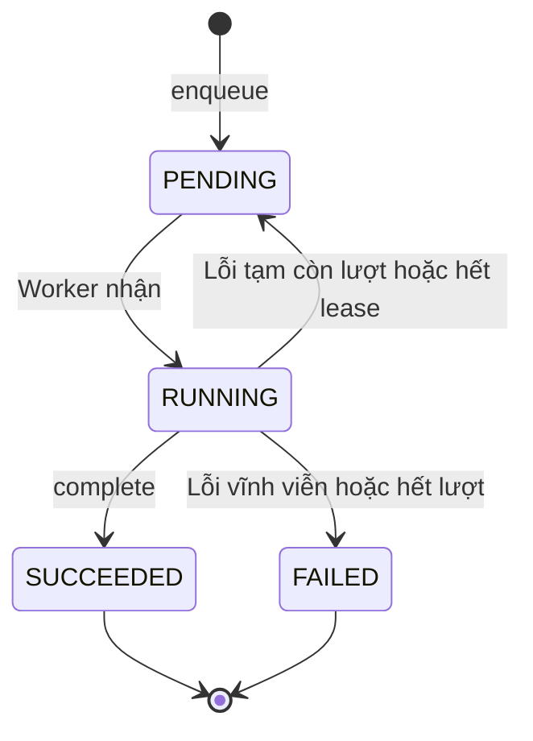

# U02 Audit, Job & Event - Domain Entities

Thiết kế độc lập công nghệ. Truy vết: `US-AUD-001`, `UC-OPS-02`. Tên thư mục `u02-audit-job-and-outbox` giữ từ bản cũ; unit không có bảng outbox.

## 1. Tổng quan

| Entity | Loại | Lưu ở | Unit ghi |
|---|---|---|---|
| `AuditEvent` | Entity bất biến | `audit_events` | U02 (mọi unit gửi qua `AuditPort`) |
| `Job` | Aggregate root | `jobs` | U02 (unit sở hữu `jobType` tạo và xử lý kết quả) |
| `JobMessage` | Message | RabbitMQ | U02 |
| `DomainEventMessage` | Message (chỉ cho thông báo) | RabbitMQ | U02 (unit nguồn phát qua `EventPublisherPort`) |

U02 **không** sở hữu: quyết định nghiệp vụ của job (unit sở hữu `jobType`), quyền đọc audit/job (U01).

## 2. `AuditEvent`

| Thuộc tính | Ràng buộc |
|---|---|
| `eventId` | Định danh; dùng làm khóa chống ghi trùng |
| `actorId` | Có thể rỗng khi actor là hệ thống |
| `actorType` | `USER`, `WORKER`, `SYSTEM` |
| `action` | Mã hành động ổn định, ví dụ `ROLE_CHANGED` |
| `resourceType`, `resourceId` | Đối tượng bị tác động |
| `result` | `SUCCESS`, `DENIED`, `FAILURE` |
| `beforeData`, `afterData` | JSON đã che dữ liệu nhạy cảm, có thể rỗng |
| `correlationId` | Nối với log và request |
| `occurredAt` | Thời điểm xảy ra do unit gọi cung cấp, không phải lúc lưu |

Không có thao tác sửa hoặc xóa. Giữ **vĩnh viễn**.

## 3. `Job`

| Thuộc tính | Ràng buộc |
|---|---|
| `jobId` | Định danh; gửi kèm message |
| `jobType` | Ví dụ `OTP_DELIVERY`, `DEADLINE_REMINDER`; mỗi loại do đúng một unit sở hữu |
| `ownerUnit` | Unit xử lý kết quả |
| `requestedBy` | `accountId` người tạo; rỗng nếu hệ thống tạo |
| `payloadRef` | JSON chỉ chứa ID/tham chiếu, không chứa bí mật |
| `idempotencyKey` | Duy nhất theo `jobType`; tạo lại cùng khóa trả về job cũ |
| `status` | `PENDING`, `RUNNING`, `SUCCEEDED`, `FAILED` |
| `attempts`, `maxAttempts` | Mặc định tối đa 5 |
| `nextAttemptAt` | Mốc được chạy/thử lại (dùng cả cho job hẹn giờ như mở/đóng bài, nhắc hạn) |
| `lastPublishedAt` | Lần gửi RabbitMQ gần nhất |
| `leaseOwner`, `leaseExpiresAt` | Worker đang giữ job |
| `resultRef` | Tham chiếu kết quả do unit sở hữu lưu |
| `failureClass`, `safeMessage` | Lý do lỗi đã lọc, hiển thị được |
| `correlationId`, `createdAt`, `updatedAt` | |

### Trạng thái

**Text alternative**: Job tạo ra ở `PENDING`. Worker nhận thì sang `RUNNING`. Thành công sang `SUCCEEDED`. Lỗi tạm còn lượt, hoặc worker giữ quá hạn lease, thì về `PENDING` chờ lần sau; lỗi vĩnh viễn hoặc hết lượt thì sang `FAILED`. `SUCCEEDED` và `FAILED` là trạng thái cuối.

## 4. `JobMessage`

`{ schemaVersion, jobId, jobType, correlationId }`, gửi tới exchange `jobs` với routing key = `jobType`, vào 1 trong 8 queue (BR-U02-33). Worker đọc chi tiết job qua U02, không tin nội dung message.

## 5. `DomainEventMessage`

`{ schemaVersion, eventId, eventType, sourceUnit, occurredAt, correlationId, payload }`, gửi sau commit lên `platform.events`, **chỉ cho thông báo** (U16 nghe bằng queue `jobs.notification`). Audit không đi qua message. Payload không chứa bí mật.

## 6. Contract

### Port U02 cung cấp

| Port | Dùng bởi |
|---|---|
| `AuditPort.record(event)` | Mọi unit; ghi trong transaction của unit gọi |
| `AuditQueryPort.query(actor, filters, page)` | Trang audit của admin |
| `JobPort.enqueue(jobType, payloadRef, idempotencyKey, requestedBy)` | Mọi unit có tác vụ nền |
| `JobPort.getStatus(actor, jobId)` | Frontend qua API |
| `JobWorkerPort.claim / complete / fail` | Worker |
| `EventPublisherPort.publish(event)` | Unit phát sự kiện cho thông báo U16 |

### Port U02 dùng

| Port | Unit | Cạnh |
|---|---|---|
| `AuthorizationPort.authorize` | U01 | `C` - chỉ cho API đọc audit/job |
