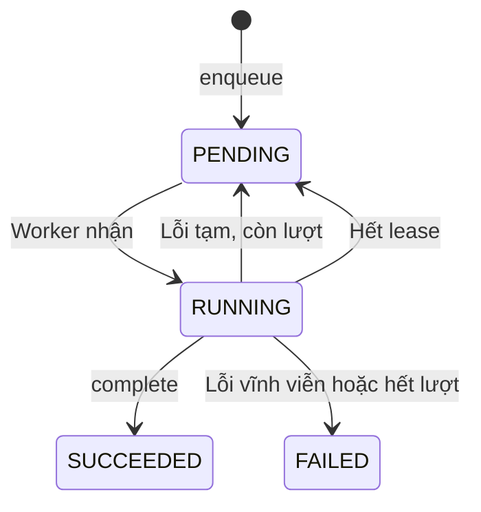

# U02 Audit, Job & Event - Domain Entities

Truy vết: `US-AUD-001`, `UC-OPS-02`. Tên thư mục `u02-audit-job-and-outbox` giữ từ bản cũ; unit hiện tên "Audit, Job & Event" và **không có bảng outbox**.

## 1. Tổng quan

| Entity | Loại | Lưu ở |
|---|---|---|
| `AuditEvent` | Bất biến | PostgreSQL `audit_events` |
| `Job` | Aggregate | PostgreSQL `jobs` |
| `JobMessage` | Message | RabbitMQ |
| `DomainEventMessage` | Message | RabbitMQ |

## 2. AuditEvent

Cấu trúc bảng `audit_events`:

| Thuộc tính | Ràng buộc |
|---|---|
| `eventId` | Định danh; dùng làm khóa chống ghi trùng |
| `actorId` | Có thể rỗng khi actor là hệ thống |
| `actorType` | `USER`, `WORKER`, `SYSTEM` |
| `action` | Mã hành động ổn định, ví dụ `ROLE_CHANGED` |
| `resourceType`, `resourceId` | Đối tượng bị tác động |
| `result` | `SUCCESS`, `DENIED`, `FAILURE` |
| `beforeData`, `afterData` | JSON đã che dữ liệu nhạy cảm, có thể rỗng |
| `correlationId` | Nối với log và request |
| `occurredAt` | Thời điểm xảy ra do unit gọi cung cấp, không phải lúc lưu |

Không có thao tác sửa hoặc xóa. Giữ **vĩnh viễn**.

## 3. Job

| Thuộc tính | Ràng buộc |
|---|---|
| `jobId` | Định danh; gửi kèm message |
| `jobType` | Ví dụ `U01_OTP_DELIVERY`; mỗi loại do đúng một unit sở hữu |
| `ownerUnit` | Unit xử lý kết quả |
| `requestedBy` | `accountId` người tạo; rỗng nếu hệ thống tạo |
| `payloadRef` | JSON chỉ chứa ID/tham chiếu, không chứa bí mật |
| `idempotencyKey` | Duy nhất theo `jobType`; tạo lại cùng khóa trả về job cũ |
| `status` | `PENDING`, `RUNNING`, `SUCCEEDED`, `FAILED` |
| `attempts`, `maxAttempts` | Mặc định tối đa 5 |
| `nextAttemptAt` | Mốc được thử lại |
| `lastPublishedAt` | Lần gửi RabbitMQ gần nhất |
| `leaseOwner`, `leaseExpiresAt` | Worker đang giữ job |
| `resultRef` | Tham chiếu kết quả do unit sở hữu lưu |
| `failureClass`, `safeMessage` | Lý do lỗi đã lọc, hiển thị được |
| `correlationId`, `createdAt`, `updatedAt` | |

### Trạng thái

**Text alternative**: Job tạo ra ở `PENDING`. Worker nhận thì sang `RUNNING`. Thành công sang `SUCCEEDED`. Lỗi tạm còn lượt thì về `PENDING` chờ lần sau; lỗi vĩnh viễn hoặc hết lượt thì sang `FAILED`. Worker giữ job quá hạn lease thì job về `PENDING`. `SUCCEEDED` và `FAILED` là trạng thái cuối.

## 4. Message

### JobMessage
`{ schemaVersion, jobId, jobType, correlationId }`. Worker đọc chi tiết từ bảng `jobs`.

### DomainEventMessage
`{ schemaVersion, eventId, eventType, sourceUnit, occurredAt, correlationId, payload }` dùng cho audit và sự kiện nghiệp vụ gửi U16. Payload không chứa bí mật.

## 5. Port U02 cung cấp

| Port | Dùng bởi |
|---|---|
| `AuditPort.record(event)` | Mọi unit |
| `AuditQueryPort.query(actor, filters, page)` | Admin Console |
| `JobPort.enqueue(jobType, payloadRef, idempotencyKey, requestedBy)` | Mọi unit có tác vụ nền |
| `JobPort.getStatus(actor, jobId)` | Frontend qua API |
| `JobWorkerPort.claim / complete / fail` | Worker |
| `EventPublisherPort.publish(event)` | Unit phát sự kiện nghiệp vụ |

## 6. Port U02 dùng

| Port | Unit | Cạnh |
|---|---|---|
| `AuthorizationPort.authorize` | U01 | `C` - chỉ cho API đọc audit/job |
