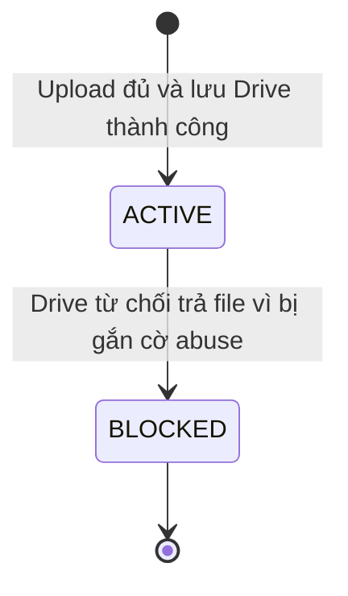

# U03 File & Artifact - Domain Entities

Thiết kế độc lập công nghệ. Unit hạ tầng, không có use case/story riêng; phục vụ U01 (ảnh đại diện), U05 (học liệu), U06/U09/U11/U14 (ảnh trong tài liệu).

## 1. Tổng quan

| Entity | Loại | Lưu ở | Unit ghi |
|---|---|---|---|
| `Artifact` | Aggregate root | `artifacts` (metadata); byte file ở Google Shared Drive | U03 |
| `ArtifactPurpose` | Value object (danh mục cố định) | Code | U03 |
| `DownloadToken` | Entity tạm thời | Redis | U03 |

U03 **không** sở hữu: nội dung nghiệp vụ, bài nộp, quyết định ai được xem file (unit sở hữu đối tượng tự kiểm quyền rồi mới xin token).

## 2. `Artifact`

| Thuộc tính | Ràng buộc |
|---|---|
| `artifactId` | Định danh |
| `ownerAccountId` | Người tải lên |
| `purpose` | Một giá trị của `ArtifactPurpose` |
| `scopeType`, `scopeId` | Đối tượng nghiệp vụ gắn file, do unit gọi truyền vào; có thể rỗng lúc tải lên |
| `storageProvider` | `GOOGLE_DRIVE` |
| `providerFileId`, `driveId` | Định danh trên Drive; không bao giờ trả cho frontend |
| `originalFileName` | Đã làm sạch ký tự điều khiển và đường dẫn |
| `mediaType` | Xác định từ nội dung file, không tin header trình duyệt |
| `byteSize` | ≤ trần của `purpose` |
| `checksum` | SHA-256 |
| `status` | `ACTIVE`, `BLOCKED` |
| `createdAt` | |

Byte file không đổi sau khi tạo. Chỉ `status` và `scopeType`/`scopeId` (một lần) được cập nhật. Không có file dẫn xuất và không xóa file.

### Trạng thái

**Text alternative**: File chỉ được tạo khi đã lưu Drive thành công, ở trạng thái `ACTIVE`. Nếu Drive từ chối trả file vì gắn cờ abuse, file chuyển `BLOCKED` và không cấp token tải được nữa. Không có đường quay lại.

## 3. `ArtifactPurpose`

| Giá trị | Loại file | Trần | Dùng bởi |
|---|---|---|---|
| `AVATAR` | JPG, PNG, WebP | 50 MB | U01 |
| `MATERIAL` | PDF, DOCX, PPTX | 50 MB | U05 |
| `DOCUMENT_IMAGE` | PNG, JPEG, GIF, SVG | 5 MB | U06, U09, U11, U14 (ảnh trong khung đề, bài làm, tài liệu nhóm) |

Không có loại file cho Draw.io: XML sơ đồ nằm trong block `DIAGRAM` của tài liệu (U09). Caption YouTube lưu ở U05; tài liệu xuất DOCX tại chỗ (U09); U16 xuất bảng điểm CSV/XLSX theo yêu cầu, không lưu tệp xuất.

## 4. `DownloadToken`

| Thuộc tính | Ràng buộc |
|---|---|
| `token` | Ngẫu nhiên 256 bit; Redis lưu băm |
| `artifactId`, `accountId` | Token chỉ dùng được bởi đúng người được cấp |
| `expiresAt` | 5 phút |
| `disposition` | `inline` hoặc `attachment` |

Token dùng lại nhiều lần trong 5 phút (để ảnh và PDF viewer tải từng phần).

## 5. Contract

### Port U03 cung cấp

| Port | Dùng bởi |
|---|---|
| `ArtifactPort.store(actor, purpose, file)` | API upload chung |
| `ArtifactPort.attach(artifactId, scopeType, scopeId, actor)` | Unit sở hữu khi gắn file vào đối tượng |
| `ArtifactPort.issueDownloadToken(artifactId, accountId)` | Unit sở hữu, **sau khi** tự kiểm quyền |
| `ArtifactPort.open(artifactId)` | Worker U05 đọc học liệu để trích chữ cho RAG |
| `AvatarPort.validateAvatar(artifactId, actor)` | U01 (U01 khai báo, U03 cài) |

### Port U03 dùng

| Port | Unit | Cạnh |
|---|---|---|
| `AuthorizationPort` | U01 | `H` - kiểm đăng nhập và role được phép upload mục đích đó |
| `AuditPort`, `JobPort` | U02 | `H` - audit; job dọn file Drive còn sót khi upload lỗi |
