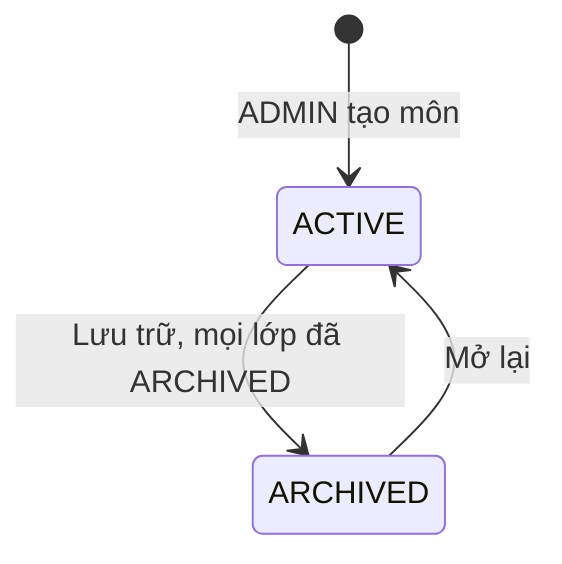
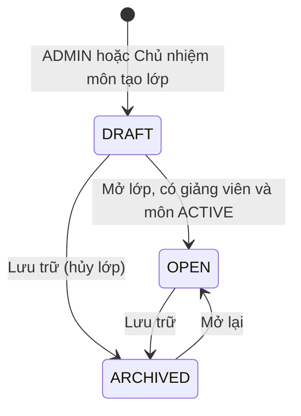
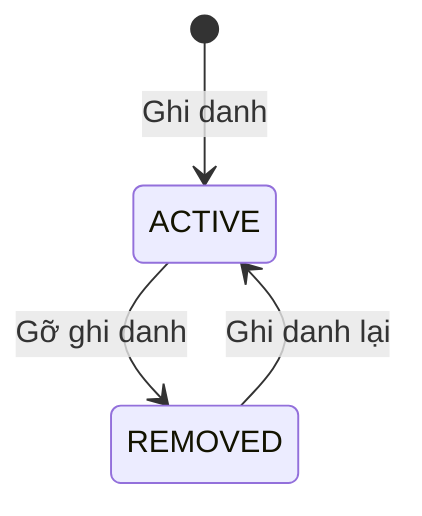

# U04 Subject, Class, Enrollment & Learning Access - Domain Entities

Thiết kế độc lập công nghệ. Truy vết: `US-CAT-001`…`003`, `US-CAT-005`, `US-LRN-001`; UC 8, UC 9, UC 10, UC 12, UC 19; cấp số đếm cho UC 18 View Statistics (U16).

## 1. Tổng quan

| Entity | Loại | Lưu ở | Unit ghi |
|---|---|---|---|
| `Subject` | Aggregate root | `subjects` | U04 |
| `CourseClass` | Aggregate root | `course_classes` | U04 |
| `InviteCode` | Value object của `CourseClass` | `course_classes` (`invite_code`, `invite_enabled`, `invite_expires_at`) | U04 |
| `Enrollment` | Bảng nối ACCOUNT–COURSE_CLASS | `enrollments` (PK `class_id`, `account_id`) | U04 |
| `StudentClassView` | Kết quả tính (lớp của người học + học liệu đang hiển thị) | Không lưu | U04 |

U04 **không** sở hữu: tài khoản và role (U01), nội dung (U05), thanh toán (U07), thông báo (U16), audit (U02).

## 2. `Subject`

| Thuộc tính | Kiểu | Ràng buộc |
|---|---|---|
| `id` | UUID | Khóa |
| `code` | chuỗi ≤ 20 | Chữ hoa, số, `-`; duy nhất; **không đổi** sau khi tạo |
| `name` | chuỗi ≤ 200 | Bắt buộc |
| `description` | chuỗi ≤ 2000 | Tùy chọn |
| `status` | enum | `ACTIVE`, `ARCHIVED` |
| `managerAccountId` | UUID | Cột `manager_id` → `accounts`; Chủ nhiệm môn; có thể rỗng; tối đa 1 người |
| `version` | số | Khóa lạc quan |

### Trạng thái

```mermaid
stateDiagram-v2
    [*] --> ACTIVE: ADMIN tạo môn
    ACTIVE --> ARCHIVED: Lưu trữ, mọi lớp đã ARCHIVED
    ARCHIVED --> ACTIVE: Mở lại
```

**Text alternative**: Môn tạo ra ở `ACTIVE`. Chỉ lưu trữ được khi mọi lớp của môn đã `ARCHIVED`; môn `ARCHIVED` không tạo lớp mới và có thể mở lại về `ACTIVE`. Không xóa môn.

## 3. `CourseClass`

| Thuộc tính | Kiểu | Ràng buộc |
|---|---|---|
| `id` | UUID | Khóa |
| `subjectId` | UUID | Thuộc đúng 1 môn; không đổi |
| `code` | chuỗi ≤ 30 | Duy nhất trong môn; không đổi |
| `name` | chuỗi ≤ 200 | Bắt buộc |
| `description` | chuỗi ≤ 2000 | Tùy chọn |
| `term` | chuỗi ≤ 20 | Học kỳ, ví dụ `2026-1` |
| `status` | enum | `DRAFT`, `OPEN`, `ARCHIVED` |
| `teacherAccountId` | UUID | Cột `teacher_id` → `accounts`; giảng viên chính; bắt buộc trước khi `OPEN` |
| `invite` | `InviteCode` | Cột `invite_code`, `invite_enabled`, `invite_expires_at`; có thể rỗng |
| `showGradeDistribution` | bool | Mặc định `false`; bật phân bố điểm ẩn danh trên Assignment List của Student khi đủ mẫu |
| `version` | số | Khóa lạc quan |

### Trạng thái

```mermaid
stateDiagram-v2
    [*] --> DRAFT: ADMIN hoặc Chủ nhiệm môn tạo lớp
    DRAFT --> OPEN: Mở lớp, có giảng viên và môn ACTIVE
    DRAFT --> ARCHIVED: Lưu trữ (hủy lớp)
    OPEN --> ARCHIVED: Lưu trữ
    ARCHIVED --> OPEN: Mở lại
```

**Text alternative**: Lớp tạo ra ở `DRAFT`. Mở lớp cần có giảng viên chính và môn đang `ACTIVE`. `DRAFT` hoặc `OPEN` đều lưu trữ được; lớp `ARCHIVED` mở lại về `OPEN`, không về `DRAFT`, và bị từ chối nếu có người học đang học lớp chưa lưu trữ khác cùng môn.

## 4. `InviteCode`

| Thuộc tính | Kiểu | Ràng buộc |
|---|---|---|
| `code` | chuỗi 8 | Bảng chữ không dễ nhầm; duy nhất toàn hệ thống |
| `enabled` | bool | Mặc định `false` |
| `expiresAt` | thời gian | Bắt buộc khi bật |

## 5. `Enrollment`

| Thuộc tính | Kiểu | Ràng buộc |
|---|---|---|
| `classId` | UUID | Cột `class_id`; khóa chính cùng `accountId` |
| `accountId` | UUID | Cột `account_id`, tài khoản có role `STUDENT` |
| `status` | enum | `ACTIVE`, `REMOVED` |
| `source` | enum | `MANUAL`, `LIST`, `INVITE` |
| `enrolledAt`, `removedAt` | thời gian | |

### Trạng thái

```mermaid
stateDiagram-v2
    [*] --> ACTIVE: Ghi danh
    ACTIVE --> REMOVED: Gỡ ghi danh
    REMOVED --> ACTIVE: Ghi danh lại
```

**Text alternative**: Ghi danh tạo ra ở `ACTIVE`; gỡ thì sang `REMOVED` nhưng giữ bản ghi và lịch sử; ghi danh lại dùng đúng bản ghi đó và chuyển về `ACTIVE`.

## 6. `StudentClassView`

Tính khi người học mở lớp: kiểm ghi danh `ACTIVE` và lớp `OPEN`, rồi lấy module và học liệu `ACTIVE` (của môn và của lớp) qua `PublishedContentPort` (U05). Không lưu.

## 7. Contract

### Port U04 cung cấp

| Port | Dùng bởi | Mô tả |
|---|---|---|
| `SubjectScopePort`, `ClassScopePort` | U01 (U01 khai báo, U04 cài); U06, U10 dùng `SubjectScopePort` | `isSubjectManager`, `isTeacherOf`, `subjectOfClass`, `listAssignments(accountId)` (để chặn hạ role); U06, U10 kiểm Chủ nhiệm môn hiện tại của môn |
| Event `enrollment.activated` | U16 | Sau commit, chỉ cho thông báo ghi danh (BR-U04-26) |
| `ClassAccessPort` | U05, U06, U08-U16 | `getClassRef(classId)` (môn, trạng thái, giảng viên, `showGradeDistribution`), `isActiveStudent(accountId, classId)`, `listActiveStudents(classId)`; cho U16 thêm `countSubjectsByStatus()`, `countClassesByStatus()`, `countActiveEnrollments()` (UC 18) |

### Port U04 dùng

| Port | Unit | Mô tả |
|---|---|---|
| `AccountLookupPort`, `AuthorizationPort` | U01 | Tìm tài khoản; kiểm role và phạm vi |
| `PublishedContentPort` | U05 (`C`) | Module `ACTIVE` của môn, học liệu `ACTIVE` của môn và của lớp |
| `AuditPort` | U02 | Audit |
| `EventPublisherPort` | U03 | Event `enrollment.activated` cho U16 |
