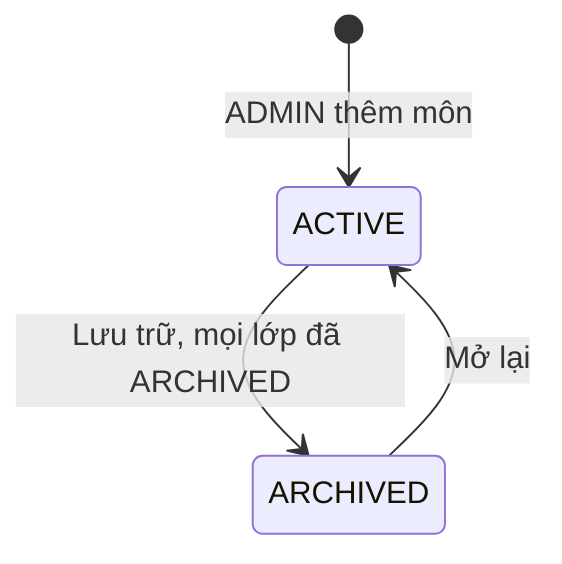
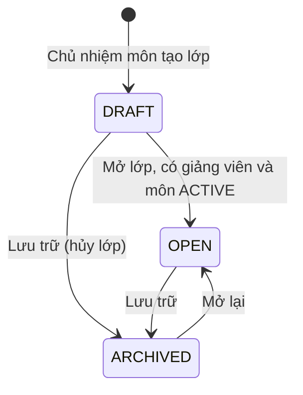
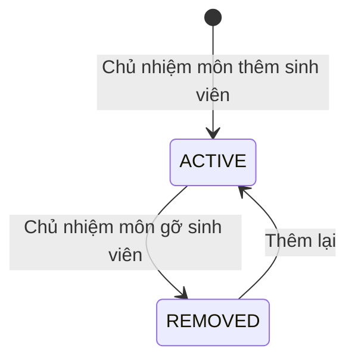

# U04 Subject, Class, Enrollment & Learning Access - Domain Entities

**Bản tài liệu 2026-10-09**: UC 13, 14, 31, 32, 47, 48, 49, 50, 51, 52, 53, 64, 65, 66, 67 theo [73 UC](../../../../docs/use-cases-73.md) và screen flow `docs/G21_Diagrams.drawio` (Page-2); primary stories: US-CAT-001, US-CAT-002, US-CAT-003, US-LRN-001. Quyền và supporting flows theo [current SRS contract](../../current-srs-contract.md); đây là thiết kế/kế hoạch, không xác nhận implementation mới.

Thiết kế độc lập công nghệ. Truy vết: `US-CAT-001`…`003`, `US-LRN-001`; UC 13, 14, 31, 32, 47–53, 64–67; cấp số đếm cho UC 58 View Admin Dashboard (U16).

## 1. Tổng quan

| Entity | Loại | Lưu ở | Unit ghi |
|---|---|---|---|
| `Subject` | Aggregate root | `subjects` | U04 |
| `CourseClass` | Aggregate root | `course_classes` | U04 |
| `Enrollment` | Bảng nối ACCOUNT–COURSE_CLASS | `enrollments` (PK `class_id`, `account_id`) | U04 |
| `StudentClassView` | Kết quả tính (lớp của người học + học liệu đang hiển thị) | Không lưu | U04 |

U04 **không** sở hữu: tài khoản và role (U01), nội dung (U05), nhóm (U12), thanh toán (U07), thông báo (U16), audit (U02).

## 2. `Subject`

| Thuộc tính | Kiểu | Ràng buộc |
|---|---|---|
| `id` | UUID | Khóa |
| `code` | chuỗi ≤ 20 | Chữ hoa, số, `-`; duy nhất; **không đổi** sau khi tạo |
| `name` | chuỗi ≤ 200 | Bắt buộc |
| `description` | chuỗi ≤ 2000 | Tùy chọn |
| `status` | enum | `ACTIVE`, `ARCHIVED` |
| `managerAccountId` | UUID | Cột `manager_id` → `accounts`; Chủ nhiệm môn, role `SUBJECT_MANAGER` `ACTIVE`; có thể rỗng; tối đa 1 người |
| `version` | số | Khóa lạc quan |

### Trạng thái

```mermaid
stateDiagram-v2
    [*] --> ACTIVE: ADMIN thêm môn
    ACTIVE --> ARCHIVED: Lưu trữ, mọi lớp đã ARCHIVED
    ARCHIVED --> ACTIVE: Mở lại
```

**Text alternative**: Môn tạo ra ở `ACTIVE`. Chỉ lưu trữ được khi mọi lớp của môn đã `ARCHIVED`; môn `ARCHIVED` không tạo lớp mới và có thể mở lại về `ACTIVE`. Lưu trữ và mở lại là thao tác trong UC 67. Không xóa môn.

## 3. `CourseClass`

| Thuộc tính | Kiểu | Ràng buộc |
|---|---|---|
| `id` | UUID | Khóa |
| `subjectId` | UUID | Thuộc đúng 1 môn; không đổi |
| `code` | chuỗi ≤ 30 | Duy nhất trong môn; không đổi |
| `name` | chuỗi ≤ 200 | Bắt buộc |
| `description` | chuỗi ≤ 2000 | Tùy chọn |
| `term` | chuỗi ≤ 20 | Học kỳ, ví dụ `2026-1` |
| `status` | enum | `DRAFT`, `OPEN`, `ARCHIVED` |
| `teacherAccountId` | UUID | Cột `teacher_id` → `accounts`; giảng viên chính, role `TEACHER` hoặc `SUBJECT_MANAGER`; bắt buộc trước khi `OPEN` |
| `showGradeDistribution` | bool | Mặc định `false`; Chủ nhiệm môn bật trong UC 52 để Student Assignments hiện phân bố điểm ẩn danh khi đủ mẫu |
| `version` | số | Khóa lạc quan |

### Trạng thái

```mermaid
stateDiagram-v2
    [*] --> DRAFT: Chủ nhiệm môn tạo lớp
    DRAFT --> OPEN: Mở lớp, có giảng viên và môn ACTIVE
    DRAFT --> ARCHIVED: Lưu trữ (hủy lớp)
    OPEN --> ARCHIVED: Lưu trữ
    ARCHIVED --> OPEN: Mở lại
```

**Text alternative**: Chủ nhiệm môn tạo lớp ở `DRAFT`. Mở lớp cần có giảng viên chính và môn đang `ACTIVE`. `DRAFT` hoặc `OPEN` đều lưu trữ được; lớp `ARCHIVED` mở lại về `OPEN`, không về `DRAFT`, và bị từ chối nếu có người học đang học lớp chưa lưu trữ khác cùng môn. Mọi chuyển trạng thái thuộc UC 52.

## 4. `Enrollment`

| Thuộc tính | Kiểu | Ràng buộc |
|---|---|---|
| `classId` | UUID | Cột `class_id`; khóa chính cùng `accountId` |
| `accountId` | UUID | Cột `account_id`, tài khoản có role `STUDENT` |
| `status` | enum | `ACTIVE`, `REMOVED` |
| `source` | enum | `MANUAL` (thêm từng người), `LIST` (thêm theo danh sách) |
| `enrolledAt`, `removedAt` | thời gian | |

### Trạng thái

```mermaid
stateDiagram-v2
    [*] --> ACTIVE: Chủ nhiệm môn thêm sinh viên
    ACTIVE --> REMOVED: Chủ nhiệm môn gỡ sinh viên
    REMOVED --> ACTIVE: Thêm lại
```

**Text alternative**: Ghi danh tạo ra ở `ACTIVE` khi Chủ nhiệm môn thêm sinh viên (UC 51); gỡ thì sang `REMOVED` nhưng giữ bản ghi và lịch sử; thêm lại dùng đúng bản ghi đó và chuyển về `ACTIVE`.

## 5. `StudentClassView`

Tính khi người học mở Student Class Detail: kiểm ghi danh `ACTIVE` và lớp `OPEN`, rồi lấy module và học liệu `ACTIVE` (của môn và của lớp) qua `PublishedContentPort` (U05). Không lưu.

## 6. Contract

### Port U04 cung cấp

| Port | Dùng bởi | Mô tả |
|---|---|---|
| `SubjectScopePort`, `ClassScopePort` | U01 (U01 khai báo, U04 cài); U05, U06 dùng `SubjectScopePort` | `isSubjectManager`, `listManagedSubjects`, `isTeacherOf`, `subjectOfClass`, `listTaughtClasses` (để chặn đổi role) |
| Event `enrollment.activated` | U16 | Sau commit, chỉ cho thông báo ghi danh (BR-U04-26) |
| `ClassAccessPort` | U05, U06, U08–U16 | `getClassRef(classId)` (môn, trạng thái, giảng viên, `showGradeDistribution`), `isActiveStudent(accountId, classId)`, `listActiveStudents(classId)`, `isClassManager(accountId, classId)` (Chủ nhiệm môn của môn chứa lớp), `listOpenClassesOf(accountId)` (lớp `OPEN` đang học hoặc dạy, cho feed của U05, U11); `listOpenClassesOfSubject(subjectId)` (lớp `OPEN` của môn, cho bài/quiz của môn ở U08, U11, U16); cho U16 thêm `countSubjectsByStatus()`, `countClassesByStatus()`, `countActiveEnrollments()` (UC 58) |

### Port U04 dùng

| Port | Unit | Mô tả |
|---|---|---|
| `AccountLookupPort`, `AuthorizationPort` | U01 | Tìm tài khoản; kiểm role và phạm vi |
| `PublishedContentPort` | U05 (`C`) | Module `ACTIVE` của môn, học liệu `ACTIVE` của môn và của lớp |
| `AuditPort` | U02 | Audit |
| `EventPublisherPort` | U03 | Event `enrollment.activated` cho U16 |

Nhóm của sinh viên trên Student Detail do frontend lấy từ API của U12; backend U04 không gọi U12.
