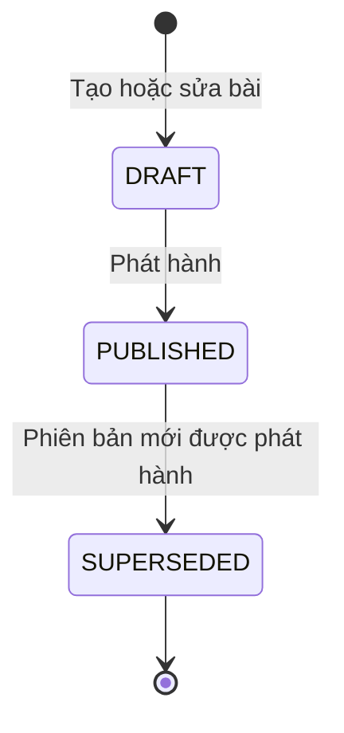
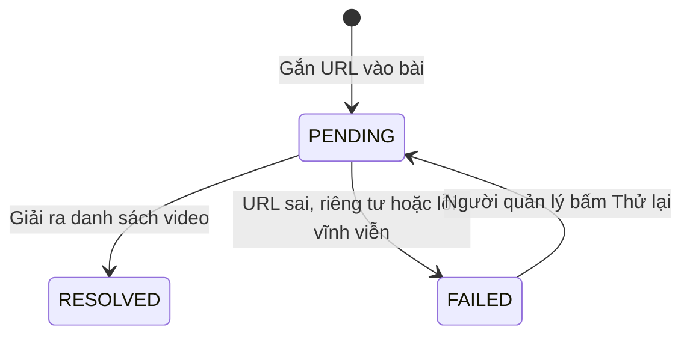
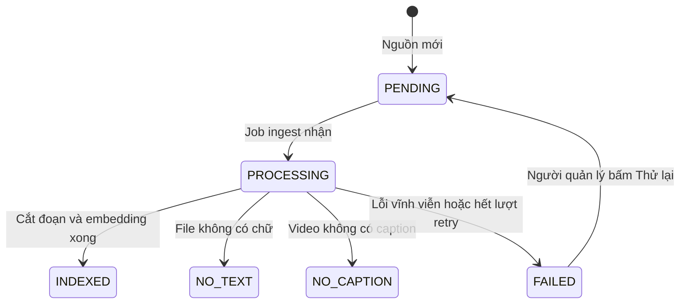
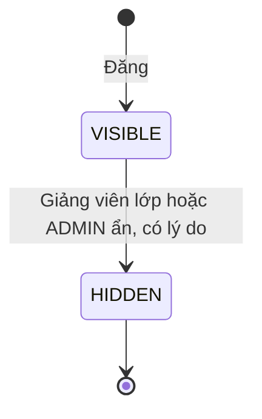

# U05 Content, Material & RAG - Domain Entities

Thiết kế độc lập công nghệ. Truy vết: `US-CNT-001`, `002`, `004`, `005`; `UC-CNT-01`…`03`, `06`…`08`.

## 1. Tổng quan

| Entity | Loại | Lưu ở | Unit ghi |
|---|---|---|---|
| `Chapter` | Aggregate root | `chapters` | U05 |
| `Lesson` | Aggregate root | `lessons` | U05 |
| `LessonVersion` | Entity | `lesson_versions` | U05 |
| `LessonItem` | Entity | `lesson_items` | U05 |
| `ClassLessonLink` | Entity | `class_lesson_links` | U05 |
| `YoutubeSource` | Entity | `youtube_sources` | U05 |
| `SourceDocument` | Aggregate root | `source_documents` | U05 |
| `RagChunk` | Entity | `rag_chunks` | U05 |
| `ClassAnnouncement` | Aggregate root | `class_announcements` | U05 |
| `ClassQuestion` | Aggregate root | `class_questions` | U05 |
| `ClassAnswer` | Entity | `class_answers` | U05 |

U05 **không** sở hữu: byte file (U03), quyền vào lớp (U04), gọi LLM tạo đề/chấm (U13), credit (U07), job (U02), hộp thông báo (U16).

## 2. `Chapter`

| Thuộc tính | Kiểu | Ràng buộc |
|---|---|---|
| `id` | UUID | |
| `scopeType` | enum | `SUBJECT`, `CLASS` |
| `subjectId` | UUID | Luôn có |
| `classId` | UUID | Có khi `scopeType = CLASS` |
| `title` | chuỗi ≤ 200 | |
| `orderNo` | số | Thứ tự trong phạm vi |
| `archived` | bool | Lưu trữ thì ẩn khỏi người học, không xóa |

## 3. `Lesson`

| Thuộc tính | Kiểu | Ràng buộc |
|---|---|---|
| `id` | UUID | |
| `chapterId` | UUID | |
| `orderNo` | số | |
| `archived` | bool | |

## 4. `LessonVersion`

| Thuộc tính | Kiểu | Ràng buộc |
|---|---|---|
| `id` | UUID | |
| `lessonId` | UUID | |
| `versionNo` | số | Tăng dần, duy nhất theo bài |
| `title` | chuỗi ≤ 200 | |
| `status` | enum | `DRAFT`, `PUBLISHED`, `SUPERSEDED` |
| `publishedAt`, `publishedBy` | | Khi phát hành |

Mỗi bài tối đa 1 `DRAFT` và 1 `PUBLISHED`.

### Trạng thái

**Text alternative**: Phiên bản bài tạo ra ở `DRAFT`. Phát hành thì thành `PUBLISHED`; khi một phiên bản mới của cùng bài được phát hành, bản đang `PUBLISHED` chuyển `SUPERSEDED` và không đổi nữa.

## 5. `LessonItem`

| Thuộc tính | Kiểu | Ràng buộc |
|---|---|---|
| `id` | UUID | |
| `lessonVersionId` | UUID | |
| `orderNo` | số | |
| `type` | enum | `TEXT`, `FILE`, `YOUTUBE` |
| `title` | chuỗi ≤ 200 | |
| `body` | markdown ≤ 50 000 ký tự | Khi `TEXT` |
| `artifactId` | UUID | Khi `FILE` (U03, purpose `MATERIAL`) |
| `youtubeSourceId` | UUID | Khi `YOUTUBE`; mỗi phiên bản bài tối đa 1 mục YouTube |
| `sourceDocumentId` | UUID | Tài liệu RAG tương ứng (`TEXT`, `FILE`) |

## 6. `ClassLessonLink`

| Thuộc tính | Kiểu | Ràng buộc |
|---|---|---|
| `classChapterId` | UUID | Chương của lớp |
| `subjectLessonId` | UUID | Bài cấp môn được đưa vào lớp |
| `orderNo` | số | |

Lớp hiển thị **bản `PUBLISHED` mới nhất** của bài cấp môn; bài cấp môn bị lưu trữ hoặc chưa có bản phát hành thì không hiện.

## 7. `YoutubeSource`

| Thuộc tính | Kiểu | Ràng buộc |
|---|---|---|
| `id` | UUID | |
| `url` | chuỗi | URL video hoặc playlist |
| `kind` | enum | `VIDEO`, `PLAYLIST` |
| `externalId` | chuỗi | Mã video/playlist trên YouTube |
| `chargedToAccountId` | UUID | Người thêm nguồn, trả credit embedding |
| `status` | enum | `PENDING`, `RESOLVED`, `FAILED` |

Mỗi video (lẻ hoặc thuộc playlist) là một `SourceDocument` loại `YOUTUBE_VIDEO` trỏ về nguồn này. Danh sách video của playlist = các `SourceDocument` cùng `youtubeSourceId`, sắp theo `orderNo`.

### Trạng thái

**Text alternative**: Nguồn YouTube tạo ra ở `PENDING`. Giải được video (một video hoặc ≤ 50 video của playlist) thì `RESOLVED` và mỗi video sinh một tài liệu RAG. Lỗi vĩnh viễn thì `FAILED`; người quản lý có thể bấm thử lại để về `PENDING`.

## 8. `SourceDocument`

| Thuộc tính | Kiểu | Ràng buộc |
|---|---|---|
| `id` | UUID | |
| `kind` | enum | `TEXT`, `FILE`, `YOUTUBE_VIDEO` |
| `contentKey` | chuỗi | SHA-256 nội dung (`TEXT`), `artifactId` (`FILE`) hoặc `videoId` (`YOUTUBE_VIDEO`); duy nhất, dùng lại khi phiên bản mới giữ nguyên mục |
| `chargedToAccountId` | UUID | Người tải/phát hành đã tạo nguồn mới; job ingest và retry trừ credit embedding của tài khoản này |
| `indexStatus` | enum | `PENDING`, `PROCESSING`, `INDEXED`, `NO_TEXT`, `NO_CAPTION`, `FAILED` |
| `errorCode` | chuỗi | Mã lỗi an toàn |
| `chunkCount` | số | |
| `language` | chuỗi | Ngôn ngữ caption |
| `youtubeSourceId` | UUID | Chỉ `YOUTUBE_VIDEO`: nguồn đã sinh ra video này |
| `videoTitle`, `orderNo` | chuỗi, số | Chỉ `YOUTUBE_VIDEO`: tiêu đề và thứ tự trong playlist |

### Trạng thái

**Text alternative**: Tài liệu RAG đi từ `PENDING` sang `PROCESSING` khi job ingest nhận. Xong thì `INDEXED`. File không có chữ kết thúc ở `NO_TEXT`, video không có caption kết thúc ở `NO_CAPTION` (không retry). Lỗi vĩnh viễn hoặc hết lượt thì `FAILED`, có thể thử lại thủ công về `PENDING`.

## 9. `RagChunk`

| Thuộc tính | Kiểu | Ràng buộc |
|---|---|---|
| `id` | UUID | |
| `sourceDocumentId` | UUID | |
| `chunkNo` | số | |
| `text` | chuỗi ≤ ~3 000 ký tự | |
| `pageNo` hoặc `startMs`/`endMs` | số | Vị trí trích dẫn |
| `embedding` | vector 768 chiều | `gemini-embedding-001` |

## 10. `ClassAnnouncement`

| Thuộc tính | Kiểu | Ràng buộc |
|---|---|---|
| `id` | UUID | |
| `classId` | UUID | |
| `title`, `body` | chuỗi | Tiêu đề ≤ 200, nội dung ≤ 5 000 ký tự; không sửa sau khi đăng |
| `authorId` | UUID | Giảng viên của lớp hoặc ADMIN (BR-U05-60) |
| `status` | enum | `VISIBLE`, `HIDDEN` |
| `createdAt` | thời gian | |
| `hiddenAt`, `hiddenBy`, `hideReason` | | Khi ẩn |

## 11. `ClassQuestion`

Thuộc tính như `ClassAnnouncement`; `authorId` là người học đang ghi danh hoặc giảng viên của lớp (BR-U05-61).

## 12. `ClassAnswer`

| Thuộc tính | Kiểu | Ràng buộc |
|---|---|---|
| `id` | UUID | |
| `questionId` | UUID | Luôn thuộc lớp của câu hỏi |
| `authorId` | UUID | |
| `body` | chuỗi | |
| `status` | enum | `VISIBLE`, `HIDDEN` |
| `createdAt`, `hiddenAt`, `hiddenBy`, `hideReason` | | |

### Trạng thái (thông báo, câu hỏi, câu trả lời)

**Text alternative**: Thông báo, câu hỏi và câu trả lời đăng ra ở `VISIBLE`. Giảng viên lớp hoặc ADMIN ẩn nội dung vi phạm (ghi người ẩn, lý do) thì sang `HIDDEN`. Không sửa, không xóa cứng.

## 13. Contract

### Port U05 cung cấp

| Port | Dùng bởi | Mô tả |
|---|---|---|
| `PublishedContentPort` | U04 (`C`) | `listForClass(classId)`: chương, bài, mục đã phát hành (của lớp và bài cấp môn đã liên kết) |
| `RagRetrievalPort` | U13 | `retrieve(scope, query, k, requesterId, requestRef)` → đoạn kèm nguồn; embedding câu hỏi tính credit cho `requesterId` |
| `ContentRefPort` | U08 | Kiểm `lessonVersionId` tồn tại, thuộc phạm vi |
| Event `u05.class.announcement-posted`, `u05.class.question-posted`, `u05.class.answer-posted` | U16 | Phát sau commit; payload gồm eventId, id đối tượng, actorId, classId; sự kiện trả lời có thêm questionAuthorId |

### Port U05 dùng

| Port | Unit | Mô tả |
|---|---|---|
| `ClassAccessPort` | U04 | Ghi danh, phạm vi lớp |
| `ArtifactPort` | U03 | `attach`, `open`, `issueDownloadToken` |
| `JobPort`, `AuditPort`, `EventPublisherPort` | U02 | Job ingest, audit, event lớp |
| `CreditPort` | U07 (`C`) | Giữ/trừ/trả credit cho embedding |
| `AiKillSwitchPort` | U13 (`C`) | Tắt gọi AI toàn hệ thống |
| `EmbeddingPort` | Adapter Gemini | `embed(texts)` → vector |
| `YoutubePort` | Adapter YouTube | Giải playlist, lấy caption |
