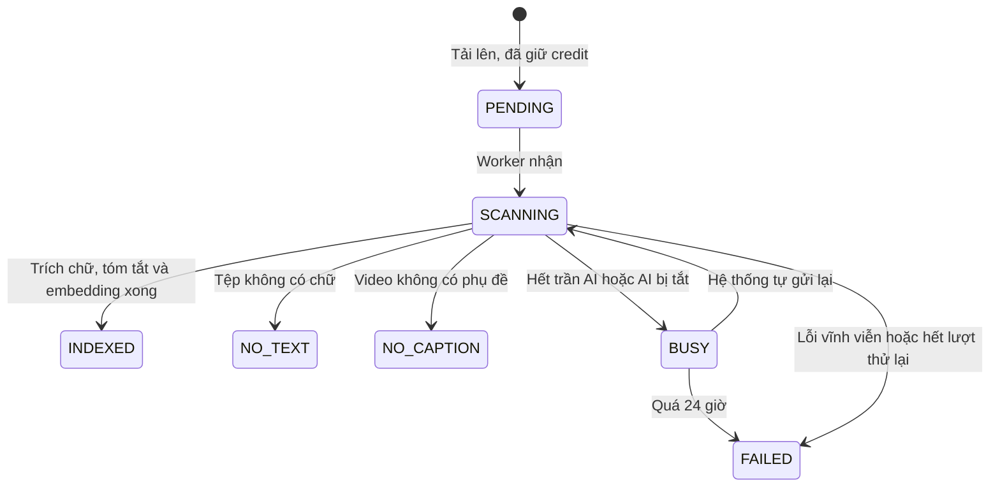
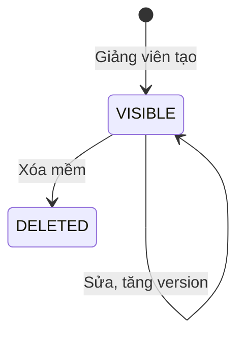

# U05 Content, Material & RAG - Domain Entities

**Bản tài liệu 2026-10-09**: UC 15, 30, 33, 34, 36, 54, 55 theo [73 UC](../../../../docs/use-cases-73.md) và screen flow `docs/G21_Diagrams.drawio` (Page-2); primary stories: US-CNT-001, US-CNT-002, US-CNT-004, US-CNT-005. Quyền và supporting flows theo [current SRS contract](../../current-srs-contract.md); đây là thiết kế/kế hoạch, không xác nhận implementation mới.

Thiết kế độc lập công nghệ. Truy vết: `US-CNT-001`, `002`, `004`, `005`; UC 15, 30, 33, 34, 36, 54, 55. Tóm tắt học liệu và truy xuất RAG cho AI soạn đề là luồng phụ.

Quyết định 2026-10-03: học liệu chỉ **tải lên rồi quét**. Không soạn nội dung trực tiếp, không phiên bản, không phát hành. Quyết định 2026-10-04: chapter đổi thành **module của môn**, mọi lớp dùng chung; mỗi lesson là một tài liệu trong module, là học liệu của môn hoặc của một lớp. Quyết định 2026-10-09: Chủ nhiệm môn quản lý module và học liệu của môn trên Material List; giảng viên quản lý học liệu của lớp trên tab Materials; quiz gắn với học liệu (U09 soạn, U11 cho làm); tự tóm tắt khi tải lên; mỗi học liệu chỉ quét một lần lúc tải lên, lỗi thì hệ thống tự thử lại; không đủ credit thì không tải lên; Sửa chỉ đổi thông tin, không thay tài liệu; bỏ bình luận dưới thông báo.

## 1. Tổng quan

| Entity | Thực thể ERD | Lưu ở | Unit ghi |
|---|---|---|---|
| `Module` | `MODULE` | `modules` | U05 |
| `Lesson` | `LESSON` | `lessons` (gồm kết quả quét, bản tóm tắt và embedding) | U05 |
| `Announcement` | `ANNOUNCEMENT` | `announcements` | U05 |

U05 **không** sở hữu: byte file (U03), quyền vào lớp (U04), quiz (U08, U09), lượt làm quiz (U11), gọi LLM tạo đề/chấm và ghi nhận chi phí AI (U13), số dư credit (U07), hàng đợi (U03), hộp thông báo (U16).

## 2. `Module`

| Cột | Kiểu | Ràng buộc |
|---|---|---|
| `id` | UUID | |
| `subject_id` | UUID | Môn sở hữu; Chủ nhiệm môn quản lý trên Material List; mọi lớp của môn (kể cả lớp tạo sau) dùng chung, không sao chép |
| `title` | chuỗi ≤ 200 | |
| `order_no` | số | Thứ tự module trong môn |
| `status` | enum | `ACTIVE`, `ARCHIVED`; lưu trữ thì ẩn module và mọi lesson bên trong, không xóa |

## 3. `Lesson`

| Cột | Kiểu | Ràng buộc |
|---|---|---|
| `id` | UUID | |
| `module_id` | UUID | Module chứa lesson |
| `class_id` | UUID | Rỗng: học liệu của môn (Chủ nhiệm môn tải, mọi lớp thấy); có giá trị: học liệu của lớp đó (giảng viên lớp tải); lớp phải thuộc môn của module |
| `title` | chuỗi ≤ 200 | Mặc định là tên tệp hoặc tiêu đề video |
| `order_no` | số | Thứ tự trong module, tính riêng cho học liệu của môn và học liệu của từng lớp; khi hiển thị học liệu của môn đứng trước |
| `source_type` | enum | `FILE`, `YOUTUBE`; nguồn (tệp hoặc link) không đổi sau khi tạo |
| `file_id`, `file_name`, `mime_type`, `size_bytes` | | Khi `FILE`: tệp PDF/DOCX/PPTX đã gắn qua U03 (purpose `MATERIAL`) |
| `youtube_url` | chuỗi | Khi `YOUTUBE`: một video (`watch?v=` hoặc `youtu.be/`); không nhận playlist |
| `uploaded_by`, `uploaded_at` | UUID, thời gian | Người tải lên (chịu credit tóm tắt và embedding, BR-U05-46) và thời điểm tải; hiện trên Material Detail |
| `scan_status` | enum | `PENDING`, `SCANNING`, `INDEXED`, `NO_TEXT`, `NO_CAPTION`, `BUSY`, `FAILED` |
| `extracted_text` | văn bản | Chữ trích từ tệp hoặc phụ đề, tối đa 2 000 000 ký tự |
| `summary` | văn bản ≤ 4 000 ký tự | Bản tóm tắt do AI tạo khi quét (BR-U05-45, 47); rỗng khi chưa quét xong, `NO_TEXT`, `NO_CAPTION` hoặc `FAILED` |
| `embedding` | vector 768 | `gemini-embedding-001`, tính từ `summary` (BR-U05-35) |
| `scanned_at` | thời gian | Lần đổi trạng thái quét gần nhất (đặt khi `PENDING`, `SCANNING` và khi kết thúc); sweeper dùng để tìm lesson `PENDING` quá 5 phút (bảng không có `updated_at`) |
| `status` | enum | `ACTIVE`, `ARCHIVED`; nút Xóa lưu trữ lesson, không xóa dòng |

Tải lên là hiển thị ngay cho người học trong phạm vi (mọi lớp của môn, hoặc chỉ lớp đó); quét chạy nền và không chặn việc xem.

### Trạng thái quét

```mermaid
stateDiagram-v2
    [*] --> PENDING: Tải lên, đã giữ credit
    PENDING --> SCANNING: Worker nhận
    SCANNING --> INDEXED: Trích chữ, tóm tắt và embedding xong
    SCANNING --> NO_TEXT: Tệp không có chữ
    SCANNING --> NO_CAPTION: Video không có phụ đề
    SCANNING --> BUSY: Hết trần AI hoặc AI bị tắt
    BUSY --> SCANNING: Hệ thống tự gửi lại
    BUSY --> FAILED: Quá 24 giờ
    SCANNING --> FAILED: Lỗi vĩnh viễn hoặc hết lượt thử lại
```

**Text alternative**: Học liệu chỉ tạo được khi đã giữ đủ credit, bắt đầu ở `PENDING`. Worker nhận thì sang `SCANNING`. Xong thì `INDEXED`. Tệp không có chữ kết thúc ở `NO_TEXT`, video không có phụ đề ở `NO_CAPTION`. Hết trần AI hoặc AI bị tắt sang `BUSY`; hệ thống tự gửi lại mỗi 30 phút, quá 24 giờ thì `FAILED`. Lỗi vĩnh viễn hoặc hết lượt thử lại sang `FAILED`. Không có nút Quét lại; mọi trạng thái kết thúc trả lại phần credit còn giữ.

## 4. `Announcement`

| Cột | Kiểu | Ràng buộc |
|---|---|---|
| `id` | UUID | |
| `class_id` | UUID | Lớp của thông báo |
| `author_id` | UUID | Giảng viên của lớp lúc tạo (BR-U05-60) |
| `title`, `body` | chuỗi | Tiêu đề ≤ 200, nội dung ≤ 5 000 (markdown đã làm sạch) |
| `posted_at` | thời gian | |
| `status` | enum | `VISIBLE`, `DELETED` |
| `version`, `updated_at`, `updated_by` | số, thời gian, UUID | Kiểm optimistic lock; người và thời điểm sửa gần nhất |
| `deleted_at`, `deleted_by` | thời gian, UUID | Khi `DELETED`; không xóa dòng |

### Trạng thái thông báo

```mermaid
stateDiagram-v2
    [*] --> VISIBLE: Giảng viên tạo
    VISIBLE --> VISIBLE: Sửa, tăng version
    VISIBLE --> DELETED: Xóa mềm
```

**Text alternative**: Thông báo tạo ra ở `VISIBLE`. Giảng viên của lớp sửa thì vẫn `VISIBLE` và tăng `version`. Xóa chuyển sang `DELETED`: thông báo không còn trong feed, dòng và audit được giữ, không sửa được nữa.

## 5. Contract

### Port U05 cung cấp

| Port | Dùng bởi | Mô tả |
|---|---|---|
| `PublishedContentPort` | U04 (`C`) | `listForClass(classId)`: module `ACTIVE` của môn, mỗi module gồm lesson `ACTIVE` của môn và của lớp |
| `RagRetrievalPort` | U13 | `retrieve(scope, query, k, requesterId)` → lesson gần nhất kèm bản tóm tắt và đoạn trích; embedding câu hỏi ghi nhận qua `AiUsagePort` cho `requesterId` |
| `ContentRefPort` | U06, U08, U09, U11 | Kiểm module/lesson tồn tại, thuộc phạm vi môn hoặc lớp và còn `ACTIVE`; `getLessonRef(lessonId)` trả môn, lớp, module, tiêu đề, trạng thái để U09 gắn quiz đúng phạm vi và U11 chỉ hiện quiz của học liệu còn hiện trong lớp |
| Event `class.announcement-posted` | U16 | Phát sau commit khi tạo thông báo; payload gồm eventId, announcementId, actorId, classId |

### Port U05 dùng

| Port | Unit | Mô tả |
|---|---|---|
| `AuthorizationPort` | U01 | Tài khoản `ACTIVE`, vai trò |
| `SubjectScopePort`, `ClassScopePort` | U04 (U01 khai báo) | Chủ nhiệm môn của môn (R2), giảng viên chính của lớp (R3/R4) |
| `ClassAccessPort` | U04 | Ghi danh `ACTIVE`, lớp `OPEN`, môn của lớp; `listOpenClassesOf(accountId)` cho feed Class Announcements |
| `ArtifactPort` | U03 | `attach`, `open`, `issueDownloadToken` |
| `AuditPort` | U02 | Audit |
| `JobPort`, `EventPublisherPort`, `PendingSweeper` | U03 | Việc `LESSON_SCAN`, `YOUTUBE_CAPTION`, gửi lại việc bị mất và việc `BUSY`, event thông báo lớp |
| `AiUsagePort` | U13 (`C`) | `quote` mức credit cần giữ và số dư; `hold` giữ credit khi tải lên, trả `holdId`; `begin(holdId, ...)`/`complete` kiểm AI bật, trần chi phí, trừ theo token và ghi `ai_suggestions` cho mỗi lần tóm tắt (`MATERIAL_SUMMARY`) và embedding (`EMBEDDING`); `release(holdId)` trả phần còn giữ; phần giữ quá 25 giờ U13 tự trả |
| `EmbeddingPort` | Adapter Gemini | `embed(texts)` → vector |
| `SummaryPort` | Adapter Gemini | `summarize(chunks, model)` → bản tóm tắt và số token đã dùng (BR-U05-47) |
| `YoutubePort` | Adapter YouTube | Lấy phụ đề video |

## 6. API

| API | Dùng để | Màn, UC | Quyền |
|---|---|---|---|
| `GET /api/v1/subjects/{subjectId}/modules` | Module và học liệu của môn kèm trạng thái quét | Material List, UC 54 | R2 |
| `POST /api/v1/subjects/{subjectId}/modules` | Thêm module | Material List, UC 55 | R2 |
| `PATCH /api/v1/modules/{moduleId}` | Đổi tên, đổi thứ tự, lưu trữ module | Material List, UC 55 | R2 |
| `GET /api/v1/lessons/upload-credit` | Mức credit cần giữ cho mỗi học liệu và số dư của người tải, để chặn nút tải khi không đủ | Form thêm học liệu, UC 34, 55 | R2, R3/R4 |
| `POST /api/v1/subjects/{subjectId}/modules/{moduleId}/lessons` | Thêm học liệu của môn; giữ credit, thiếu thì trả lỗi "Không đủ credit AI" | Material List, UC 55 | R2 |
| `GET /api/v1/classes/{classId}/modules` | Module của môn kèm học liệu của môn (chỉ đọc) và của lớp, kèm trạng thái quét | Tab Materials, UC 33 | R3/R4 |
| `POST /api/v1/classes/{classId}/modules/{moduleId}/lessons` | Thêm học liệu của lớp; giữ credit, thiếu thì trả lỗi "Không đủ credit AI" | Tab Materials, UC 34 | R3/R4 |
| `GET /api/v1/lessons/{lessonId}?classId=` | Thông tin, nguồn, bản tóm tắt; người quản lý thấy thêm trạng thái quét và người tải. Có `classId` khi mở từ một lớp | Material Detail, Learning Material, UC 15, 34, 55 | R2, R3/R4, R5 |
| `POST /api/v1/lessons/{lessonId}/download?classId=` | URL tải hoặc xem tệp (token 5 phút) | Material Detail, Learning Material, UC 15, 34, 55 | R2, R3/R4, R5 |
| `PATCH /api/v1/lessons/{lessonId}` | Sửa thông tin (tên, thứ tự), xóa (lưu trữ) học liệu; không đổi tệp hay link | Material Detail, UC 34, 55 | Người quản lý học liệu |
| `GET /api/v1/lessons/{lessonId}/scan` | Poll trạng thái quét (chỉ xem, không có quét lại) | Material Detail, Material List, tab Materials | Người quản lý học liệu |
| `GET /api/v1/me/announcements?classId=` | Feed thông báo của các lớp `OPEN` mình học hoặc dạy, lọc theo lớp | Class Announcements, UC 30 | R5, R3/R4 |
| `POST /api/v1/classes/{classId}/announcements` | Tạo thông báo | Class Announcements, UC 36 | R3/R4 |
| `PATCH /api/v1/announcements/{announcementId}` | Sửa thông báo kèm `version` | Class Announcements, UC 36 | R3/R4 |
| `DELETE /api/v1/announcements/{announcementId}` | Xóa mềm thông báo kèm `version` | Class Announcements, UC 36 | R3/R4 |

`updateAnnouncement`/`deleteAnnouncement` ghi audit cùng transaction; chỉ tạo mới mới phát `class.announcement-posted`. "Người quản lý học liệu" là R2 với học liệu của môn và R3/R4 của đúng lớp với học liệu của lớp (BR-U05-02).
