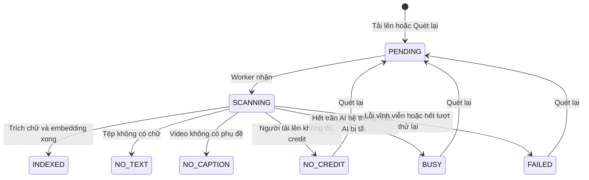
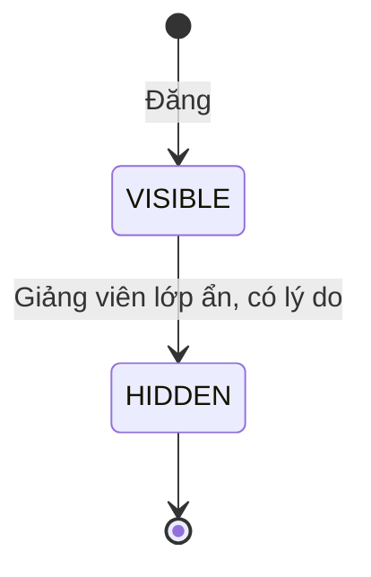

# U05 Content, Material & RAG - Domain Entities

**Bản tài liệu 2026-10-08**: UC 14, 26, 29, 30, 31, 51, 52; primary stories: US-CNT-001, US-CNT-002, US-CNT-004, US-CNT-005. Quyền và supporting flows theo [current SRS contract](../../current-srs-contract.md); đây là thiết kế/kế hoạch, không xác nhận implementation mới.

Thiết kế độc lập công nghệ. Truy vết: `US-CNT-001`, `002`, `004`, `005`; UC 14, 26, 29–31, 51–52; comment là supporting flow của thông báo. Bảng theo [mô hình dữ liệu của unit](domain-entities.md).

Quyết định 2026-10-03: học liệu chỉ **tải lên rồi quét**. Không soạn nội dung trực tiếp, không phiên bản, không phát hành. Quyết định 2026-10-04: chapter đổi thành **module của môn** do Chủ nhiệm môn tạo trên Subject Detail, mọi lớp dùng chung; mỗi lesson là một tài liệu trong module, là học liệu của môn hoặc của một lớp; hỏi đáp lớp đổi thành bình luận dưới thông báo.

## 1. Tổng quan

| Entity | Thực thể ERD | Lưu ở | Unit ghi |
|---|---|---|---|
| `Module` | `MODULE` | `modules` | U05 |
| `Lesson` | `LESSON` | `lessons` (gồm kết quả quét và embedding) | U05 |
| `Announcement` | `ANNOUNCEMENT` | `announcements` | U05 |
| `AnnouncementComment` | Bảng nối ACCOUNT commenting_on ANNOUNCEMENT | `announcement_comments` | U05 |

U05 **không** sở hữu: byte file (U03), quyền vào lớp (U04), gọi LLM tạo đề/chấm và ghi nhận chi phí AI (U13), số dư credit (U07), hàng đợi (U03), hộp thông báo (U16).

## 2. `Module`

| Cột | Kiểu | Ràng buộc |
|---|---|---|
| `id` | UUID | |
| `subject_id` | UUID | Môn sở hữu; Chủ nhiệm môn quản lý trên Subject Detail; mọi lớp của môn (kể cả lớp tạo sau) dùng chung, không sao chép |
| `title` | chuỗi ≤ 200 | |
| `order_no` | số | Thứ tự module trong môn |
| `status` | enum | `ACTIVE`, `ARCHIVED`; lưu trữ thì ẩn module và mọi lesson bên trong, không xóa |

## 3. `Lesson`

| Cột | Kiểu | Ràng buộc |
|---|---|---|
| `id` | UUID | |
| `module_id` | UUID | Module chứa lesson |
| `class_id` | UUID | Rỗng: học liệu của môn (Chủ nhiệm môn tải, mọi lớp thấy); có giá trị: học liệu của lớp đó (giảng viên lớp tải); lớp phải thuộc môn của module |
| `title` | chuỗi ≤ 200 | Mặc định là tên tệp hoặc tiêu đề video |
| `order_no` | số | Thứ tự trong module, tính riêng cho học liệu của môn và học liệu của từng lớp; khi hiển thị học liệu của môn đứng trước |
| `source_type` | enum | `FILE`, `YOUTUBE` |
| `file_id`, `file_name`, `mime_type`, `size_bytes` | | Khi `FILE`: tệp PDF/DOCX/PPTX đã gắn qua U03 (purpose `MATERIAL`) |
| `youtube_url` | chuỗi | Khi `YOUTUBE`: một video (`watch?v=` hoặc `youtu.be/`); không nhận playlist |
| `scan_status` | enum | `PENDING`, `SCANNING`, `INDEXED`, `NO_TEXT`, `NO_CAPTION`, `NO_CREDIT`, `BUSY`, `FAILED` |
| `extracted_text` | văn bản | Chữ trích từ tệp hoặc phụ đề, tối đa 2 000 000 ký tự |
| `embedding` | vector 768 | `gemini-embedding-001`, tính từ phần đầu `extracted_text` |
| `scanned_at` | thời gian | Lần đổi trạng thái quét gần nhất (đặt khi `PENDING`, `SCANNING` và khi kết thúc); sweeper dùng để tìm lesson `PENDING` quá 5 phút (bảng không có `updated_at`) |
| `status` | enum | `ACTIVE`, `ARCHIVED` |

Tải lên là hiển thị ngay cho người học trong phạm vi (mọi lớp của môn, hoặc chỉ lớp đó); quét chạy nền và không chặn việc xem.

### Trạng thái quét

```mermaid
stateDiagram-v2
    [*] --> PENDING: Tải lên hoặc Quét lại
    PENDING --> SCANNING: Worker nhận
    SCANNING --> INDEXED: Trích chữ và embedding xong
    SCANNING --> NO_TEXT: Tệp không có chữ
    SCANNING --> NO_CAPTION: Video không có phụ đề
    SCANNING --> NO_CREDIT: Người tải lên không đủ credit
    SCANNING --> BUSY: Hết trần AI hệ thống hoặc AI bị tắt
    SCANNING --> FAILED: Lỗi vĩnh viễn hoặc hết lượt thử lại
    NO_CREDIT --> PENDING: Quét lại
    BUSY --> PENDING: Quét lại
    FAILED --> PENDING: Quét lại
```

**Text alternative**: Học liệu tải lên ở `PENDING`. Worker nhận thì sang `SCANNING`. Xong thì `INDEXED`. Tệp không có chữ kết thúc ở `NO_TEXT`, video không có phụ đề ở `NO_CAPTION`. Thiếu credit sang `NO_CREDIT`, hết trần AI hoặc AI bị tắt sang `BUSY`, lỗi vĩnh viễn hoặc hết lượt sang `FAILED`; ba trạng thái này có nút Quét lại để về `PENDING`.

## 4. `Announcement`

| Cột | Kiểu | Ràng buộc |
|---|---|---|
| `id` | UUID | |
| `class_id` | UUID | |
| `author_id` | UUID | Giảng viên của lớp (BR-U05-60) |
| `title`, `body` | chuỗi | Tiêu đề ≤ 200, nội dung ≤ 5 000; R3/R4 sửa với version |
| `posted_at` | thời gian | |
| `status`, `hidden_reason` | enum, chuỗi | Announcement: VISIBLE/HIDDEN/DELETED; xóa mềm khỏi feed, giữ audit/tham chiếu |
| `version`, `updated_at`, `updated_by` | số, thời gian, UUID | Kiểm optimistic lock, actor/thời điểm sửa |
| `deleted_at`, `deleted_by` | thời gian, UUID | Khi DELETED; không xóa dòng |

## 5. `AnnouncementComment`

| Cột | Kiểu | Ràng buộc |
|---|---|---|
| `id` | UUID | Một người bình luận nhiều lần dưới một thông báo |
| `announcement_id` | UUID | Thông báo được bình luận |
| `account_id` | UUID | Người học `ACTIVE` hoặc giảng viên của lớp (BR-U05-61) |
| `body` | chuỗi ≤ 2 000 | Văn bản thuần; không sửa sau khi gửi |
| `posted_at` | thời gian | |
| `status`, `hidden_reason` | enum, chuỗi | `VISIBLE`, `HIDDEN`; lý do khi ẩn |

### Trạng thái bình luận (thông báo còn có DELETED)

```mermaid
stateDiagram-v2
    [*] --> VISIBLE: Đăng
    VISIBLE --> HIDDEN: Giảng viên lớp ẩn, có lý do
    HIDDEN --> [*]
```

**Text alternative**: Bình luận đăng VISIBLE, giảng viên lớp ẩn vi phạm với lý do thì HIDDEN, không sửa/xóa cứng. Announcement riêng: VISIBLE hoặc HIDDEN có thể cập nhật theo version; delete chuyển DELETED và ẩn khỏi feed, giữ dòng/tham chiếu/audit; không sửa hay bình luận mới khi DELETED.

## 6. Contract

### Port U05 cung cấp

| Port | Dùng bởi | Mô tả |
|---|---|---|
| `PublishedContentPort` | U04 (`C`) | `listForClass(classId)`: module `ACTIVE` của môn, mỗi module gồm lesson `ACTIVE` của môn và của lớp |
| `RagRetrievalPort` | U13 | `retrieve(scope, query, k, requesterId)` → lesson gần nhất kèm đoạn trích; embedding câu hỏi ghi nhận qua `AiUsagePort` cho `requesterId` |
| `ContentRefPort` | U06, U08 | Kiểm `moduleId`/`lessonId` tồn tại, thuộc phạm vi (phân loại câu hỏi, phạm vi AI soạn đề) |
| Event `class.announcement-posted` | U16 | Phát sau commit; payload gồm eventId, announcementId, actorId, classId. Bình luận không phát sự kiện |

### Port U05 dùng

| Port | Unit | Mô tả |
|---|---|---|
| `AuthorizationPort` | U01 | Tài khoản `ACTIVE`, vai trò |
| `ClassAccessPort` | U04 | Ghi danh, phạm vi lớp |
| `ArtifactPort` | U03 | `attach`, `open`, `issueDownloadToken` |
| `AuditPort` | U02 | Audit |
| `JobPort`, `EventPublisherPort`, `PendingSweeper` | U03 | Việc `LESSON_SCAN`, `YOUTUBE_CAPTION`, gửi lại việc bị mất, event thông báo lớp |
| `AiUsagePort` | U13 (`C`) | Kiểm AI bật, trần chi phí, giữ/trừ credit và ghi `ai_suggestions` cho mỗi lần embedding |
| `EmbeddingPort` | Adapter Gemini | `embed(texts)` → vector |
| `YoutubePort` | Adapter YouTube | Lấy phụ đề video |

## API thông báo
GET/POST /api/v1/classes/{id}/announcements; PATCH/DELETE /api/v1/announcements/{id} với version và R3/R4. updateAnnouncement/deleteAnnouncement ghi audit cùng transaction; chỉ POST mới phát class.announcement-posted. Danh sách bỏ DELETED; API comment từ chối thông báo đã xóa.
