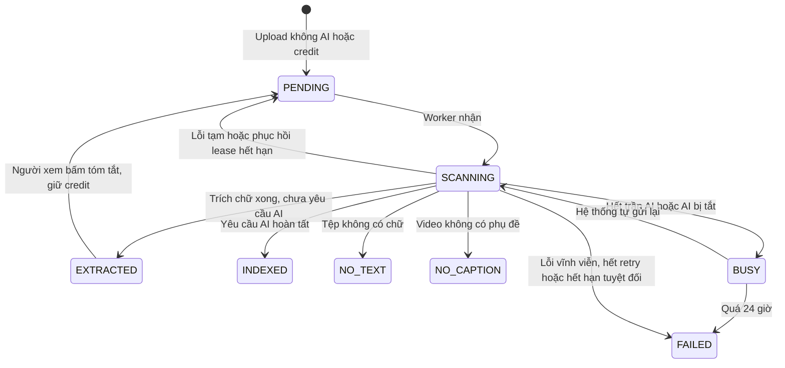
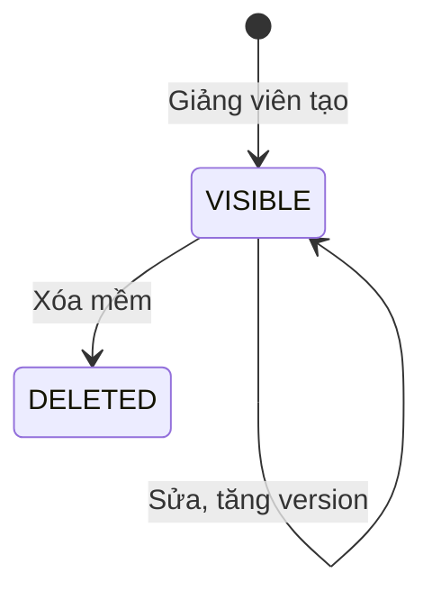

# U05 Content, Material & RAG - Domain Entities

**Bản tài liệu 2026-10-09**: UC 15, 30, 33, 34, 36, 54, 55 theo [73 UC](../../../../docs/use-cases-73.md) và screen flow `docs/G21_Diagrams.drawio` (Page-2); primary stories: US-CNT-001, US-CNT-002, US-CNT-004, US-CNT-005. Quyền và supporting flows theo [current SRS contract](../../current-srs-contract.md); đây là thiết kế/kế hoạch, không xác nhận implementation mới.

Thiết kế độc lập công nghệ. Truy vết: `US-CNT-001`, `002`, `004`, `005`; UC 15, 30, 33, 34, 36, 54, 55. Tóm tắt học liệu và truy xuất RAG cho AI soạn đề là luồng phụ.

Quyết định 2026-10-03: học liệu chỉ **tải lên rồi quét**. Không soạn nội dung trực tiếp, không phiên bản, không phát hành. Quyết định 2026-10-04: chapter đổi thành **module của môn**, mọi lớp dùng chung; mỗi lesson là một tài liệu trong module, là học liệu của môn hoặc của một lớp. Quyết định 2026-10-09: Chủ nhiệm môn quản lý module và học liệu của môn trên Material List; giảng viên quản lý học liệu của lớp trên tab Materials; quiz gắn với học liệu (U09 soạn, U11 cho làm); chỉ tóm tắt khi người xem bấm Tóm tắt tài liệu; upload trích chữ một lần; AI chỉ sau yêu cầu người xem, lỗi tạm tự retry hữu hạn; upload không kiểm credit; giữ credit của người bấm khi yêu cầu tóm tắt; Sửa chỉ đổi thông tin, không thay tài liệu; bỏ bình luận dưới thông báo.

## 1. Tổng quan

| Entity | Thực thể ERD | Lưu ở | Unit ghi |
|---|---|---|---|
| `Module` | `MODULE` | `modules` | U05 |
| `Lesson` | `LESSON` | `lessons` (gồm kết quả quét, bản tóm tắt và embedding) | U05 |
| `Announcement` | `ANNOUNCEMENT` | `announcements` | U05 |

U05 **không** sở hữu: byte file (U03), quyền vào lớp (U04), quiz (U08, U09), lượt làm quiz (U11), gọi LLM tạo đề/chấm và ghi nhận chi phí AI (U13), số dư credit (U07), hàng đợi (U03), hộp thông báo (U16).

## 2. `Module`

| Cột | Kiểu | Ràng buộc |
|---|---|---|
| `id` | UUID | |
| `subject_id` | UUID | Môn sở hữu; Chủ nhiệm môn quản lý trên Material List; mọi lớp của môn (kể cả lớp tạo sau) dùng chung, không sao chép |
| `title` | chuỗi ≤ 200 | |
| `order_no` | số | Thứ tự module trong môn |
| `status` | enum | `ACTIVE`, `ARCHIVED`; lưu trữ thì ẩn module và mọi lesson bên trong, không xóa |

## 3. `Lesson`

| Cột | Kiểu | Ràng buộc |
|---|---|---|
| `id` | UUID | |
| `module_id` | UUID | Module chứa lesson |
| `class_id` | UUID | Rỗng: học liệu của môn (Chủ nhiệm môn tải, mọi lớp thấy); có giá trị: học liệu của lớp đó (giảng viên lớp tải); lớp phải thuộc môn của module |
| `title` | chuỗi ≤ 200 | Mặc định là tên tệp hoặc tiêu đề video |
| `order_no` | số | Thứ tự trong module, tính riêng cho học liệu của môn và học liệu của từng lớp; khi hiển thị học liệu của môn đứng trước |
| `source_type` | enum | `FILE`, `YOUTUBE`; nguồn (tệp hoặc link) không đổi sau khi tạo |
| `file_id`, `file_name`, `mime_type`, `size_bytes` | | Khi `FILE`: tệp PDF/DOCX/PPTX đã gắn qua U03 (purpose `MATERIAL`) |
| `youtube_url` | chuỗi | Khi `YOUTUBE`: một video (`watch?v=` hoặc `youtu.be/`); không nhận playlist |
| `uploaded_by`, `uploaded_at` | UUID, thời gian | Người tải lên (không chịu phí AI chỉ vì upload) và thời điểm tải; hiện trên Material Detail |
| `scan_status` | enum | `PENDING`, `SCANNING`, `EXTRACTED`, `INDEXED`, `NO_TEXT`, `NO_CAPTION`, `BUSY`, `FAILED` |
| `extracted_text` | văn bản | Chữ trích từ tệp hoặc phụ đề, tối đa 2 000 000 ký tự |
| `summary` | văn bản ≤ 4 000 ký tự | Bản tóm tắt do AI tạo sau yêu cầu trên màn xem (BR-U05-45, 47); rỗng nếu chưa tạo được summary; summary hoàn tất được giữ/hiển thị kể cả embedding FAILED, không đưa lesson FAILED vào RAG |
| `summary_requested_by`, `summary_requested_at` | UUID, thời gian/rỗng | Actor chịu phí và thời điểm nhận yêu cầu; rỗng sau upload. Chỉ đặt một lần cùng HOLD khi nhận yêu cầu; không đổi bởi người bấm trùng/poll. |
| `embedding` | vector 768 | `gemini-embedding-001`, tính từ `summary` (BR-U05-35) |
| `scanned_at` | thời gian | Lần đổi trạng thái quét gần nhất (đặt khi `PENDING`, `SCANNING` và khi kết thúc); sweeper dùng để tìm lesson `PENDING` quá 5 phút (bảng không có `updated_at`) |
| `scan_expires_at` | thời gian | Deadline giai đoạn: upload + 24 giờ cho trích chữ; nhận yêu cầu + 24 giờ cho AI; chỉ reset khi chuyển EXTRACTED sang yêu cầu AI, không đổi khi retry/BUSY |
| `scan_retry_at` | thời gian/rỗng | Lần sớm nhất được gửi lại; backoff lỗi tạm hoặc BUSY 30 phút |
| `scan_claim_id`, `scan_lease_until` | UUID, thời gian/rỗng | Claim của worker, lease 5 phút gia hạn khi đang xử lý; mọi ghi kết quả kiểm claim và hạn; claim hết hạn được sweeper thu hồi |
| `scan_retry_count` | số | Retry/recovery hữu hạn tối đa 5; BUSY chờ trần không tính lỗi tạm nhưng vẫn bị hạn tuyệt đối 24 giờ |
| `status` | enum | `ACTIVE`, `ARCHIVED`; nút Xóa lưu trữ lesson, không xóa dòng |

Tải lên là hiển thị ngay cho người học trong phạm vi (mọi lớp của môn, hoặc chỉ lớp đó); quét chạy nền và không chặn việc xem.

### Trạng thái quét


```mermaid
stateDiagram-v2
    [*] --> PENDING: Upload không AI hoặc credit
    PENDING --> SCANNING: Worker nhận
    SCANNING --> EXTRACTED: Trích chữ xong, chưa yêu cầu AI
    EXTRACTED --> PENDING: Người xem bấm tóm tắt, giữ credit
    SCANNING --> INDEXED: Yêu cầu AI hoàn tất
    SCANNING --> NO_TEXT: Tệp không có chữ
    SCANNING --> NO_CAPTION: Video không có phụ đề
    SCANNING --> BUSY: Hết trần AI hoặc AI bị tắt
    BUSY --> SCANNING: Hệ thống tự gửi lại
    BUSY --> FAILED: Quá 24 giờ
    SCANNING --> PENDING: Lỗi tạm hoặc phục hồi lease hết hạn
    SCANNING --> FAILED: Lỗi vĩnh viễn, hết retry hoặc hết hạn tuyệt đối
```

**Text alternative**: Upload PENDING → SCANNING → EXTRACTED (không AI/credit), hoặc NO_TEXT/NO_CAPTION/FAILED. Sau nút Tóm tắt tài liệu và HOLD, EXTRACTED → PENDING → SCANNING → INDEXED. Phân biệt hai giai đoạn bằng summary_requested_at. Mỗi giai đoạn deadline 24 giờ từ lúc bắt đầu; AI BUSY chờ 30 phút. Retry/lease/CAS hữu hạn; chỉ giai đoạn AI chốt HOLD và scanner dự phòng 25 giờ từ yêu cầu. Summary đã hoàn tất giữ khi embedding lỗi.

## 4. `Announcement`

| Cột | Kiểu | Ràng buộc |
|---|---|---|
| `id` | UUID | |
| `class_id` | UUID | Lớp của thông báo |
| `author_id` | UUID | Giảng viên của lớp lúc tạo (BR-U05-60) |
| `title`, `body` | chuỗi | Tiêu đề ≤ 200, nội dung ≤ 5 000 (markdown đã làm sạch) |
| `posted_at` | thời gian | |
| `status` | enum | `VISIBLE`, `DELETED` |
| `version`, `updated_at`, `updated_by` | số, thời gian, UUID | Kiểm optimistic lock; người và thời điểm sửa gần nhất |
| `deleted_at`, `deleted_by` | thời gian, UUID | Khi `DELETED`; không xóa dòng |

### Trạng thái thông báo


```mermaid
stateDiagram-v2
    [*] --> VISIBLE: Giảng viên tạo
    VISIBLE --> VISIBLE: Sửa, tăng version
    VISIBLE --> DELETED: Xóa mềm
```

**Text alternative**: Thông báo tạo ra ở `VISIBLE`. Giảng viên của lớp sửa thì vẫn `VISIBLE` và tăng `version`. Xóa chuyển sang `DELETED`: thông báo không còn trong feed, dòng và audit được giữ, không sửa được nữa.

## 5. Contract

### Port U05 cung cấp

| Port | Dùng bởi | Mô tả |
|---|---|---|
| `PublishedContentPort` | U04 (`C`) | `listForClass(classId)`: module `ACTIVE` của môn, mỗi module gồm lesson `ACTIVE` của môn và của lớp |
| `RagRetrievalPort` | U13 | `retrieve(scope, query, k, requesterId)` → lesson gần nhất kèm bản tóm tắt và đoạn trích; embedding câu hỏi ghi nhận qua `AiUsagePort` cho `requesterId` |
| `ContentRefPort` | U06, U08, U09, U11 | Kiểm module/lesson tồn tại, thuộc phạm vi môn hoặc lớp và còn `ACTIVE`; `getLessonRef(lessonId)` trả môn, lớp, module, tiêu đề, trạng thái để U09 gắn quiz đúng phạm vi và U11 chỉ hiện quiz của học liệu còn hiện trong lớp |
| Event `class.announcement-posted` | U16 | Phát sau commit khi tạo thông báo; payload gồm eventId, announcementId, actorId, classId |

### Port U05 dùng

| Port | Unit | Mô tả |
|---|---|---|
| `AuthorizationPort` | U01 | Tài khoản `ACTIVE`, vai trò |
| `SubjectScopePort`, `ClassScopePort` | U04 (U01 khai báo) | Chủ nhiệm môn của môn (R2), giảng viên chính của lớp (R3/R4) |
| `ClassAccessPort` | U04 | Ghi danh `ACTIVE`, lớp `OPEN`, môn của lớp; `listOpenClassesOf(accountId)` cho feed Class Announcements |
| `ArtifactPort` | U03 | `attach`, `open`, `issueDownloadToken` |
| `AuditPort` | U02 | Audit |
| `JobPort`, `EventPublisherPort`, `PendingSweeper` | U03 | Việc `LESSON_SCAN`, `YOUTUBE_CAPTION`, `MATERIAL_SUMMARY`, gửi lại việc bị mất và việc `BUSY`, event thông báo lớp |
| `AiUsagePort` | U13 (`C`) | `checkAvailability(task, actor, target)` → allowed/reason theo AiGuard, không giữ credit; `quote` → CreditQuote; `hold` → HoldSnapshot, `findHold` phục hồi holdId; `begin(task, actor, target, requestRef, holdId?, scanClaimId?)` → UsageStart (RUN/REPLAY/BUSY/IN_PROGRESS/CLOSED); `complete(ticket, tokens, cost, checkpoint?)`, `fail(ticket, usage?)` → CallSnapshot; `release(holdId)` chốt tổng đã dùng/trả dư. DTO, idempotency và fencing theo mục AiUsagePort phía dưới; scanner 25 giờ cùng cách chốt |
| `EmbeddingPort` | Adapter Gemini | `embed(texts)` → vector |
| `SummaryPort` | Adapter Gemini | `summarize(chunks, model)` → bản tóm tắt và số token đã dùng (BR-U05-47) |
| `YoutubePort` | Adapter YouTube | Lấy phụ đề video |

## 6. API

| API | Dùng để | Màn, UC | Quyền |
|---|---|---|---|
| `GET /api/v1/subjects/{subjectId}/modules` | Module và học liệu của môn kèm trạng thái quét | Material List, UC 54 | R2 |
| `POST /api/v1/subjects/{subjectId}/modules` | Thêm module | Material List, UC 55 | R2 |
| `PATCH /api/v1/modules/{moduleId}` | Đổi tên, đổi thứ tự, lưu trữ module | Material List, UC 55 | R2 |
| `POST /api/v1/subjects/{subjectId}/modules/{moduleId}/lessons` | Thêm học liệu của môn; không giữ credit/không AI | Material List, UC 55 | R2 |
| `GET /api/v1/classes/{classId}/modules` | Module của môn kèm học liệu của môn (chỉ đọc) và của lớp, kèm trạng thái quét | Tab Materials, UC 33 | R3/R4 |
| `POST /api/v1/classes/{classId}/modules/{moduleId}/lessons` | Thêm học liệu của lớp; không giữ credit/không AI | Tab Materials, UC 34 | R3/R4 |
| `GET /api/v1/lessons/{lessonId}?classId=` | Thông tin, nguồn, bản tóm tắt; người quản lý thấy thêm trạng thái quét và người tải. Có `classId` khi mở từ một lớp | Material Detail, Learning Material, UC 15, 34, 55 | R2, R3/R4, R5 |
| `GET /api/v1/lessons/{lessonId}/summary-credit?classId=` | Quote theo người đang xem; quyền xem, không cấp quyền từ quote | View Material, UC 15, 34, 55 | R2, R3/R4, R5 |
| `POST /api/v1/lessons/{lessonId}/summary?classId=` | Nút Tóm tắt tài liệu, Idempotency-Key; nhận yêu cầu và HOLD một lần hoặc trả kết quả/trạng thái sẵn có | View Material, UC 15, 34, 55 | R2, R3/R4, R5; Admin denied |
| `POST /api/v1/lessons/{lessonId}/download?classId=` | URL tải hoặc xem tệp (token 5 phút) | Material Detail, Learning Material, UC 15, 34, 55 | R2, R3/R4, R5 |
| `PATCH /api/v1/lessons/{lessonId}` | Sửa thông tin (tên, thứ tự), xóa (lưu trữ) học liệu; không đổi tệp hay link | Material Detail, UC 34, 55 | Người quản lý học liệu |
| `GET /api/v1/lessons/{lessonId}/scan?classId=` | Poll giai đoạn/trạng thái trích chữ và tóm tắt; không lộ HOLD/chi phí của người khác | View Material và danh sách học liệu | Quyền xem R2, R3/R4, R5 |
| `GET /api/v1/me/announcements?classId=` | Feed thông báo của các lớp `OPEN` mình học hoặc dạy, lọc theo lớp | Class Announcements, UC 30 | R5, R3/R4 |
| `POST /api/v1/classes/{classId}/announcements` | Tạo thông báo | Class Announcements, UC 36 | R3/R4 |
| `PATCH /api/v1/announcements/{announcementId}` | Sửa thông báo kèm `version` | Class Announcements, UC 36 | R3/R4 |
| `DELETE /api/v1/announcements/{announcementId}` | Xóa mềm thông báo kèm `version` | Class Announcements, UC 36 | R3/R4 |

`updateAnnouncement`/`deleteAnnouncement` ghi audit cùng transaction; chỉ tạo mới mới phát `class.announcement-posted`. "Người quản lý học liệu" là R2 với học liệu của môn và R3/R4 của đúng lớp với học liệu của lớp (BR-U05-02).

## AiUsagePort — contract HOLD và checkpoint hiện hành

U05 khai báo port; U13 cài và sở hữu ai_suggestions. Đây là contract nội bộ, không thêm HTTP API và không cho U05 đọc repository U13. Chữ ký logic:

```text
checkAvailability(task, actor, target) -> allowed/reason
quote(accountId) -> CreditQuote
hold(task, actor, targetType, targetId, requestRef) -> HoldSnapshot
findHold(targetType, targetId, requestRef) -> HoldSnapshot?
begin(task, actor, target, requestRef, holdId?, scanClaimId?) -> UsageStart
complete(ticket, tokens, cost, checkpoint?) -> CallSnapshot
fail(ticket, usage?) -> CallSnapshot
release(holdId) -> HoldSnapshot
```

- HoldSnapshot gồm holdId, ownerId, target, requestRef, creditStatus, creditsReserved, creditsUsed và reserveExpiresAt. hold cùng requestRef trả lại cùng HOLD, không giữ thêm; findHold đọc theo target LESSON + lessonId:HOLD để phục hồi sau restart. Worker chỉ tra target đang xử lý; actor/target phải khớp HOLD. Không tìm thấy HOLD là lỗi invariant: worker báo lỗi an toàn, không tự reserve thêm. Hạn và trạng thái đã chốt không được kéo dài/mở lại.
- UsageStart gồm outcome RUN, REPLAY, BUSY, IN_PROGRESS hoặc CLOSED. RUN trả ticket {callId, requestRef, holdId?, scanClaimId?} cùng model/config snapshot cho lời gọi provider. REPLAY trả CallSnapshot READY với checkpoint và usage đã ghi: caller dùng lại, không gọi provider/complete lần nữa. BUSY không gọi AI hoặc giữ thêm; CLOSED khi HOLD đã chốt/quá hạn; IN_PROGRESS khi lời gọi đang được worker hợp lệ xử lý. Kiểm cùng actor/target/task trước trả kết quả; requestRef dùng khác target bị từ chối.
- Child call có requestRef riêng cho SUMMARY:chunkIndex, SUMMARY:MERGE, EMBEDDING, creditStatus NONE, không reserve thêm. Checkpoint có kind SUMMARY_CHUNK/SUMMARY_MERGE/EMBEDDING, sourceHash, model và payload tương ứng (text hoặc vector); lưu kết quả có cấu trúc, không prompt thô. Với child call thành công, complete bắt buộc nhận checkpoint phù hợp task/source. CallSnapshot trả status, checkpoint, tokens, cost và creditsUsed.
- complete trong transaction ngắn khóa HOLD còn RESERVED và kiểm ticket/scanClaimId đang gắn với child call; chỉ chuyển RUNNING sang READY một lần, lưu checkpoint/usage và cộng creditsUsed vào HOLD cùng transaction. Gọi lặp ticket đã READY trả lại snapshot, không cộng lại. fail có thể nhận usage thật đã biết, ghi FAILED và cộng lượng đó một lần; chưa gọi AI có usage 0. fail child không đóng/hoàn HOLD, không xóa READY đã lưu. Timeout không chứng minh provider chưa dùng; không tạo số usage giả hoặc cam kết exactly-once provider.
- U05 kiểm/khóa lesson với scan_claim_id và lease/deadline còn hợp lệ trong cùng transaction trước begin, complete hoặc fail; nếu claim mất thì rollback toàn bộ ghi checkpoint/credit. scanClaimId được U13 gắn vào metadata child call để ticket cũ không ghi sau rebind. Worker phục hồi có claim mới mới được tiếp quản child RUNNING/FAILED chưa READY; READY chỉ REPLAY. U13 không kiểm claim bằng callback hay đọc bảng lesson; điều kiện claim thuộc U05. Không giữ transaction trong lúc gọi provider.
- release của U13 khóa HOLD, chốt tổng đã ghi đúng một lần: có sử dụng thì CreditPort.settle và trả dư, chưa sử dụng mới CreditPort.release hoàn toàn bộ. Child NONE không được scanner đóng riêng. complete đến sau khi HOLD đã chốt bị từ chối; complete/release cùng khóa HOLD nên không bỏ sót lượng dùng đã commit. U05 terminal và scanner 25 giờ gọi cùng thao tác.

## Phân biệt hai giai đoạn

`scan_phase` suy ra từ summary_requested_at, trả trong DTO chứ không thêm cột; phase TEXT/AI. `summary_requested_at` rỗng: handler chỉ trích chữ/phụ đề, không AiUsagePort/HOLD; thành công EXTRACTED. Có giá trị: handler MATERIAL_SUMMARY dùng chữ đã lưu và HOLD của summary_requested_by. Message trích chữ cũ bị bỏ nếu giai đoạn đã đổi; message AI chỉ xử lý khi có yêu cầu/HOLD hợp lệ. State/lease/retry thuộc giai đoạn hiện thời. Yêu cầu trùng và terminal không mở lại HOLD.
