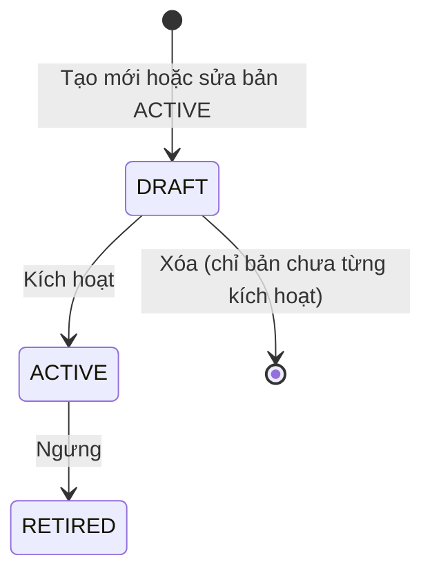

# U06 Rubric & Question Bank - Domain Entities

Thiết kế độc lập công nghệ. Truy vết: `US-QBK-001`, `002`; `UC-QBK-01`, `02`.

## 1. Tổng quan

| Entity | Loại | Lưu ở | Unit ghi |
|---|---|---|---|
| `BankItem` | Aggregate root (một bản ghi = một phiên bản) | `bank_items` | U06 |
| `QuestionDefinition` | Value object của `BankItem` câu hỏi | `bank_items` | U06 (khung tài liệu do U09 kiểm) |
| `RubricDefinition` | Value object của `BankItem` rubric | `bank_items` | U06 |

U06 **không** sở hữu: bài đánh giá và việc dùng câu hỏi trong bài (U08), cấu hình riêng từng bài (U09), chạy code (U13), chấm (U15).

## 2. `BankItem`

| Thuộc tính | Kiểu | Ràng buộc |
|---|---|---|
| `id` | UUID | Chính là ID phiên bản; bài của U08 lưu ID này |
| `stableKey` | UUID | Gom các phiên bản của cùng một câu/rubric |
| `versionNo` | số | Duy nhất theo `stableKey` |
| `itemType` | enum | `QUESTION`, `RUBRIC` |
| `scopeType` | enum | `SUBJECT`, `CLASS` |
| `subjectId` | UUID | Luôn có |
| `classId` | UUID | Khi `CLASS` |
| `title` | chuỗi ≤ 200 | |
| `definition` | `QuestionDefinition` hoặc `RubricDefinition` | Theo `itemType` |
| `status` | enum | `DRAFT`, `ACTIVE`, `RETIRED` |
| `difficulty` | enum | `EASY`, `MEDIUM`, `HARD` (chỉ câu hỏi) |
| `tags` | danh sách chuỗi | ≤ 10 tag, mỗi tag ≤ 50 ký tự |
| `lessonRefs` | danh sách ID | Chương/bài U05 cùng phạm vi, ≤ 10 |
| `clonedFrom` | UUID | Phiên bản gốc khi nhân bản |
| `createdBy`, `createdAt`, `activatedAt` | | |

### Trạng thái



**Text alternative**: Phiên bản mới ở `DRAFT`; kích hoạt thì thành `ACTIVE` và không sửa được nữa. Sửa một bản `ACTIVE` tạo phiên bản `DRAFT` mới cùng `stableKey`; bản cũ vẫn `ACTIVE` cho tới khi người dùng ngưng (`RETIRED`). Chỉ bản `DRAFT` chưa từng kích hoạt mới xóa được.

## 3. `QuestionDefinition`

| `questionType` | Nội dung |
|---|---|
| `MCQ_SINGLE`, `MCQ_MULTI` | `stem` (markdown), 2-6 `options` (`id`, `text`), `correctOptionIds`, `explanation` tùy chọn |
| `ESSAY` | `stem`, `answerGuide` tùy chọn, `rubricId` tùy chọn; văn bản thường, không giới hạn số từ |
| `DOCUMENT` | `stem`, `skeleton` tùy chọn (khung tài liệu theo mô hình của U09: heading, đoạn văn, bảng, ảnh, sơ đồ Draw.io), `requiredDiagrams` tùy chọn (loại sơ đồ → số tối thiểu), `rubricId` tùy chọn; không giới hạn số từ |
| `CODE` | `stem`, `language` (`JAVA`, `PYTHON`, `C`, `CPP`, `JAVASCRIPT`, `DART`, `CSHARP`), `starterFiles` (tên → nội dung), `referenceFiles` (lời giải mẫu, không bao giờ trả cho người học), `entryPoint`, `testCases` (`input`, `expectedOutput`, `hidden`, `points`), `timeLimitMs`, `memoryLimitMb`, `rubricId` tùy chọn |

Mọi câu có `defaultPoints` (> 0, tối đa 2 chữ số thập phân).

## 4. `RubricDefinition`

```text
Rubric
  scaleMax (tổng điểm = tổng điểm mọi mục)
  criteria[]            tiêu chí: id, title
    items[]             mục checklist: id, text, points (> 0)
```

**Text alternative**: Rubric gồm các tiêu chí; mỗi tiêu chí có các mục checklist, mỗi mục một số điểm dương. Chấm là tích đạt/không đạt từng mục; điểm tiêu chí là tổng mục được tích, điểm rubric là tổng các tiêu chí.

## 5. Contract

### Port U06 cung cấp

| Port | Dùng bởi | Mô tả |
|---|---|---|
| `BankQueryPort` | U08, U09, U10, U13 | `getVersion(id)` (bản bất biến), `search(scope, filter)` chỉ trả `ACTIVE` |
| `RubricPort` | U11, U15 | `getRubric(id)`, `score(rubricId, checkedItemIds)` |

### Port U06 dùng

| Port | Unit | Mô tả |
|---|---|---|
| `ClassAccessPort` | U04 | Phạm vi lớp/môn |
| `ArtifactPort` | U03 | Ảnh trong khung tài liệu |
| `DocumentModelPort` | U09 (`C`) | Kiểm khung tài liệu; chưa có U09 → chỉ kiểm cấu trúc JSON |
| `ContentRefPort` | U05 (`C`) | Kiểm `lessonRefs`; chưa có U05 thì bỏ qua kiểm và lưu ID |
| `AiDraftPort` | U13 | Nhận câu hỏi AI đề xuất vào ngân hàng |
