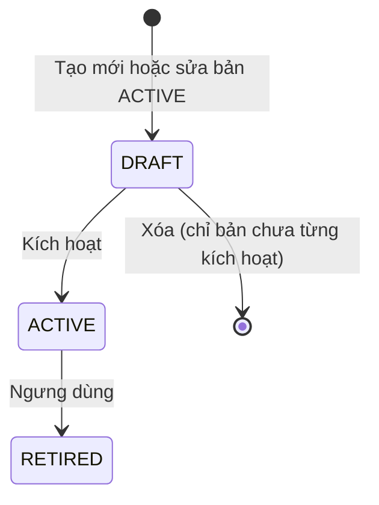
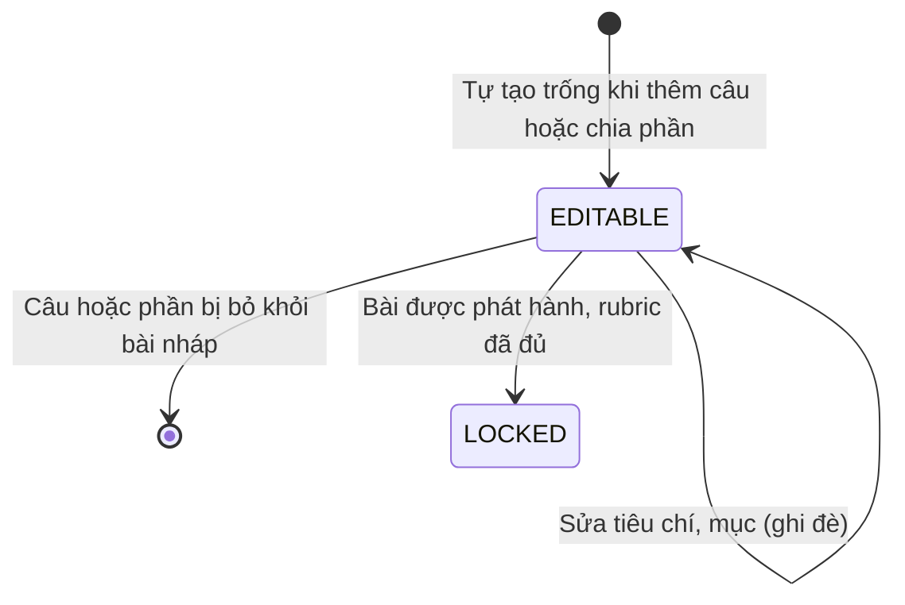

# U06 Rubric & Question Bank - Domain Entities

**Bản tài liệu 2026-10-09**: UC 46, 56, 57 theo [73 UC](../../../../docs/use-cases-73.md) và screen flow `docs/G21_Diagrams.drawio` (Page-2); primary stories: US-QBK-001, US-QBK-002. Quyền và supporting flows theo [current SRS contract](../../current-srs-contract.md); đây là thiết kế/kế hoạch, không xác nhận implementation mới.

Thiết kế độc lập công nghệ. Truy vết: `US-QBK-001`, `002`; UC 35 (dùng câu trong quiz), 46, 56, 57.

Quyết định 2026-10-09: ngân hàng câu hỏi chỉ ở cấp môn, giữ câu của mọi dạng bài (trắc nghiệm, tự luận, tài liệu, code); không có ngân hàng của lớp; rubric bắt buộc và được tự tạo (trống) cho mỗi câu Text Essay hoặc mỗi phần Diagram Essay/bài nhóm, sửa trực tiếp khi bài còn nháp, phải điền đủ trước khi phát hành và khóa khi bài phát hành.

## 1. Tổng quan

| Entity | Loại | Lưu ở | Unit ghi |
|---|---|---|---|
| `Question` | Aggregate root (một dòng = một phiên bản) | `questions` (thực thể `QUESTION`) | U06 |
| `QuestionDefinition` | Value object của câu hỏi | `questions.definition` | U06 (khung tài liệu do U09 kiểm) |
| `Rubric` | Aggregate root (không có phiên bản) | `rubrics` (thực thể `RUBRIC`) | U06 |
| `RubricDefinition` | Value object của rubric | `rubrics.criteria` | U06 |

U06 **không** sở hữu: bài, quiz và việc dùng câu hỏi trong bài (U08), cấu hình riêng từng bài và khung của bài (U09), chạy code và kết quả kiểm lời giải (U13), chấm (U15).

## 2. `Question`

| Thuộc tính | Kiểu | Ràng buộc |
|---|---|---|
| `id` | UUID | Chính là ID phiên bản; câu của bài và quiz (`assignment_questions` của U08) lưu ID này |
| `lineage_id` | UUID | Gom các phiên bản của cùng một câu |
| `version` | số | Duy nhất theo `lineage_id` |
| `scope_type` | enum | `SUBJECT` (ngân hàng môn), `ASSIGNMENT` (câu riêng của một bài hoặc quiz, U08 ghi qua `InlineQuestionPort`, không hiện trên Question List) |
| `scope_id` | UUID | ID môn hoặc bài theo `scope_type` |
| `question_type` | enum | `MCQ_SINGLE`, `MCQ_MULTI`, `ESSAY`, `DOCUMENT`, `CODE`; cột `assignment_type` suy ra để lọc theo dạng bài |
| `title` | chuỗi ≤ 200 | |
| `definition` | `QuestionDefinition` | Theo `question_type` |
| `default_points` | số thập phân | > 0, tối đa 2 chữ số thập phân |
| `status` | enum | `DRAFT`, `ACTIVE`, `RETIRED` |
| `difficulty` | enum | `EASY`, `MEDIUM`, `HARD` |
| `tags` | danh sách chuỗi | ≤ 10 tag, mỗi tag ≤ 50 ký tự |
| `lessonRefs` | danh sách ID | Module/học liệu U05 cùng môn, ≤ 10; lưu trong `definition` |
| `created_at` | thời gian | Người tạo và thời điểm kích hoạt nằm trong audit |

### Trạng thái


```mermaid
stateDiagram-v2
    [*] --> DRAFT: Tạo mới hoặc sửa bản ACTIVE
    DRAFT --> ACTIVE: Kích hoạt
    DRAFT --> [*]: Xóa (chỉ bản chưa từng kích hoạt)
    ACTIVE --> RETIRED: Ngưng dùng
```

**Text alternative**: Phiên bản mới ở `DRAFT`; kích hoạt thì thành `ACTIVE` và không sửa được nữa. Sửa một bản `ACTIVE` tạo phiên bản `DRAFT` mới cùng `lineage_id`; bản cũ vẫn `ACTIVE` cho tới khi người dùng ngưng (`RETIRED`). Chỉ bản `DRAFT` chưa từng kích hoạt mới xóa được.

## 3. `QuestionDefinition`

| `questionType` | Nội dung |
|---|---|
| `MCQ_SINGLE`, `MCQ_MULTI` | `stem` (markdown), 2-6 `options` (`id`, `text`), `correctOptionIds`, `explanation` tùy chọn |
| `ESSAY` | `stem`, `answerGuide` tùy chọn; văn bản thường, không giới hạn số từ hay số dòng |
| `DOCUMENT` | `stem`, `skeleton` bắt buộc (khung tài liệu theo mô hình của U09: heading, đoạn văn, bảng, ảnh, sơ đồ Draw.io), `requiredDiagrams` tùy chọn (loại sơ đồ → số tối thiểu); không giới hạn số từ |
| `CODE` | `stem`, `language` (`JAVA`, `PYTHON`, `C`, `CPP`, `JAVASCRIPT`, `DART`, `CSHARP`), `starterFiles` (tên → nội dung), `referenceFiles` (lời giải mẫu, không bao giờ trả cho người học), `entryPoint`, `testCases` (`input`, `expectedOutput`, `hidden`, `points`), `timeLimitMs`, `memoryLimitMb` |

Mọi câu có `defaultPoints` (> 0, tối đa 2 chữ số thập phân) và `lessonRefs`. Câu hỏi không chứa `rubricId`: rubric thuộc bài (BR-U06-24, 34).

### Dạng bài dùng được

| Dạng bài (U08) | `questionType` | Use case |
|---|---|---|
| `MULTIPLE_CHOICE_QUIZ` (quiz luyện tập) | `MCQ_SINGLE`, `MCQ_MULTI` | UC 35 |
| `TEXT_ESSAY` | `ESSAY` | UC 42 |
| `CODE_LAB` | `CODE` | UC 43 |
| `DIAGRAM_ESSAY` | `DOCUMENT` (sao khung vào bài) | UC 44 |
| `GROUP_ASSIGNMENT` | `DOCUMENT` (sao khung vào bài; phần tự tính theo heading) | UC 45 |

Một câu `DOCUMENT` dùng được cho cả Diagram Essay và bài nhóm; rubric từng câu/phần tự tạo khi đưa vào bài, không lưu trong câu.

## 4. `Rubric`

| Thuộc tính | Kiểu | Ràng buộc |
|---|---|---|
| `id` | UUID | `assignments.config` (`questionRubrics[].rubricId`, `parts[].rubricId`) lưu ID này |
| `assignment_id` | UUID | Bài sở hữu (U08); một rubric thuộc đúng một bài |
| `target_ref` | chuỗi | ID câu (Text Essay) hoặc phần (Diagram Essay, bài nhóm) trong `config` mà rubric chấm; mỗi câu hoặc phần đúng một rubric |
| `scope_type`, `scope_id` | enum, UUID | `CLASS` hoặc `SUBJECT` theo bài, để kiểm quyền R3/R4 hoặc R2 |
| `title` | chuỗi ≤ 200 | |
| `criteria` | `RubricDefinition` | Rỗng khi mới tự tạo; phải hợp lệ (BR-U06-30) trước khi phát hành |
| `total_points` | số thập phân | Tổng điểm mọi mục (`scaleMax`) |
| `locked_at` | thời gian | Rỗng: sửa/xóa được; có giá trị: bài đã phát hành, chỉ đọc |
| `updated_at` | thời gian | |


```mermaid
stateDiagram-v2
    [*] --> EDITABLE: Tự tạo trống khi thêm câu hoặc chia phần
    EDITABLE --> EDITABLE: Sửa tiêu chí, mục (ghi đè)
    EDITABLE --> [*]: Câu hoặc phần bị bỏ khỏi bài nháp
    EDITABLE --> LOCKED: Bài được phát hành, rubric đã đủ
```

**Text alternative**: Rubric được hệ thống tự tạo ở dạng trống khi thêm câu Text Essay hoặc khi khung được chia phần, ở trạng thái sửa được (`locked_at` rỗng). Người soạn điền và sửa tiêu chí, mục; lưu là ghi đè. Câu hoặc phần bị bỏ khỏi bài nháp thì rubric bị xóa theo. Khi bài được phát hành, mọi rubric phải hợp lệ; đủ thì bị khóa (`locked_at` có giá trị) và chỉ còn đọc, dùng để chấm.

## 5. `RubricDefinition`

```text
Rubric
  scaleMax (tổng điểm = tổng điểm mọi mục)
  criteria[]            tiêu chí: id, title
    items[]             mục checklist: id, text, points (> 0)
```

**Text alternative**: Rubric gồm các tiêu chí; mỗi tiêu chí có các mục checklist, mỗi mục một số điểm dương. Chấm là tích đạt/không đạt từng mục; điểm tiêu chí là tổng mục được tích, điểm rubric là tổng các tiêu chí.

## 6. Contract

### Port U06 cung cấp

| Port | Dùng bởi | Mô tả |
|---|---|---|
| `BankQueryPort` | U08, U09, U11, U13, U15 | `search(subjectId, filter)` chỉ trả bản `ACTIVE` mới nhất, lọc theo dạng bài; `pickRandom(subjectId, filter, n, excludeIds)` trả ngẫu nhiên tối đa `n` câu `ACTIVE` khớp dạng và bộ lọc (BR-U08-18); `getVersion(id)` trả phiên bản bất biến kèm đáp án/test/lời giải; `getStudentView(id)` trả câu đã bỏ đáp án, giải thích, `answerGuide`, test ẩn, lời giải mẫu (P6) |
| `InlineQuestionPort` | U08 | `save`: kiểm câu riêng của bài hoặc quiz theo quy tắc ngân hàng và lưu với `scope_type = ASSIGNMENT`; `copyToAssignment`: sao câu riêng khi bài được nhân bản hoặc copy |
| `RubricPort` | U08, U09, U11, U13, U15 | `create(actor, assignmentId, scope, targetRef)` tạo rubric trống, `update(actor, rubricId, criteria)`, `delete(actor, rubricId)` khi chưa khóa (U09 gọi tự động theo câu hoặc phần); `lockForAssignment(assignmentId)` kiểm đủ rồi khóa khi phát hành, thiếu thì trả danh sách câu hoặc phần cần điền; `cloneForAssignment(rubricId, targetAssignmentId, targetScope)`; `getRubric(id)`, `score(rubricId, checkedItemIds)` |

### Port U06 dùng

| Port | Unit | Mô tả |
|---|---|---|
| `AuthorizationPort` | U01 | Tài khoản `ACTIVE`, vai trò |
| `AuditPort` | U02 | Audit |
| `SubjectScopePort`, `ClassScopePort`, `ClassAccessPort` | U04 | Chủ nhiệm môn của môn (R2); giảng viên của một lớp thuộc môn được đọc câu `ACTIVE` khi soạn quiz |
| `ContentRefPort` | U05 (`C`) | Kiểm `lessonRefs`; chưa có U05 thì bỏ qua kiểm và lưu ID |
| `DocumentModelPort` | U09 (`C`) | Kiểm khung câu `DOCUMENT`; chưa có U09 thì chỉ kiểm cấu trúc JSON |
| `ArtifactPort` | U03 | Ảnh trong khung tài liệu |
| `AiDraftPort` | U13 | Gửi yêu cầu AI soạn câu theo loại, đọc đề xuất và đánh dấu đã nhận |

## 7. API

| API | Dùng để | Màn, UC | Quyền |
|---|---|---|---|
| `GET /api/v1/subjects/{subjectId}/questions` | Danh sách câu (bản `ACTIVE` mới nhất, cờ có bản nháp, câu chỉ có bản nháp), lọc và phân trang | Question List, UC 56; chọn câu trong Quiz Detail, Assignment Form | R2; giảng viên một lớp của môn chỉ thấy `ACTIVE` |
| `POST /api/v1/subjects/{subjectId}/questions` | Tạo câu nháp | Question Detail, UC 57 | R2 |
| `GET /api/v1/questions/{questionId}` | Một phiên bản kèm đáp án | Question Detail, UC 56 | R2 |
| `PATCH /api/v1/questions/{questionId}` | Sửa bản nháp; sửa bản `ACTIVE` tạo bản nháp mới | Question Detail, UC 57 | R2 |
| `POST /api/v1/questions/{questionId}/activate` | Kích hoạt | Question Detail, UC 57 | R2 |
| `POST /api/v1/questions/{questionId}/retire` | Ngưng dùng | Question Detail, UC 57 | R2 |
| `DELETE /api/v1/questions/{questionId}` | Xóa bản nháp chưa từng kích hoạt | Question Detail, UC 57 | R2 |
| `GET /api/v1/questions/{questionId}/versions` | Lịch sử phiên bản | Question Detail, UC 56 | R2 |
| `GET /api/v1/questions/{questionId}/preview` | Xem như người học | Question Detail; chọn câu trong Quiz Detail, Assignment Form | R2; giảng viên một lớp của môn (bản `ACTIVE`) |
| `GET /api/v1/question-import-template?type=&format=` | Tải file mẫu `xlsx` hoặc `csv` theo loại câu (`?type=`) | Question List | R2 |
| `POST /api/v1/subjects/{subjectId}/question-imports` | Nhập câu từ file (một loại mỗi file), trả kết quả từng dòng | Question List | R2 |

Rubric không có API riêng của U06: popup Rubric Detail gọi API rubric của U09 (`/assignments/{id}/questions/{questionId}/rubric`, `/assignments/{id}/parts/{partId}/rubric`), U09 gọi `RubricPort`. AI soạn câu dùng API của U13 (`POST /api/v1/ai/question-drafts`, nhận/bỏ đề xuất); câu giữ lại lưu qua `POST /subjects/{subjectId}/questions`.
