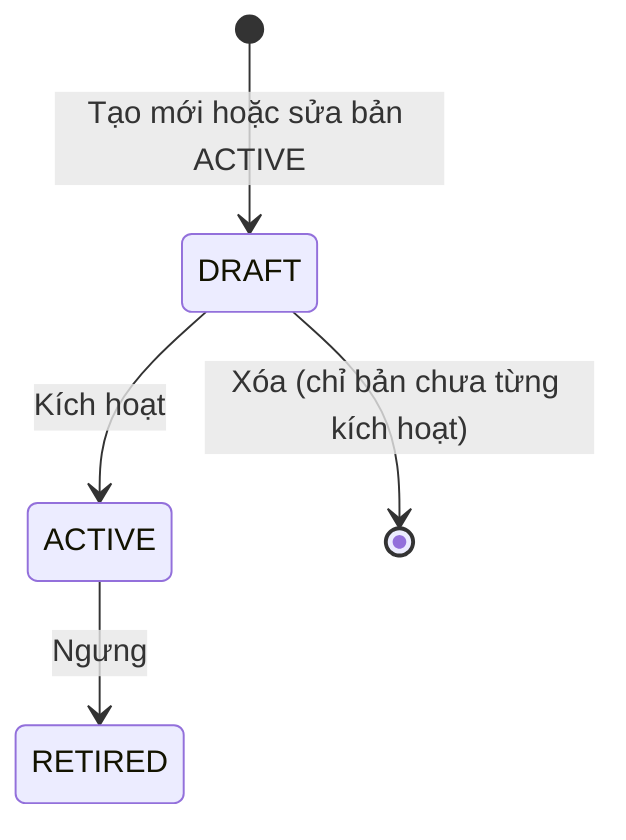

# U06 Rubric & Question Bank - Domain Entities

**Bản tài liệu 2026-10-08**: UC 32, 33, 44, 55, 56; primary stories: US-QBK-001, US-QBK-002. Quyền và supporting flows theo [current SRS contract](../../current-srs-contract.md); đây là thiết kế/kế hoạch, không xác nhận implementation mới.

Thiết kế độc lập công nghệ. Truy vết: `US-QBK-001`, `002`; UC 32, 33, 39, 40, 41, 42, 43, 44, 55, 56.

## 1. Tổng quan

| Entity | Loại | Lưu ở | Unit ghi |
|---|---|---|---|
| `BankItem` | Aggregate root (một bản ghi = một phiên bản); câu hỏi lưu ở `questions` (thực thể `QUESTION`), rubric lưu ở `rubrics` (thực thể `RUBRIC`) | `questions`, `rubrics` | U06 |
| `QuestionDefinition` | Value object của câu hỏi | `questions.definition` | U06 (khung tài liệu do U09 kiểm) |
| `RubricDefinition` | Value object của rubric | `rubrics.criteria` | U06 |

U06 **không** sở hữu: bài đánh giá và việc dùng câu hỏi trong bài (U08), cấu hình riêng từng bài (U09), chạy code (U13), chấm (U15).

## 2. `BankItem`

| Thuộc tính | Kiểu | Ràng buộc |
|---|---|---|
| `id` | UUID | Chính là ID phiên bản; `assignments.config` (`questionRubrics[].rubricId`, `parts[].rubricId`) lưu ID này |
| `lineage_id` | UUID | Gom các phiên bản của cùng một câu/rubric |
| `version` | số | Duy nhất theo `lineage_id` |
| `itemType` | enum | `QUESTION` (bảng `questions`), `RUBRIC` (bảng `rubrics`) |
| `scope_type` | enum | `SUBJECT`, `CLASS`; `ASSIGNMENT` cho câu riêng của một bài (U08) |
| `scope_id` | UUID | ID môn, lớp hoặc bài theo `scope_type` |
| `title` | chuỗi ≤ 200 | |
| `definition` / `criteria` | `QuestionDefinition` (cột `questions.definition`) hoặc `RubricDefinition` (cột `rubrics.criteria`) | Theo `itemType`; `questions` thêm `assignment_type`, `question_type` để lọc |
| `status` | enum | `DRAFT`, `ACTIVE`, `RETIRED` |
| `difficulty` | enum | `EASY`, `MEDIUM`, `HARD` (chỉ câu hỏi) |
| `tags` | danh sách chuỗi | ≤ 10 tag, mỗi tag ≤ 50 ký tự |
| `lessonRefs` | danh sách ID | Lesson U05 cùng phạm vi, ≤ 10; lưu trong `definition` |
| `clonedFrom` | UUID | Phiên bản gốc khi nhân bản; lưu trong `definition` |
| `created_at` | thời gian | Người tạo và thời điểm kích hoạt nằm trong audit |

### Trạng thái


```mermaid
stateDiagram-v2
    [*] --> DRAFT: Tạo mới hoặc sửa bản ACTIVE
    DRAFT --> ACTIVE: Kích hoạt
    DRAFT --> [*]: Xóa (chỉ bản chưa từng kích hoạt)
    ACTIVE --> RETIRED: Ngưng
```

**Text alternative**: Phiên bản mới ở `DRAFT`; kích hoạt thì thành `ACTIVE` và không sửa được nữa. Sửa một bản `ACTIVE` tạo phiên bản `DRAFT` mới cùng `lineage_id`; bản cũ vẫn `ACTIVE` cho tới khi người dùng ngưng (`RETIRED`). Chỉ bản `DRAFT` chưa từng kích hoạt mới xóa được.

## 3. `QuestionDefinition`

| `questionType` | Nội dung |
|---|---|
| `MCQ_SINGLE`, `MCQ_MULTI` | `stem` (markdown), 2-6 `options` (`id`, `text`), `correctOptionIds`, `explanation` tùy chọn |
| `ESSAY` | `stem`, `answerGuide` tùy chọn; văn bản thường, không giới hạn số từ hay số dòng |
| `DOCUMENT` | `stem`, `skeleton` bắt buộc (khung tài liệu theo mô hình của U09: heading, đoạn văn, bảng, ảnh, sơ đồ Draw.io), `requiredDiagrams` tùy chọn (loại sơ đồ → số tối thiểu); không giới hạn số từ |
| `CODE` | `stem`, `language` (`JAVA`, `PYTHON`, `C`, `CPP`, `JAVASCRIPT`, `DART`, `CSHARP`), `starterFiles` (tên → nội dung), `referenceFiles` (lời giải mẫu, không bao giờ trả cho người học), `entryPoint`, `testCases` (`input`, `expectedOutput`, `hidden`, `points`), `timeLimitMs`, `memoryLimitMb` |

Mọi câu có `defaultPoints` (> 0, tối đa 2 chữ số thập phân). Câu hỏi không chứa `rubricId`: rubric gắn vào bài (BR-U06-24, 34).

### Dạng bài dùng được

Ngân hàng giữ câu hỏi của cả năm dạng bài (thay đổi 2026-10-01). Dạng bài dùng được suy ra từ `questionType` và lưu thêm ở cột `questions.assignment_type` để lọc:

| Dạng bài (U08) | `questionType` | Use case |
|---|---|---|
| `TEXT_ESSAY` | `ESSAY` | UC 40 |
| `MULTIPLE_CHOICE_QUIZ` | `MCQ_SINGLE`, `MCQ_MULTI` | UC 39 |
| `DIAGRAM_ESSAY` | `DOCUMENT` | UC 42 |
| `CODE_LAB` | `CODE` | UC 41 |
| `GROUP_ASSIGNMENT` | `DOCUMENT` (cùng loại câu với Diagram Essay; phần tự tính theo heading, không có heading thì cả khung là một phần) | UC 43 |

Một câu `DOCUMENT` dùng được cho cả Diagram Essay và bài nhóm (phần tự tính theo heading nhỏ nhất khi đưa vào bài); rubric từng phần tạo khi soạn bài, không lưu trong câu.

## 4. `RubricDefinition`

```text
Rubric
  scaleMax (tổng điểm = tổng điểm mọi mục)
  criteria[]            tiêu chí: id, title
    items[]             mục checklist: id, text, points (> 0)
```

**Text alternative**: Rubric gồm các tiêu chí; mỗi tiêu chí có các mục checklist, mỗi mục một số điểm dương. Chấm là tích đạt/không đạt từng mục; điểm tiêu chí là tổng mục được tích, điểm rubric là tổng các tiêu chí.

## 5. Contract

### Port U06 cung cấp

| Port | Dùng bởi | Mô tả |
|---|---|---|
| `BankQueryPort` | U08, U09, U11, U13, U15 | `getVersion(id)` (bản bất biến), `search(scope, filter)` chỉ trả `ACTIVE`; `filter` có dạng bài để chỉ trả câu khớp dạng (§3); `pickRandom(scope, filter, n, excludeIds)` trả ngẫu nhiên tối đa `n` câu `ACTIVE` khớp bộ lọc, không trùng `excludeIds` (BR-U08-18); `getStudentView(id)` trả câu đã bỏ đáp án, `answerGuide`, test ẩn cho U11 (P6) |
| `RubricPort` | U09, U11, U13, U15 | `createForAssignment(actor, scope, criteria)`, `revise(rubricId, criteria)` → phiên bản mới, `cloneForAssignment(rubricId, targetScope)` (BR-U06-34…36); `getRubric(id)`, `score(rubricId, checkedItemIds)` |
| `InlineQuestionPort` | U08, U10 | Kiểm câu riêng của bài theo quy tắc ngân hàng và lưu thành dòng `questions` với `scope_type = ASSIGNMENT`, không hiện trong danh sách ngân hàng |
| `BankCopyPort` | U10 | Sao chép câu cấp lớp sang lớp đích khi copy bài giữa lớp (rubric nhân bản qua `TypeConfigPort.copy` của U09) |
| `QuestionVerificationPort` | U13 | Ghi kết quả kiểm lời giải mẫu Code Lab vào `questions.definition.verification` (kèm `contentHash`) |

### Port U06 dùng

| Port | Unit | Mô tả |
|---|---|---|
| `AuthorizationPort` | U01 | Tài khoản `ACTIVE`, vai trò |
| `AuditPort` | U02 | Audit |
| `ClassAccessPort`, `SubjectScopePort` | U04 | Phạm vi lớp/môn; Chủ nhiệm môn của môn (BR-U06-01) |
| `ArtifactPort` | U03 | Ảnh trong khung tài liệu |
| `DocumentModelPort` | U09 (`C`) | Kiểm khung tài liệu; chưa có U09 → chỉ kiểm cấu trúc JSON |
| `ContentRefPort` | U05 (`C`) | Kiểm `lessonRefs`; chưa có U05 thì bỏ qua kiểm và lưu ID |
| `AiDraftPort` | U13 | Nhận câu hỏi AI đề xuất vào ngân hàng |
| `RubricOwnerPort` | U06 khai báo, U08 cài (`C`) | `repoint(oldRubricId, newRubricId)`: bài `DRAFT` (của lớp hoặc template) đang trỏ phiên bản cũ chuyển sang phiên bản mới khi rubric được sửa ở Question Bank (BR-U06-36). Chưa có U08 → adapter rỗng |
