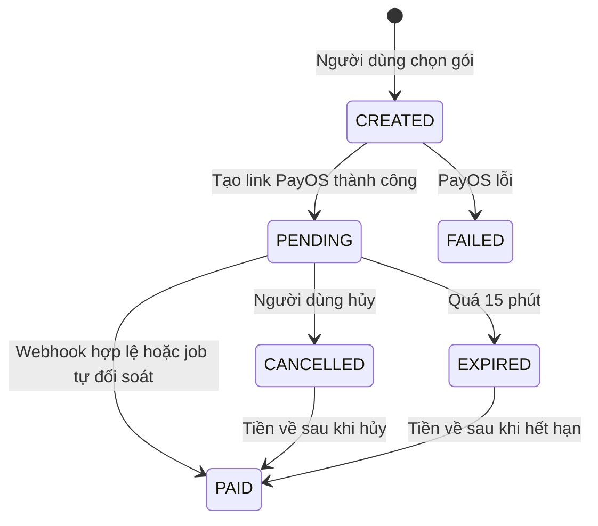
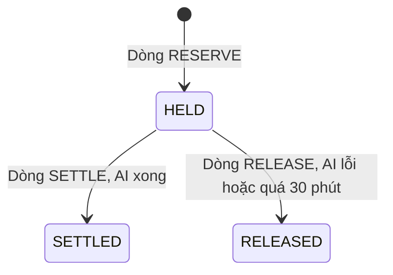

# U07 Payment & AI Credit - Domain Entities

Thiết kế độc lập công nghệ. Truy vết: `US-PAY-001`, `002`; `UC-PAY-01`.

## 1. Tổng quan

| Entity | Loại | Lưu ở | Unit ghi |
|---|---|---|---|
| `CreditPackage` | Aggregate root | `credit_packages` | U07 |
| `Payment` | Aggregate root | `payments` | U07 |
| `PaymentWebhookEvent` | Entity bất biến | `payment_webhook_events` | U07 |
| `CreditLedgerEntry` | Entity bất biến (sổ cái) | `credit_ledger` | U07 |
| `CreditReservation` | Khái niệm suy ra từ sổ cái | `credit_ledger` | U07 |
| `CreditBalance` | Value object của `Account` (U01) | `accounts` | U07 |
| `CreditSettings` | Cấu hình | `app_settings` (khóa `u07.*`) | U07 |

U07 **không** sở hữu: gọi Gemini và tính token thực tế (U05 cho embedding, U13 cho tạo nội dung), kill-switch/quota AI toàn hệ thống (U13), quyền vào lớp (U04, không liên quan).

## 2. `CreditPackage`

| Thuộc tính | Kiểu | Ràng buộc |
|---|---|---|
| `id` | UUID | |
| `name` | chuỗi ≤ 100 | |
| `credits` | số nguyên > 0 | |
| `priceVnd` | số nguyên ≥ 2 000 | Đơn vị VND |
| `active` | bool | Ẩn thay vì xóa; không xóa gói đã có giao dịch |

## 3. `Payment`

| Thuộc tính | Kiểu | Ràng buộc |
|---|---|---|
| `id` | UUID | |
| `orderCode` | số nguyên 64 bit | Mã gửi PayOS; duy nhất |
| `accountId` | UUID | Người mua |
| `packageId` | UUID | |
| `credits`, `amountVnd` | số | Chụp lại lúc tạo, không đổi khi gói đổi giá |
| `status` | enum | `CREATED`, `PENDING`, `PAID`, `CANCELLED`, `EXPIRED`, `FAILED` |
| `checkoutUrl` | chuỗi | Link PayOS |
| `providerReference` | chuỗi | Mã tham chiếu PayOS khi đã trả |
| `idempotencyKey` | chuỗi | Duy nhất theo `accountId` |
| `expiresAt` | thời gian | Tạo + 15 phút |
| `paidAt`, `createdAt` | thời gian | |

### Trạng thái

**Text alternative**: Giao dịch tạo ở `CREATED`; tạo link PayOS thành công thì `PENDING`, lỗi thì `FAILED`. Từ `PENDING`, xác nhận đã trả (webhook có chữ ký hợp lệ hoặc job tự đối soát) thì `PAID` và cộng credit đúng một lần; người dùng hủy thì `CANCELLED`; quá 15 phút thì `EXPIRED`. Nếu tiền vẫn về hợp lệ sau khi `CANCELLED`/`EXPIRED`, giao dịch vẫn chuyển `PAID` (BR-U07-13).

## 4. `PaymentWebhookEvent`

| Thuộc tính | Kiểu | Ràng buộc |
|---|---|---|
| `id` | UUID | |
| `orderCode` | số | |
| `eventKey` | chuỗi | Duy nhất: `orderCode` + `reference` của PayOS |
| `signatureValid` | bool | |
| `result` | enum | `APPLIED`, `DUPLICATE`, `REJECTED` |
| `receivedAt` | thời gian | |

Không lưu dữ liệu thẻ (PayOS là chuyển khoản).

## 5. `CreditLedgerEntry`

| Thuộc tính | Kiểu | Ràng buộc |
|---|---|---|
| `id` | UUID | |
| `accountId` | UUID | |
| `type` | enum | `PURCHASE`, `MONTHLY_GRANT`, `RESERVE`, `SETTLE`, `RELEASE` |
| `freeDelta`, `purchasedDelta` | số nguyên | Âm hoặc dương |
| `refType`, `refId` | | `PAYMENT` (với `PURCHASE`); id dòng `RESERVE` (với `SETTLE`, `RELEASE`) |
| `requestRef` | chuỗi | Chỉ `RESERVE`: mã yêu cầu do U05/U13 đặt; duy nhất trong các dòng `RESERVE` |
| `expiresAt` | thời gian | Chỉ `RESERVE`: tạo + 30 phút |
| `actorId`, `createdAt` | | |

Sổ cái chỉ thêm, không sửa, không xóa. `CreditBalance` = tổng sổ cái (kiểm được bằng query). Mọi thay đổi số dư khóa dòng tài khoản và ghi một dòng sổ cái trong cùng transaction.

## 6. `CreditReservation`

Một lần giữ credit là một dòng `RESERVE` (delta âm = phần giữ). Trạng thái suy ra từ các dòng trỏ tới nó; mỗi lần giữ chỉ được đóng một lần (unique `refId` trên các dòng `SETTLE`/`RELEASE`).

### Trạng thái

**Text alternative**: Giữ credit tạo một dòng `RESERVE` và ở trạng thái `HELD`. AI chạy xong thì ghi dòng `SETTLE` (hoàn phần chênh lệch nếu dùng ít hơn), thành `SETTLED`. AI lỗi, hoặc job quét thấy quá 30 phút, thì ghi dòng `RELEASE` hoàn toàn bộ, thành `RELEASED`.

## 7. `CreditBalance`

Thuộc tính `freeBalance`, `freePeriod` (`yyyy-MM`), `purchasedBalance` của tài khoản (xem U01). Tháng mới: `freeBalance` đặt lại bằng mức tặng; trừ credit tặng trước, credit mua sau; không bao giờ âm.

## 8. `CreditSettings`

| Khóa | Ý nghĩa |
|---|---|
| `u07.monthlyFreeCredits` | Credit tặng mỗi tháng cho mọi tài khoản; ADMIN sửa, có audit |
| `u07.tokensPerCredit` | Quy đổi token Gemini ra credit |

## 9. Contract

### Port U07 cung cấp

| Port | Dùng bởi | Mô tả |
|---|---|---|
| `CreditPort` | U05, U13 | `reserve(accountId, credits, requestRef)`, `settle(reservationId, actualCredits)`, `release(reservationId)` (`reservationId` = id dòng `RESERVE`), `balance(accountId)` |
| Event `u07.payment.paid` | U16 | Báo mua credit thành công |

### Port U07 dùng

| Port | Unit | Mô tả |
|---|---|---|
| `PaymentProviderPort` | Adapter PayOS | Tạo link, lấy trạng thái, kiểm chữ ký webhook |
| `AuthorizationPort` | U01 | Quyền admin |
| `JobPort`, `AuditPort`, `EventPublisherPort` | U02 | Job tự đối soát và trả phần giữ quá hạn, audit, event |
