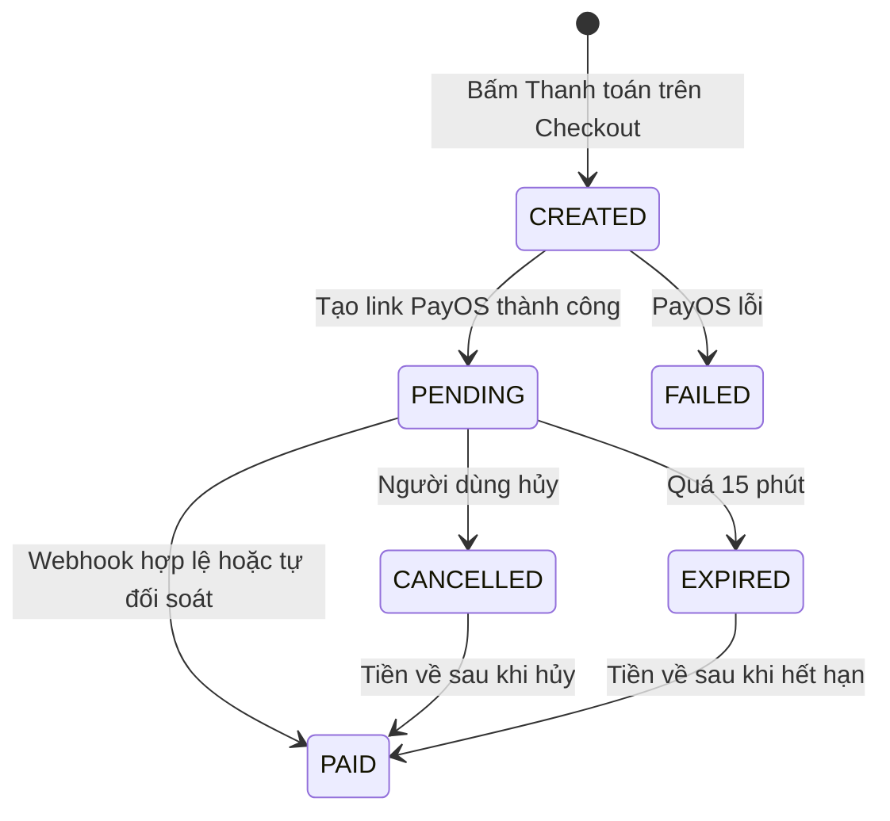
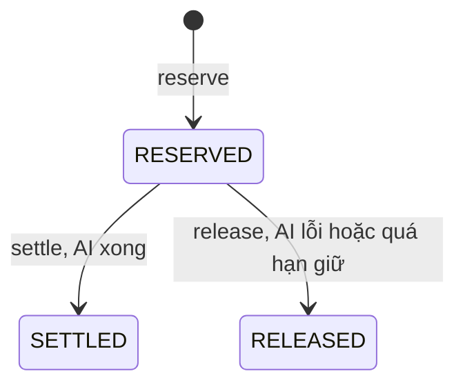

# U07 Payment & AI Credit - Domain Entities

**Bản tài liệu 2026-10-09**: UC 08, 09, 10, 11, 68, 69, 72 theo [73 UC](../../../../docs/use-cases-73.md) và screen flow `docs/G21_Diagrams.drawio` (Page-2); mục credit tặng định kỳ của Settings (UC 70–71); primary stories: US-PAY-001, US-PAY-002, US-PAY-004, US-PAY-005. Quyền và supporting flows theo [current SRS contract](../../current-srs-contract.md); đây là thiết kế/kế hoạch, không xác nhận implementation mới.

Thiết kế độc lập công nghệ. Truy vết: `US-PAY-001`, `002`, `004`, `005`; UC 08–11, 68, 69, 72. Quyết định 2026-10-09: chỉ Student, Teacher, Subject Manager có ví; kết quả thanh toán hiện trên Credit Package Checkout; mức tặng định kỳ chỉnh trên Settings.

## 1. Tổng quan

| Entity | Loại | Lưu ở | Unit ghi |
|---|---|---|---|
| `CreditPackage` | Thực thể `CREDIT_PACKAGE` | `credit_packages` | U07 (Admin thêm/sửa; seed ban đầu) |
| `Payment` | Bảng nối ACCOUNT purchasing CREDIT_PACKAGE | `payments` | U07 |
| `CreditBalance` | Value object của `Account` (U01) | `accounts` (`free_balance`, `free_period`, `purchased_balance`) | U07 |
| Mục `credit.monthlyFreeCredits` | Mục cài đặt (U07 khai báo `SettingDefinition`) | `system_settings` của U03 | U03 (Admin sửa trên Settings) |

Không có bảng sổ cái hay bảng sự kiện webhook (database chỉ gồm bảng của ERD, quyết định 2026-10-03): lần mua nằm ở `payments`; lần giữ/trừ credit nằm ở dòng `ai_suggestions` của U13 (`credits_reserved`, `free_credits_reserved`, `credits_used`, `credit_status`).

U07 **không** sở hữu: gọi Gemini, tính token và ghi lần gọi AI (U13), kill-switch/quota AI toàn hệ thống (U13), màn và bảng Settings (U03), quyền vào lớp (U04, không liên quan).

## 2. `CreditPackage`

| Thuộc tính | Kiểu | Ràng buộc |
|---|---|---|
| `id` | UUID | |
| `name` | chuỗi ≤ 100 | |
| `credits` | số nguyên > 0 | |
| `priceVnd` | số nguyên ≥ 2 000 | Đơn vị VND |
| `active` | bool | Đang bán; `false` thì không hiện trên Public Credit Packages; không xóa gói |
| `information` | chuỗi ≤ 2 000 | Mô tả bán, văn bản làm sạch |
| `version` | số nguyên | Optimistic lock khi sửa |
| `created_at`, `updated_at`, `updated_by` | thời gian, UUID | Actor/thời gian thay đổi; audit qua U02 |

## 3. `Payment`

| Thuộc tính | Kiểu | Ràng buộc |
|---|---|---|
| `id` | UUID | |
| `orderCode` | số nguyên 64 bit | Mã gửi PayOS; duy nhất |
| `accountId` | UUID | Người mua (Student, Teacher hoặc Subject Manager) |
| `packageId` | UUID | |
| `credits`, `amountVnd`, `packageName`, `packageInformation` | | Chụp lại lúc tạo, không đổi khi gói đổi |
| `status` | enum | `CREATED`, `PENDING`, `PAID`, `CANCELLED`, `EXPIRED`, `FAILED`; `PAID` chỉ đặt một lần, dùng làm khóa chống cộng trùng |
| `checkoutUrl` | chuỗi | Link PayOS |
| `providerReference` | chuỗi | Mã tham chiếu PayOS khi đã trả |
| `idempotencyKey` | chuỗi | Duy nhất |
| `expiresAt` | thời gian | Tạo + 15 phút |
| `paidAt`, `createdAt` | thời gian | |

### Trạng thái

```mermaid
stateDiagram-v2
    [*] --> CREATED: Bấm Thanh toán trên Checkout
    CREATED --> PENDING: Tạo link PayOS thành công
    CREATED --> FAILED: PayOS lỗi
    PENDING --> PAID: Webhook hợp lệ hoặc tự đối soát
    PENDING --> CANCELLED: Người dùng hủy
    PENDING --> EXPIRED: Quá 15 phút
    CANCELLED --> PAID: Tiền về sau khi hủy
    EXPIRED --> PAID: Tiền về sau khi hết hạn
```

**Text alternative**: Giao dịch tạo ở `CREATED` khi bấm Thanh toán trên Credit Package Checkout; tạo link PayOS thành công thì `PENDING`, lỗi thì `FAILED`. Từ `PENDING`, xác nhận đã trả (webhook có chữ ký hợp lệ hoặc job tự đối soát) thì `PAID` và cộng credit đúng một lần; người dùng hủy thì `CANCELLED`; quá 15 phút thì `EXPIRED`. Nếu tiền vẫn về hợp lệ sau khi `CANCELLED`/`EXPIRED`, giao dịch vẫn chuyển `PAID` (BR-U07-13). Màn Checkout hiện trạng thái này (BR-U07-14).

## 4. Webhook và chống cộng trùng

Không lưu từng webhook. Webhook hợp lệ được áp dụng bằng câu lệnh có điều kiện `UPDATE payments SET status = 'PAID' ... WHERE order_code = :code AND status <> 'PAID'`; cộng `purchased_balance` chỉ khi câu lệnh cập nhật đúng một dòng. Webhook trùng không cập nhật dòng nào nên không cộng thêm. Webhook sai chữ ký hoặc lệch số tiền ghi audit. Không lưu dữ liệu thẻ (PayOS là chuyển khoản).

## 5. `CreditBalance`

Cột `free_balance`, `free_period` (`yyyy-MM`), `purchased_balance` của `accounts`. Student, Teacher, Subject Manager được tặng định kỳ cùng một mức và được mua credit; tài khoản Admin không dùng các cột này. Student chỉ tiêu credit (tặng hay mua) cho `PRACTICE_GRADING` hợp lệ. Mọi thay đổi số dư khóa dòng tài khoản (`SELECT ... FOR UPDATE`) và đi cùng transaction với dòng nghiệp vụ tạo ra thay đổi (`payments` khi mua, `ai_suggestions` khi giữ/trừ).

## 6. Giữ và trừ credit

Một lần giữ là một dòng `ai_suggestions` của U13 ở `credit_status = RESERVED`, ghi tổng credit giữ và phần lấy từ credit tặng. U13 chỉ gọi `CreditPort` khi chuyển trạng thái của dòng đó trong cùng transaction, nên mỗi lần giữ chỉ được đóng một lần.

```mermaid
stateDiagram-v2
    [*] --> RESERVED: reserve
    RESERVED --> SETTLED: settle, AI xong
    RESERVED --> RELEASED: release, AI lỗi hoặc quá hạn giữ
```

**Text alternative**: Giữ credit đặt dòng `ai_suggestions` sang `RESERVED` và trừ số dư. AI chạy xong thì `settle` (trả phần dư nếu dùng ít hơn), thành `SETTLED`. AI lỗi, hoặc scanner thấy quá hạn giữ (30 phút; giữ khi tải học liệu tối đa 25 giờ), thì `release` trả toàn bộ, thành `RELEASED`.

## 7. Cấu hình

| Mục | Ở đâu | Ý nghĩa |
|---|---|---|
| `credit.monthlyFreeCredits` | Settings (U03), nhóm Credit | Credit tặng mỗi tháng cho Student, Teacher, Subject Manager; số nguyên 0–10 000, mặc định 100; Admin sửa trên Setting Detail |
| `U07_TOKENS_PER_CREDIT` | Biến môi trường | Quy đổi token Gemini ra credit (mặc định 1 000) |
| `U07_PACKAGES` | Biến môi trường | Dữ liệu seed ban đầu; INSERT thiếu, không update gói Admin đã sửa |

## 8. Contract

### Port U07 cung cấp

| Port | Dùng bởi | Mô tả |
|---|---|---|
| `CreditPort` | U13 | `reserve(accountId, credits, purpose, attemptRef?)` → `{reserved, fromFree}`, `settle(accountId, reserved, fromFree, actualCredits)`, `release(accountId, reserved, fromFree)`, `balance(accountId)`; gọi trong transaction của U13; Admin không có ví; Student chỉ được reserve cho `PRACTICE_GRADING` với attempt hợp lệ |
| `SettingDefinition` `credit.monthlyFreeCredits` | U03 | Khai báo mục Credit cho màn Settings |
| Event `payment.paid` | U16 | Báo mua credit thành công |

### Port U07 dùng

| Port | Unit | Mô tả |
|---|---|---|
| `PaymentProviderPort` | Adapter PayOS | Tạo link, lấy trạng thái, kiểm chữ ký webhook |
| `AuthorizationPort` | U01 | Tài khoản `ACTIVE`, vai trò và chủ ví |
| `AuditPort` | U02 | Audit |
| `JobPort`, `JobHandler`, `ScheduledScanner`, `EventPublisherPort` | U03 | Việc `PAYOS_CHECK`, scanner đối soát và hết hạn giao dịch, event `payment.paid` |
| `SettingsPort` | U03 | Đọc `credit.monthlyFreeCredits` (cache 30 giây) |
| `CreditUsagePort` | U13 (`C`, U07 khai báo) | `listUsage(accountId, page)` → lần dùng credit của chính chủ ví từ `ai_suggestions` (thời điểm, tác vụ, `credits_used`, `credit_status`). U07 không đọc thẳng bảng của U13; chưa có U13 → adapter rỗng (bảng trống) |

## 9. API

| API | Dùng để | Màn, UC | Quyền |
|---|---|---|---|
| `GET /api/v1/me/credits` | Số dư tặng, mua, tổng | My Credit Package (UC 08), thanh điều hướng | Student, Teacher, Subject Manager (chủ ví) |
| `GET /api/v1/me/payments` | Lịch sử mua của chính mình | My Credit Package (UC 08) | Chủ ví |
| `GET /api/v1/me/credit-usage` | Lần dùng credit của chính mình | My Credit Package (UC 08) | Chủ ví |
| `GET /api/v1/credit-packages` | Gói đang bán | Public Credit Packages (UC 09), Checkout | Student, Teacher, Subject Manager |
| `POST /api/v1/payments` | Tạo giao dịch và link PayOS (kèm `Idempotency-Key`) | Credit Package Checkout (UC 10) | Student, Teacher, Subject Manager |
| `GET /api/v1/payments/{orderCode}` | Trạng thái giao dịch của mình | Credit Package Checkout (UC 11) | Chủ giao dịch |
| `POST /api/v1/payments/{orderCode}:cancel` | Về qua `cancelUrl`: hỏi PayOS, chưa trả thì `CANCELLED` | Credit Package Checkout (UC 11) | Chủ giao dịch |
| `POST /api/v1/payments/payos/webhook` | Nhận webhook PayOS | - | Không đăng nhập, kiểm chữ ký |
| `GET /api/v1/admin/credit-packages` | Danh sách gói kèm trạng thái bán | Credit Package List (UC 68) | ADMIN |
| `POST /api/v1/admin/credit-packages` | Thêm gói | Credit Package Detail (UC 69) | ADMIN |
| `PATCH /api/v1/admin/credit-packages/{id}` | Sửa gói kèm `version` | Credit Package Detail (UC 69) | ADMIN |
| `GET /api/v1/admin/payments` | Lịch sử thanh toán toàn nền tảng, lọc tài khoản/gói/thời gian/trạng thái, trang 20 (tối đa 100) | Payment History (UC 72) | ADMIN |

DTO Admin trả người mua, snapshot gói/giá/credit, trạng thái/thời gian; không checksum key/token/checkout secret. Không có API sửa/xóa payment, đổi credit thủ công hay xóa gói.
