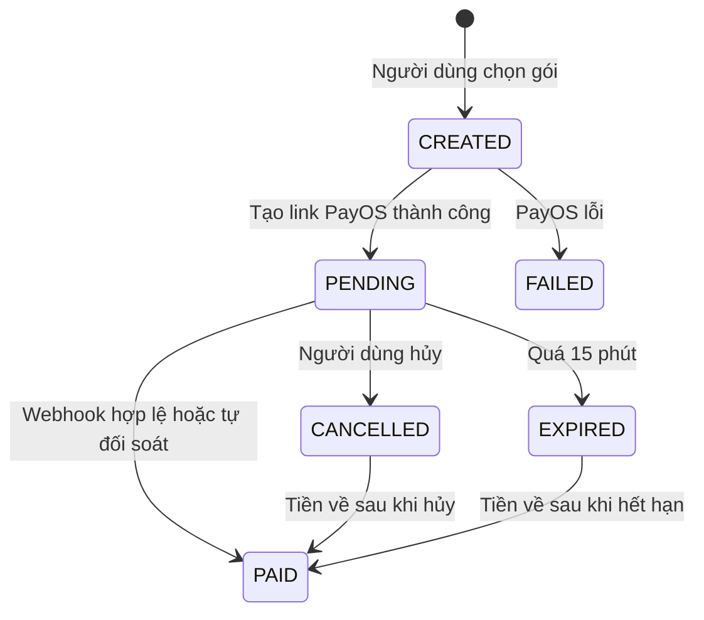
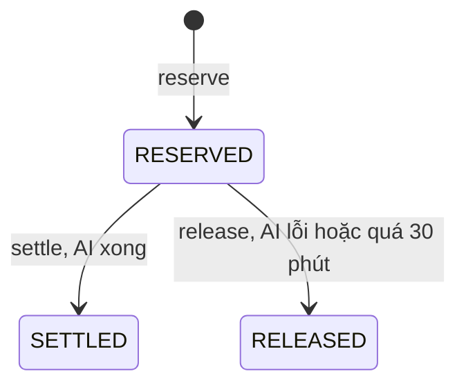

# U07 Payment & AI Credit - Domain Entities

Thiết kế độc lập công nghệ. Truy vết: `US-PAY-001`, `002`, `US-AIG-003` S4; UC 37. Gói credit và mức tặng hằng tháng là cấu hình cố định (không thuộc UC 22 từ 2026-10-03).

## 1. Tổng quan

| Entity | Loại | Lưu ở | Unit ghi |
|---|---|---|---|
| `CreditPackage` | Thực thể `CREDIT_PACKAGE` | `credit_packages` | U07 (seed khi triển khai) |
| `Payment` | Bảng nối ACCOUNT purchasing CREDIT_PACKAGE | `payments` | U07 |
| `CreditBalance` | Value object của `Account` (U01) | `accounts` (`free_balance`, `free_period`, `purchased_balance`) | U07 |
| `CreditSettings` | Cấu hình triển khai | Biến môi trường `U07_*` | - |

Không có bảng sổ cái hay bảng sự kiện webhook (database chỉ gồm bảng của ERD, quyết định 2026-10-03): lần mua nằm ở `payments`; lần giữ/trừ credit nằm ở dòng `ai_suggestions` của U13 (`credits_reserved`, `free_credits_reserved`, `credits_used`, `credit_status`).

U07 **không** sở hữu: gọi Gemini, tính token và ghi lần gọi AI (U13), kill-switch/quota AI toàn hệ thống (U13), quyền vào lớp (U04, không liên quan).

## 2. `CreditPackage`

| Thuộc tính | Kiểu | Ràng buộc |
|---|---|---|
| `id` | UUID | |
| `name` | chuỗi ≤ 100 | |
| `credits` | số nguyên > 0 | |
| `priceVnd` | số nguyên ≥ 2 000 | Đơn vị VND |
| `active` | bool | Đặt trong seed; không xóa gói đã có giao dịch |

## 3. `Payment`

| Thuộc tính | Kiểu | Ràng buộc |
|---|---|---|
| `id` | UUID | |
| `orderCode` | số nguyên 64 bit | Mã gửi PayOS; duy nhất |
| `accountId` | UUID | Người mua |
| `packageId` | UUID | |
| `credits`, `amountVnd` | số | Chụp lại lúc tạo, không đổi khi gói đổi giá |
| `status` | enum | `CREATED`, `PENDING`, `PAID`, `CANCELLED`, `EXPIRED`, `FAILED`; `PAID` chỉ đặt một lần, dùng làm khóa chống cộng trùng |
| `checkoutUrl` | chuỗi | Link PayOS |
| `providerReference` | chuỗi | Mã tham chiếu PayOS khi đã trả |
| `idempotencyKey` | chuỗi | Duy nhất |
| `expiresAt` | thời gian | Tạo + 15 phút |
| `paidAt`, `createdAt` | thời gian | |

### Trạng thái

```mermaid
stateDiagram-v2
    [*] --> CREATED: Người dùng chọn gói
    CREATED --> PENDING: Tạo link PayOS thành công
    CREATED --> FAILED: PayOS lỗi
    PENDING --> PAID: Webhook hợp lệ hoặc tự đối soát
    PENDING --> CANCELLED: Người dùng hủy
    PENDING --> EXPIRED: Quá 15 phút
    CANCELLED --> PAID: Tiền về sau khi hủy
    EXPIRED --> PAID: Tiền về sau khi hết hạn
```

**Text alternative**: Giao dịch tạo ở `CREATED`; tạo link PayOS thành công thì `PENDING`, lỗi thì `FAILED`. Từ `PENDING`, xác nhận đã trả (webhook có chữ ký hợp lệ hoặc job tự đối soát) thì `PAID` và cộng credit đúng một lần; người dùng hủy thì `CANCELLED`; quá 15 phút thì `EXPIRED`. Nếu tiền vẫn về hợp lệ sau khi `CANCELLED`/`EXPIRED`, giao dịch vẫn chuyển `PAID` (BR-U07-13).

## 4. Webhook và chống cộng trùng

Không lưu từng webhook. Webhook hợp lệ được áp dụng bằng câu lệnh có điều kiện `UPDATE payments SET status = 'PAID' ... WHERE order_code = :code AND status <> 'PAID'`; cộng `purchased_balance` chỉ khi câu lệnh cập nhật đúng một dòng. Webhook trùng không cập nhật dòng nào nên không cộng thêm. Webhook sai chữ ký hoặc lệch số tiền ghi audit. Không lưu dữ liệu thẻ (PayOS là chuyển khoản).

## 5. `CreditBalance`

Cột `free_balance`, `free_period` (`yyyy-MM`), `purchased_balance` của `accounts`. Cả bốn vai trò được tặng tháng cùng một mức và được mua credit. Student chỉ tiêu credit (tặng hay mua) cho `PRACTICE_GRADING` hợp lệ. Mọi thay đổi số dư khóa dòng tài khoản (`SELECT ... FOR UPDATE`) và đi cùng transaction với dòng nghiệp vụ tạo ra thay đổi (`payments` khi mua, `ai_suggestions` khi giữ/trừ).

## 6. Giữ và trừ credit

Một lần giữ là một dòng `ai_suggestions` của U13 ở `credit_status = RESERVED`, ghi tổng credit giữ và phần lấy từ credit tặng. U13 chỉ gọi `CreditPort` khi chuyển trạng thái của dòng đó trong cùng transaction, nên mỗi lần giữ chỉ được đóng một lần.

```mermaid
stateDiagram-v2
    [*] --> RESERVED: reserve
    RESERVED --> SETTLED: settle, AI xong
    RESERVED --> RELEASED: release, AI lỗi hoặc quá 30 phút
```

**Text alternative**: Giữ credit đặt dòng `ai_suggestions` sang `RESERVED` và trừ số dư. AI chạy xong thì `settle` (trả phần dư nếu dùng ít hơn), thành `SETTLED`. AI lỗi, hoặc scanner thấy quá 30 phút, thì `release` trả toàn bộ, thành `RELEASED`.

## 7. `CreditSettings`

| Biến | Ý nghĩa |
|---|---|
| `U07_MONTHLY_FREE_CREDITS` | Credit tặng mỗi tháng cho mọi tài khoản `ACTIVE` (Người học, Giảng viên, Chủ nhiệm môn, Quản trị viên); đổi bằng lần triển khai mới |
| `U07_TOKENS_PER_CREDIT` | Quy đổi token Gemini ra credit (mặc định 1 000) |
| `U07_PACKAGES` | Danh sách gói nạp vào `credit_packages` khi khởi động |

## 8. Contract

### Port U07 cung cấp

| Port | Dùng bởi | Mô tả |
|---|---|---|
| `CreditPort` | U13 | `reserve(accountId, credits, purpose, attemptRef?)` → `{reserved, fromFree}`, `settle(accountId, reserved, fromFree, actualCredits)`, `release(accountId, reserved, fromFree)`, `balance(accountId)`; gọi trong transaction của U13; Student chỉ được reserve cho `PRACTICE_GRADING` với attempt hợp lệ |
| Event `payment.paid` | U16 | Báo mua credit thành công |

### Port U07 dùng

| Port | Unit | Mô tả |
|---|---|---|
| `PaymentProviderPort` | Adapter PayOS | Tạo link, lấy trạng thái, kiểm chữ ký webhook |
| `AuthorizationPort` | U01 | Tài khoản `ACTIVE`, vai trò và chủ ví |
| `AuditPort` | U02 | Audit |
| `JobPort`, `JobHandler`, `ScheduledScanner`, `EventPublisherPort` | U03 | Việc `PAYOS_CHECK`, scanner đối soát và hết hạn giao dịch, event `payment.paid` |
| `CreditUsagePort` | U13 (`C`, U07 khai báo) | `listUsage(accountId, page)` → lần dùng credit của chính chủ ví từ `ai_suggestions` (thời điểm, tác vụ, `credits_used`, `credit_status`). U07 không đọc thẳng bảng của U13; chưa có U13 → adapter rỗng (bảng trống) |
