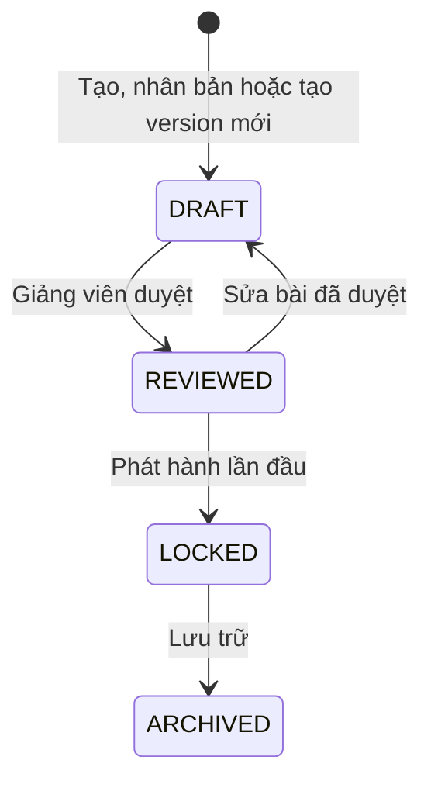
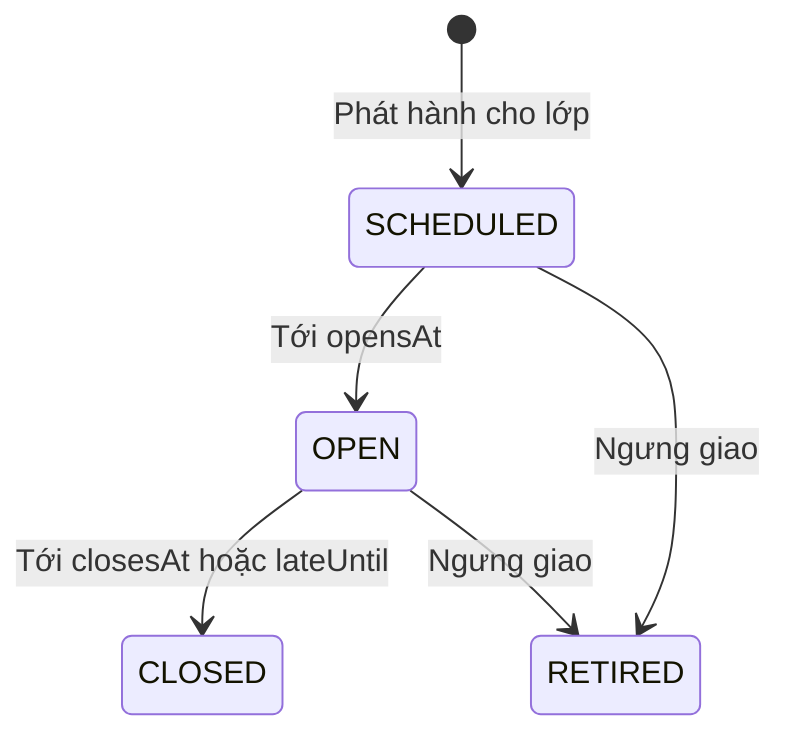

# U08 Assessment Core & Publication - Domain Entities

Thiết kế độc lập công nghệ. Truy vết: `US-ASM-001`; `UC-ASM-01`, `UC-ASM-07`; khóa nội dung cho `US-QBK-002` S2, S3.

## 1. Tổng quan

| Entity | Loại | Lưu ở | Unit ghi |
|---|---|---|---|
| `Assignment` | Aggregate root (một bản ghi = một version) | `assignments` | U08 |
| `AssignmentComponent` | Entity | `assignment_components` | U08 |
| `Publication` | Aggregate root | `publications` | U08 |
| `QuestionTypeConfig` | Value object của `Assignment` | `assignments` | U09 |
| `DocumentSkeleton` | Value object của `Assignment` | `assignments` | U09 |
| `AssignmentLineage` | Value object của `Assignment` | `assignments` | U10 |
| `SimulationPolicy` | Value object của `Publication` | `publications` | U10 |
| `GradeRelease` | Value object của `Publication` | `publications` | U15 |

U08 tạo migration cho các bảng trên; U09, U10, U15 ghi phần của mình qua port của U08. U08 **không** sở hữu nghiệp vụ: cấu hình riêng từng loại bài (U09), template/copy/thi thử (U10), lượt làm và bài nộp (U11), nhóm (U12), AI và chạy code (U13), điểm (U15).

## 2. `Assignment`

| Thuộc tính | Kiểu | Ràng buộc |
|---|---|---|
| `id` | UUID | Một bản ghi = một version |
| `stableKey` | UUID | Gom các version của cùng một bài |
| `versionNo` | số | Tăng dần theo `stableKey` |
| `ownerType` | enum | `CLASS` (bài của lớp) hoặc `SUBJECT_TEMPLATE` (template cấp môn của U10, không phát hành trực tiếp) |
| `classId` / `subjectId` | UUID | Theo `ownerType`; không có đề chung cấp môn |
| `title` | chuỗi ≤ 200 | |
| `instructions` | markdown ≤ 20 000 ký tự | |
| `assignmentType` | enum | `QUIZ`, `ESSAY`, `DOCUMENT`, `CODE_LAB`, `GROUP`; một loại mỗi bài |
| `status` | enum | `DRAFT`, `REVIEWED`, `LOCKED`, `ARCHIVED` |
| `totalPoints` | numeric(6,2) | Tổng điểm thành phần, tự tính |
| `origin` | enum | `MANUAL`, `AI`, `CLONE`, `NEW_VERSION`, `TEMPLATE_COPY`, `CLASS_COPY` |
| `aiProposalRef` | chuỗi | Khi từ AI: tham chiếu đề xuất và nguồn (U13) |
| `typeConfig` | `QuestionTypeConfig` | U09 ghi |
| `skeleton` | `DocumentSkeleton` | U09 ghi; chỉ bài `DOCUMENT`/`GROUP` |
| `lineage` | `AssignmentLineage` | U10 ghi khi copy/nhân bản/version mới |
| `reviewedBy`, `reviewedAt` | | |
| `createdBy`, `version` | | Khóa lạc quan |

### Trạng thái

**Text alternative**: Bài tạo ra ở `DRAFT`. Giảng viên duyệt thì thành `REVIEWED`; sửa bài đã duyệt đưa về `DRAFT`. Phát hành lần đầu chuyển bài sang `LOCKED` và từ đó nội dung không sửa được; muốn đổi thì ngưng giao hoặc đợi đóng rồi tạo version mới. Bài `LOCKED` có thể lưu trữ (`ARCHIVED`).

## 3. `AssignmentComponent`

| Thuộc tính | Kiểu | Ràng buộc |
|---|---|---|
| `id` | UUID | |
| `assignmentId` | UUID | |
| `sequenceNo` | số | |
| `componentType` | enum | `QUESTION`, `RUBRIC` |
| `bankItemId` | UUID | Câu/rubric từ ngân hàng U06 (phiên bản `ACTIVE`, ghim) |
| `inlineDefinition` | JSON | Câu riêng của bài, cùng cấu trúc `QuestionDefinition` U06, khi không có `bankItemId` |
| `points` | numeric(6,2) | Mặc định bằng `defaultPoints` của câu; sửa được khi `DRAFT` |

Mỗi thành phần có đúng một trong `bankItemId`, `inlineDefinition`. Loại câu phải khớp `assignmentType` (`QUIZ` ↔ `MCQ_*`, `ESSAY` ↔ `ESSAY`, `DOCUMENT` ↔ `DOCUMENT`, `CODE_LAB` ↔ `CODE`; `GROUP` là bài `DOCUMENT` làm nhóm: đúng một thành phần `DOCUMENT` có khung chứa các mục việc).

## 4. `Publication`

| Thuộc tính | Kiểu | Ràng buộc |
|---|---|---|
| `id` | UUID | |
| `assignmentId` | UUID | |
| `classId` | UUID | Một lớp mỗi lần phát hành |
| `opensAt`, `closesAt` | thời gian | `opensAt < closesAt` |
| `allowLate` | bool | |
| `lateUntil` | thời gian | Khi `allowLate`; `closesAt < lateUntil ≤ closesAt + 30 ngày` |
| `maxAttempts` | số | 1-10 |
| `deliveryMode` | enum | `STANDARD`, `SIMULATION` |
| `status` | enum | `SCHEDULED`, `OPEN`, `CLOSED`, `RETIRED` |
| `simulationPolicy` | `SimulationPolicy` | U10 ghi; chỉ `SIMULATION` |
| `gradeRelease` | `GradeRelease` | U15 ghi |
| `publishedBy`, `publishedAt`, `retiredBy`, `retiredAt`, `retireReason` | | |

Unique: một `Publication` chưa `RETIRED` cho mỗi `(assignmentId, classId)`.

### Trạng thái

**Text alternative**: Mỗi lần phát hành bắt đầu ở `SCHEDULED`; tới giờ mở thì `OPEN`; tới hạn (hoặc hạn nộp trễ nếu cho phép) thì `CLOSED`. Giảng viên có thể ngưng giao (`RETIRED`, bắt buộc lý do) khi đang `SCHEDULED` hoặc `OPEN`. `CLOSED` và `RETIRED` là trạng thái cuối.

## 5. Value object do unit khác ghi

| Value object | Định nghĩa ở | Unit ghi |
|---|---|---|
| `QuestionTypeConfig`, `DocumentSkeleton` | U09 domain entities | U09 |
| `AssignmentLineage`, `SimulationPolicy` | U10 domain entities | U10 |
| `GradeRelease` | U15 domain entities | U15 |

## 6. Contract

### Port U08 cung cấp

| Port | Dùng bởi | Mô tả |
|---|---|---|
| `AssignmentQueryPort` | U09-U12, U14-U16 | Bài, thành phần, publication; `isSubmissionOpen(publicationId, now)` |
| `AssignmentService`, `PublicationService` | U10 | Tạo bài nháp (copy, template), tạo publication `SIMULATION` |
| `AssignmentExtensionPort` | U09, U10, U15 | Ghi value object của mình vào bài/publication khi trạng thái cho phép |

### Port U08 khai báo, unit khác cài

| Port | Cài bởi | Mô tả |
|---|---|---|
| `TypeConfigPort` | U09 (`C`) | `check` cấu hình đủ để duyệt; `copy(fromId, toId)` khi tạo version mới hoặc nhân bản; chưa có U09 → bỏ qua |
| `GroupReadinessPort` | U12 (`C`) | Bài nhóm đủ nhóm hợp lệ, mỗi nhóm một trưởng nhóm, mọi người học có nhóm; chưa có U12 → không cho phát hành bài `GROUP` |
| `CodeLabCheckPort` | U13 (`C`) | Bài `CODE_LAB` đã kiểm lời giải mẫu với nội dung hiện tại |

### Port U08 dùng

| Port | Unit | Mô tả |
|---|---|---|
| `AiDraftPort` | U13 (`C`) | Yêu cầu và nhận đề xuất AI |
| `BankQueryPort`, `DefinitionValidationPort` | U06 | Lấy phiên bản, kiểm câu riêng |
| `ClassAccessPort` | U04 | Phạm vi, danh sách lớp |
| `JobPort`, `AuditPort`, `EventPublisherPort` | U02 | Mở/đóng theo lịch, audit, event `u08.assignment.*` |
