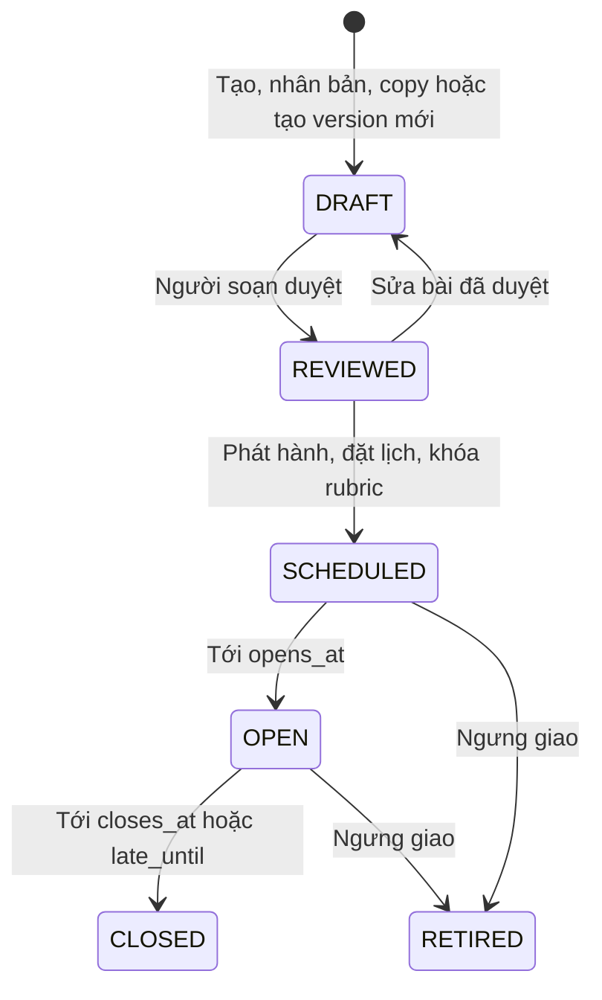
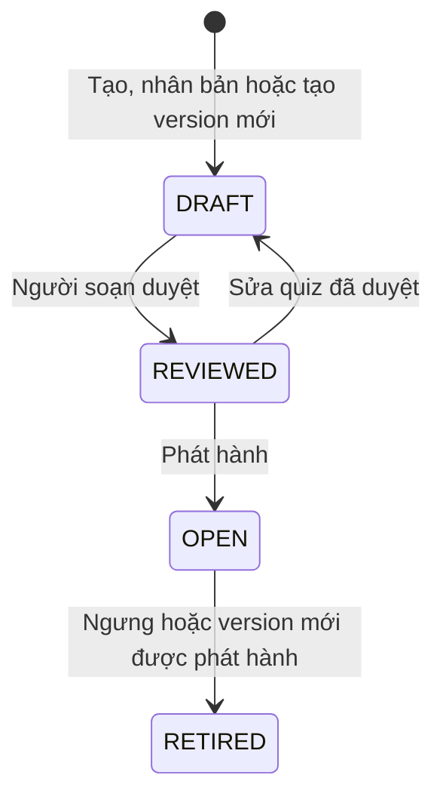

# U08 Assessment Core & Publication - Domain Entities

**Bản tài liệu 2026-10-09**: UC 41 và vòng đời (tạo, xóa, duyệt, phát hành, lịch, ngưng giao, nhân bản, version) của UC 35, 42, 43, 44, 45 theo [73 UC](../../../../docs/use-cases-73.md) và screen flow `docs/G21_Diagrams.drawio` (Page-2); primary stories: US-ASM-001, US-ASM-008, US-ASM-009, US-ASM-010. Quyền và supporting flows theo [current SRS contract](../../current-srs-contract.md); đây là thiết kế/kế hoạch, không xác nhận implementation mới.

Thiết kế độc lập công nghệ. Truy vết: `US-ASM-001`, `US-ASM-008`; UC 35, 41–45; khóa nội dung cho `US-QBK-002` S2, S3.

Quyết định 2026-10-03: không có bảng `publications`; mỗi dòng `assignments` mang luôn lịch mở/đóng. Quyết định 2026-10-09: có bài của lớp, bài của môn (giao cho mọi lớp của môn, một lịch chung, giảng viên từng lớp chấm) và quiz luyện tập gắn học liệu; giữ bước Duyệt; template môn được thay bằng bài của môn; copy bài giữa lớp gộp vào U08, U10 bị xóa.

## 1. Tổng quan

| Entity | Thực thể ERD | Lưu ở | Unit ghi |
|---|---|---|---|
| `Assignment` | `ASSIGNMENT` (một dòng = một version của một bài hoặc quiz) | `assignments` | U08 |
| `AssignmentQuestion` | Bảng nối ASSIGNMENT including QUESTION (quiz, Text Essay, Code Lab) | `assignment_questions` | U08 |
| `QuestionTypeConfig`, `DocumentSkeleton`, cài đặt quiz | Value object | `assignments.config` | U09 |
| Lineage (nhân bản, version, copy giữa lớp) | Value object | `assignments.source_assignment_id`, `config.origin` | U08 |
| `ReminderMark` | Value object | `assignments.reminder_sent_at` | U16 |

U08 tạo migration cho hai bảng; U09, U15, U16 ghi phần của mình qua port của U08. U08 sở hữu dạng, chế độ, phạm vi (lớp hoặc môn), học liệu của quiz, lịch, nhân bản, version và copy giữa lớp; U08 **không** sở hữu nội dung riêng từng dạng bài (U09), lượt làm (U11), nhóm (U12), AI và chạy code (U13), tài liệu nhóm (U14), điểm (U15), rubric (U06).

## 2. `Assignment`

| Cột | Kiểu | Ràng buộc |
|---|---|---|
| `id` | UUID | Một dòng = một version |
| `class_id` | UUID | Bài hoặc quiz của lớp; NULL khi là của môn |
| `subject_id` | UUID | Bài hoặc quiz của môn (mọi lớp của môn thấy); NULL khi là của lớp |
| `lesson_id` | UUID | Chỉ quiz: học liệu gắn (U05); học liệu của lớp với quiz lớp, học liệu của môn với quiz môn |
| `source_assignment_id` | UUID | Version trước, bài gốc khi nhân bản hoặc bài nguồn khi copy; không là khóa ngoại |
| `type` | enum | `TEXT_ESSAY`, `DIAGRAM_ESSAY`, `CODE_LAB`, `GROUP_ASSIGNMENT` (bài tập); `MULTIPLE_CHOICE_QUIZ` (quiz) |
| `grading_mode` | enum | `GRADED` hoặc `PRACTICE`; `GROUP_ASSIGNMENT` chỉ `GRADED`; quiz chỉ `PRACTICE` |
| `title` | chuỗi ≤ 200 | |
| `instructions` | markdown ≤ 20 000 ký tự | |
| `config` | JSON | Nội dung riêng dạng bài, khung tài liệu, cài đặt quiz (U09); `origin` (`MANUAL`, `CLONE`, `NEW_VERSION`, `CLASS_COPY`) |
| `status` | enum | Bài tập: `DRAFT`, `REVIEWED`, `SCHEDULED`, `OPEN`, `CLOSED`, `RETIRED`; quiz: `DRAFT`, `REVIEWED`, `OPEN`, `RETIRED` |
| `version` | số | Số version của bài, chỉ tăng khi tạo version mới (BR-U08-43) |
| `opens_at`, `closes_at` | thời gian | Bài tập: đặt khi phát hành, `opens_at < closes_at`; quiz: `opens_at` = lúc phát hành, không có `closes_at` |
| `late_until` | thời gian | NULL = không nhận nộp trễ; `closes_at < late_until ≤ closes_at + 30 ngày` |
| `max_attempts` | số | Bài tập 1-10; quiz 1-10 hoặc NULL (không giới hạn) |
| `reminder_sent_at` | thời gian | U16 đánh dấu đã nhắc hạn |

Tổng điểm tính khi đọc theo BR-U08-12. Người tạo, người duyệt, người phát hành, lý do ngưng giao nằm trong audit.

### Trạng thái bài tập (của lớp hoặc của môn)

```mermaid
stateDiagram-v2
    [*] --> DRAFT: Tạo, nhân bản, copy hoặc tạo version mới
    DRAFT --> REVIEWED: Người soạn duyệt
    REVIEWED --> DRAFT: Sửa bài đã duyệt
    REVIEWED --> SCHEDULED: Phát hành, đặt lịch, khóa rubric
    SCHEDULED --> OPEN: Tới opens_at
    OPEN --> CLOSED: Tới closes_at hoặc late_until
    SCHEDULED --> RETIRED: Ngưng giao
    OPEN --> RETIRED: Ngưng giao
```

**Text alternative**: Bài tạo ra ở `DRAFT`. Người soạn duyệt thì thành `REVIEWED`; sửa bài đã duyệt đưa về `DRAFT`. Phát hành đặt lịch, khóa rubric và chuyển `SCHEDULED`; từ đây nội dung không sửa được. Tới giờ mở thì `OPEN`, tới hạn (hoặc hạn nộp trễ) thì `CLOSED`. Người có quyền có thể ngưng giao (`RETIRED`, có lý do) khi đang `SCHEDULED` hoặc `OPEN`. Muốn đổi nội dung sau khi `CLOSED`/`RETIRED` thì tạo version mới.

### Trạng thái quiz

```mermaid
stateDiagram-v2
    [*] --> DRAFT: Tạo, nhân bản hoặc tạo version mới
    DRAFT --> REVIEWED: Người soạn duyệt
    REVIEWED --> DRAFT: Sửa quiz đã duyệt
    REVIEWED --> OPEN: Phát hành
    OPEN --> RETIRED: Ngưng hoặc version mới được phát hành
```

**Text alternative**: Quiz tạo ra ở `DRAFT`, duyệt thành `REVIEWED`, phát hành thì `OPEN` ngay (không có lịch). Quiz `OPEN` bị ngưng, hoặc có version mới được phát hành, thì `RETIRED`; lượt làm cũ vẫn xem được.

## 3. `AssignmentQuestion` (quiz, Text Essay, Code Lab)

| Cột | Kiểu | Ràng buộc |
|---|---|---|
| `assignment_id` | UUID | Khóa chính cùng `question_id`; bài là quiz, Text Essay hoặc Code Lab |
| `question_id` | UUID | Một version cụ thể của câu trong `questions` (U06): câu ngân hàng `ACTIVE` được ghim, hoặc câu riêng của bài (`scope_type = ASSIGNMENT`) |
| `order_no` | số | |
| `points` | numeric(6,2) | Quiz: mặc định `defaultPoints`, sửa được khi `DRAFT`; Code Lab: tổng điểm test của câu; Text Essay: tổng điểm rubric của câu (tính khi đọc) |

Loại câu phải khớp dạng: `MULTIPLE_CHOICE_QUIZ` ↔ `MCQ_*`, `TEXT_ESSAY` ↔ `ESSAY`, `CODE_LAB` ↔ `CODE`. Diagram Essay và bài nhóm không có dòng `assignment_questions`; câu `DOCUMENT` của ngân hàng chỉ là nguồn để sao khung.

## 4. Contract

### Port U08 cung cấp

| Port | Dùng bởi | Mô tả |
|---|---|---|
| `AssignmentQueryPort` | U09-U11, U13-U16 | Bài, câu, lịch; `listForClass(classId)` gồm bài của lớp và bài của môn chứa lớp; `listQuizzesOfLesson(lessonId, classId)`; `isSubmissionOpen(assignmentId, now)` |
| `AssignmentExtensionPort` | U09, U15, U16 | Ghi cột/value object của mình vào bài khi trạng thái cho phép (U09: nội dung dạng bài, khung, cài đặt quiz) |
| Event `assignment.opened` | U16 | Phát sau commit khi bài tập mở hoặc quiz phát hành; payload `assignmentId`, `classId` hoặc `subjectId`, `type` |

### Port U08 khai báo, unit khác cài

| Port | Cài bởi | Mô tả |
|---|---|---|
| `TypeConfigPort` | U09 (`C`) | `check` cấu hình đủ để duyệt (gồm rubric đã điền); `syncQuestionRubrics(assignmentId, questionIds)` khi thêm/bỏ câu Text Essay; `copy(fromId, toId)` khi tạo version mới hoặc nhân bản (nhân bản rubric); chưa có U09 → bỏ qua |
| `GroupReadinessPort` | U12 (`C`) | Lớp của bài nhóm có ít nhất một nhóm, mỗi nhóm có thành viên và một trưởng nhóm (lỗi chặn); sinh viên chưa có nhóm là cảnh báo cần xác nhận; không có bản cài → không cho phát hành bài `GROUP_ASSIGNMENT` |
| `CodeLabCheckPort` | U13 (`C`) | `check`: mọi câu `CODE` của bài đã kiểm lời giải mẫu theo `contentHash` hiện tại (BR-U08-20); U13 còn cung cấp `statusOf` cho U09 hiện trạng thái; chưa có U13 → bỏ qua kiểm |
| `AssignmentLifecyclePort` | U11, U14 (`C`) | `onOpened(assignmentId)`, `onRetired(assignmentId)` gọi trong transaction mở bài/ngưng giao; chưa có U11/U14 → adapter rỗng |

### Port U08 dùng

| Port | Unit | Mô tả |
|---|---|---|
| `AiDraftPort` | U13 (`C`) | Yêu cầu và nhận đề xuất câu cho quiz, Text Essay, Code Lab |
| `BankQueryPort`, `InlineQuestionPort` | U06 | Tìm, chọn ngẫu nhiên câu khớp dạng của ngân hàng môn; lưu câu riêng của bài |
| `RubricPort` | U06 | `lockForAssignment` khi phát hành (từ chối khi rubric trống) |
| `ContentRefPort` | U05 | `getLessonRef` cho học liệu của quiz; module/học liệu trong bộ lọc chọn ngẫu nhiên |
| `AuthorizationPort` | U01 | Tài khoản `ACTIVE`, vai trò |
| `ClassAccessPort`, `SubjectScopePort`, `ClassScopePort` | U04 | Giảng viên của lớp (R3/R4), Chủ nhiệm môn (R2), môn của lớp, trạng thái lớp/môn |
| `AuditPort` | U02 | Audit |
| `ScheduledScanner`, `EventPublisherPort` | U03 | Mở/đóng theo lịch, event `assignment.opened` |

## 5. API

| API | Dùng để | Màn, UC | Quyền |
|---|---|---|---|
| `GET /api/v1/classes/{classId}/assignments` | Bài tập của lớp kèm bài của môn (chỉ đọc), lọc dạng/chế độ/trạng thái | Tab Evals, UC 41 | R3/R4 |
| `POST /api/v1/classes/{classId}/assignments` | Tạo bài tập của lớp (dạng, chế độ) | Tab Evals → Assignment Form, UC 42–45 | R3/R4 |
| `GET /api/v1/classes/{classId}/quizzes` | Quiz của lớp kèm quiz của môn (chỉ đọc) | Tab Evals | R3/R4 |
| `POST /api/v1/classes/{classId}/quizzes` | Tạo quiz của lớp (kèm `lessonId`) | Tab Evals → Quiz Detail, UC 35 | R3/R4 |
| `GET /api/v1/subjects/{subjectId}/assignments` | Bài tập của môn | Assignment List (Manager Dashboard) | R2 |
| `POST /api/v1/subjects/{subjectId}/assignments` | Tạo bài tập của môn (không có bài nhóm) | Assignment List → Assignment Form | R2 |
| `GET /api/v1/subjects/{subjectId}/quizzes` | Quiz của môn | Quiz List (Manager Dashboard) | R2 |
| `POST /api/v1/subjects/{subjectId}/quizzes` | Tạo quiz của môn (kèm `lessonId`) | Quiz List → Quiz Detail | R2 |
| `GET`, `PATCH`, `DELETE /api/v1/assignments/{id}` | Xem; sửa tiêu đề/hướng dẫn/chế độ khi `DRAFT`; xóa bài chưa từng phát hành | Assignment Form, Quiz Detail | Người có quyền với bài; giảng viên lớp chỉ xem bài của môn |
| `POST`, `PATCH`, `DELETE /api/v1/assignments/{id}/questions` | Thêm (chọn tay, ngẫu nhiên, câu riêng), sắp xếp, đặt điểm, bỏ câu của quiz, Text Essay, Code Lab | Quiz Detail, Assignment Form | Người có quyền với bài |
| `POST /api/v1/assignments/{id}/ai-drafts` | Nhờ AI soạn câu cho quiz, Text Essay, Code Lab | Quiz Detail, Assignment Form | Người có quyền với bài |
| `POST /api/v1/assignments/{id}/review` | Duyệt | Assignment Form, Quiz Detail | Người có quyền với bài |
| `POST /api/v1/assignments/{id}/publish` | Phát hành (bài tập kèm lịch; quiz không lịch; bài nhóm kèm `confirmUngroupedStudents` khi có cảnh báo) | Assignment Form, Quiz Detail | Người có quyền với bài |
| `PATCH /api/v1/assignments/{id}/schedule` | Sửa lịch bài tập | Assignment Form | Người có quyền với bài |
| `POST /api/v1/assignments/{id}/retire` | Ngưng giao kèm lý do | Assignment Form, Quiz Detail | Người có quyền với bài |
| `POST /api/v1/assignments/{id}/clone`, `/versions` | Nhân bản; tạo version mới | Assignment Form, Quiz Detail | Người có quyền với bài |
| `GET /api/v1/classes/{classId}/copy-sources?type=&mode=` | Lớp mình dạy và bài cùng dạng, chế độ để copy | Tạo bài (tab Evals) | R3/R4 của lớp đích |
| `POST /api/v1/classes/{classId}/assignments:copy-from-class` | Copy bài từ lớp khác thành bài nháp của lớp đích | Tạo bài (tab Evals) | R3/R4 của cả hai lớp |

"Người có quyền với bài": R3/R4 của đúng lớp với bài/quiz của lớp, R2 với bài/quiz của môn.
