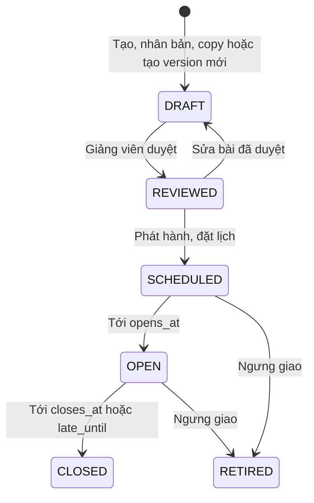

# U08 Assessment Core & Publication - Domain Entities

Thiết kế độc lập công nghệ. Truy vết: `US-ASM-001`; UC 28; khóa nội dung cho `US-QBK-002` S2, S3. Bảng theo [database](../../../../docs/database.md).

Quyết định 2026-10-03: không có bảng `publications`; mỗi dòng `assignments` của lớp mang luôn lịch mở/đóng (quan hệ COURSE_CLASS scheduling ASSIGNMENT). Phát hành cùng nội dung cho lớp khác là copy bài sang lớp đó (U10).

## 1. Tổng quan

| Entity | Thực thể ERD | Lưu ở | Unit ghi |
|---|---|---|---|
| `Assignment` | `ASSIGNMENT` (một dòng = một version của một bài) | `assignments` | U08 |
| `AssignmentQuestion` | Bảng nối ASSIGNMENT including QUESTION | `assignment_questions` | U08 |
| `QuestionTypeConfig`, `DocumentSkeleton` | Value object | `assignments.config` | U09 |
| `TemplateInfo`, lineage | Value object | `assignments` (`subject_id`, `source_assignment_id`, `status` của template) | U10 |
| `GradeRelease` | Value object | `assignments.grades_released_at` | U15 |
| `ReminderMark` | Value object | `assignments.reminder_sent_at` | U16 |

U08 tạo migration cho hai bảng; U09, U10, U15, U16 ghi phần của mình qua port của U08. U08 sở hữu dạng, chế độ và lịch của bài; U08 **không** sở hữu cấu hình riêng từng loại bài (U09), template/copy (U10), lượt làm (U11), nhóm (U12), AI và chạy code (U13), tài liệu nhóm (U14), điểm (U15).

## 2. `Assignment`

| Cột | Kiểu | Ràng buộc |
|---|---|---|
| `id` | UUID | Một dòng = một version |
| `class_id` | UUID | Bài của lớp; NULL khi là template của môn |
| `subject_id` | UUID | Template của môn (U10); NULL với bài của lớp |
| `source_assignment_id` | UUID | Version trước, bài gốc khi nhân bản hoặc template khi copy; không là khóa ngoại |
| `type` | enum | `MULTIPLE_CHOICE_QUIZ`, `TEXT_ESSAY`, `DIAGRAM_ESSAY` (dùng cấu hình DOCUMENT), `CODE_LAB`, `GROUP_ASSIGNMENT`; một dạng mỗi bài |
| `grading_mode` | enum | `GRADED` hoặc `PRACTICE`; `GROUP_ASSIGNMENT` chỉ cho `GRADED` |
| `title` | chuỗi ≤ 200 | |
| `instructions` | markdown ≤ 20 000 ký tự | |
| `config` | JSON | Cấu hình riêng loại bài và khung tài liệu (U09); `origin` (`MANUAL`, `CLONE`, `NEW_VERSION`, `TEMPLATE_COPY`, `CLASS_COPY`): cách tạo bài; câu do AI đề xuất là câu riêng của bài, tham chiếu đề xuất nằm ở `ai_suggestions` (BR-U08-21) |
| `status` | enum | Bài của lớp: `DRAFT`, `REVIEWED`, `SCHEDULED`, `OPEN`, `CLOSED`, `RETIRED`; template: xem U10 |
| `version` | số | Số version của bài, chỉ tăng khi tạo version mới (BR-U08-43); không tăng khi sửa nháp |
| `opens_at`, `closes_at` | thời gian | Đặt khi phát hành; `opens_at < closes_at` |
| `late_until` | thời gian | NULL = không nhận nộp trễ; `closes_at < late_until ≤ closes_at + 30 ngày` |
| `max_attempts` | số | 1-10 |
| `reminder_sent_at` | thời gian | U16 đánh dấu đã nhắc hạn |
| `grades_released_at` | thời gian | U15 đánh dấu đã công bố điểm |

Tổng điểm tính khi đọc theo BR-U08-12: tổng `assignment_questions.points`; Diagram Essay và bài nhóm là tổng điểm rubric các phần (U09). Người tạo, người duyệt, người phát hành, lý do ngưng giao nằm trong audit.

### Trạng thái (bài của lớp)

```mermaid
stateDiagram-v2
    [*] --> DRAFT: Tạo, nhân bản, copy hoặc tạo version mới
    DRAFT --> REVIEWED: Giảng viên duyệt
    REVIEWED --> DRAFT: Sửa bài đã duyệt
    REVIEWED --> SCHEDULED: Phát hành, đặt lịch
    SCHEDULED --> OPEN: Tới opens_at
    OPEN --> CLOSED: Tới closes_at hoặc late_until
    SCHEDULED --> RETIRED: Ngưng giao
    OPEN --> RETIRED: Ngưng giao
```

**Text alternative**: Bài tạo ra ở `DRAFT`. Giảng viên duyệt thì thành `REVIEWED`; sửa bài đã duyệt đưa về `DRAFT`. Phát hành đặt lịch và chuyển `SCHEDULED`; từ đây nội dung không sửa được. Tới giờ mở thì `OPEN`, tới hạn (hoặc hạn nộp trễ) thì `CLOSED`. Giảng viên có thể ngưng giao (`RETIRED`, có lý do) khi đang `SCHEDULED` hoặc `OPEN`. Muốn đổi nội dung sau khi `CLOSED`/`RETIRED` thì tạo version mới.

## 3. `AssignmentQuestion`

| Cột | Kiểu | Ràng buộc |
|---|---|---|
| `assignment_id` | UUID | Khóa chính cùng `question_id` |
| `question_id` | UUID | Một version cụ thể của câu trong `questions` (U06): câu ngân hàng `ACTIVE` được ghim, hoặc câu riêng của bài (U06 lưu với `scope_type = ASSIGNMENT`) |
| `order_no` | số | |
| `points` | numeric(6,2) | Mặc định bằng `defaultPoints` của câu, sửa được khi `DRAFT`; câu Text Essay luôn bằng tổng điểm rubric của câu (U09 ghi qua `AssignmentExtensionPort`) |

Loại câu phải khớp `type`: `MULTIPLE_CHOICE_QUIZ` ↔ `MCQ_*`, `TEXT_ESSAY` ↔ `ESSAY`, `CODE_LAB` ↔ `CODE`. `DIAGRAM_ESSAY` và `GROUP_ASSIGNMENT` không có dòng `assignment_questions`: khung tài liệu nằm ở `config` (U09), câu `DOCUMENT` trong ngân hàng chỉ là nguồn để sao khung.

## 4. Contract

### Port U08 cung cấp

| Port | Dùng bởi | Mô tả |
|---|---|---|
| `RubricOwnerPort` (U06 khai báo) | U06 | `repoint(oldRubricId, newRubricId)`: bài `DRAFT` đang trỏ phiên bản cũ chuyển sang phiên bản mới qua `TypeConfigPort.repointRubric` (BR-U06-36) |
| `AssignmentQueryPort` | U09-U11, U14-U16 | Bài, câu, lịch; `isSubmissionOpen(assignmentId, now)` |
| `AssignmentDraftPort` | U10 | Tạo bài nháp (copy, template); `AssignmentService` cài |
| `AssignmentExtensionPort` | U09, U10, U15, U16 | Ghi cột/value object của mình vào bài khi trạng thái cho phép (U09: cấu hình, khung, điểm câu Text Essay theo rubric) |

### Port U08 khai báo, unit khác cài

| Port | Cài bởi | Mô tả |
|---|---|---|
| `TypeConfigPort` | U09 (`C`) | `check` cấu hình đủ để duyệt (gồm rubric từng câu/từng phần); `copy(fromId, toId)` khi tạo version mới hoặc nhân bản (nhân bản rubric từng câu/từng phần); `repointRubric`; chưa có U09 → bỏ qua |
| `GroupReadinessPort` | U12 (`C`) | Lớp của bài nhóm có ít nhất một nhóm, mỗi nhóm hợp lệ và có một trưởng nhóm; Student chưa có nhóm là cảnh báo cần giảng viên xác nhận (BR-U12-21); U12 code trước U08 trong wave 2 nên U08 cắm thẳng bản thật; không có bản cài → không cho phát hành bài `GROUP_ASSIGNMENT` |
| `CodeLabCheckPort` | U13 (`C`) | Bài `CODE_LAB` đã kiểm lời giải mẫu với nội dung hiện tại (BR-U08-20); chưa có U13 → bỏ qua kiểm |
| `AssignmentLifecyclePort` | U11, U14 (`C`) | `onOpened(assignmentId)`, `onRetired(assignmentId)` gọi trong transaction mở bài/ngưng giao; cài đặt ghi dòng của unit nhận hoặc gửi việc nền (tạo tài liệu nhóm, tự nộp). Chưa có U11/U14 → adapter rỗng |

### Port U08 dùng

| Port | Unit | Mô tả |
|---|---|---|
| `AiDraftPort` | U13 (`C`) | Yêu cầu và nhận đề xuất AI |
| `BankQueryPort`, `InlineQuestionPort` | U06 | Tìm, chọn ngẫu nhiên (`pickRandom`), lấy phiên bản và bản cho người học (`getStudentView`); kiểm và lưu câu riêng của bài |
| `ContentRefPort` | U05 | Kiểm module/lesson trong bộ lọc chọn ngẫu nhiên và phạm vi yêu cầu AI thuộc lớp |
| `AuthorizationPort` | U01 | Tài khoản `ACTIVE`, vai trò |
| `ClassAccessPort` | U04 | Phạm vi, danh sách lớp |
| `AuditPort` | U02 | Audit |
| `ScheduledScanner`, `EventPublisherPort` | U03 | Mở/đóng theo lịch, event `assignment.opened` (chỉ cho thông báo U16) |
