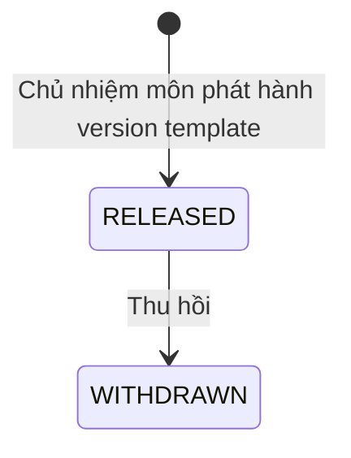
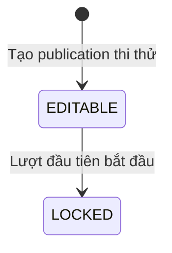

# U10 Template, Copy & Simulation - Domain Entities

Thiết kế độc lập công nghệ. Truy vết: `US-ASM-008`…`011`; `UC-ASM-15`…`18`.

## 1. Tổng quan

| Entity | Loại | Lưu ở | Unit ghi |
|---|---|---|---|
| `TemplateRelease` | Aggregate root | `template_releases` | U10 |
| `AssignmentLineage` | Value object của `Assignment` (U08) | `assignments` | U10 |
| `SimulationPolicy` | Value object của `Publication` (U08) | `publications` | U10 |
| `AssignmentDiff` | Kết quả tính | Không lưu | U10 |

U10 sở hữu nghiệp vụ: phát hành template cấp môn, nguồn gốc của bài được copy, so sánh version, chính sách thi thử. Bài, version, thành phần và publication thuộc U08 (template là bài `ownerType = SUBJECT_TEMPLATE`); U10 ghi value object của mình qua port của U08.

## 2. `TemplateRelease`

| Thuộc tính | Kiểu | Ràng buộc |
|---|---|---|
| `id` | UUID | |
| `templateAssignmentId` | UUID | Version template (bài U08 `SUBJECT_TEMPLATE`, `LOCKED` khi phát hành) |
| `subjectId` | UUID | |
| `stableKey`, `versionNo` | | Lấy từ U08 |
| `status` | enum | `RELEASED`, `WITHDRAWN` |
| `releasedBy`, `releasedAt`, `withdrawnAt` | | |

### Trạng thái

**Text alternative**: Mỗi version template được Chủ nhiệm môn phát hành ở `RELEASED`, giảng viên các lớp thuộc môn copy được. Thu hồi thì `WITHDRAWN`, không copy được nữa; bản đã copy không bị ảnh hưởng.

## 3. `AssignmentLineage`

| Thuộc tính | Kiểu | Ràng buộc |
|---|---|---|
| `sourceAssignmentId` | UUID | Version nguồn |
| `kind` | enum | `TEMPLATE_COPY`, `CLASS_COPY`, `CLONE`, `NEW_VERSION` |
| `sourceClassId` | UUID | Lớp nguồn; lớp đích là lớp của chính bài |
| `actorId`, `createdAt` | | |

Ghi một lần khi tạo bài bằng copy/nhân bản/version mới; không đồng bộ hai chiều.

## 4. `SimulationPolicy`

| Thuộc tính | Kiểu | Ràng buộc |
|---|---|---|
| `maxAttempts` | số nguyên | Bắt buộc, mặc định 3, từ 1 đến 10 |
| `resultPolicy` | enum | `HIGHEST`, `LATEST`, `AVERAGE` |
| `answerRelease` | enum | `AFTER_ATTEMPT`, `AFTER_CLOSE`, `NEVER` |
| `countsTowardGrade` | bool | |
| `lockedAt` | thời gian | Đặt khi lượt đầu tiên bắt đầu |

Chỉ có ở publication `deliveryMode = SIMULATION`.

### Trạng thái

**Text alternative**: Chính sách thi thử sửa được cho tới khi có lượt làm đầu tiên; lúc đó ghi `lockedAt` và chính sách bị khóa, muốn đổi phải tạo version mới.

## 5. `AssignmentDiff`

`instructions` (diff theo dòng), `components` (thêm/bớt/đổi thứ tự/đổi điểm/đổi nội dung), `typeConfig` (trường thay đổi), `totalPoints`. Tính khi xem, không lưu.

## 6. Contract

### Port U10 cung cấp

| Port | Dùng bởi | Mô tả |
|---|---|---|
| `SimulationPolicyPort` | U11, U15 | Chính sách của publication thi thử; `lock(publicationId)` khi lượt đầu bắt đầu |

### Port U10 dùng

| Port | Unit | Mô tả |
|---|---|---|
| `AssignmentQueryPort`, `AssignmentService`, `PublicationService`, `AssignmentExtensionPort` | U08 | Đọc version, tạo bài nháp, tạo publication `SIMULATION`, ghi lineage và chính sách |
| `TypeConfigPort` | U09 | Sao chép cấu hình/khung |
| `BankCopyPort` | U06 | Sao chép câu/rubric cấp lớp sang lớp đích |
| `ClassAccessPort` | U04 | Phạm vi lớp/môn |
| `AiDraftPort` | U13 | Nhận câu hỏi AI đề xuất vào template |
