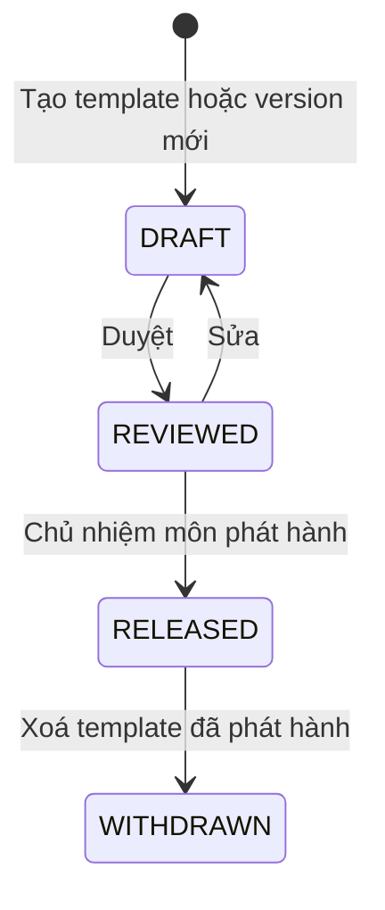

# U10 Template & Copy - Domain Entities

Thiết kế độc lập công nghệ. Truy vết: `US-ASM-008`…`010`, `US-AIG-002` (nhận bản nháp AI); UC 21, UC 28. Tên thư mục lịch sử được giữ để các liên kết cũ vẫn hoạt động.

## 1. Tổng quan

| Entity | Loại | Lưu ở | Unit ghi |
|---|---|---|---|
| `Template` | Dòng `assignments` của môn (`subject_id` có, `class_id` NULL) | `assignments` | U10 qua `AssignmentExtensionPort` của U08 |
| `AssignmentLineage` | Value object của `Assignment` | `assignments.source_assignment_id`, `config.origin` | U10 |
| `AssignmentDiff` | Kết quả tính | Không lưu | U10 |

Không có bảng `template_releases` (database chỉ gồm bảng của ERD, quyết định 2026-10-03): template là bài của môn theo quan hệ SUBJECT templating ASSIGNMENT. U10 sở hữu nghiệp vụ: tạo/sửa/xoá và phát hành template cấp môn, copy bài, so sánh version. Câu và cấu hình của bài thuộc U08/U06/U09.

## 2. `Template`

| Cột `assignments` | Ràng buộc |
|---|---|
| `subject_id` | Môn của template; `class_id` NULL |
| `status` | `DRAFT`, `REVIEWED`, `RELEASED`, `WITHDRAWN` |
| `version`, `source_assignment_id` | Version mới của template trỏ về version trước |
| Người tạo, người phát hành, thời điểm | Trong audit; quyền sửa/xoá theo Chủ nhiệm môn hiện tại của môn (BR-U10-01) |

### Trạng thái

```mermaid
stateDiagram-v2
    [*] --> DRAFT: Tạo template hoặc version mới
    DRAFT --> REVIEWED: Duyệt
    REVIEWED --> DRAFT: Sửa
    REVIEWED --> RELEASED: Chủ nhiệm môn phát hành
    RELEASED --> WITHDRAWN: Xoá template đã phát hành
```

**Text alternative**: Template tạo ra ở `DRAFT`; duyệt thì `REVIEWED`, sửa thì về `DRAFT`. Chủ nhiệm môn phát hành thì `RELEASED`, nội dung khóa và giảng viên các lớp thuộc môn copy được. Xoá template đã phát hành thì `WITHDRAWN` (BR-U10-07), không copy được nữa; bản đã copy không bị ảnh hưởng.

## 3. `AssignmentLineage`

| Thuộc tính | Lưu ở | Ràng buộc |
|---|---|---|
| Nguồn | `source_assignment_id` | Version nguồn (template, bài lớp khác, bài gốc khi nhân bản, version trước) |
| `kind` | `config.origin` | `TEMPLATE_COPY`, `CLASS_COPY`, `CLONE`, `NEW_VERSION` |
| Người copy, thời điểm | Audit | |

Ghi một lần khi tạo bài bằng copy/nhân bản/version mới; không đồng bộ hai chiều.

## 4. `AssignmentDiff`

`instructions` (diff theo dòng), câu (thêm/bớt/đổi thứ tự/đổi điểm/đổi nội dung), `config` (trường thay đổi), tổng điểm. Tính khi xem, không lưu.

## 5. Contract

### Port U10 cung cấp

| Port | Dùng bởi | Mô tả |
|---|---|---|
| `CopyFromTemplateDialog`, `CopyFromClassDialog` (frontend) | U08 | Hai lựa chọn nguồn ở bước 2 của `CreateAssignmentDialog`; U10 không cung cấp port backend cho unit khác |

### Port U10 dùng

| Port | Unit | Mô tả |
|---|---|---|
| `AssignmentQueryPort`, `AssignmentDraftPort`, `AssignmentExtensionPort` | U08 | Đọc version, tạo bài nháp, ghi `subject_id`, trạng thái template, `source_assignment_id` |
| `TypeConfigPort` | U09 | Sao chép cấu hình/khung và nhân bản rubric từng câu/phần |
| `BankCopyPort`, `InlineQuestionPort` | U06 | Sao chép câu cấp lớp sang lớp đích; sao câu riêng của bài (rubric nhân bản qua `TypeConfigPort.copy` của U09) |
| `ClassAccessPort`, `SubjectScopePort` | U04 | Giảng viên của lớp nguồn/đích; Chủ nhiệm môn hiện tại của môn |
| `AuthorizationPort` | U01 | Tài khoản `ACTIVE`, vai trò |
| `AuditPort` | U02 | Audit |
| `AiDraftPort` | U13 (`C`) | Đề xuất câu AI cho template; chưa có U13 thì ẩn nút AI |
