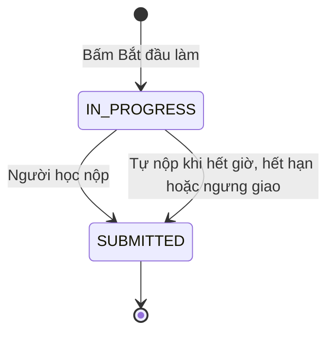

# U11 Attempt & Submission - Domain Entities

Thiết kế độc lập công nghệ. Truy vết: `US-ASM-003`; phần làm bài của `US-ASM-004`, `US-ASM-011`; `UC-ASM-09`…`14`.

## 1. Tổng quan

| Entity | Loại | Lưu ở | Unit ghi |
|---|---|---|---|
| `Attempt` | Aggregate root (một bản ghi = một lượt làm) | `submissions` | U11 |
| `AttemptContent` | Value object của `Attempt` | `submissions` | U11 |
| `AttemptSnapshot` | Value object của `Attempt` | `submissions` | U11 |
| `SubmissionReceipt` | Kết quả trả về khi nộp | Không lưu riêng (băm nằm trong `Attempt`) | U11 |

U11 **không** sở hữu: bài/publication (U08), cấu hình loại bài và mô hình tài liệu (U09), chính sách thi thử (U10), tài liệu bài nhóm (U14), chạy code (U13), điểm (U15).

## 2. `Attempt`

| Thuộc tính | Kiểu | Ràng buộc |
|---|---|---|
| `id` | UUID | |
| `publicationId` | UUID | |
| `learnerId` | UUID | |
| `attemptNo` | số | Duy nhất theo `(publicationId, learnerId)` |
| `assignmentVersionId` | UUID | Version bài lúc bắt đầu (bất biến, U08 `LOCKED`) |
| `snapshot` | `AttemptSnapshot` | Chụp lúc bắt đầu |
| `content` | `AttemptContent` | Bản nháp khi đang làm, bản nộp sau khi nộp |
| `status` | enum | `IN_PROGRESS`, `SUBMITTED` |
| `submitMode` | enum | `MANUAL`, `AUTO_TIME_LIMIT`, `AUTO_DEADLINE`, `AUTO_RETIRED` |
| `late` | bool | Nộp sau `closesAt` trong thời gian cho phép trễ |
| `startedAt`, `deadlineAt`, `lastSavedAt`, `submittedAt` | thời gian | `deadlineAt` = sớm nhất giữa (`startedAt` + giới hạn giờ) và hạn cuối nhận bài |
| `contentVersion` | số | Tăng mỗi lần lưu (chống ghi đè giữa hai tab) |
| `receiptHash` | chuỗi | SHA-256 nội dung lúc nộp |

### Trạng thái

**Text alternative**: Bấm "Bắt đầu làm" tạo lượt ở `IN_PROGRESS`; người học nộp, hoặc hệ thống tự nộp (hết giờ làm, hết hạn nhận bài, bài bị ngưng giao), chuyển sang `SUBMITTED`. Sau đó nội dung bất biến; làm lại là tạo lượt mới nếu còn lượt.

## 3. `AttemptContent`

| Loại bài | Nội dung |
|---|---|
| `QUIZ` | `answers`: câu → danh sách `optionId` đã chọn |
| `ESSAY` | `Document` (mô hình U09, chỉ block chữ) |
| `DOCUMENT` | `Document` (mô hình U09: khung + block người học; sơ đồ gồm XML + SVG; ảnh qua U03 `DOCUMENT_IMAGE`) |
| `CODE_LAB` | `files`: tên → nội dung; `language` |

Sau khi `SUBMITTED`, nội dung bất biến.

## 4. `AttemptSnapshot`

Cấu hình loại bài, chính sách (hạn, nộp trễ, giờ làm, thi thử), seed trộn câu/đáp án và thứ tự câu tại lúc bắt đầu. Sửa bài hay lịch sau đó không ảnh hưởng lượt đang làm.

## 5. `SubmissionReceipt`

`attemptId`, `submittedAt`, `late`, `receiptHash` trả cho người học khi nộp; xem lại được từ lịch sử lượt.

## 6. Contract

### Port U11 cung cấp

| Port | Dùng bởi | Mô tả |
|---|---|---|
| `SubmissionQueryPort` | U13, U15, U16 | Bài nộp, nội dung, lượt được chấm |
| Event `u11.submission.submitted` | U13, U15, U16 | `{attemptId, publicationId, learnerId, late, submitMode}` |

### Port U11 dùng

| Port | Unit | Mô tả |
|---|---|---|
| `AssignmentQueryPort`, `isSubmissionOpen` | U08 | Bài, publication, hạn |
| `TypeConfigPort`, `DocumentModelPort`, `DocxExportPort`, `DocxLearnerImportPort` | U09 | Cấu hình, kiểm tài liệu, xuất DOCX, xem trước nhập DOCX của người học |
| `SimulationPolicyPort` | U10 | Lượt tối đa, khóa chính sách |
| `BankQueryPort` | U06 | Góc nhìn người học của câu hỏi |
| `CodeRunPort` | U13 (`C`) | Chạy thử code khi đang làm |
| `GradeQueryPort` | U15 (`C`: ẩn điểm tới khi U15 có) | Hiển thị điểm/đáp án theo BR-U11-33 |
| `ClassAccessPort` | U04 | Ghi danh |
| `ArtifactPort` | U03 | Ảnh trong tài liệu |
