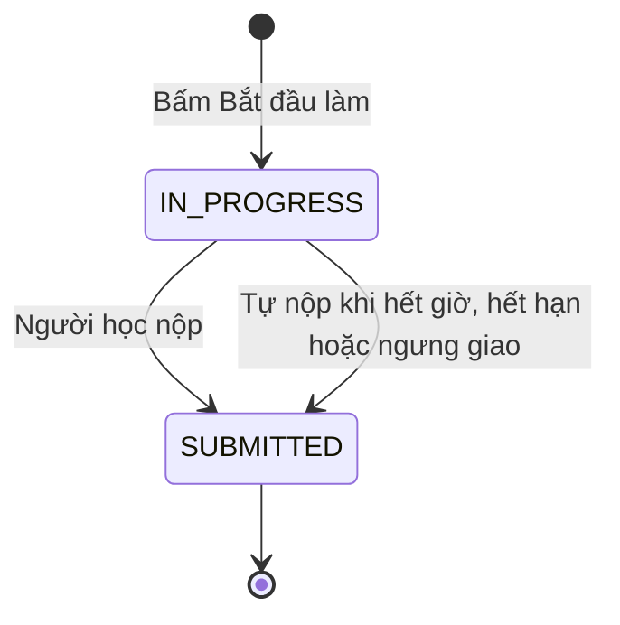

# U11 Attempt & Submission - Domain Entities

Thiết kế độc lập công nghệ. Truy vết: `US-ASM-003`, `US-ASM-012`; phần làm bài của `US-ASM-004`; UC 29, UC 30, UC 31, UC 40. UC 30 là phần nộp bài chung; UC 16 (U14) kế thừa UC 30 cho bài nhóm.

## 1. Tổng quan

| Entity | Loại | Lưu ở | Unit ghi |
|---|---|---|---|
| `Attempt` | Thực thể `ATTEMPT` (một dòng = một lượt làm cá nhân) | `attempts` | U11 |
| `AttemptContent` | Value object của `Attempt` | `attempts.content` | U11 |
| `AttemptSnapshot` | Value object của `Attempt` | `attempts.snapshot` | U11 |
| Kết quả Practice | Dòng `evaluations` `kind = PRACTICE` (U15 sở hữu bảng) | `evaluations` | U11 (Quiz/Code Lab), U13 (AI) qua `PracticeResultPort` của U15 |
| `SubmissionReceipt` | Kết quả trả về khi nộp | Không lưu riêng (băm nằm trong `Attempt`) | U11 |

U11 **không** sở hữu: bài và lịch bài (U08), cấu hình loại bài và mô hình tài liệu (U09), tài liệu bài nhóm (U14), chạy code và AI (U13), điểm chính thức (U15).

## 2. `Attempt`

| Thuộc tính | Kiểu | Ràng buộc |
|---|---|---|
| `id` | UUID | |
| `assignmentId` | UUID | Bài (một version, đã khóa từ khi phát hành) |
| `accountId` | UUID | Cột `account_id`, Student làm bài |
| `attemptNo` | số | Duy nhất theo `(assignmentId, accountId)` |
| `snapshot` | `AttemptSnapshot` | Chụp lúc bắt đầu |
| `content` | `AttemptContent` | Bản nháp khi đang làm, bản nộp sau khi nộp |
| `status` | enum | `IN_PROGRESS`, `SUBMITTED` |
| `submitMode` | enum | Cột `submit_mode`: `MANUAL`, `AUTO_TIME_LIMIT`, `AUTO_DEADLINE`, `AUTO_RETIRED` |
| `late` | bool | Cột `is_late`; nộp sau `closes_at` trong thời gian cho phép trễ |
| `startedAt`, `deadlineAt`, `submittedAt` | thời gian | Thời điểm lưu cuối nằm trong `content`; `deadlineAt` = sớm nhất giữa (`startedAt` + giới hạn giờ) và hạn cuối nhận bài |
| `contentVersion` | số | Tăng mỗi lần lưu (chống ghi đè giữa hai tab) |
| `receiptHash` | chuỗi | SHA-256 nội dung lúc nộp |
| `runResult` | JSON | Cột `run_result`: kết quả chạy thử/chấm test gần nhất của Code Lab (U13) |

Kết quả Practice không nằm trong `attempts`: điểm/phản hồi xác định của Quiz/Code Lab và điểm AI của Text/Diagram Essay là dòng `evaluations` `kind = PRACTICE` gắn `attempt_id`; trạng thái chấm AI (`PENDING`, `SCORED`, `NO_CREDIT`, `FAILED`) đọc từ `ai_suggestions` của U13 có `target` là lượt này.

### Trạng thái

```mermaid
stateDiagram-v2
    [*] --> IN_PROGRESS: Bấm Bắt đầu làm
    IN_PROGRESS --> SUBMITTED: Người học nộp
    IN_PROGRESS --> SUBMITTED: Tự nộp khi hết giờ, hết hạn hoặc ngưng giao
    SUBMITTED --> [*]
```

**Text alternative**: Bấm "Bắt đầu làm" tạo lượt ở `IN_PROGRESS`; người học nộp, hoặc hệ thống tự nộp (hết giờ làm, hết hạn nhận bài, bài bị ngưng giao), chuyển sang `SUBMITTED`. Sau đó nội dung bất biến; làm lại là tạo lượt mới nếu còn lượt.

## 3. `AttemptContent`

| Loại bài | Nội dung |
|---|---|
| `MULTIPLE_CHOICE_QUIZ` | `answers`: câu → danh sách `optionId` đã chọn |
| `TEXT_ESSAY` | `answers`: câu tự luận → `Document` (mô hình U09, chỉ block chữ); mỗi câu chấm theo rubric riêng của câu |
| `DIAGRAM_ESSAY` | `Document` (mô hình U09: khung + block Student; sơ đồ gồm XML + SVG; ảnh qua U03 `DOCUMENT_IMAGE`) |
| `CODE_LAB` | `files`: tên → nội dung; `language` |

Sau khi `SUBMITTED`, nội dung bất biến.

## 4. `AttemptSnapshot`

Cấu hình dạng/chế độ bài, chính sách (hạn, nộp trễ, giờ làm), seed trộn câu/đáp án và thứ tự câu tại lúc bắt đầu. Sửa bài hay lịch sau đó không ảnh hưởng lượt đang làm.

## 5. `SubmissionReceipt`

`attemptId`, `submittedAt`, `late`, `receiptHash` trả cho người học khi nộp; xem lại được từ lịch sử lượt.

## 6. Contract

### Port U11 cung cấp

| Port | Dùng bởi | Mô tả |
|---|---|---|
| `SubmissionQueryPort` | U13, U15, U16 | Bài nộp, nội dung, lượt được chấm |
| `AssignmentLifecyclePort.onRetired` | U08 khai báo (`C`) | Đặt mọi lượt dở của bài về hạn ngay và `submit_mode = AUTO_RETIRED`; scanner tự nộp. `onOpened` không làm gì (bài cá nhân không cần chuẩn bị khi mở) |
| `AttemptRunResultPort` | U13 | Ghi kết quả chạy thử/chấm test Code Lab mới nhất vào `attempts.run_result` |

### Port U11 dùng

| Port | Unit | Mô tả |
|---|---|---|
| `AssignmentQueryPort`, `isSubmissionOpen` | U08 | Bài, lịch, hạn |
| `TypeConfigPort`, `DocumentModelPort`, `DocxExportPort`, `DocxStudentImportPort` | U09 | Cấu hình, kiểm tài liệu, xuất DOCX, xem trước nhập DOCX của người học |
| `BankQueryPort` | U06 | Góc nhìn người học của câu hỏi |
| `RubricPort` | U06 | `getRubric` để hiện rubric từng câu (Text Essay) hoặc từng phần (Diagram Essay) cho người học (UC 29) |
| `CodeRunPort` | U13 (`C`) | `try` khi đang làm; `grade` khi nộp Practice Code Lab |
| `PracticeGradingPort` | U13 (`C`) | Xác minh và xếp một lần chấm AI cho attempt Practice Text/Diagram Essay khi đủ credit |
| `GradeQueryPort` | U15 (`C`: ẩn điểm tới khi U15 có) | Hiển thị điểm/đáp án theo BR-U11-33 |
| `SubmissionSubmittedPort` | U11 khai báo, U15 cài (`C`) | Chỉ bài `GRADED`: gọi trong transaction nộp để U15 tạo dòng `evaluations` `PENDING`. Bài `PRACTICE` đi theo scorer đáp án/test hoặc U13 AI riêng; chưa có U15 → adapter rỗng |
| `AuditPort` | U02 | Audit |
| `ScheduledScanner` | U03 | Tự nộp theo hạn, audit |
| `PracticeResultPort` | U15 (`C`) | `scoreQuiz(attemptId)`: U15 chấm Practice Quiz bằng `QuizScorer` và ghi `evaluations` `kind = PRACTICE`; chưa có U15 → adapter rỗng, Practice Quiz hiện "chưa có kết quả" |
| `AuthorizationPort` | U01 | Tài khoản `ACTIVE`, vai trò |
| `ClassAccessPort` | U04 | Ghi danh |
| `ArtifactPort` | U03 | Ảnh trong tài liệu |
