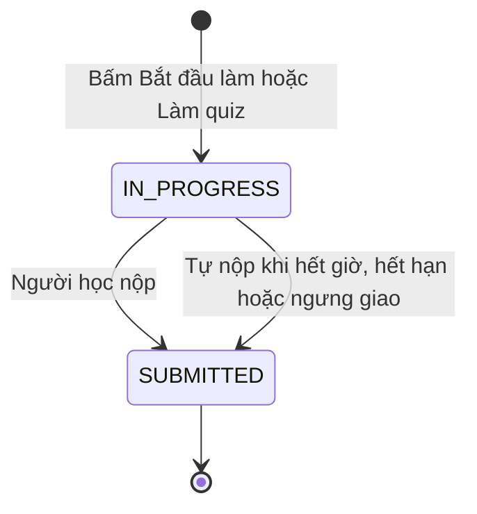

# U11 Attempt & Submission - Domain Entities

**Bản tài liệu 2026-10-09**: UC 18, 19, 20, 21, 22, 23, 24, 25, 26, 28, 29 theo [73 UC](../../../../docs/use-cases-73.md) và screen flow `docs/G21_Diagrams.drawio` (Page-2); danh sách quiz của học liệu trên Learning Material (UC 15, màn của U05); primary stories: US-ASM-003, US-ASM-012. Quyền và supporting flows theo [current SRS contract](../../current-srs-contract.md); đây là thiết kế/kế hoạch, không xác nhận implementation mới.

Thiết kế độc lập công nghệ. Truy vết: `US-ASM-003`, `US-ASM-012`; phần làm bài của `US-ASM-004`, `US-ASM-006`, `US-ASM-007`; UC 18–26, 28, 29. UC 27 (bài nhóm, U14) dùng chung cách tự lưu, biên nhận, trễ, tự nộp; UC 38 (Teacher nhờ AI đề xuất chấm) thuộc U15: U15 tự làm panel trong Grading Workspace, U11 không cung cấp component cho phần này (người dùng chốt 2026-10-09).

Quyết định 2026-10-09: quiz là quiz luyện tập gắn học liệu (luôn `PRACTICE`, không lịch, không vào sổ điểm), làm từ Learning Material hoặc Quiz Practice; không còn quiz `GRADED` và `AFTER_CLOSE`. Student Assignments và Quiz Practice History là danh sách gộp các lớp mình học, lọc theo lớp; Student Assignments gồm bài của lớp và bài của môn. Mỗi lượt ghi lớp người học làm bài. Admin không có quyền ở U11.

## 1. Tổng quan

| Entity | Loại | Lưu ở | Unit ghi |
|---|---|---|---|
| `Attempt` | Thực thể `ATTEMPT` (một dòng = một lượt làm cá nhân của bài tập hoặc quiz) | `attempts` | U11 |
| `AttemptContent` | Value object của `Attempt` | `attempts.content` | U11 |
| `AttemptSnapshot` | Value object của `Attempt` | `attempts.snapshot` | U11 |
| Kết quả Practice và quiz | Dòng `evaluations` `kind = PRACTICE` (U15 sở hữu bảng) | `evaluations` | U15 qua `PracticeResultPort` (U11 gọi cho quiz; U13 cho Code Lab và AI) |
| `SubmissionReceipt` | Kết quả trả về khi nộp | Không lưu riêng (băm nằm trong `Attempt`) | U11 |

U11 **không** sở hữu: bài, quiz và lịch (U08), cấu hình loại bài, cài đặt quiz và mô hình tài liệu (U09), học liệu (U05), tài liệu bài nhóm (U14), chạy code và AI (U13), điểm và kết quả Practice (U15).

## 2. `Attempt`

| Thuộc tính | Kiểu | Ràng buộc |
|---|---|---|
| `id` | UUID | |
| `assignmentId` | UUID | Bài tập hoặc quiz (một version, đã khóa từ khi phát hành) |
| `classId` | UUID | Cột `class_id`: lớp người học làm bài (lớp của bài; với bài/quiz của môn là lớp người học đang ghi danh) |
| `accountId` | UUID | Cột `account_id`, Student làm bài |
| `attemptNo` | số | Duy nhất theo `(assignmentId, accountId)` |
| `snapshot` | `AttemptSnapshot` | Chụp lúc bắt đầu |
| `content` | `AttemptContent` | Bản nháp khi đang làm, bản nộp sau khi nộp |
| `status` | enum | `IN_PROGRESS`, `SUBMITTED` |
| `submitMode` | enum | Cột `submit_mode`: `MANUAL`, `AUTO_TIME_LIMIT` (quiz), `AUTO_DEADLINE` (bài tập), `AUTO_RETIRED` |
| `late` | bool | Cột `is_late`; bài tập nộp sau `closes_at` trong thời gian cho phép trễ; quiz luôn `false` |
| `startedAt`, `deadlineAt`, `submittedAt` | thời gian | Thời điểm lưu cuối nằm trong `content`; `deadlineAt` theo BR-U11-06, rỗng với quiz không giới hạn giờ |
| `contentVersion` | số | Tăng mỗi lần lưu (chống ghi đè giữa hai tab) |
| `receiptHash` | chuỗi | SHA-256 nội dung lúc nộp |
| `runResult` | JSON | Cột `run_result`: kết quả chạy thử/chấm test gần nhất của Code Lab (U13) |

Kết quả Practice không nằm trong `attempts`: điểm của quiz, điểm/phản hồi test Code Lab và điểm AI của Text/Diagram Essay là dòng `evaluations` `kind = PRACTICE` gắn `attempt_id`; trạng thái chấm AI (`PENDING`, `SCORED`, `NO_CREDIT`, `FAILED`) đọc từ `ai_suggestions` của U13 có `target` là lượt này.

### Trạng thái

```mermaid
stateDiagram-v2
    [*] --> IN_PROGRESS: Bấm Bắt đầu làm hoặc Làm quiz
    IN_PROGRESS --> SUBMITTED: Người học nộp
    IN_PROGRESS --> SUBMITTED: Tự nộp khi hết giờ, hết hạn hoặc ngưng giao
    SUBMITTED --> [*]
```

**Text alternative**: Bấm "Bắt đầu làm" (bài tập) hoặc "Làm quiz" tạo lượt ở `IN_PROGRESS`; người học nộp, hoặc hệ thống tự nộp (hết giờ làm quiz, hết hạn nhận bài tập, bài hoặc quiz bị ngưng), chuyển sang `SUBMITTED`. Sau đó nội dung bất biến; làm lại là tạo lượt mới nếu còn lượt.

## 3. `AttemptContent`

| Loại bài | Nội dung |
|---|---|
| `MULTIPLE_CHOICE_QUIZ` | `answers`: câu → danh sách `optionId` đã chọn |
| `TEXT_ESSAY` | `answers`: câu tự luận → `Document` (mô hình U09, chỉ block chữ); mỗi câu chấm theo rubric riêng của câu |
| `DIAGRAM_ESSAY` | `Document` (mô hình U09: khung + block Student; sơ đồ gồm XML + SVG; ảnh qua U03 `DOCUMENT_IMAGE`) |
| `CODE_LAB` | `files`: tên → nội dung; `language` (mỗi câu `CODE`) |

Sau khi `SUBMITTED`, nội dung bất biến. Bài nhóm (`GROUP_ASSIGNMENT`) không có `Attempt`; nội dung ở tài liệu nhóm của U14.

## 4. `AttemptSnapshot`

Dạng/chế độ bài, phạm vi (của lớp hoặc của môn), chính sách hạn (`closesAt`, `lateUntil`), cài đặt quiz (`timeLimitMinutes`, `shuffleQuestions`, `shuffleOptions`, `showScoreAfterSubmit`, `showCorrectAnswers`), seed trộn và thứ tự câu tại lúc bắt đầu. Sửa bài, lịch hay cài đặt sau đó không ảnh hưởng lượt đã có.

## 5. `SubmissionReceipt`

`attemptId`, `submittedAt`, `attemptNo`, `late`, `receiptHash` trả cho người học khi nộp; xem lại được trên Submission History.

## 6. Contract

### Port U11 cung cấp

| Port | Dùng bởi | Mô tả |
|---|---|---|
| `SubmissionQueryPort` | U13, U15, U16 | Lượt theo bài và lớp (`listByAssignment(assignmentId, classId)`), nội dung, lượt được chấm, người chưa nộp |
| `AttemptRunResultPort` | U13 | Ghi kết quả chạy thử/chấm test Code Lab mới nhất vào `attempts.run_result` |
| `AssignmentLifecyclePort` (cài) | U08 khai báo (`C`) | `onRetired`: đặt mọi lượt dở của bài/quiz về hạn ngay và `submit_mode = AUTO_RETIRED`; scanner tự nộp. `onOpened` không làm gì |
| `LessonQuizList` (component) | U05 | Gắn vào Learning Material: quiz của học liệu, nút "Làm quiz" |

### Port U11 khai báo, unit khác cài

| Port | Cài bởi | Mô tả |
|---|---|---|
| `SubmissionSubmittedPort` | U15 (`C`) | Chỉ bài tập `GRADED`: gọi trong transaction nộp để U15 tạo dòng `evaluations` `PENDING`; chưa có U15 → adapter rỗng |
| `PracticeResultPort` | U15 (`C`) | `scoreQuiz(attemptId)`: U15 chấm quiz bằng `QuizScorer`, ghi `evaluations` `kind = PRACTICE`; chưa có U15 → adapter rỗng, Quiz Result hiện "chưa có kết quả" |

### Port U11 dùng

| Port | Unit | Mô tả |
|---|---|---|
| `AuthorizationPort` | U01 | Tài khoản `ACTIVE`, vai trò |
| `AuditPort` | U02 | Audit |
| `ScheduledScanner`, `ArtifactPort` | U03 | Tự nộp theo hạn; ảnh trong tài liệu |
| `ClassAccessPort` | U04 | Ghi danh `ACTIVE`, lớp `OPEN`, `listOpenClassesOf(accountId)` cho danh sách gộp |
| `ContentRefPort` | U05 | `getLessonRef`: học liệu của quiz còn hiện trong lớp khi bắt đầu lượt |
| `BankQueryPort` | U06 | `getStudentView` cho đề khi xem và làm; `getVersion` cho đáp án đúng và giải thích trên Quiz Result khi `AFTER_SUBMIT` |
| `RubricPort` | U06 | `getRubric` để hiện rubric từng câu (Text Essay) hoặc từng phần (Diagram Essay) trên Assignment Detail |
| `AssignmentQueryPort` | U08 | `get`, `listForClass(classId)` (gồm bài của môn), `listQuizzesOfLesson(lessonId, classId)`, `isSubmissionOpen` |
| `TypeConfigPort`, `DocumentModelPort`, `DocxExportPort`, `DocxStudentImportPort` | U09 | Đọc cấu hình và cài đặt quiz, kiểm tài liệu, xuất DOCX, xem trước nhập DOCX của người học |
| `CodeRunPort` | U13 (`C`) | `grade` khi nộp Practice Code Lab; chạy thử do Codelab Workspace gọi API của U13 |
| `PracticeGradingPort` | U13 (`C`) | Xác minh và xếp một lần chấm AI cho lượt Practice Text/Diagram Essay khi đủ credit |
| `GroupSubmissionQueryPort` | U14 (`C`) | Tài liệu nhóm của mình và trạng thái nộp nhóm cho Student Assignments, Assignment Detail; chưa có U14 → không hiện trạng thái, ẩn nút "Mở bài nhóm" |
| `GradeQueryPort` | U15 (`C`) | Điểm/phản hồi đã công bố của lượt `GRADED`, kết quả Practice và quiz; chưa có U15 → ẩn điểm |

## 7. API

| API | Dùng để | Màn, UC | Quyền |
|---|---|---|---|
| `GET /api/v1/me/assignments?classId=&type=&status=` | Danh sách gộp bài của lớp và bài của môn ở các lớp `OPEN` mình học, kèm lượt gần nhất | Student Assignments, UC 22 | R5 |
| `GET /api/v1/assignments/{assignmentId}/overview?classId=` | Chi tiết bài tập (hướng dẫn, đề/khung, rubric, lịch, lượt còn lại) hoặc chi tiết quiz | Assignment Detail, UC 23; Quiz Practice Detail, UC 19 | R5 của lớp |
| `GET /api/v1/classes/{classId}/lessons/{lessonId}/quizzes` | Quiz `OPEN` của học liệu kèm lượt đã dùng/còn lại, lượt gần nhất | Learning Material, UC 15, 20 | R5 của lớp |
| `GET /api/v1/me/quiz-attempts?classId=` | Lượt quiz của mình ở các lớp `OPEN` đang học, nhóm theo quiz | Quiz Practice History, UC 18 | R5 |
| `POST /api/v1/assignments/{assignmentId}/attempts` | Bắt đầu lượt (body `classId`) hoặc trả lượt đang làm | Assignment Detail, Quiz Practice Detail, Learning Material; UC 20, 24–26 | R5 của lớp |
| `GET /api/v1/assignments/{assignmentId}/attempts/mine` | Lượt của mình cho bài | Submission History, UC 28; Quiz Practice Detail | R5, chủ lượt |
| `GET /api/v1/attempts/{attemptId}` | Lượt đang làm (đề đã trộn, bản nháp) hoặc đã nộp (chỉ đọc) | Quiz Taking, Text Essay/Codelab/Diagram Essay Workspace, Submission History | Chủ lượt |
| `PUT /api/v1/attempts/{attemptId}/content` | Lưu nháp kèm `contentVersion` (gzip) | Các workspace, UC 20, 24–26 | Chủ lượt |
| `POST /api/v1/attempts/{attemptId}/docx:preview` | Xem trước DOCX của người học (U11 kiểm rồi gọi `DocxStudentImportPort`) | Diagram Essay Workspace, UC 26 | Chủ lượt |
| `POST /api/v1/attempts/{attemptId}/submit` | Nộp, trả biên nhận | Các workspace, UC 20, 24–26 | Chủ lượt |
| `GET /api/v1/attempts/{attemptId}/practice-result` | Điểm/phản hồi Practice của lượt; quiz: điểm và đáp án đúng theo cài đặt; trạng thái chấm AI | Quiz Result, UC 21; Submission History, UC 28, 29 | Chủ lượt |
| `POST /api/v1/attempts/{attemptId}/ai-grading` | Yêu cầu AI chấm lượt Practice Text/Diagram Essay | Submission History, UC 29 | Chủ lượt |
| `GET /api/v1/attempts/{attemptId}/export.docx` | Tải DOCX bài Text Essay/Diagram Essay của mình | Submission History, UC 28; Submission Detail (U15) | Chủ lượt; giảng viên lớp của lượt (R3/R4) |

"R5 của lớp": ghi danh `ACTIVE` lớp `OPEN` và bài thuộc lớp đó, là bài của môn chứa lớp, hoặc là quiz của học liệu còn hiện trong lớp. Trừ `export.docx`, mọi API trên từ chối `ADMIN`, `TEACHER`, `SUBJECT_MANAGER` (không có ghi danh); `export.docx` từ chối `ADMIN`; ngoài phạm vi → `404`. Chạy thử Code Lab dùng `POST /api/v1/code-runs` của U13.
