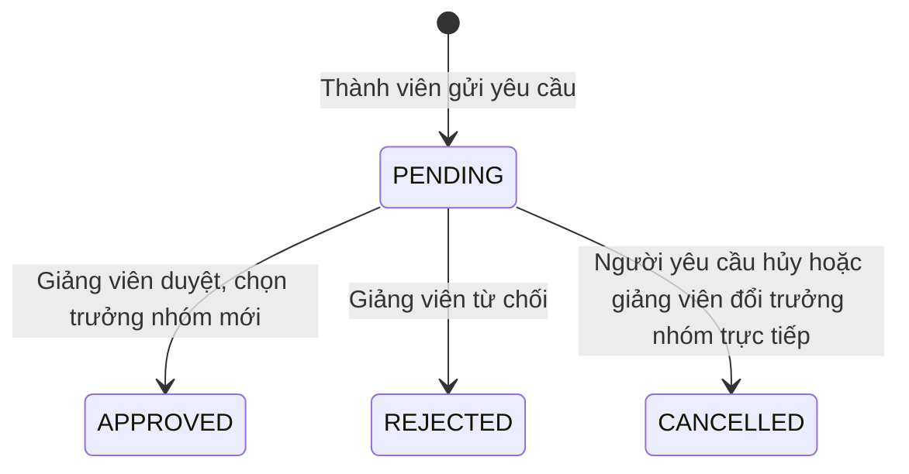

# U12 Group & Allocation - Domain Entities

Thiết kế độc lập công nghệ. Truy vết: `US-GRP-001`, `002`; `UC-GRP-01`…`04`.

## 1. Tổng quan

| Entity | Loại | Lưu ở | Unit ghi |
|---|---|---|---|
| `GroupSet` | Khái niệm gom (mọi nhóm của một bài nhóm) | Không lưu riêng | U12 |
| `StudentGroup` | Aggregate root | `student_groups` | U12 (tài liệu nhóm trong cùng bản ghi do U14 ghi) |
| `GroupMember` | Entity | `group_members` | U12 |
| `LeaderChangeRequest` | Aggregate root | `leader_change_requests` | U12 |

U12 **không** sở hữu: bài nhóm (U08), tài liệu nhóm, mục việc và khóa mục (U14), điểm (U15). Không có phân công phần của giảng viên.

## 2. `GroupSet`

Bộ nhóm của một bài `GROUP` = mọi `StudentGroup` cùng `assignmentId`. Lưu nguyên khối (BR-U12-07) trong một transaction có khóa theo bài; ràng buộc mỗi người học tối đa một nhóm trong bộ được kiểm trong transaction đó. Dùng lại nhóm của bài khác thì mỗi nhóm ghi `copiedFromAssignmentId`.

## 3. `StudentGroup`

| Thuộc tính | Kiểu | Ràng buộc |
|---|---|---|
| `id` | UUID | |
| `assignmentId` | UUID | Bài `GROUP` |
| `name` | chuỗi ≤ 100 | Duy nhất theo `assignmentId` |
| `leaderId` | UUID | Đúng một trưởng nhóm, phải là thành viên |
| `copiedFromAssignmentId` | UUID | Khi dùng lại nhóm của bài khác |
| `createdBy`, `version` | | Khóa lạc quan |

`GroupDocument` của nhóm (U14) nằm trong cùng bản ghi, định nghĩa ở U14.

## 4. `GroupMember`

| Thuộc tính | Kiểu | Ràng buộc |
|---|---|---|
| `groupId` | UUID | |
| `learnerId` | UUID | Người học đang ghi danh `ACTIVE` của lớp |
| `joinedAt`, `removedAt` | thời gian | `removedAt` rỗng = đang là thành viên |

Mỗi người học tối đa một nhóm đang hiệu lực trong một bộ nhóm.

## 5. `LeaderChangeRequest`

| Thuộc tính | Kiểu | Ràng buộc |
|---|---|---|
| `id` | UUID | |
| `groupId` | UUID | |
| `requesterId` | UUID | Thành viên nhóm |
| `proposedLeaderId` | UUID | Tùy chọn, phải là thành viên |
| `reason` | chuỗi 10-1000 | |
| `status` | enum | `PENDING`, `APPROVED`, `REJECTED`, `CANCELLED` |
| `decidedBy`, `decidedAt`, `decisionNote` | | |

Mỗi nhóm tối đa một yêu cầu `PENDING`.

### Trạng thái

**Text alternative**: Yêu cầu đổi trưởng nhóm tạo ra ở `PENDING`. Giảng viên duyệt (chọn trưởng nhóm mới, mặc định người được đề xuất) thì `APPROVED`, từ chối thì `REJECTED`. Người yêu cầu tự hủy, hoặc giảng viên đổi trưởng nhóm trực tiếp, thì yêu cầu thành `CANCELLED`.

## 6. Contract

### Port U12 cung cấp

| Port | Dùng bởi | Mô tả |
|---|---|---|
| `GroupReadinessPort` | U08 khai báo (`C`) | Bộ nhóm đủ điều kiện phát hành |
| `GroupMembershipPort` | U14, U16 | `groupOf(learnerId, assignmentId)`, `members(groupId)`, `leaderOf(groupId)`, lịch sử thành viên |
| `GroupDocumentStorePort` | U14 | Đọc/ghi tài liệu nhóm trong bản ghi nhóm |
| Event `group.membership-changed`, `group.leader-changed` | U16 | Sau commit |

### Port U12 dùng

| Port | Unit | Mô tả |
|---|---|---|
| `AssignmentQueryPort` | U08 | Bài `GROUP`, trạng thái publication |
| `ClassAccessPort` | U04 | Người học đang ghi danh |
| `GroupChangePort` | U12 khai báo, U14 cài (`C`) | `onGroupCreated(groupId)` khi thêm nhóm sau khi bài đã mở (U14 tạo job tạo tài liệu nhóm); `onMemberRemoved(groupId, learnerId)` khi thành viên rời nhóm (U14 nhả khóa mục của người đó). Gọi trong transaction; chưa có U14 → adapter rỗng |
| `AuditPort`, `EventPublisherPort` | U02 | Audit, event thông báo |
