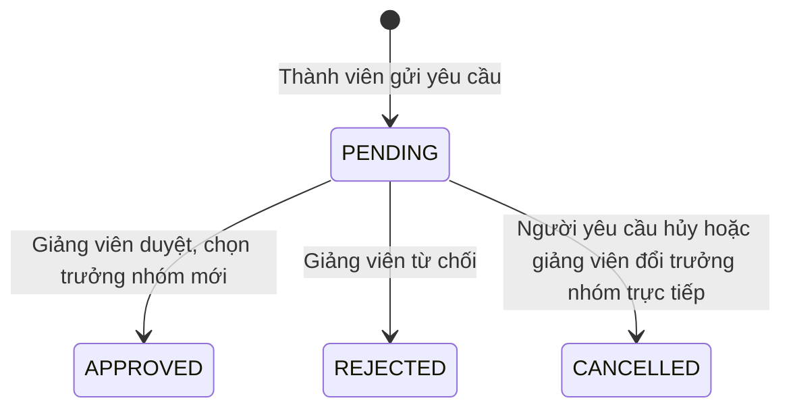

# U12 Group & Allocation - Domain Entities

Thiết kế độc lập công nghệ. Truy vết: `US-GRP-001`, `002`; UC 9, UC 15.

## 1. Tổng quan

| Entity | Loại | Lưu ở | Unit ghi |
|---|---|---|---|
| `ClassGroups` | Khái niệm gom (mọi nhóm của một lớp) | Không lưu riêng | U12 |
| `StudentGroup` | Aggregate root | `student_groups` | U12 |
| `GroupMember` | Entity | `group_members` | U12 |
| `LeaderChangeRequest` | Aggregate root | `leader_change_requests` | U12 |

U12 **không** sở hữu: lớp và ghi danh (U04), bài nhóm (U08), tài liệu nhóm, mục việc và khóa mục (U14, bảng `group_documents`), điểm (U15). Không có phân công phần của giảng viên.

## 2. `ClassGroups`

Nhóm của một lớp = mọi `StudentGroup` cùng `classId`. Lưu nguyên khối (BR-U12-07) trong một transaction có khóa theo lớp; ràng buộc mỗi sinh viên tối đa một nhóm đang hiệu lực trong lớp được kiểm trong transaction đó. Mọi bài `GROUP` của lớp dùng chung các nhóm này.

## 3. `StudentGroup`

| Thuộc tính | Kiểu | Ràng buộc |
|---|---|---|
| `id` | UUID | |
| `classId` | UUID | Lớp chứa nhóm |
| `name` | chuỗi ≤ 100 | Duy nhất theo `classId` |
| `leaderId` | UUID | Đúng một trưởng nhóm, phải là thành viên |
| `createdBy`, `version` | | Khóa lạc quan |

Tài liệu nhóm của từng bài nhóm nằm ở `GroupDocument` (U14), tham chiếu `groupId`.

## 4. `GroupMember`

| Thuộc tính | Kiểu | Ràng buộc |
|---|---|---|
| `groupId` | UUID | |
| `studentId` | UUID | Sinh viên đang ghi danh `ACTIVE` của lớp |
| `joinedAt`, `removedAt` | thời gian | `removedAt` rỗng = đang là thành viên |

Mỗi sinh viên tối đa một nhóm đang hiệu lực trong một lớp.

## 5. `LeaderChangeRequest`

| Thuộc tính | Kiểu | Ràng buộc |
|---|---|---|
| `id` | UUID | |
| `groupId` | UUID | |
| `requesterId` | UUID | Thành viên nhóm |
| `proposedLeaderId` | UUID | Tùy chọn, phải là thành viên |
| `reason` | chuỗi 10-1000 | |
| `status` | enum | `PENDING`, `APPROVED`, `REJECTED`, `CANCELLED` |
| `decidedBy`, `decidedAt`, `decisionNote` | | |

Mỗi nhóm tối đa một yêu cầu `PENDING`.

### Trạng thái

```mermaid
stateDiagram-v2
    [*] --> PENDING: Thành viên gửi yêu cầu
    PENDING --> APPROVED: Giảng viên duyệt, chọn trưởng nhóm mới
    PENDING --> REJECTED: Giảng viên từ chối
    PENDING --> CANCELLED: Người yêu cầu hủy hoặc giảng viên đổi trưởng nhóm trực tiếp
```

**Text alternative**: Yêu cầu đổi trưởng nhóm tạo ra ở `PENDING`. Giảng viên duyệt (chọn trưởng nhóm mới, mặc định người được đề xuất) thì `APPROVED`, từ chối thì `REJECTED`. Người yêu cầu tự hủy, hoặc giảng viên đổi trưởng nhóm trực tiếp, thì yêu cầu thành `CANCELLED`.

## 6. Contract

### Port U12 cung cấp

| Port | Dùng bởi | Mô tả |
|---|---|---|
| `GroupReadinessPort` | U08 khai báo (`C`) | Nhóm của lớp đủ điều kiện phát hành bài `GROUP` |
| `GroupMembershipPort` | U14, U16 | `groupOf(studentId, classId)`, `groupsOf(classId)`, `members(groupId)`, `leaderOf(groupId)`, lịch sử thành viên |
| Event `group.membership-changed`, `group.leader-changed`, `group.leader-request-rejected` | U16 | Sau commit, chỉ cho thông báo |

### Port U12 dùng

| Port | Unit | Mô tả |
|---|---|---|
| `ClassAccessPort` | U04 | Lớp, quyền giảng viên, sinh viên đang ghi danh |
| `GroupChangePort` | U12 khai báo, U14 cài (`C`) | `onGroupCreated(groupId)`: U14 tạo job tạo tài liệu nhóm cho mọi publication bài nhóm đang mở của lớp; `onMemberRemoved(groupId, studentId)`: U14 nhả khóa mục của người đó; `hasGroupWork(groupId)`: chặn xóa nhóm đã có tài liệu/bản nộp. Gọi trong transaction; chưa có U14 → adapter rỗng |
| `AuditPort`, `EventPublisherPort` | U02 | Audit, event thông báo |
