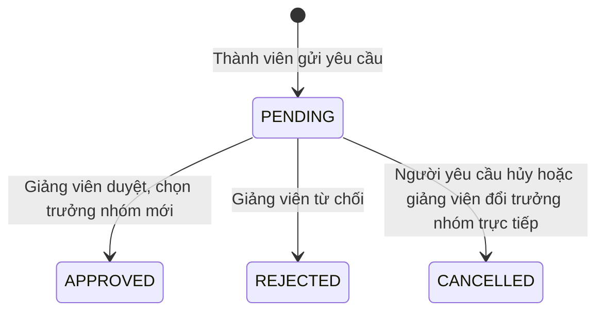

# U12 Group & Allocation - Domain Entities

**Bản tài liệu 2026-10-08**: UC 15, 16; primary stories: US-GRP-001, US-GRP-002. Quyền và supporting flows theo [current SRS contract](../../current-srs-contract.md); đây là thiết kế/kế hoạch, không xác nhận implementation mới.

Thiết kế độc lập công nghệ. Truy vết: `US-GRP-001`, `002`; UC 16, 45, 46, 47, 48, 49.

## 1. Tổng quan

| Entity | Loại | Lưu ở | Unit ghi |
|---|---|---|---|
| `ClassGroups` | Khái niệm gom (mọi nhóm của một lớp) | Không lưu riêng | U12 |
| `StudentGroup` | Thực thể `STUDENT_GROUP` | `student_groups` | U12 |
| `GroupMember` | Bảng nối ACCOUNT joining STUDENT_GROUP (gồm cờ trưởng nhóm) | `group_members` | U12 |
| `LeaderChangeRequest` | Thực thể `LEADER_CHANGE_REQUEST` | `leader_change_requests` | U12 |

U12 **không** sở hữu: lớp và ghi danh (U04), bài nhóm (U08), tài liệu nhóm, các phần (mục) và khóa phần (U14, bảng `group_documents`), điểm (U15). Không có phân công phần của giảng viên.

## 2. `ClassGroups`

Nhóm của một lớp = mọi `StudentGroup` cùng `classId`. Lưu nguyên khối (BR-U12-07) trong một transaction có khóa theo lớp; ràng buộc mỗi sinh viên tối đa một nhóm đang hiệu lực trong lớp được kiểm trong transaction đó. Mọi bài nhóm (`GROUP_ASSIGNMENT`) của lớp dùng chung các nhóm này.

## 3. `StudentGroup`

| Thuộc tính | Kiểu | Ràng buộc |
|---|---|---|
| `id` | UUID | |
| `classId` | UUID | Lớp chứa nhóm |
| `name` | chuỗi ≤ 100 | Duy nhất theo `classId` |
| `createdAt`, `version` | | Khóa lạc quan; người tạo nằm trong audit |

Trưởng nhóm là thành viên có `group_members.is_leader = true`; mỗi nhóm đúng một trưởng nhóm.

Tài liệu nhóm của từng bài nhóm nằm ở `GroupDocument` (U14), tham chiếu `groupId`.

## 4. `GroupMember`

| Thuộc tính | Kiểu | Ràng buộc |
|---|---|---|
| `groupId` | UUID | |
| `accountId` | UUID | Cột `account_id`, sinh viên đang ghi danh `ACTIVE` của lớp; khóa chính cùng `groupId` |
| `isLeader` | bool | Cột `is_leader`; đúng một `true` mỗi nhóm |
| `joinedAt` | thời gian | Gỡ thành viên là xóa dòng; lịch sử thành viên nằm trong audit |

Mỗi sinh viên tối đa một nhóm đang hiệu lực trong một lớp.

## 5. `LeaderChangeRequest`

| Thuộc tính | Kiểu | Ràng buộc |
|---|---|---|
| `id` | UUID | |
| `groupId` | UUID | |
| `requesterId` | UUID | Thành viên nhóm |
| `nomineeId` | UUID | Cột `nominee_id`, người được đề xuất làm trưởng nhóm, phải là thành viên |
| `reason` | chuỗi 10-1000 | |
| `status` | enum | `PENDING`, `APPROVED`, `REJECTED`, `CANCELLED` |
| `decisionReason` | chuỗi ≤ 1000 | Cột `decision_reason`; bắt buộc khi từ chối |
| `createdAt`, `decidedAt` | thời gian | Người duyệt/từ chối nằm trong audit |

Mỗi nhóm tối đa một yêu cầu `PENDING`.

### Trạng thái

```mermaid
stateDiagram-v2
    [*] --> PENDING: Thành viên gửi yêu cầu
    PENDING --> APPROVED: Giảng viên duyệt, chọn trưởng nhóm mới
    PENDING --> REJECTED: Giảng viên từ chối
    PENDING --> CANCELLED: Người yêu cầu hủy hoặc giảng viên đổi trưởng nhóm trực tiếp
```

**Text alternative**: Yêu cầu đổi trưởng nhóm tạo ra ở `PENDING`. Giảng viên duyệt (chọn trưởng nhóm mới, mặc định người được đề xuất) thì `APPROVED`, từ chối thì `REJECTED`. Người yêu cầu tự hủy, hoặc giảng viên đổi trưởng nhóm trực tiếp, thì yêu cầu thành `CANCELLED`.

## 6. Contract

### Port U12 cung cấp

| Port | Dùng bởi | Mô tả |
|---|---|---|
| `GroupReadinessPort` | U08 khai báo (`C`) | Nhóm của lớp đủ điều kiện phát hành bài nhóm (`GROUP_ASSIGNMENT`) |
| `GroupMembershipPort` | U14, U16 | `groupOf(studentId, classId)`, `groupsOf(classId)`, `members(groupId)`, `leaderOf(groupId)`; lịch sử thành viên nằm trong audit |
| Event `group.membership-changed`, `group.leader-changed`, `group.leader-requested`, `group.leader-request-rejected` | U16 | Sau commit, chỉ cho thông báo |

### Port U12 dùng

| Port | Unit | Mô tả |
|---|---|---|
| `ClassAccessPort` | U04 | Lớp, quyền giảng viên, sinh viên đang ghi danh |
| `GroupChangePort` | U12 khai báo, U14 cài (`C`) | `onGroupCreated(groupId)`: U14 tạo job tạo tài liệu nhóm cho mọi bài nhóm đang mở của lớp; `onMemberRemoved(groupId, studentId)`: U14 nhả khóa mục của người đó; `hasGroupWork(groupId)`: chặn xóa nhóm đã có tài liệu/bản nộp. Gọi trong transaction; chưa có U14 → adapter rỗng |
| `AuthorizationPort` | U01 | Tài khoản `ACTIVE`, vai trò |
| `AuditPort` | U02 | Audit |
| `EventPublisherPort` | U03 | Event thông báo sau commit |
