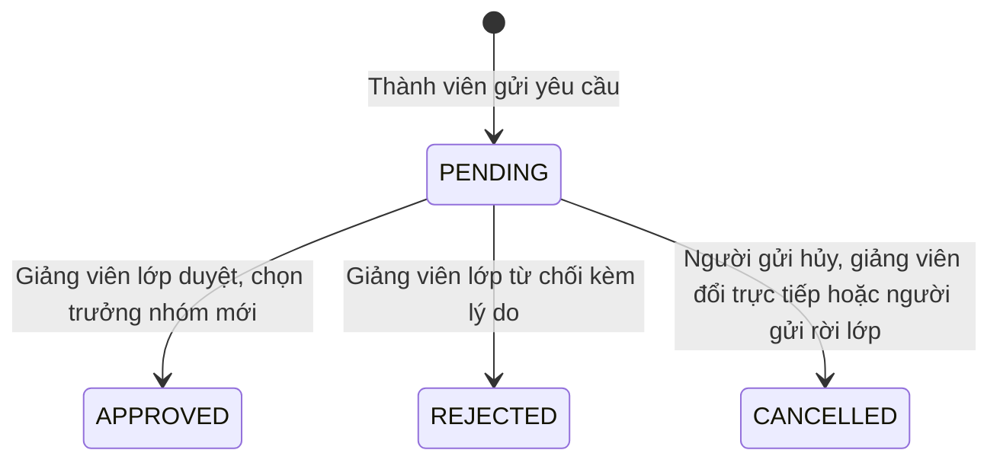

# U12 Group & Allocation - Domain Entities

**Bản tài liệu 2026-10-09**: UC 16, 17 và luồng phụ nhóm (quản lý nhóm, duyệt yêu cầu đổi trưởng nhóm trong tab Students của UC 32; sẵn sàng phát hành bài nhóm của UC 45) theo [73 UC](../../../../docs/use-cases-73.md) và screen flow `docs/G21_Diagrams.drawio` (Page-2); primary stories: US-GRP-001, US-GRP-002. Quyền và supporting flows theo [current SRS contract](../../current-srs-contract.md); đây là thiết kế/kế hoạch, không xác nhận implementation mới.

Thiết kế độc lập công nghệ. Truy vết: `US-GRP-001`, `002`; UC 16, 17 (primary); luồng phụ của UC 32 (tab Students, Student Detail), UC 45 (phát hành bài nhóm); dữ liệu nhóm cho UC 27 (U14).

## 1. Tổng quan

| Entity | Loại | Lưu ở | Unit ghi |
|---|---|---|---|
| `ClassGroups` | Khái niệm gom (mọi nhóm của một lớp) | Không lưu riêng | U12 |
| `StudentGroup` | Thực thể `STUDENT_GROUP` | `student_groups` | U12 |
| `GroupMember` | Bảng nối ACCOUNT joining STUDENT_GROUP (gồm cờ trưởng nhóm) | `group_members` | U12 |
| `LeaderChangeRequest` | Thực thể `LEADER_CHANGE_REQUEST` | `leader_change_requests` | U12 |
| `MyGroupView` | Kết quả tính cho UC 16 | Không lưu | U12 |

U12 **không** sở hữu: lớp và ghi danh (U04), bài nhóm (U08), tài liệu nhóm, các phần (mục) và khóa phần (U14, bảng `group_documents`), điểm (U15). Không có phân công phần của giảng viên.

## 2. `ClassGroups`

Nhóm của một lớp = mọi `StudentGroup` cùng `classId`. Lưu nguyên khối (BR-U12-07) trong một transaction có khóa theo lớp; ràng buộc mỗi sinh viên tối đa một nhóm đang hiệu lực trong lớp được kiểm trong transaction đó. Mọi bài nhóm (`GROUP_ASSIGNMENT`, chỉ có ở lớp) của lớp dùng chung các nhóm này. Khi đọc, mỗi thành viên kèm cờ `activeEnrollment` (BR-U12-15) lấy từ `ClassAccessPort.listActiveStudents(classId)`.

## 3. `StudentGroup`

| Thuộc tính | Kiểu | Ràng buộc |
|---|---|---|
| `id` | UUID | |
| `classId` | UUID | Lớp chứa nhóm |
| `name` | chuỗi ≤ 100 | Duy nhất theo `classId` |
| `createdAt`, `version` | | Khóa lạc quan; người tạo nằm trong audit |

Trưởng nhóm là thành viên có `group_members.is_leader = true`; mỗi nhóm đúng một trưởng nhóm.

Tài liệu nhóm của từng bài nhóm nằm ở `GroupDocument` (U14), tham chiếu `groupId`.

## 4. `GroupMember`

| Thuộc tính | Kiểu | Ràng buộc |
|---|---|---|
| `groupId` | UUID | |
| `accountId` | UUID | Cột `account_id`, sinh viên đang ghi danh `ACTIVE` của lớp khi thêm; khóa chính cùng `groupId` |
| `isLeader` | bool | Cột `is_leader`; đúng một `true` mỗi nhóm |
| `joinedAt` | thời gian | Gỡ thành viên là xóa dòng; lịch sử thành viên nằm trong audit |

Mỗi sinh viên tối đa một nhóm đang hiệu lực trong một lớp. Người bị gỡ khỏi lớp vẫn còn dòng đến lần lưu sau nhưng không còn hiệu lực (BR-U12-15).

## 5. `LeaderChangeRequest`

| Thuộc tính | Kiểu | Ràng buộc |
|---|---|---|
| `id` | UUID | |
| `groupId` | UUID | |
| `requesterId` | UUID | Thành viên nhóm |
| `nomineeId` | UUID, có thể rỗng | Cột `nominee_id`; người được đề cử (UC 17 cho phép không đề cử); nếu có phải là thành viên khác trưởng nhóm hiện tại |
| `reason` | chuỗi 10-1000 | |
| `status` | enum | `PENDING`, `APPROVED`, `REJECTED`, `CANCELLED` |
| `decisionReason` | chuỗi ≤ 1000 | Cột `decision_reason`; bắt buộc khi từ chối |
| `createdAt`, `decidedAt` | thời gian | Người duyệt/từ chối và trưởng nhóm được chọn nằm trong audit |

Mỗi nhóm tối đa một yêu cầu `PENDING`.

### Trạng thái

```mermaid
stateDiagram-v2
    [*] --> PENDING: Thành viên gửi yêu cầu
    PENDING --> APPROVED: Giảng viên lớp duyệt, chọn trưởng nhóm mới
    PENDING --> REJECTED: Giảng viên lớp từ chối kèm lý do
    PENDING --> CANCELLED: Người gửi hủy, giảng viên đổi trực tiếp hoặc người gửi rời lớp
```

**Text alternative**: Yêu cầu đổi trưởng nhóm tạo ra ở `PENDING`. Giảng viên lớp duyệt (chọn trưởng nhóm mới, mặc định người được đề cử, bắt buộc chọn khi không có đề cử) thì `APPROVED`, từ chối kèm lý do thì `REJECTED`. Người gửi tự hủy, giảng viên đổi trưởng nhóm trực tiếp, hoặc người gửi bị gỡ khỏi lớp (xử lý ở lần lưu nhóm) thì yêu cầu thành `CANCELLED`.

## 6. `MyGroupView` (UC 16)

Tính khi sinh viên mở Student Class Detail: kiểm R5, tìm nhóm của mình (rỗng nếu chưa có), thành viên hiệu lực và trưởng nhóm, tài liệu nhóm theo bài (frontend lấy từ API của U14 `GET /api/v1/groups/{groupId}/group-docs`), yêu cầu gần nhất của mình và cờ nhóm đang có yêu cầu `PENDING`. Không lưu.

## 7. Contract

### Port U12 cung cấp

| Port | Dùng bởi | Mô tả |
|---|---|---|
| `GroupReadinessPort` | U08 khai báo, U12 cài (`C`) | `check(classId)` trả lỗi chặn và cảnh báo theo BR-U12-21 khi phát hành bài nhóm |
| `GroupMembershipPort` | U14, U16 | `groupOf(studentId, classId)`, `groupsOf(classId)`, `members(groupId)`, `leaderOf(groupId)`; chỉ trả thành viên hiệu lực (BR-U12-15); lịch sử thành viên nằm trong audit |
| Event `group.membership-changed`, `group.leader-changed`, `group.leader-requested`, `group.leader-request-rejected` | U16 | Sau commit, chỉ cho thông báo |

### Port U12 dùng

| Port | Unit | Mô tả |
|---|---|---|
| `ClassAccessPort` | U04 | Lớp (trạng thái, giảng viên chính), `isActiveStudent`, `listActiveStudents` |
| `GroupChangePort` | U12 khai báo, U14 cài (`C`) | `onGroupCreated(groupId)`: U14 tạo tài liệu nhóm cho mọi bài nhóm đang mở của lớp; `onMemberRemoved(groupId, studentId)`: U14 nhả khóa mục của người đó; `hasGroupWork(groupId)`: chặn xóa nhóm đã có tài liệu/bản nộp. Tài liệu nhóm ở UC 16 do frontend lấy từ API của U14 (`GET /api/v1/groups/{groupId}/group-docs`). Ghi gọi trong transaction; chưa có U14 → adapter rỗng (danh sách rỗng, `hasGroupWork` = false) |
| `AuthorizationPort` | U01 | Tài khoản `ACTIVE`, vai trò |
| `AuditPort` | U02 | Audit |
| `EventPublisherPort` | U03 | Event thông báo sau commit |

## 8. API

| API | Dùng để | Màn, UC | Quyền |
|---|---|---|---|
| `GET /api/v1/classes/{classId}/groups` | Nhóm của lớp (thành viên, cờ `activeEnrollment`, trưởng nhóm, `hasGroupWork`) và sinh viên chưa có nhóm | Tab Students, popup Student Detail (UC 32) | R3/R4 |
| `PUT /api/v1/classes/{classId}/groups` | Lưu nguyên khối: tạo, sửa, xóa nhóm chưa dùng, chuyển thành viên, đổi trưởng nhóm trực tiếp | Tab Students (UC 32) | R3/R4, lớp `DRAFT`/`OPEN` |
| `POST /api/v1/classes/{classId}/groups:random-split` | Xem trước chia ngẫu nhiên sinh viên chưa có nhóm (sĩ số 2-20) | Popup chia ngẫu nhiên ở tab Students (UC 32) | R3/R4, lớp `DRAFT`/`OPEN` |
| `GET /api/v1/classes/{classId}/groups/readiness` | Lỗi chặn, cảnh báo trước khi phát hành bài nhóm | Hộp phát hành của Assignment Form (UC 45) | R3/R4 |
| `GET /api/v1/classes/{classId}/leader-requests?status=` | Yêu cầu đổi trưởng nhóm của lớp | Tab Students (UC 32) | R3/R4 |
| `POST /api/v1/leader-requests/{requestId}/approve` | Duyệt, chọn trưởng nhóm mới (bắt buộc khi không có đề cử) | Tab Students (UC 32) | R3/R4 của lớp chứa nhóm |
| `POST /api/v1/leader-requests/{requestId}/reject` | Từ chối, bắt buộc lý do | Tab Students (UC 32) | R3/R4 của lớp chứa nhóm |
| `GET /api/v1/classes/{classId}/my-group` | Nhóm của mình, thành viên, trưởng nhóm, tài liệu bài nhóm, yêu cầu gần nhất của mình; `group` rỗng khi chưa có nhóm | Student Class Detail (UC 16) | R5 |
| `POST /api/v1/groups/{groupId}/leader-requests` | Gửi yêu cầu đổi trưởng nhóm: lý do, đề cử tùy chọn | Popup Request Leader Change (UC 17) | R5, thành viên nhóm |
| `POST /api/v1/leader-requests/{requestId}/cancel` | Hủy yêu cầu đang chờ của mình | Student Class Detail (UC 17) | R5, người gửi |

Ngoài phạm vi trả `404`, không lộ nhóm. Không có API nhóm cho Admin hay Chủ nhiệm môn không dạy lớp.
