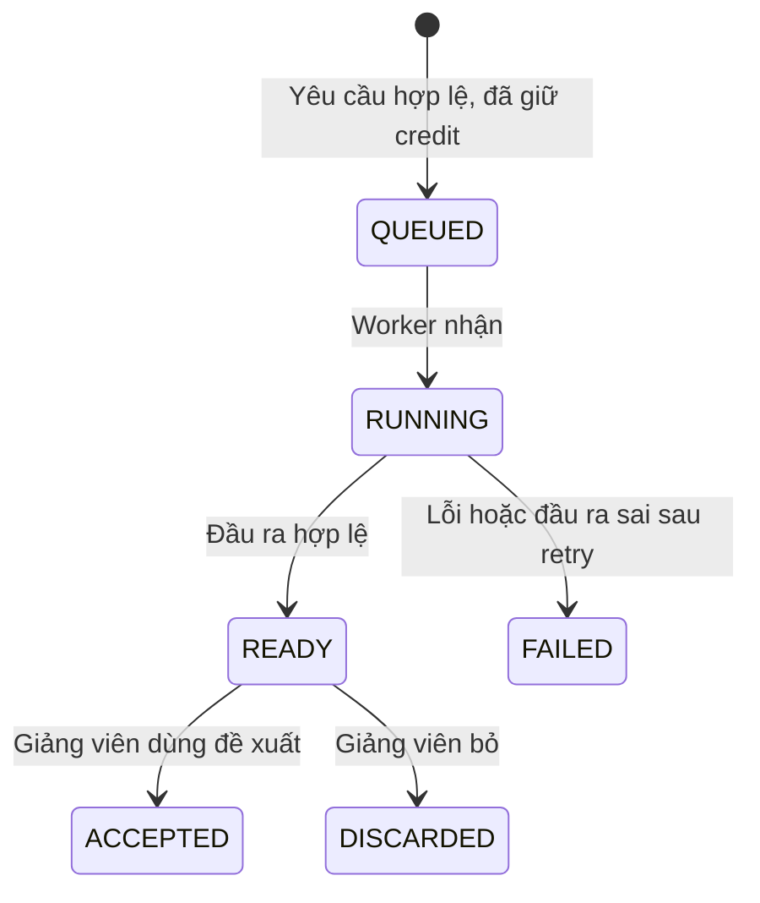
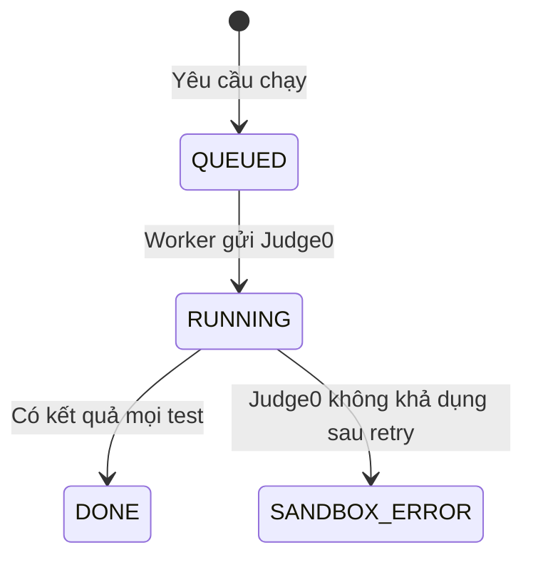

# U13 AI & Code Execution - Domain Entities

Thiết kế độc lập công nghệ. Truy vết: `US-AIG-001`…`003`, `US-ASM-005`; `UC-AIG-01`…`03`, `UC-ASM-05`.

## 1. Tổng quan

| Entity | Loại | Lưu ở | Unit ghi |
|---|---|---|---|
| `AiTaskConfig` | Entity (một bản ghi mỗi loại việc) | `ai_task_configs` | U13 |
| `AiGlobalSettings` | Cấu hình | `app_settings` (khóa `u13.*`) | U13 |
| `AiCall` | Entity bất biến (nhật ký, không lưu nội dung) | `ai_calls` | U13 |
| `AiProposal` | Aggregate root | `ai_proposals` | U13 |
| `CodeRun` | Aggregate root | `code_runs` | U13 |
| `SolutionVerification` | Khái niệm suy ra từ `CodeRun` loại `VERIFY` | `code_runs` | U13 |

U13 **không** sở hữu: bài/câu hỏi (U08, U06), bài nộp (U11, U14), điểm (U15), credit (U07), RAG (U05), rút gọn XML (U09).

## 2. `AiTaskConfig`

| `task` | Model mặc định | Ghi chú |
|---|---|---|
| `QUESTION_DRAFT` | `gemini-2.5-flash` | Tạo câu hỏi/đề nháp từ RAG |
| `GRADING_PROPOSAL` | `gemini-2.5-pro` | Đề xuất chấm theo rubric (bài dài, cần suy luận) |
| `CODE_FEEDBACK` | `gemini-2.5-flash` | Nhận xét code sau khi đã có kết quả test |
| `SHORT_TEXT` | `gemini-2.5-flash-lite` | Việc ngắn (gợi ý tiêu đề, tóm tắt ngắn) |

| Thuộc tính | Ràng buộc |
|---|---|
| `task` | Khóa; một trong các giá trị trên |
| `model` | Trong danh sách cho phép: `gemini-2.5-flash-lite`, `gemini-2.5-flash`, `gemini-2.5-pro` |
| `maxOutputTokens`, `temperature` | |
| `enabled` | Tắt riêng một loại việc |

## 3. `AiGlobalSettings`

| Khóa | Ý nghĩa |
|---|---|
| `u13.killSwitch` | Bool, mặc định `false`; `true` chặn mọi lời gọi AI mới (kể cả embedding của U05) |
| `u13.dailyCostCapUsd` | Trần chi phí ngày của hệ thống; vượt thì báo "Hệ thống đang bận" |
| `u13.perUserPerMinute` | Mặc định 10 yêu cầu/phút/người |

Chỉ ADMIN sửa; mọi thay đổi ghi audit.

## 4. `AiCall`

| Thuộc tính | Ràng buộc |
|---|---|
| `id`, `task`, `model` | |
| `requestedBy`, `scopeRef` | Người yêu cầu, lớp/môn |
| `inputTokens`, `outputTokens`, `creditsCharged`, `estimatedCostUsd`, `latencyMs` | Số liệu, không lưu prompt/phản hồi |
| `status` | `SUCCEEDED`, `FAILED`, `REJECTED_QUOTA`, `REJECTED_KILL_SWITCH`, `INVALID_OUTPUT` |
| `errorCode`, `createdAt` | |

## 5. `AiProposal`

| Thuộc tính | Kiểu | Ràng buộc |
|---|---|---|
| `id` | UUID | |
| `kind` | enum | `QUESTION_DRAFT`, `GRADING_PROPOSAL` |
| `requestedBy` | UUID | |
| `target` | JSON | Bài/template/ngân hàng đích, hoặc lượt bài nộp/phần đóng góp |
| `input` | JSON | Tham số (loại câu, số câu 1-20, độ khó, chương/bài); không lưu prompt thô |
| `result` | JSON | Câu hỏi đề xuất kèm trích dẫn nguồn; hoặc từng mục checklist đạt/không + nhận xét + bằng chứng |
| `status` | enum | `QUEUED`, `RUNNING`, `READY`, `FAILED`, `ACCEPTED`, `DISCARDED` |
| `jobId` | UUID | Job U02 |

### Trạng thái

**Text alternative**: Yêu cầu AI qua được kiểm tra (kill-switch, trần chi phí, tần suất, credit) thì tạo đề xuất ở `QUEUED`. Worker nhận thì `RUNNING`; đầu ra hợp lệ thì `READY`, lỗi hoặc sai định dạng sau retry thì `FAILED` (credit được trả). Giảng viên dùng đề xuất thì `ACCEPTED`, bỏ thì `DISCARDED`. AI không bao giờ tự lưu vào bài hay chốt điểm.

## 6. `CodeRun`

| Thuộc tính | Kiểu | Ràng buộc |
|---|---|---|
| `id` | UUID | |
| `kind` | enum | `TRY` (người học chạy thử test công khai), `VERIFY` (lời giải mẫu), `GRADE` (bài nộp, mọi test) |
| `ownerRef` | | Lượt làm / phần / bài / câu ngân hàng |
| `language` | enum | `JAVA`, `PYTHON`, `C`, `CPP`, `JAVASCRIPT`, `DART`, `CSHARP` |
| `status` | enum | `QUEUED`, `RUNNING`, `DONE`, `SANDBOX_ERROR` |
| `results[]` | JSON | Mỗi test: `passed`, `status` (`ACCEPTED`, `WRONG_ANSWER`, `TIME_LIMIT`, `MEMORY_LIMIT`, `RUNTIME_ERROR`, `COMPILE_ERROR`), `timeMs`, `memoryKb`, output rút gọn (test ẩn không trả output) |
| `score` | numeric(6,2) | `GRADE`: tổng điểm test đạt |
| `contentHash` | chuỗi | `VERIFY`: SHA-256 của đề + test + lời giải lúc chạy |

Kết quả bất biến sau `DONE`.

### Trạng thái

**Text alternative**: Lần chạy tạo ở `QUEUED`, worker gửi sang Judge0 thì `RUNNING`. Có kết quả (kể cả lỗi biên dịch hay sai đáp án của người học) thì `DONE`. Sandbox lỗi sau retry thì `SANDBOX_ERROR`; không bao giờ chạy code ngoài sandbox.

## 7. `SolutionVerification`

Kết quả kiểm lời giải mẫu hiện hành = lần `CodeRun` loại `VERIFY` mới nhất của bài/câu có `contentHash` khớp nội dung hiện tại; đạt khi mọi test `ACCEPTED`. Sửa đề, test hoặc lời giải làm hash lệch nên phải kiểm lại trước khi duyệt bài.

## 8. Contract

### Port U13 cung cấp / cài

| Port | Dùng bởi | Mô tả |
|---|---|---|
| `AiDraftPort` | U08 (`C`), U06, U10 | Tạo/đọc/nhận đề xuất câu hỏi |
| `AiGradingPort` | U15 | Tạo/đọc đề xuất chấm |
| `CodeRunPort` | U11 (`C`), U15 | `try`, `grade`, kết quả |
| `CodeLabCheckPort` | U08 khai báo (`C`) | Bài `CODE_LAB` đã kiểm lời giải mẫu với đúng nội dung hiện tại |
| `AiKillSwitchPort` | U05 (`C`) | Trạng thái kill-switch |
| Event `u13.code.graded` | U15 | Điểm Code Lab tự chấm |

### Port U13 dùng

| Port | Unit | Mô tả |
|---|---|---|
| `CreditPort` | U07 | Giữ/trừ/trả credit |
| `RagRetrievalPort` | U05 | Đoạn học liệu trong phạm vi |
| `BankQueryPort` | U06 | Câu hỏi, rubric |
| `DiagramCompactPort`, `DocumentModelPort` | U09 (`C`) | XML rút gọn, văn bản phẳng |
| `SubmissionQueryPort`, `GroupSubmissionQueryPort` | U11, U14 (`C`) | Nội dung bài nộp / các mục của một thành viên để AI đề xuất chấm; adapter tạm báo "chưa hỗ trợ" tới khi U11/U14 có |
| Event `u11.submission.submitted` | U11 (`C`) | Chấm Code Lab khi nộp |
| `JobPort`, `AuditPort`, `EventPublisherPort` | U02 | Chạy nền, audit, event |
