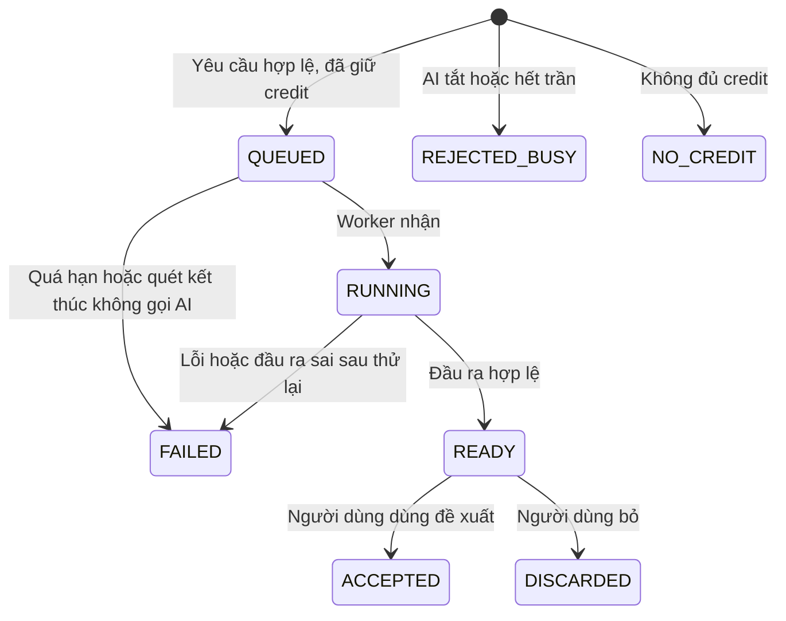
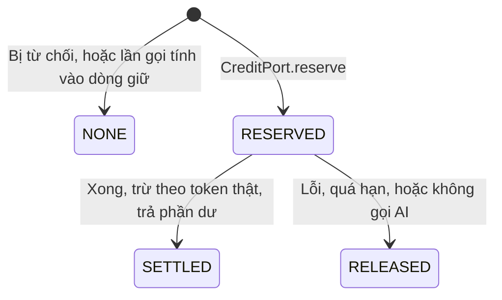
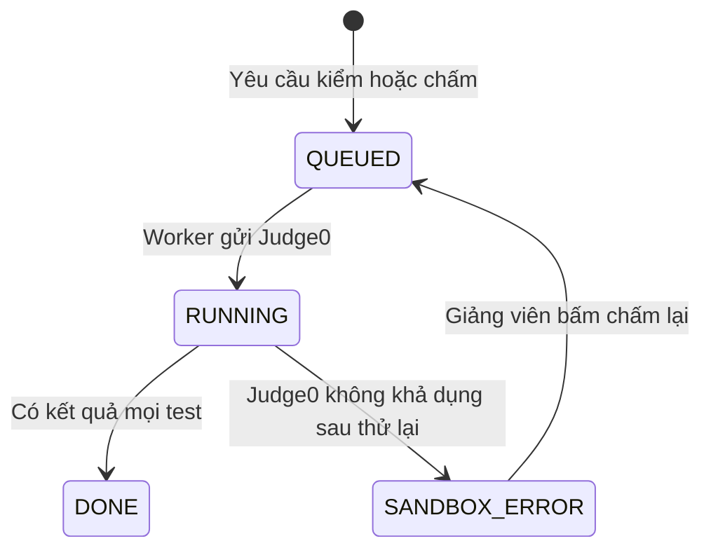

# U13 AI & Code Execution - Domain Entities

**Bản tài liệu 2026-10-09**: không primary UC; phần chạy AI và Judge0 của UC 25, 29, 38, 43, nhóm AI của Settings UC 70–71, luồng phụ AI soạn đề (UC 35, 42–45, 57) và tóm tắt/embedding học liệu (UC 34, 55) theo [73 UC](../../../../docs/use-cases-73.md) và screen flow `docs/G21_Diagrams.drawio` (Page-2); primary stories: US-AIG-001, US-AIG-002, US-AIG-003. Quyền và supporting flows theo [current SRS contract](../../current-srs-contract.md); đây là thiết kế/kế hoạch, không xác nhận implementation mới.

Thiết kế độc lập công nghệ. Truy vết: `US-AIG-001`…`003`, `US-ASM-005`, `US-ASM-012`; chạy test công khai và chấm Code Lab (UC 25), AI chấm bài Practice (UC 29, U11 chủ trì màn), AI đề xuất chấm (UC 38, U15 chủ trì màn), kiểm lời giải mẫu Code Lab (UC 43, U08/U09 chủ trì màn), mục AI của Settings (UC 70–71, U03 chủ trì màn và bảng).

Quyết định 2026-10-09: Admin không có ví và không dùng AI; cấu hình AI là các mục nhóm AI trên Settings của U03 (bỏ bảng `ai_services` và API cấu hình AI riêng); không còn template (U10 đã xóa) và ngân hàng lớp; U13 tự lưu kết quả kiểm lời giải mẫu theo `contentHash` của phiên bản câu `CODE` (bỏ `QuestionVerificationPort` của U06).

## 1. Tổng quan

| Entity | Loại | Lưu ở | Unit ghi |
|---|---|---|---|
| `AiSuggestion` | Entity (một lần gọi AI hoặc một lần giữ credit khi tải học liệu: đề xuất, số liệu, credit) | `ai_suggestions` | U13 |
| `CodeRun` | Entity (một lần kiểm lời giải mẫu hoặc chấm code chạy nền) | `code_runs` | U13 |
| `CodeRunResult` | Value object | `code_runs.results`; bản mới nhất của lượt trong `attempts.run_result` (chạy thử, chấm test) | U13; `attempts` qua port của U11 |
| `AiSettingDefinitions` | Khai báo trong code (`SettingDefinition` nhóm `AI`) | Giá trị ở `system_settings` của U03 | U13 khai báo, Admin sửa qua U03 (UC 71) |

U13 **không** sở hữu: bài/câu hỏi (U08, U06), bài nộp (U11, U14), điểm và kết quả Practice (U15), số dư credit (U07), học liệu và bản tóm tắt (U05), rút gọn XML (U09), màn và bảng Settings (U03), màn chấm (U11, U15). Bảng `ai_services` của bản trước bỏ; `CODE_RUN` là thực thể mới cần thêm vào ERD.

## 2. `AiSettingDefinitions` (nhóm AI trên Settings)

U13 cài `SettingDefinition` của U03; U03 lưu, hiển thị trên Setting List/Setting Detail, kiểm giới hạn, audit `SETTING_UPDATED` và cache 30 giây (BR-U03-80…86). U13 đọc qua `SettingsPort`.

| Khóa | Kiểu | Giới hạn | Mặc định | Dùng để |
|---|---|---|---|---|
| `ai.enabled` | `BOOLEAN` | | `true` | Kill-switch toàn hệ thống |
| `ai.dailyCostCapUsd` | `DECIMAL` | 0,1–100 | 2 | Trần chi phí Gemini/ngày của cả hệ thống (giờ Việt Nam) |
| `ai.ratePerMinute` | `INTEGER` | 1–60 | 10 | Số yêu cầu AI tối đa mỗi người mỗi phút |
| `ai.questionDraft.model` | `ENUM` | `gemini-2.5-flash-lite`, `gemini-2.5-flash`, `gemini-2.5-pro` | `gemini-2.5-flash` | AI soạn câu hỏi (`QUESTION_DRAFT`) |
| `ai.skeletonDraft.model` | `ENUM` | như trên | `gemini-2.5-flash` | AI soạn khung Diagram Essay, bài nhóm (`SKELETON_DRAFT`) |
| `ai.gradingProposal.model` | `ENUM` | như trên | `gemini-2.5-pro` | AI đề xuất chấm cho giảng viên (`GRADING_PROPOSAL`) |
| `ai.practiceGrading.model` | `ENUM` | như trên | `gemini-2.5-pro` | AI chấm bài Practice cho Student (`PRACTICE_GRADING`) |
| `ai.materialSummary.model` | `ENUM` | như trên | `gemini-2.5-flash` | Tóm tắt học liệu khi quét (`MATERIAL_SUMMARY`, U05) |
| `ai.{task}.enabled` | `BOOLEAN` | | `true` | Tắt riêng từng loại việc: `questionDraft`, `skeletonDraft`, `gradingProposal`, `practiceGrading`, `materialSummary`, `embedding` |

Model embedding cố định `gemini-embedding-001` trong mã (đổi model làm vector cũ của U05 lệch chiều), chỉ bật/tắt được. `maxOutputTokens`, `temperature` cố định trong mã theo loại việc. Bảng giá model là cấu hình triển khai `U13_MODEL_PRICES`; `GEMINI_API_KEY`, `JUDGE0_AUTH_TOKEN` là bí mật, không phải cài đặt (BR-U03-85).

## 3. `AiSuggestion`

| Cột | Kiểu | Ràng buộc |
|---|---|---|
| `id` | UUID | Dùng làm `requestRef` khi giữ credit |
| `task_type` | enum | `QUESTION_DRAFT`, `SKELETON_DRAFT`, `GRADING_PROPOSAL`, `PRACTICE_GRADING`, `EMBEDDING`, `MATERIAL_SUMMARY` |
| `model` | chuỗi | Model đọc từ Settings lúc gọi; rỗng khi chưa gọi |
| `requested_by` | UUID | Người chịu phí (Student, Teacher, Subject Manager; không bao giờ là Admin) |
| `target_type`, `target_id` | | `BANK` (ngân hàng của môn), `ASSIGNMENT` (bài của lớp, bài của môn hoặc quiz), `ATTEMPT` (đề xuất chấm bài `GRADED`), `PRACTICE_ATTEMPT` (chấm Practice), `GROUP_DOCUMENT`, `LESSON` (tóm tắt, embedding học liệu), `QUERY` (embedding câu truy xuất); mỗi `PRACTICE_ATTEMPT` tối đa một dòng `QUEUED`/`RUNNING`/`READY` |
| `hold_id` | UUID | Dòng giữ credit khi tải học liệu mà lần gọi này tính vào (embedding học liệu); rỗng với dòng tự giữ credit |
| `request_ref` | chuỗi | Khóa idempotent do unit gọi truyền (U05: `lessonId:scanNo:task`); duy nhất khi có giá trị |
| `status` | enum | `QUEUED`, `RUNNING`, `READY`, `FAILED`, `ACCEPTED`, `DISCARDED`, `REJECTED_BUSY`, `NO_CREDIT` |
| `input_tokens`, `output_tokens`, `cost_usd`, `latency_ms` | số | Số liệu vận hành; không lưu prompt thô |
| `credits_reserved`, `free_credits_reserved`, `credits_used`, `credit_status` | | Phần giữ, phần lấy từ credit tặng, phần đã dùng; `credit_status` `NONE`, `RESERVED`, `SETTLED`, `RELEASED` (U07 đổi số dư cùng transaction) |
| `reserve_expires_at` | thời gian | Hạn giữ: 30 phút; dòng giữ khi tải học liệu (`MATERIAL_SUMMARY`) 25 giờ |
| `result` | JSON | Tham số yêu cầu và kết quả: câu hỏi đề xuất kèm trích dẫn; khung đề xuất kèm gợi ý rubric từng phần và trích dẫn; hoặc từng mục checklist đạt/không + điểm/nhận xét/bằng chứng; cờ `suspectedInjection` |
| `created_at`, `completed_at` | thời gian | |

Dòng giữ khi tải học liệu: `task_type = MATERIAL_SUMMARY`, `target_type = LESSON`, giữ credit tối đa của một lần quét (tóm tắt + embedding); lần tóm tắt ghi số liệu trên chính dòng này, lần embedding là dòng riêng có `hold_id` trỏ về, `credit_status = NONE`, credit cộng vào `credits_used` của dòng giữ.

### Trạng thái

```mermaid
stateDiagram-v2
    [*] --> QUEUED: Yêu cầu hợp lệ, đã giữ credit
    [*] --> REJECTED_BUSY: AI tắt hoặc hết trần
    [*] --> NO_CREDIT: Không đủ credit
    QUEUED --> RUNNING: Worker nhận
    QUEUED --> FAILED: Quá hạn hoặc quét kết thúc không gọi AI
    RUNNING --> READY: Đầu ra hợp lệ
    RUNNING --> FAILED: Lỗi hoặc đầu ra sai sau thử lại
    READY --> ACCEPTED: Người dùng dùng đề xuất
    READY --> DISCARDED: Người dùng bỏ
```

**Text alternative**: Yêu cầu AI qua được kiểm tra (vai trò, phạm vi, kill-switch, trần chi phí, tần suất, credit) thì tạo dòng ở `QUEUED`; AI tắt hoặc hết trần thì dòng ghi `REJECTED_BUSY`, thiếu credit ghi `NO_CREDIT`, không gọi AI. Worker nhận thì `RUNNING`; đầu ra hợp lệ thì `READY`, lỗi hoặc sai định dạng sau thử lại thì `FAILED` và trả credit chưa dùng. Với đề xuất câu hỏi và khung, người dùng chấp nhận (`ACCEPTED`) hoặc bỏ (`DISCARDED`). Dòng giữ credit khi tải học liệu ở `QUEUED` tới khi worker tóm tắt; học liệu không có chữ, không phụ đề hoặc quét thất bại trước khi gọi AI thì dòng sang `FAILED` và trả toàn bộ credit. Embedding đi `QUEUED` → `RUNNING` → `READY` trong cùng lời gọi.

### Trạng thái credit

```mermaid
stateDiagram-v2
    [*] --> NONE: Bị từ chối, hoặc lần gọi tính vào dòng giữ
    [*] --> RESERVED: CreditPort.reserve
    RESERVED --> SETTLED: Xong, trừ theo token thật, trả phần dư
    RESERVED --> RELEASED: Lỗi, quá hạn, hoặc không gọi AI
```

**Text alternative**: Dòng bị từ chối hoặc lần embedding tính vào dòng giữ khi tải học liệu có `credit_status = NONE`. Dòng tự giữ credit sang `RESERVED` khi `CreditPort.reserve` thành công. Xong việc thì `SETTLED`: trừ theo token thật và trả phần dư. Lỗi, quá hạn (30 phút; dòng giữ khi tải học liệu 25 giờ) hoặc không gọi AI thì `RELEASED`, trả toàn bộ phần giữ. Mỗi lần đổi đi cùng một lời gọi `CreditPort` trong cùng transaction nên thử lại không giữ hay trừ trùng.

## 4. `CodeRun`

| Cột | Kiểu | Ràng buộc |
|---|---|---|
| `id` | UUID | |
| `kind` | enum | `VERIFY` (kiểm lời giải mẫu một câu `CODE`), `GRADE` (chấm một lượt nộp Code Lab) |
| `question_id` | UUID | `VERIFY`: ID phiên bản câu `CODE` (U06) |
| `content_hash` | chuỗi | `VERIFY`: SHA-256 của đề, ngôn ngữ, entry point, lời giải mẫu, test case và giới hạn của phiên bản câu lúc chạy |
| `assignment_id` | UUID | `VERIFY`: bài nơi người soạn bấm kiểm (để kiểm quyền và audit) |
| `attempt_id` | UUID | `GRADE`: lượt nộp (U11) |
| `requested_by` | UUID | Người bấm kiểm; rỗng với `GRADE` do hệ thống tạo khi nộp |
| `status` | enum | `QUEUED`, `RUNNING`, `DONE`, `SANDBOX_ERROR` |
| `passed_all` | boolean | `DONE`: mọi test `ACCEPTED` |
| `score` | số | `GRADE`: tổng điểm test đạt |
| `results` | JSON | `CodeRunResult` |
| `created_at`, `completed_at` | thời gian | |

Không trừ credit: chạy code không dùng AI. Kiểm lời giải mẫu hiện hành của một câu = dòng `VERIFY` `DONE` mới nhất có `question_id` và `content_hash` khớp nội dung hiện tại. Phiên bản câu `ACTIVE` của ngân hàng bất biến nên kết quả dùng lại được cho mọi bài dùng câu đó; câu nháp hoặc câu riêng của bài sửa nội dung thì hash lệch, phải kiểm lại. Mỗi `attempt_id` tối đa một dòng `GRADE` ở `QUEUED`/`RUNNING`/`DONE`.

### Trạng thái

```mermaid
stateDiagram-v2
    [*] --> QUEUED: Yêu cầu kiểm hoặc chấm
    QUEUED --> RUNNING: Worker gửi Judge0
    RUNNING --> DONE: Có kết quả mọi test
    RUNNING --> SANDBOX_ERROR: Judge0 không khả dụng sau thử lại
    SANDBOX_ERROR --> QUEUED: Giảng viên bấm chấm lại
```

**Text alternative**: Lần kiểm lời giải mẫu hoặc chấm code ghi `QUEUED`, worker gửi sang Judge0 thì `RUNNING`. Có kết quả (kể cả lỗi biên dịch hay sai đáp án) thì `DONE`. Sandbox lỗi sau thử lại thì `SANDBOX_ERROR`; với `GRADE`, giảng viên bấm chấm lại thì quay về `QUEUED`. Không bao giờ chạy code ngoài sandbox.

## 5. `CodeRunResult`

| Thuộc tính | Ràng buộc |
|---|---|
| `kind` | `TRY` (Student chạy test công khai, đồng bộ, không lưu `code_runs`), `VERIFY`, `GRADE` |
| `status` | `DONE`, `SANDBOX_ERROR` |
| `results[]` | Mỗi test: `testId`, `hidden`, `passed`, `status` (`ACCEPTED`, `WRONG_ANSWER`, `TIME_LIMIT`, `MEMORY_LIMIT`, `RUNTIME_ERROR`, `COMPILE_ERROR`), `timeMs`, `memoryKb`, output rút gọn (test ẩn không trả output cho Student) |
| `score` | `GRADE`: tổng điểm test đạt |

`TRY` và `GRADE` ghi bản mới nhất vào `attempts.run_result` qua `AttemptRunResultPort` của U11 để Codelab Workspace và Grading Workspace hiển thị. Điểm `GRADE` bài `GRADED` gửi U15 qua `CodeGradedPort`; bài `PRACTICE` qua `PracticeResultPort.record` của U15.

## 6. Contract

### Port U13 cung cấp / cài

| Port | Dùng bởi | Mô tả |
|---|---|---|
| `AiDraftPort` | U06 (Question List), U08 (`C`, quiz, Text Essay, Code Lab), U09 (`C`, khung) | `request(actor, DraftRequest)` tạo đề xuất câu hỏi (`QUESTION_DRAFT`) hoặc khung (`SKELETON_DRAFT`); `get`, `accept`, `discard` |
| `AiGradingPort` | U15 (`C`) | Đề xuất chấm bài `GRADED` cho giảng viên lớp, từng bài (`request`) hoặc theo lô (`requestBatch`); `get` |
| `PracticeGradingPort` | U11 (`C`) | `request(student, attemptId)`: xác minh attempt, giữ credit, gửi việc; `latest(attemptId)`; kết quả ghi qua `PracticeResultPort` của U15 |
| `CodeRunPort` | U11 (`C`), U15 (`C`) | `tryRun` (đồng bộ, test công khai), `grade(attemptId)` (tạo `code_runs` `GRADE`, gửi việc); `regrade(attemptId)` khi `SANDBOX_ERROR` |
| `CodeLabCheckPort` | U08 khai báo (`C`, duyệt bài), U09 (hiện trạng thái) | `check(assignmentId)` → danh sách câu `CODE` chưa kiểm/không đạt/kiểm cho nội dung cũ; `statusOf(assignmentId)` → trạng thái từng câu (`NOT_VERIFIED`, `RUNNING`, `PASSED`, `FAILED`, `OUTDATED`, `SANDBOX_ERROR`) |
| `AiUsagePort` | U05 khai báo (`C`) | `quote(accountId)` → mức credit giữ cho một lần quét và số dư; `hold(MATERIAL_SUMMARY, uploader, LESSON, lessonId, requestRef)` giữ credit khi tạo học liệu (cùng transaction của U05); `begin(task, requestedBy, target, requestRef, holdId?)` kiểm AI bật, trần chi phí, tạo/nhận dòng; `complete(ticket, tokens, cost)`; `fail(ticket)`; `release(holdId)` chốt credit đã dùng và trả phần còn giữ |
| `CreditUsagePort` | U07 khai báo (`C`) | `listUsage(accountId, page)`: lần dùng credit của chính chủ ví từ `ai_suggestions` (thời điểm, loại việc, `credits_used`, `credit_status`) cho My Credit Package (UC 08) |
| `AiUsageStatsPort` | U16 (`C`, Admin Dashboard UC 58) | `summarize(from, to)`: số lượt, lỗi, độ trễ trung bình, token, chi phí ước tính theo ngày/loại việc/model; chỉ số đếm, không nội dung |
| `SettingDefinition` (`AiSettingDefinitions`) | U03 | Khai báo các mục nhóm AI (mục 2) |

### Port U13 dùng

| Port | Unit | Mô tả |
|---|---|---|
| `SettingsPort` | U03 | Đọc mục nhóm AI (cache 30 giây) |
| `CreditPort` | U07 | `reserve(accountId, credits, purpose, attemptRef?)` → `{reserved, fromFree}`, `settle(accountId, reserved, fromFree, actualCredits)`, `release(accountId, reserved, fromFree)`, `balance(accountId)`; gọi trong transaction đổi `credit_status`; `purpose` thêm `MATERIAL_SUMMARY` |
| `RagRetrievalPort` | U05 | Lesson và đoạn trích trong phạm vi lớp hoặc môn |
| `BankQueryPort`, `RubricPort` | U06 | Phiên bản câu đầy đủ (test, lời giải mẫu) để kiểm lời giải, chấm; rubric và `score` |
| `AssignmentQueryPort` | U08 | Bài, câu `CODE` của bài, phạm vi lớp/môn, trạng thái `DRAFT` |
| `DiagramCompactPort`, `DocumentModelPort` | U09 | XML rút gọn, văn bản phẳng, `validateSkeleton` |
| `SubmissionQueryPort`, `AttemptRunResultPort` | U11 | Nội dung bài nộp, chủ lượt, chế độ; ghi kết quả chạy code vào lượt |
| `GroupSubmissionQueryPort` | U14 | Bản nộp tài liệu nhóm |
| `CodeGradedPort`, `PracticeResultPort` | U15 | Bài `GRADED`: U15 ghi điểm Code Lab; bài `PRACTICE`: `record(attemptId, result)` ghi `evaluations` `kind = PRACTICE` |
| `AuthorizationPort`, `SubjectScopePort`, `ClassScopePort` | U01, U04 | Tài khoản `ACTIVE`, vai trò; Chủ nhiệm môn của môn (R2), giảng viên chính của lớp (R3/R4) |
| `AuditPort` | U02 | Audit |
| `JobPort`, `JobHandler`, `PendingSweeper`, `ScheduledScanner` | U03 | Việc `AI_TASK` (`jobs.gemini`), `CODE_RUN` (`jobs.code`), gửi lại việc bị mất, scanner hết hạn chấm và trả credit giữ quá hạn |

## 7. API

| API | Dùng để | Màn, UC | Quyền |
|---|---|---|---|
| `POST /api/v1/ai/question-drafts` | AI soạn câu vào ngân hàng của môn (`subjectId`, loại câu, số câu, độ khó, module/học liệu, ghi chú) | Question List (U06), luồng phụ UC 57 | Subject Manager, R2 của môn |
| `GET /api/v1/ai-suggestions/{id}` | Trạng thái và kết quả một đề xuất (poll) | Quiz Detail, Assignment Form, Question List, Grading Workspace (panel AI đề xuất của U15), Submission History (U11); UC 29, 38 | Người yêu cầu; Student chỉ dòng `PRACTICE_GRADING` của chính mình |
| `GET /api/v1/ai-suggestions?ids=` | Theo dõi lô đề xuất chấm | Student Submissions (U15, chấm hàng loạt), UC 38 | Teacher, Subject Manager là người yêu cầu |
| `POST /api/v1/ai-suggestions/{id}/accept` | Đánh dấu đã dùng đề xuất câu (sau khi U06 lưu câu giữ lại) | Question List, luồng phụ UC 57 | Người yêu cầu (R2) |
| `POST /api/v1/ai-suggestions/{id}/discard` | Bỏ đề xuất | Question List, Quiz Detail, Assignment Form | Người yêu cầu |
| `POST /api/v1/code-runs` (`TRY`) | Chạy test công khai, trả kết quả ngay, 5 lần/phút | Codelab Workspace (U11), UC 25 | Student chủ lượt đang làm |
| `POST /api/v1/code-runs` (`VERIFY`) | Kiểm lời giải mẫu một câu `CODE` của bài (`assignmentId`, `questionId`) | Assignment Form (U08/U09), UC 43 | R3/R4 bài của lớp, R2 bài của môn; bài `DRAFT` |
| `GET /api/v1/code-runs/{runId}` | Poll kết quả kiểm lời giải mẫu | Assignment Form, UC 43 | Như `VERIFY` |

AI chấm Practice (UC 29) gọi qua API của U11 (`POST /api/v1/attempts/{id}/ai-grading`, `GET /api/v1/attempts/{id}/practice-result`); AI đề xuất chấm (UC 38) qua API của U15 (`POST /api/v1/evaluations/{id}/ai-proposal`, `POST /api/v1/evaluations:ai-proposal-batch`); AI soạn câu cho bài/quiz qua U08 (`POST /api/v1/assignments/{id}/ai-drafts`); AI soạn khung qua U09 (`POST .../skeleton:ai-draft`); cấu hình AI qua Settings của U03 (`GET /api/v1/admin/settings`, `PATCH /api/v1/admin/settings/{key}`); lần dùng credit qua U07 (`GET /api/v1/me/credit-usage`); mức giữ khi tải học liệu qua U05 (`GET /api/v1/lessons/upload-credit`). Bỏ `GET /api/v1/admin/ai/usage`, `GET`/`PUT /api/v1/admin/ai/settings`. Mọi API AI từ chối `ADMIN`.
