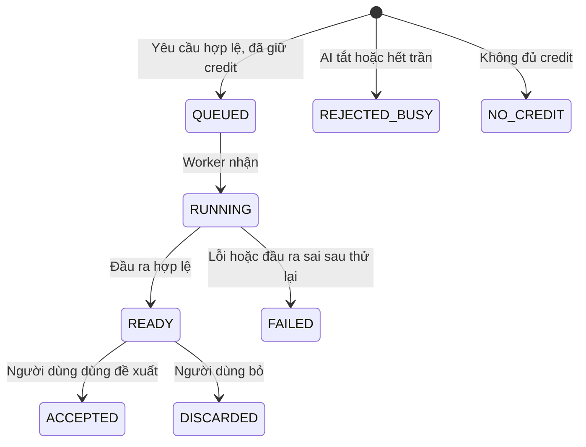
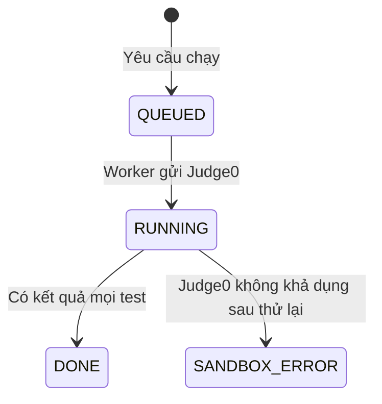

# U13 AI & Code Execution - Domain Entities

**Bản tài liệu 2026-10-08**: không primary UC; primary stories: US-AIG-001, US-AIG-002, US-AIG-003. Quyền và supporting flows theo [current SRS contract](../../current-srs-contract.md); đây là thiết kế/kế hoạch, không xác nhận implementation mới.

Thiết kế độc lập công nghệ. Truy vết: `US-AIG-001`…`003`, `US-ASM-005`; vận hành AI (không UC trực tiếp); kiểm lời giải mẫu và chạy code cho UC 41 (U09 chủ trì) và luồng AI soạn bản nháp của UC 38, 39, 40, 41, 42, 43, 53, 54. Bảng theo [mô hình dữ liệu của unit](domain-entities.md).

## 1. Tổng quan

| Entity | Thực thể ERD | Lưu ở | Unit ghi |
|---|---|---|---|
| `AiService` | `AI_SERVICE` (một dòng mỗi loại việc, thêm dòng `GLOBAL`) | `ai_services` | U13 |
| `AiSuggestion` | `AI_SUGGESTION` (một lần gọi AI: đề xuất, số liệu, credit) | `ai_suggestions` | U13 |
| `CodeRunResult` | Value object | `attempts.run_result` (chạy thử, chấm test), `questions.definition.verification` (kiểm lời giải mẫu) | U13 qua port của U11, U06 |

Không có bảng `ai_task_configs`, `ai_calls`, `ai_proposals`, `code_runs` hay khóa `app_settings` (database chỉ gồm bảng của ERD, quyết định 2026-10-03). U13 **không** sở hữu: bài/câu hỏi (U08, U06), bài nộp (U11, U14), điểm (U15), số dư credit (U07), học liệu (U05), rút gọn XML (U09).

## 2. `AiService`

| `task_type` | Model mặc định | Ghi chú |
|---|---|---|
| `GLOBAL` | - | `enabled = false` là kill-switch toàn hệ thống; `daily_cost_cap` là trần chi phí Gemini/ngày của cả hệ thống; `rate_per_minute` là giới hạn mỗi người |
| `QUESTION_DRAFT` | `gemini-2.5-flash` | Tạo câu hỏi/đề nháp từ RAG |
| `SKELETON_DRAFT` | `gemini-2.5-flash` | Đề xuất khung tài liệu (cây heading, hướng dẫn, gợi ý rubric từng phần) cho Diagram Essay, bài nhóm từ RAG |
| `GRADING_PROPOSAL` | `gemini-2.5-pro` | Đề xuất chấm bài `GRADED` cho Teacher duyệt |
| `PRACTICE_GRADING` | `gemini-2.5-pro` | Chấm một attempt Text/Diagram Essay `PRACTICE` của Student |
| `EMBEDDING` | `gemini-embedding-001` | Quét học liệu và câu truy xuất của U05 |

| Cột | Ràng buộc |
|---|---|
| `task_type` | Duy nhất |
| `model` | Trong danh sách cho phép: `gemini-2.5-flash-lite`, `gemini-2.5-flash`, `gemini-2.5-pro`, `gemini-embedding-001` |
| `enabled` | Tắt riêng một loại việc; dòng `GLOBAL` tắt toàn bộ |
| `daily_cost_cap`, `rate_per_minute` | Dùng ở dòng `GLOBAL` |
| `updated_at` | Người sửa nằm trong audit |

Chỉ ADMIN sửa (popup AI Setting); `maxOutputTokens`, `temperature` cố định trong mã theo loại việc.

## 3. `AiSuggestion`

| Cột | Kiểu | Ràng buộc |
|---|---|---|
| `id` | UUID | Dùng làm `requestRef` khi giữ credit |
| `ai_service_id` | UUID | Loại việc |
| `requested_by` | UUID | Người chịu phí |
| `target_type`, `target_id` | | Bài/template/câu hỏi đích, `ATTEMPT` (đề xuất chấm bài `GRADED`), `PRACTICE_ATTEMPT` (chấm Practice), `GROUP_DOCUMENT`, `LESSON`, `QUERY`; mỗi `PRACTICE_ATTEMPT` tối đa một dòng `QUEUED`/`RUNNING`/`READY` |
| `status` | enum | `QUEUED`, `RUNNING`, `READY`, `FAILED`, `ACCEPTED`, `DISCARDED`, `REJECTED_BUSY`, `NO_CREDIT` |
| `input_tokens`, `output_tokens`, `cost_usd`, `latency_ms` | số | Số liệu cho AI Usage; không lưu prompt thô |
| `credits_reserved`, `free_credits_reserved`, `credits_used`, `credit_status` | | Phần giữ, phần lấy từ credit tặng, phần đã trừ; `credit_status` `NONE`, `RESERVED`, `SETTLED`, `RELEASED` (U07 đổi số dư cùng transaction) |
| `result` | JSON | Tham số yêu cầu và kết quả: câu hỏi đề xuất kèm trích dẫn; khung đề xuất kèm gợi ý rubric từng phần và trích dẫn; hoặc từng mục checklist đạt/không + điểm/nhận xét/bằng chứng |
| `created_at`, `completed_at` | thời gian | |

### Trạng thái

```mermaid
stateDiagram-v2
    [*] --> QUEUED: Yêu cầu hợp lệ, đã giữ credit
    [*] --> REJECTED_BUSY: AI tắt hoặc hết trần
    [*] --> NO_CREDIT: Không đủ credit
    QUEUED --> RUNNING: Worker nhận
    RUNNING --> READY: Đầu ra hợp lệ
    RUNNING --> FAILED: Lỗi hoặc đầu ra sai sau thử lại
    READY --> ACCEPTED: Người dùng dùng đề xuất
    READY --> DISCARDED: Người dùng bỏ
```

**Text alternative**: Yêu cầu AI qua được kiểm tra (kill-switch, trần chi phí, tần suất, credit) thì tạo dòng ở `QUEUED`; AI tắt hoặc hết trần thì dòng ghi `REJECTED_BUSY`, thiếu credit ghi `NO_CREDIT`, không gọi AI. Worker nhận thì `RUNNING`; đầu ra hợp lệ thì `READY`, lỗi hoặc sai định dạng sau thử lại thì `FAILED` (credit chưa dùng được trả). Với đề xuất, người dùng chấp nhận (`ACCEPTED`) hoặc bỏ (`DISCARDED`). Embedding của U05 đi thẳng `QUEUED` → `READY` trong cùng lời gọi.

## 4. `CodeRunResult`

| Thuộc tính | Ràng buộc |
|---|---|
| `kind` | `TRY` (người học chạy thử test công khai), `VERIFY` (lời giải mẫu), `GRADE` (bài nộp, mọi test) |
| `status` | `QUEUED`, `RUNNING`, `DONE`, `SANDBOX_ERROR` |
| `results[]` | Mỗi test: `passed`, `status` (`ACCEPTED`, `WRONG_ANSWER`, `TIME_LIMIT`, `MEMORY_LIMIT`, `RUNTIME_ERROR`, `COMPILE_ERROR`), `timeMs`, `memoryKb`, output rút gọn (test ẩn không trả output) |
| `score` | `GRADE`: tổng điểm test đạt |
| `contentHash` | `VERIFY`: SHA-256 của đề + test + lời giải lúc chạy |

`TRY` và `GRADE` ghi vào `attempts.run_result` (kết quả mới nhất của lượt) qua `AttemptRunResultPort` của U11; `VERIFY` ghi vào `questions.definition.verification` qua `QuestionVerificationPort` của U06. Điểm `GRADE` của bài `GRADED` gửi U15 qua `CodeGradedPort`; bài `PRACTICE` ghi kết quả luyện tập qua `PracticeResultPort` của U15.

### Trạng thái

```mermaid
stateDiagram-v2
    [*] --> QUEUED: Yêu cầu chạy
    QUEUED --> RUNNING: Worker gửi Judge0
    RUNNING --> DONE: Có kết quả mọi test
    RUNNING --> SANDBOX_ERROR: Judge0 không khả dụng sau thử lại
```

**Text alternative**: Lần chạy ghi `QUEUED`, worker gửi sang Judge0 thì `RUNNING`. Có kết quả (kể cả lỗi biên dịch hay sai đáp án của người học) thì `DONE`. Sandbox lỗi sau thử lại thì `SANDBOX_ERROR`; không bao giờ chạy code ngoài sandbox.

Kiểm lời giải mẫu hiện hành = `questions.definition.verification` có `contentHash` khớp nội dung hiện tại; đạt khi mọi test `ACCEPTED`. Sửa đề, test hoặc lời giải làm hash lệch nên phải kiểm lại trước khi duyệt bài.

## 5. Contract

### Port U13 cung cấp / cài

| Port | Dùng bởi | Mô tả |
|---|---|---|
| `AiDraftPort` | U08 (`C`), U06, U09, U10 | Tạo/đọc/nhận đề xuất câu hỏi; đề xuất khung cho U09 (`SKELETON_DRAFT`) |
| `AiGradingPort` | U15 | Tạo/đọc đề xuất chấm bài `GRADED` cho Teacher, từng bài (`request`) hoặc theo lô (`requestBatch`) |
| `PracticeGradingPort` | U11 | Xác minh attempt, giữ credit, gửi việc và ghi kết quả AI `PRACTICE` qua U15 |
| `CodeRunPort` | U11 (`C`), U15 | `try`, `grade`, kết quả |
| `CodeLabCheckPort` | U08 khai báo (`C`), U09 dùng khi soạn Code Lab | Bài `CODE_LAB` đã kiểm lời giải mẫu với đúng nội dung hiện tại |
| `CreditUsagePort` | U07 (`C`, U07 khai báo) | `listUsage(accountId, page)`: lần dùng credit của chính chủ ví từ `ai_suggestions` cho phần lịch sử dùng credit trên Credit Packages |
| `AiUsagePort` | U05 (`C`) | `begin(task, requestedBy, target)` (kill-switch, trần, tần suất, giữ credit, tạo dòng `ai_suggestions`), `complete(id, tokens, cost)`, `fail(id)` |

### Port U13 dùng

| Port | Unit | Mô tả |
|---|---|---|
| `CreditPort` | U07 | `reserve(accountId, credits, purpose, attemptRef?)` → `{reserved, fromFree}`, `settle(accountId, reserved, fromFree, actualCredits)`, `release(accountId, reserved, fromFree)`; gọi trong transaction đổi `credit_status` |
| `RagRetrievalPort` | U05 | Lesson và đoạn trích trong phạm vi |
| `BankQueryPort`, `QuestionVerificationPort` | U06 | Câu hỏi, rubric; ghi kết quả kiểm lời giải mẫu |
| `DiagramCompactPort`, `DocumentModelPort` | U09 (`C`) | XML rút gọn, văn bản phẳng |
| `SubmissionQueryPort`, `AttemptRunResultPort`, `GroupSubmissionQueryPort` | U11, U14 (`C`, đã code ở wave 3) | Nội dung bài nộp / bản nộp tài liệu nhóm; ghi kết quả chạy code vào lượt |
| `CodeGradedPort`, `PracticeResultPort` | U15 (`C`, đã code ở wave 3) | Bài `GRADED`: U15 ghi điểm Code Lab; bài `PRACTICE`: `record(attemptId, result)` ghi `evaluations` `kind = PRACTICE` |
| `RubricPort` | U06 | `getRubric`, `score(rubricId, checkedItemIds)` cho đề xuất chấm và chấm Practice |
| `AuthorizationPort`, `ClassAccessPort` | U01, U04 | Vai trò; giảng viên của lớp |
| `AuditPort` | U02 | Audit |
| `JobPort`, `PendingSweeper`, `ScheduledScanner` | U03 | Chạy nền (`AI_TASK`, `CODE_RUN`), gửi lại việc bị mất, scanner hết hạn chấm và trả credit giữ quá hạn |
