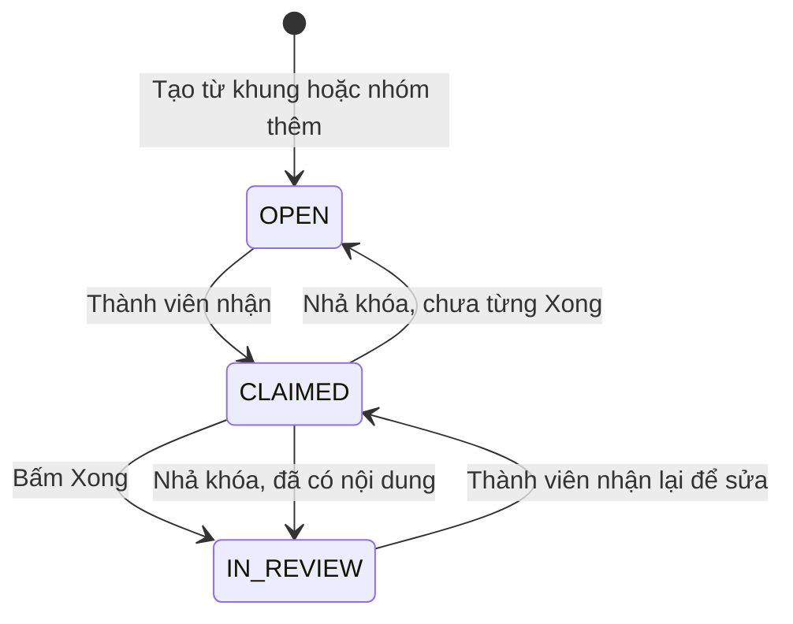

# U14 Group Document & Submission - Domain Entities

Thiết kế độc lập công nghệ. Truy vết: `US-GRP-003`…`005`; `UC-GRP-05`…`07`.

## 1. Tổng quan

| Entity | Loại | Lưu ở | Unit ghi |
|---|---|---|---|
| `GroupDocument` | Aggregate root (một nhóm một tài liệu) | `student_groups` | U14 (qua port U12) |
| `Section` | Entity | `sections` | U14 |
| `SectionRevision` | Entity bất biến | `section_revisions` | U14 |
| `SectionComment` | Entity | `section_comments` | U14 |
| `GroupSubmission` | Entity bất biến | `group_submissions` | U14 |

U14 **không** sở hữu: bộ nhóm và trưởng nhóm (U12), bài/khung (U08, U09), điểm (U15). Không có "phần" do giảng viên phân công hay bản tổng hợp do giảng viên chốt.

## 2. `GroupDocument`

| Thuộc tính | Kiểu | Ràng buộc |
|---|---|---|
| `groupId` | UUID | Định danh tài liệu = định danh nhóm (URL `/api/v1/group-docs/{groupId}`) |
| `publicationId` | UUID | Lượt phát hành của bài nhóm |
| `sharedBlocks` | `Document` (U09) | Block ngoài mục: phần khóa của giảng viên như trang bìa, lời dẫn |
| `updatedAt`, `version` | | Khóa lạc quan |

Tạo khi publication bài nhóm mở (một tài liệu cho mỗi nhóm), dựng từ khung của giảng viên.

## 3. `Section`

| Thuộc tính | Kiểu | Ràng buộc |
|---|---|---|
| `id` | UUID | |
| `groupId` | UUID | Tài liệu nhóm chứa mục |
| `orderNo` | số | |
| `title` | chuỗi ≤ 200 | |
| `origin` | enum | `TEACHER` (từ heading `workSection` của khung), `GROUP` (nhóm thêm) |
| `status` | enum | `OPEN`, `CLAIMED`, `IN_REVIEW` |
| `claimedBy`, `claimedAt` | | Khi `CLAIMED` |
| `publishedBlocks` | `Document` (U09) | Nội dung đang hiển thị trong tài liệu chung |
| `draftBlocks` | `Document` (U09) | Bản đang làm của người nhận (chỉ người nhận thấy) |
| `lastAuthorId`, `version` | | |

### Trạng thái

**Text alternative**: Mục trống ở `OPEN`; một thành viên nhận thì thành `CLAIMED` và bị khóa cho người đó. Bấm "Xong" thì nội dung vào tài liệu chung, mục thành `IN_REVIEW` và hết khóa; bất kỳ thành viên nào cũng có thể nhận lại để sửa. Mục đang `CLAIMED` được nhả (người nhận tự nhả, trưởng nhóm/giảng viên nhả, hoặc người nhận rời nhóm) về `OPEN` nếu chưa từng xong, hoặc về `IN_REVIEW` nếu đã có nội dung.

## 4. `SectionRevision`

| Thuộc tính | Kiểu | Ràng buộc |
|---|---|---|
| `id` | UUID | |
| `sectionId` | UUID | |
| `authorId` | UUID | |
| `blocks` | `Document` (U09) | Bất biến |
| `createdAt` | thời gian | |

Tạo mỗi lần bấm "Xong"; dùng để biết ai viết gì.

## 5. `SectionComment`

| Thuộc tính | Kiểu | Ràng buộc |
|---|---|---|
| `id` | UUID | |
| `sectionId` | UUID | |
| `authorId` | UUID | |
| `text` | chuỗi ≤ 2 000 | |
| `createdAt`, `resolvedAt` | thời gian | `resolvedAt` rỗng = chưa xử lý |

## 6. `GroupSubmission`

| Thuộc tính | Kiểu | Ràng buộc |
|---|---|---|
| `id` | UUID | |
| `groupId`, `publicationId` | UUID | |
| `submittedBy` | UUID | Trưởng nhóm, hoặc `SYSTEM` khi tự nộp |
| `submitMode` | enum | `MANUAL`, `AUTO_DEADLINE`, `AUTO_RETIRED` |
| `document` | `Document` (U09) | Toàn bộ tài liệu, bất biến |
| `sectionAuthors` | JSON | Mục → danh sách tác giả theo `SectionRevision` |
| `warnings`, `late` | | Mục còn trống/đang nhận khi nộp; nộp trễ |
| `submittedAt`, `receiptHash` | | |

Nhiều lần nộp; lần cuối được chấm.

## 7. Contract

### Port U14 cung cấp

| Port | Dùng bởi | Mô tả |
|---|---|---|
| `GroupSubmissionQueryPort` | U13, U15, U16 | Bản nộp, tác giả từng mục, các mục của một thành viên |
| Event `u14.group.submitted` | U15, U16 | Sau commit |

### Port U14 dùng

| Port | Unit | Mô tả |
|---|---|---|
| `GroupMembershipPort`, `GroupDocumentStorePort` | U12 | Nhóm, thành viên, trưởng nhóm; lưu tài liệu nhóm |
| `AssignmentQueryPort`, `isSubmissionOpen` | U08 | Khung, hạn |
| `DocumentModelPort`, `DocxExportPort`, `DocumentEditor` | U09 | Kiểm/làm sạch block, xuất DOCX, trình soạn |
| `ArtifactPort` | U03 | Ảnh trong mục |
| `JobPort`, `AuditPort`, `EventPublisherPort` | U02 | Tự nộp, audit, event |
