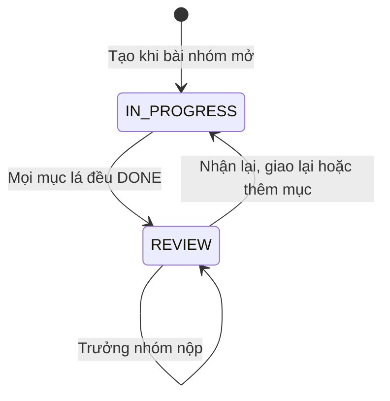
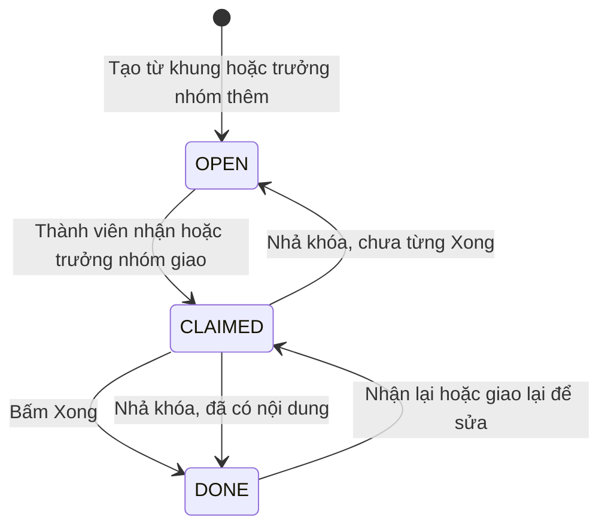

# U14 Group Document & Submission - Domain Entities

Thiết kế độc lập công nghệ. Truy vết: `US-GRP-003`…`005`; UC 16, UC 27.

## 1. Tổng quan

| Entity | Loại | Lưu ở | Unit ghi |
|---|---|---|---|
| `GroupDocument` | Aggregate root (một nhóm, một publication bài nhóm) | `group_documents` | U14 |
| `Section` | Entity | `sections` | U14 |
| `SectionRevision` | Entity bất biến | `section_revisions` | U14 |
| `SectionComment` | Entity | `section_comments` | U14 |
| `GroupSubmission` | Entity bất biến | `group_submissions` | U14 |

U14 **không** sở hữu: nhóm của lớp và trưởng nhóm (U12), bài/khung (U08, U09), điểm (U15). Giảng viên chỉ chuẩn bị mục chính; trưởng nhóm thêm mục chi tiết và giao mục. Không có bản tổng hợp do giảng viên chốt.

## 2. `GroupDocument`

| Thuộc tính | Kiểu | Ràng buộc |
|---|---|---|
| `id` | UUID | URL `/api/v1/group-docs/{id}` |
| `groupId` | UUID | Nhóm của lớp (U12) |
| `publicationId` | UUID | Lượt phát hành của bài nhóm; unique `(groupId, publicationId)` |
| `status` | enum | `IN_PROGRESS`, `REVIEW` |
| `sharedBlocks` | `Document` (U09) | Block ngoài mục: phần khóa của giảng viên như trang bìa, lời dẫn |
| `updatedAt`, `version` | | Khóa lạc quan |

Tạo khi publication bài nhóm mở (một tài liệu cho mỗi nhóm của lớp), dựng từ khung của giảng viên.

### Trạng thái tài liệu

```mermaid
stateDiagram-v2
    [*] --> IN_PROGRESS: Tạo khi bài nhóm mở
    IN_PROGRESS --> REVIEW: Mọi mục lá đều DONE
    REVIEW --> IN_PROGRESS: Nhận lại, giao lại hoặc thêm mục
    REVIEW --> REVIEW: Trưởng nhóm nộp
```

**Text alternative**: Tài liệu nhóm bắt đầu ở `IN_PROGRESS`. Khi mọi mục lá đều `DONE`, tài liệu tự chuyển `REVIEW` để cả nhóm xem lại và bình luận; trưởng nhóm chỉ nộp được ở trạng thái này và có thể nộp lại trước hạn. Nếu có người nhận lại mục, trưởng nhóm giao lại mục hoặc thêm mục mới, tài liệu quay về `IN_PROGRESS`. Tới hạn hệ thống tự nộp bản hiện tại ở bất kỳ trạng thái nào.

## 3. `Section`

| Thuộc tính | Kiểu | Ràng buộc |
|---|---|---|
| `id` | UUID | |
| `groupDocumentId` | UUID | Tài liệu nhóm chứa mục |
| `parentSectionId` | UUID/rỗng | Mục chính chứa mục chi tiết; rỗng với mục chính |
| `origin` | enum | `TEACHER` (mục chính từ heading `workSection` của khung), `GROUP` (mục chi tiết trưởng nhóm thêm, luôn có `parentSectionId`) |
| `orderNo` | số | Thứ tự trong cùng cấp |
| `title` | chuỗi ≤ 200 | |
| `status` | enum | Mục lá: `OPEN`, `CLAIMED`, `DONE`. Mục cha: suy ra (`DONE` khi mọi mục chi tiết `DONE`) |
| `claimedBy`, `claimedAt` | | Khi `CLAIMED` |
| `assignedBy` | UUID/rỗng | Trưởng nhóm giao mục; rỗng khi thành viên tự nhận |
| `publishedBlocks` | `Document` (U09) | Nội dung đang hiển thị trong tài liệu chung |
| `draftBlocks` | `Document` (U09) | Bản đang làm của người giữ (chỉ người giữ thấy) |
| `lastAuthorId`, `version` | | |

### Trạng thái mục lá

```mermaid
stateDiagram-v2
    [*] --> OPEN: Tạo từ khung hoặc trưởng nhóm thêm
    OPEN --> CLAIMED: Thành viên nhận hoặc trưởng nhóm giao
    CLAIMED --> DONE: Bấm Xong
    CLAIMED --> OPEN: Nhả khóa, chưa từng Xong
    CLAIMED --> DONE: Nhả khóa, đã có nội dung
    DONE --> CLAIMED: Nhận lại hoặc giao lại để sửa
```

**Text alternative**: Mục lá trống ở `OPEN`; thành viên tự nhận hoặc trưởng nhóm giao thì thành `CLAIMED` và bị khóa cho người đó. Bấm "Xong" thì nội dung vào tài liệu chung, mục thành `DONE` và hết khóa; thành viên có thể nhận lại hoặc trưởng nhóm giao lại để sửa. Mục đang `CLAIMED` được nhả (người giữ tự nhả, trưởng nhóm/giảng viên nhả, hoặc người giữ rời nhóm) về `OPEN` nếu chưa từng xong, hoặc về `DONE` nếu đã có nội dung.

## 4. `SectionRevision`

| Thuộc tính | Kiểu | Ràng buộc |
|---|---|---|
| `id` | UUID | |
| `sectionId` | UUID | |
| `authorId` | UUID | |
| `blocks` | `Document` (U09) | Bất biến |
| `createdAt` | thời gian | |

Tạo mỗi lần bấm "Xong"; dùng để biết ai viết gì.

## 5. `SectionComment`

| Thuộc tính | Kiểu | Ràng buộc |
|---|---|---|
| `id` | UUID | |
| `sectionId` | UUID | |
| `authorId` | UUID | |
| `text` | chuỗi ≤ 2 000 | |
| `createdAt`, `resolvedAt` | thời gian | `resolvedAt` rỗng = chưa xử lý |

## 6. `GroupSubmission`

| Thuộc tính | Kiểu | Ràng buộc |
|---|---|---|
| `id` | UUID | |
| `groupDocumentId` | UUID | Suy ra nhóm và publication |
| `submittedBy` | UUID | Trưởng nhóm, hoặc `SYSTEM` khi tự nộp |
| `submitMode` | enum | `MANUAL`, `AUTO_DEADLINE`, `AUTO_RETIRED` |
| `document` | `Document` (U09) | Toàn bộ tài liệu, bất biến |
| `sectionAuthors` | JSON | Mục → danh sách tác giả theo `SectionRevision` |
| `warnings`, `late` | | Mục chưa xong hoặc tài liệu chưa review khi tự nộp; bình luận chưa giải quyết; nộp trễ |
| `submittedAt`, `receiptHash` | | |

Nhiều lần nộp; lần cuối được chấm.

## 7. Contract

### Port U14 cung cấp

| Port | Dùng bởi | Mô tả |
|---|---|---|
| `GroupSubmissionQueryPort` | U13, U15, U16 | Bản nộp, tác giả từng mục, các mục của một thành viên |
| Event `group.submitted`, `group.document-review` | U16 | Sau commit, chỉ cho thông báo |
| `PublicationLifecyclePort.onOpened/onRetired` | U08 khai báo (`C`) | Tạo job tạo tài liệu nhóm cho mọi nhóm của lớp khi bài mở; tạo job tự nộp khi ngưng giao |
| `GroupChangePort` | U12 khai báo (`C`) | `onGroupCreated`: tạo job tạo tài liệu cho nhóm mới ở mọi publication bài nhóm đang mở của lớp; `onMemberRemoved`: nhả khóa mục của người rời nhóm (BR-U14-13); `hasGroupWork`: nhóm đã có tài liệu/bản nộp |

### Port U14 dùng

| Port | Unit | Mô tả |
|---|---|---|
| `GroupMembershipPort` | U12 | Nhóm của lớp, thành viên, trưởng nhóm |
| `AssignmentQueryPort`, `isSubmissionOpen` | U08 | Khung, hạn |
| `DocumentModelPort`, `DocxExportPort`, `DocumentEditor` | U09 | Kiểm/làm sạch block, xuất DOCX, trình soạn |
| `ArtifactPort` | U03 | Ảnh trong mục |
| `GroupSubmittedPort` | U14 khai báo, U15 cài (`C`) | Gọi trong transaction nộp: U15 tạo job chấm. Chưa có U15 → adapter rỗng |
| `JobPort`, `AuditPort`, `EventPublisherPort` | U02 | Tự nộp, audit, event |
