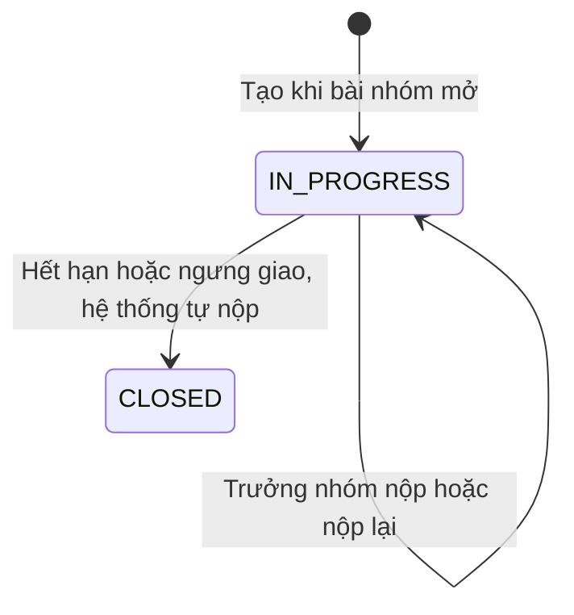
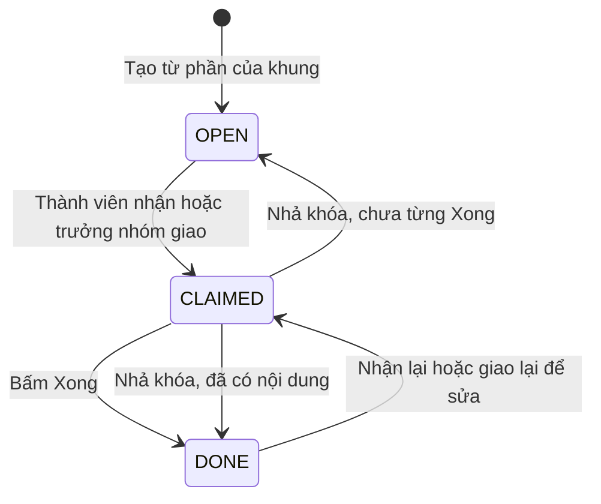

# U14 Group Document & Submission - Domain Entities

**Bản tài liệu 2026-10-09**: UC 27 và phần bài nhóm của UC 16, 23, 28, 37 theo [73 UC](../../../../docs/use-cases-73.md) và screen flow `docs/G21_Diagrams.drawio` (Page-2); primary stories: US-GRP-004, US-GRP-005. Quyền và supporting flows theo [current SRS contract](../../current-srs-contract.md); đây là thiết kế/kế hoạch, không xác nhận implementation mới.

Thiết kế độc lập công nghệ. Truy vết: `US-GRP-004`, `US-GRP-005`; dựng tài liệu nhóm cho `US-GRP-003` (UC 45, U09 chủ trì); dữ liệu cho `US-GRP-006` (U15). UC 27 dùng chung quy tắc lưu nháp, biên nhận, nộp trễ, tự nộp với bài cá nhân của U11 (UC 24–26); U14 làm phần riêng của bài nhóm. Toàn bộ tài liệu nhóm nằm trong một dòng `group_documents` (thực thể `GROUP_DOCUMENT`); không có bảng `sections`, `section_revisions`, `section_comments`, `group_submissions` (quyết định 2026-10-03).

## 1. Tổng quan

| Entity | Loại | Lưu ở | Unit ghi |
|---|---|---|---|
| `GroupDocument` | Aggregate root (một nhóm, một bài nhóm) | `group_documents` | U14 |
| `Section` | Phần tử trong cột JSON | `group_documents.sections` | U14 |
| `SectionRevision` | Phần tử bất biến trong cột JSON | `group_documents.revisions` | U14 |
| `GroupSubmission` | Bản nộp mới nhất, bất biến | `group_documents.submitted_snapshot`, `submit_mode`, `submitted_at` | U14 |

U14 **không** sở hữu: nhóm của lớp và trưởng nhóm (U12), bài, lịch và khung (U08, U09), rubric từng phần (U06, U09), điểm (U15). Khung tự chia thành phần theo heading nhỏ nhất của mỗi nhánh (U09); mỗi phần là một mục của tài liệu nhóm; trưởng nhóm giao mục, không thêm hay xóa mục. Bài nhóm chỉ có ở lớp, không có bài nhóm của môn.

## 2. `GroupDocument`

| Thuộc tính | Kiểu | Ràng buộc |
|---|---|---|
| `id` | UUID | URL `/api/v1/group-docs/{id}` |
| `groupId` | UUID | Nhóm của lớp (U12) |
| `assignmentId` | UUID | Bài nhóm của lớp (`GROUP_ASSIGNMENT`); unique `(groupId, assignmentId)` |
| `status` | enum | `IN_PROGRESS` (đang làm; trưởng nhóm nộp và nộp lại được), `CLOSED` (đã tự nộp khi hết hạn hoặc ngưng giao; chỉ đọc) |
| `sharedBlocks` | `Document` (U09) | Heading cha và block ngoài phần: trang bìa, lời dẫn của người soạn; khóa; lưu đầu cột `sections` |
| `updatedAt`, `version` | | Khóa lạc quan; mọi thao tác trên mục và nộp đều khóa dòng tài liệu và tăng `version` |

Tạo khi bài nhóm mở (một tài liệu cho mỗi nhóm của lớp), dựng từ khung. Nhóm nhỏ (chia ngẫu nhiên tối đa 20 người, BR-U12-05) nên danh sách mục và lịch sử nằm gọn trong một dòng.

### Trạng thái tài liệu

```mermaid
stateDiagram-v2
    [*] --> IN_PROGRESS: Tạo khi bài nhóm mở
    IN_PROGRESS --> IN_PROGRESS: Trưởng nhóm nộp hoặc nộp lại
    IN_PROGRESS --> CLOSED: Hết hạn hoặc ngưng giao, hệ thống tự nộp
```

**Text alternative**: Tài liệu nhóm bắt đầu ở `IN_PROGRESS`. Trưởng nhóm nộp bất kỳ lúc nào trước hạn và nộp lại được; mọi mục xong không làm đổi trạng thái. Hết hạn hoặc bài bị ngưng giao thì hệ thống tự nộp bản hiện tại, chốt các mục đang làm bằng bản nháp đã lưu gần nhất, và tài liệu chuyển `CLOSED`, chỉ đọc.

## 3. `Section`

| Thuộc tính | Kiểu | Ràng buộc |
|---|---|---|
| `id` | UUID | Duy nhất trong tài liệu |
| `partId` | UUID | Phần của khung (`config.parts[].partId`, U09); khóa mục; U15 dùng để chấm theo rubric của phần |
| `headingBlockId`, `ancestorHeadingIds[]` | UUID | Sao từ `SkeletonPart` (U09) khi dựng; popup làm phần dùng để hiện các heading trên nhánh |
| `orderNo` | số | Thứ tự theo khung |
| `title` | chuỗi ≤ 200 | Đường dẫn tiêu đề của phần, ví dụ "H1 › H2.1 › H3.1" |
| `status` | enum | `OPEN`, `CLAIMED`, `DONE` |
| `claimedBy`, `claimedAt` | | Khi `CLAIMED` |
| `assignedBy` | UUID/rỗng | Trưởng nhóm giao mục; rỗng khi thành viên tự nhận |
| `publishedBlocks` | `Document` (U09) | Nội dung đang hiển thị trong tài liệu chung |
| `draftBlocks` | `Document` (U09) | Bản đang làm của người giữ (chỉ người giữ thấy); xóa khi nhả |
| `lastAuthorId`, `version` | | |

### Trạng thái mục

```mermaid
stateDiagram-v2
    [*] --> OPEN: Tạo từ phần của khung
    OPEN --> CLAIMED: Thành viên nhận hoặc trưởng nhóm giao
    CLAIMED --> DONE: Bấm Xong
    CLAIMED --> OPEN: Nhả khóa, chưa từng Xong
    CLAIMED --> DONE: Nhả khóa, đã có nội dung
    DONE --> CLAIMED: Nhận lại hoặc giao lại để sửa
```

**Text alternative**: Mục trống ở `OPEN`; thành viên tự nhận hoặc trưởng nhóm giao thì thành `CLAIMED` và bị khóa cho người đó. Bấm "Xong" thì nội dung vào tài liệu chung, mục thành `DONE` và hết khóa; thành viên có thể nhận lại hoặc trưởng nhóm giao lại để sửa. Mục đang `CLAIMED` được nhả (người giữ tự nhả, trưởng nhóm hoặc giảng viên chính của lớp nhả, hoặc người giữ rời nhóm) về `OPEN` nếu chưa từng xong, hoặc về `DONE` nếu đã có nội dung. Bản nháp chưa Xong bị bỏ khi nhả (có cảnh báo trước, BR-U14-13).

## 4. `SectionRevision`

| Thuộc tính | Kiểu | Ràng buộc |
|---|---|---|
| `sectionId` | UUID | |
| `authorId` | UUID | |
| `blocks` | `Document` (U09) | Bất biến |
| `createdAt` | thời gian | |

Thêm vào mảng `revisions` mỗi lần bấm "Xong" hoặc khi tự nộp chốt mục đang giữ; dùng để biết ai viết gì.

## 5. `GroupSubmission`

| Thuộc tính | Kiểu | Ràng buộc |
|---|---|---|
| `submittedBy` | UUID | Trưởng nhóm, hoặc `SYSTEM` khi tự nộp; trong `submitted_snapshot` |
| `submitMode` | enum | Cột `submit_mode`: `MANUAL`, `AUTO_DEADLINE`, `AUTO_RETIRED` |
| `document` | `Document` (U09) | Toàn bộ tài liệu, bất biến |
| `sectionAuthors` | JSON | `partId` → danh sách tác giả theo `SectionRevision` |
| `warnings`, `late` | | Mục chưa xong khi trưởng nhóm nộp; mục được chốt từ bản nháp khi tự nộp; nộp trễ |
| `submittedAt`, `receiptHash` | | |

Nộp lại ghi đè `submitted_snapshot` bằng bản mới; lần cuối được chấm; mỗi lần nộp (người nộp, `receiptHash`) ghi audit.

## 6. Contract

### Port U14 cung cấp

| Port | Dùng bởi | Mô tả |
|---|---|---|
| `GroupSubmissionQueryPort` | U11, U13, U15, U16 | U11: trạng thái tài liệu và bản nộp của nhóm mình theo bài (Student Assignments); U13: nội dung bản nộp cuối cho AI đề xuất chấm; U15: bản nộp cuối, tác giả từng mục theo `partId`; U16: tiến độ, nhóm chưa nộp |
| `SseHub` (fanout `platform.realtime`) | U16 | Kênh SSE theo khóa: U14 dùng `groupDocumentId`, U16 đăng ký kênh `accountId` cho chuông thông báo |
| Event `group.submitted` | U16 | Sau commit, chỉ cho thông báo |
| `AssignmentLifecyclePort.onOpened/onRetired` | U08 khai báo (`C`) | `onOpened`: gửi việc `GROUP_DOC_CREATE` tạo tài liệu cho mọi nhóm của lớp; `onRetired`: sau commit đẩy `ASSIGNMENT_RETIRED` tới kênh các tài liệu của bài, `GroupAutoSubmitScanner` tự nộp ở lượt quét kế tiếp |
| `GroupChangePort` | U12 khai báo (`C`) | `onGroupCreated`: tạo tài liệu cho nhóm mới ở mọi bài nhóm đang mở của lớp; `onMemberRemoved`: nhả khóa mục và đóng kênh của người rời nhóm (BR-U14-13); `hasGroupWork`: nhóm đã có tài liệu/bản nộp |

### Port U14 dùng

| Port | Unit | Mô tả |
|---|---|---|
| `GroupMembershipPort` | U12 | Nhóm của lớp, thành viên, trưởng nhóm hiện tại |
| `ClassAccessPort` | U04 | R5 (ghi danh `ACTIVE`, lớp `OPEN`); giảng viên chính của lớp (R3/R4) |
| `AssignmentQueryPort`, `isSubmissionOpen` | U08 | Bài nhóm của lớp, khung, hạn, trạng thái |
| `DocumentModelPort`, `DocxExportPort`, `DocumentEditor` | U09 | Kiểm/làm sạch block, xuất DOCX, trình soạn; `SkeletonPart` (`partId`, `ancestorHeadingIds`) |
| `ArtifactPort` | U03 | Ảnh trong mục |
| `GroupSubmittedPort` | U14 khai báo, U15 cài (`C`) | Gọi trong transaction nộp: U15 tạo/đặt lại đánh giá chờ chấm. Chưa có U15 → adapter rỗng |
| `AuthorizationPort` | U01 | Tài khoản `ACTIVE`, vai trò |
| `AuditPort` | U02 | Audit |
| `JobPort`, `ScheduledScanner`, `EventPublisherPort` | U03 | Việc `GROUP_DOC_CREATE`; `GroupAutoSubmitScanner` tự nộp khi tới hạn hoặc bài ngưng giao; event `group.submitted` |

## 7. API

| API | Dùng để | Màn, UC | Quyền |
|---|---|---|---|
| `GET /api/v1/assignments/{assignmentId}/group-docs/mine` | Tài liệu nhóm của mình cho bài nhóm: `groupDocumentId`, nhóm, trưởng nhóm, thành viên, số mục theo trạng thái, trạng thái nộp | Assignment Detail, UC 23, 27 | R5, thành viên nhóm |
| `GET /api/v1/groups/{groupId}/group-docs` | Tài liệu các bài nhóm của nhóm: bài, hạn, tiến độ, đã nộp | My Group (Student Class Detail), UC 16 | R5, thành viên nhóm |
| `GET /api/v1/group-docs/{id}` | Phần chung, mục, trạng thái, người giữ, trạng thái tài liệu; bản nháp chỉ trả cho người giữ | Group Essay Workspace, UC 27; dòng mở rộng của `GroupDocsOverviewPanel`, UC 37 | R5 thành viên nhóm; R3/R4 chỉ đọc (không có bản nháp) |
| `GET /api/v1/group-docs/{id}/events` | Kênh SSE sự kiện tài liệu | Group Essay Workspace, UC 27 | R5, thành viên nhóm |
| `POST /api/v1/group-docs/{id}/sections/{sid}/claim` | Nhận mục | Group Essay Workspace, UC 27 | R5, thành viên nhóm |
| `POST /api/v1/group-docs/{id}/sections/{sid}/assign` | Giao mục cho thành viên | Group Essay Workspace, UC 27 | Trưởng nhóm hiện tại |
| `PUT /api/v1/group-docs/{id}/sections/{sid}/draft` | Tự lưu bản nháp mục (có `version`) | Popup làm phần, UC 27 | Người giữ mục |
| `POST /api/v1/group-docs/{id}/sections/{sid}/done` | Xong mục | Popup làm phần, UC 27 | Người giữ mục |
| `POST /api/v1/group-docs/{id}/sections/{sid}/release` | Nhả khóa, bỏ bản nháp chưa Xong | Group Essay Workspace, UC 27; `GroupDocsOverviewPanel`, UC 37 | Người giữ, trưởng nhóm hiện tại, R3/R4 |
| `POST /api/v1/group-docs/{id}/submissions` | Nộp hoặc nộp lại | Group Essay Workspace, UC 27 | Trưởng nhóm hiện tại |
| `GET /api/v1/group-docs/{id}/submission` | Bản nộp cuối, biên nhận, tác giả từng mục | Submission History, UC 28; Submission Detail (U15), UC 37 | R5 thành viên nhóm; R3/R4 |
| `GET /api/v1/group-docs/{id}/export.docx?submission=` | Tải DOCX bản hiện tại hoặc bản nộp | Group Essay Workspace, Submission History, Submission Detail | R5 thành viên nhóm (cả hai); R3/R4 (chỉ bản nộp) |
| `GET /api/v1/assignments/{assignmentId}/group-docs` | Tiến độ các nhóm của bài nhóm | Tab Evals của Teacher Class Detail (danh sách bài nộp U15), UC 37 | R3/R4 |

R5: sinh viên ghi danh `ACTIVE` của lớp `OPEN`. R3/R4: giảng viên chính của lớp. `ADMIN` không có quyền nào ở đây; ngoài quyền trả `404`.
