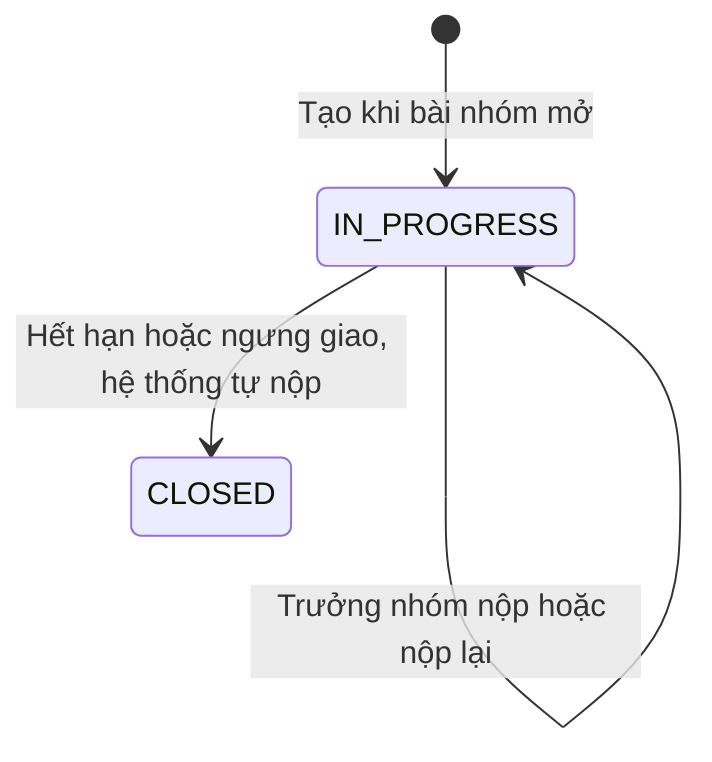
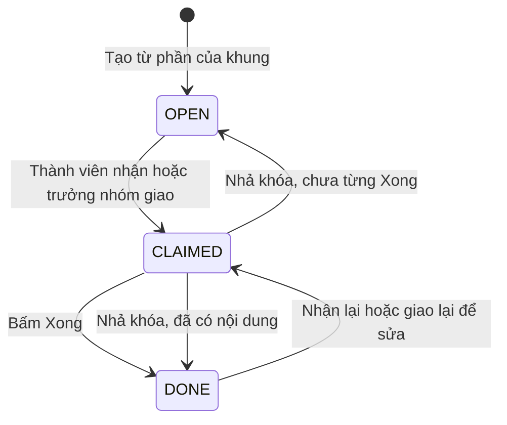

# U14 Group Document & Submission - Domain Entities

**Bản tài liệu 2026-10-08**: UC 23; primary stories: US-GRP-004, US-GRP-005. Quyền và supporting flows theo [current SRS contract](../../current-srs-contract.md); đây là thiết kế/kế hoạch, không xác nhận implementation mới.

Thiết kế độc lập công nghệ. Truy vết: `US-GRP-003`…`005`; UC 23 (kế thừa UC 19, 20, 21, 22 Submit Assignment của U11: tự lưu, biên nhận, trễ, tự nộp khi hết hạn/ngưng giao; U14 làm phần riêng của bài nhóm); dựng tài liệu nhóm và nhả khóa mục cho UC 43 (U09 chủ trì). Bảng theo [mô hình dữ liệu của unit](domain-entities.md): toàn bộ tài liệu nhóm nằm trong một dòng `group_documents` (thực thể `GROUP_DOCUMENT`); không có bảng `sections`, `section_revisions`, `section_comments`, `group_submissions` (quyết định 2026-10-03).

## 1. Tổng quan

| Entity | Loại | Lưu ở | Unit ghi |
|---|---|---|---|
| `GroupDocument` | Aggregate root (một nhóm, một bài nhóm) | `group_documents` | U14 |
| `Section` | Phần tử trong cột JSON | `group_documents.sections` | U14 |
| `SectionRevision` | Phần tử bất biến trong cột JSON | `group_documents.revisions` | U14 |
| `GroupSubmission` | Bản nộp mới nhất, bất biến | `group_documents.submitted_snapshot`, `submit_mode`, `submitted_at` | U14 |

U14 **không** sở hữu: nhóm của lớp và trưởng nhóm (U12), bài/khung (U08, U09), điểm (U15). Khung tự chia thành phần theo heading (U09); mỗi phần là một mục của tài liệu nhóm; trưởng nhóm giao mục, không thêm hay xóa mục. Không có bản tổng hợp do giảng viên chốt.

## 2. `GroupDocument`

| Thuộc tính | Kiểu | Ràng buộc |
|---|---|---|
| `id` | UUID | URL `/api/v1/group-docs/{id}` |
| `groupId` | UUID | Nhóm của lớp (U12) |
| `assignmentId` | UUID | Bài nhóm; unique `(groupId, assignmentId)` |
| `status` | enum | `IN_PROGRESS` (đang làm; trưởng nhóm nộp và nộp lại được), `CLOSED` (đã tự nộp khi hết hạn hoặc ngưng giao; chỉ đọc) |
| `sharedBlocks` | `Document` (U09) | Block ngoài mục: phần khóa của giảng viên như trang bìa, lời dẫn; lưu đầu cột `sections` |
| `updatedAt`, `version` | | Khóa lạc quan; mọi thao tác trên mục và nộp đều khóa dòng tài liệu và tăng `version` |

Tạo khi bài nhóm mở (một tài liệu cho mỗi nhóm của lớp), dựng từ khung của giảng viên. Nhóm nhỏ (chia ngẫu nhiên tối đa 20 người, BR-U12-05) nên danh sách mục và lịch sử nằm gọn trong một dòng.

### Trạng thái tài liệu

```mermaid
stateDiagram-v2
    [*] --> IN_PROGRESS: Tạo khi bài nhóm mở
    IN_PROGRESS --> IN_PROGRESS: Trưởng nhóm nộp hoặc nộp lại
    IN_PROGRESS --> CLOSED: Hết hạn hoặc ngưng giao, hệ thống tự nộp
```

**Text alternative**: Tài liệu nhóm bắt đầu ở `IN_PROGRESS`. Trưởng nhóm nộp bất kỳ lúc nào trước hạn và nộp lại được; mọi mục xong không làm đổi trạng thái. Hết hạn hoặc bài bị ngưng giao thì hệ thống tự nộp bản hiện tại, chốt các mục đang làm bằng bản nháp đã lưu gần nhất, và tài liệu chuyển `CLOSED`, chỉ đọc.

## 3. `Section`

| Thuộc tính | Kiểu | Ràng buộc |
|---|---|---|
| `id` | UUID | Duy nhất trong tài liệu |
| `partId` | UUID | Phần của khung (`config.parts[].partId`, U09); U15 dùng để chấm theo rubric của phần |
| `orderNo` | số | Thứ tự theo khung |
| `title` | chuỗi ≤ 200 | |
| `status` | enum | `OPEN`, `CLAIMED`, `DONE` |
| `claimedBy`, `claimedAt` | | Khi `CLAIMED` |
| `assignedBy` | UUID/rỗng | Trưởng nhóm giao mục; rỗng khi thành viên tự nhận |
| `publishedBlocks` | `Document` (U09) | Nội dung đang hiển thị trong tài liệu chung |
| `draftBlocks` | `Document` (U09) | Bản đang làm của người giữ (chỉ người giữ thấy); xóa khi nhả |
| `lastAuthorId`, `version` | | |

### Trạng thái mục

```mermaid
stateDiagram-v2
    [*] --> OPEN: Tạo từ phần của khung
    OPEN --> CLAIMED: Thành viên nhận hoặc trưởng nhóm giao
    CLAIMED --> DONE: Bấm Xong
    CLAIMED --> OPEN: Nhả khóa, chưa từng Xong
    CLAIMED --> DONE: Nhả khóa, đã có nội dung
    DONE --> CLAIMED: Nhận lại hoặc giao lại để sửa
```

**Text alternative**: Mục trống ở `OPEN`; thành viên tự nhận hoặc trưởng nhóm giao thì thành `CLAIMED` và bị khóa cho người đó. Bấm "Xong" thì nội dung vào tài liệu chung, mục thành `DONE` và hết khóa; thành viên có thể nhận lại hoặc trưởng nhóm giao lại để sửa. Mục đang `CLAIMED` được nhả (người giữ tự nhả, trưởng nhóm/giảng viên nhả, hoặc người giữ rời nhóm) về `OPEN` nếu chưa từng xong, hoặc về `DONE` nếu đã có nội dung. Bản nháp chưa Xong bị bỏ khi nhả (có cảnh báo trước, BR-U14-13).

## 4. `SectionRevision`

| Thuộc tính | Kiểu | Ràng buộc |
|---|---|---|
| `sectionId` | UUID | |
| `authorId` | UUID | |
| `blocks` | `Document` (U09) | Bất biến |
| `createdAt` | thời gian | |

Thêm vào mảng `revisions` mỗi lần bấm "Xong"; dùng để biết ai viết gì.

## 5. `GroupSubmission`

| Thuộc tính | Kiểu | Ràng buộc |
|---|---|---|
| `submittedBy` | UUID | Trưởng nhóm, hoặc `SYSTEM` khi tự nộp; trong `submitted_snapshot` |
| `submitMode` | enum | Cột `submit_mode`: `MANUAL`, `AUTO_DEADLINE`, `AUTO_RETIRED` |
| `document` | `Document` (U09) | Toàn bộ tài liệu, bất biến |
| `sectionAuthors` | JSON | Mục → danh sách tác giả theo `SectionRevision` |
| `warnings`, `late` | | Mục chưa xong khi trưởng nhóm nộp; mục được chốt từ bản nháp khi tự nộp; nộp trễ |
| `submittedAt`, `receiptHash` | | |

Nộp lại ghi đè `submitted_snapshot` bằng bản mới; lần cuối được chấm; mỗi lần nộp (người nộp, `receiptHash`) ghi audit.

## 6. Contract

### Port U14 cung cấp

| Port | Dùng bởi | Mô tả |
|---|---|---|
| `GroupSubmissionQueryPort` | U13, U15, U16 | Bản nộp, tác giả từng mục |
| `SseHub` (fanout `platform.realtime`) | U16 | Kênh SSE theo khóa: U14 dùng `groupDocumentId`, U16 đăng ký kênh `accountId` cho chuông thông báo |
| Event `group.submitted` | U16 | Sau commit, chỉ cho thông báo |
| `AssignmentLifecyclePort.onOpened/onRetired` | U08 khai báo (`C`) | `onOpened`: gửi việc `GROUP_DOC_CREATE` tạo tài liệu cho mọi nhóm của lớp; `onRetired`: không làm gì thêm, `GroupAutoSubmitScanner` tự nộp bài đã ngưng giao |
| `GroupChangePort` | U12 khai báo (`C`) | `onGroupCreated`: tạo tài liệu cho nhóm mới ở mọi bài nhóm đang mở của lớp; `onMemberRemoved`: nhả khóa mục của người rời nhóm (BR-U14-13); `hasGroupWork`: nhóm đã có tài liệu/bản nộp |

### Port U14 dùng

| Port | Unit | Mô tả |
|---|---|---|
| `GroupMembershipPort` | U12 | Nhóm của lớp, thành viên, trưởng nhóm |
| `ClassAccessPort` | U04 | Giảng viên lớp được xem tài liệu nhóm, nhả khóa (P3) |
| `AssignmentQueryPort`, `isSubmissionOpen` | U08 | Khung, hạn |
| `DocumentModelPort`, `DocxExportPort`, `DocumentEditor` | U09 | Kiểm/làm sạch block, xuất DOCX, trình soạn |
| `ArtifactPort` | U03 | Ảnh trong mục |
| `GroupSubmittedPort` | U14 khai báo, U15 cài (`C`) | Gọi trong transaction nộp: U15 tạo dòng `evaluations` chờ chấm. Chưa có U15 → adapter rỗng |
| `AuthorizationPort` | U01 | Tài khoản `ACTIVE`, vai trò |
| `AuditPort` | U02 | Audit |
| `JobPort`, `ScheduledScanner`, `EventPublisherPort` | U03 | Việc `GROUP_DOC_CREATE`; `GroupAutoSubmitScanner` tự nộp khi tới hạn hoặc bài ngưng giao; event `group.submitted` |
