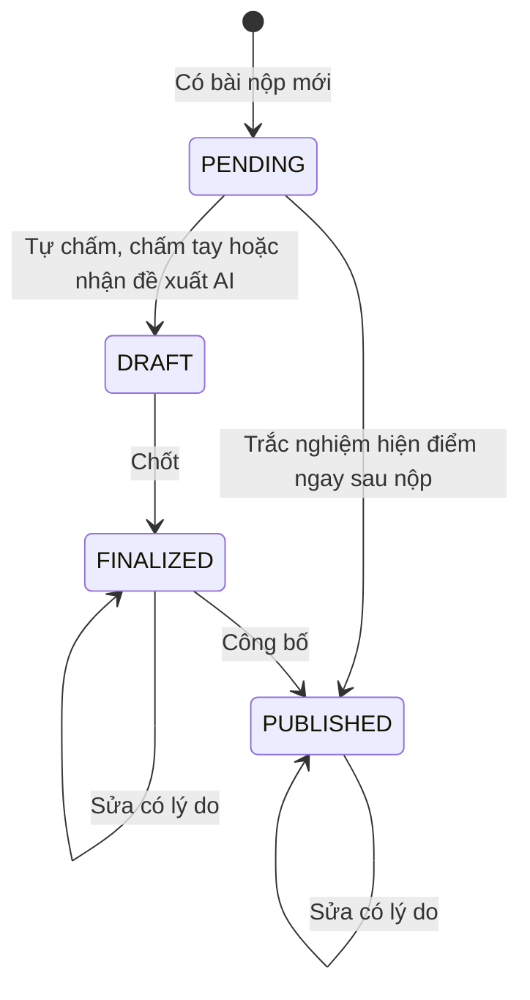

# U15 Grading - Domain Entities

Thiết kế độc lập công nghệ. Truy vết: `US-GRD-001`…`005`, `US-GRP-006`; `UC-GRD-01`…`07`, `UC-GRP-08`.

## 1. Tổng quan

| Entity | Loại | Lưu ở | Unit ghi |
|---|---|---|---|
| `Grade` | Aggregate root | `grades` | U15 |
| `GradeHistory` | Entity bất biến | `grade_history` | U15 |
| `GradeRelease` | Value object của `Publication` (U08) | `publications` | U15 (qua port U08) |
| `GradebookView` | Kết quả tính (sổ điểm) | Không lưu | U15 |

U15 **không** sở hữu: bài nộp (U11, U14), rubric (U06), đề xuất AI và chạy code (U13), chính sách thi thử (U10).

## 2. `Grade`

| Thuộc tính | Kiểu | Ràng buộc |
|---|---|---|
| `id` | UUID | |
| `targetKind` | enum | `ATTEMPT` (lượt U11), `GROUP_DOCUMENT` (bản nộp nhóm U14), `MEMBER_CONTRIBUTION` (phần đóng góp của một thành viên), `MEMBER_FINAL` (điểm cuối thành viên bài nhóm) |
| `targetId`, `learnerId`, `publicationId` | UUID | Theo loại |
| `method` | enum | `DETERMINISTIC` (trắc nghiệm, code), `MANUAL`, `AI_ASSISTED` |
| `maxScore` | numeric(6,2) | Tổng điểm của bài (thành phần/rubric) |
| `autoScore` | numeric(6,2) | Điểm tự chấm hoặc đề xuất AI (tham khảo) |
| `items` | JSON | Theo câu: điểm câu; theo rubric: mục checklist đạt/không |
| `finalScore` | numeric(6,2) | 0 ≤ `finalScore` ≤ `maxScore` |
| `feedback` | markdown ≤ 10 000 | |
| `aiProposalId` | UUID | Khi dùng AI |
| `status` | enum | `PENDING`, `DRAFT`, `FINALIZED`, `PUBLISHED` |
| `finalizedBy`, `finalizedAt`, `publishedAt`, `version` | | |

### Trạng thái

**Text alternative**: Bài nộp mới tạo điểm `PENDING`. Có điểm tự chấm, điểm chấm tay, hoặc giảng viên nhận đề xuất AI thì thành `DRAFT`; giảng viên chốt thì `FINALIZED`; công bố thì `PUBLISHED`. Bài trắc nghiệm bật "hiện điểm ngay sau nộp" đi thẳng tới `PUBLISHED`. Sửa điểm đã chốt hoặc đã công bố cần lý do, giữ nguyên trạng thái và ghi `GradeHistory`.

## 3. `GradeHistory`

| Thuộc tính | Kiểu | Ràng buộc |
|---|---|---|
| `id` | UUID | |
| `gradeId` | UUID | |
| `changedBy` | UUID hoặc `SYSTEM` | |
| `previous`, `next` | JSON | Điểm, trạng thái, phương thức trước/sau |
| `reason` | chuỗi | Bắt buộc khi sửa điểm đã chốt |
| `changedAt` | thời gian | |

Bất biến.

## 4. `GradeRelease`

| Thuộc tính | Ý nghĩa |
|---|---|
| `releasedBy` | Giảng viên bấm "Công bố" cho một lượt phát hành |
| `releasedAt` | Thời điểm công bố; rỗng = chưa công bố |

## 5. `GradebookView`

Sổ điểm lớp: hàng = người học, cột = lượt phát hành; ô = điểm lượt được chấm "x / tổng" và trạng thái (chưa nộp, trễ, chờ chấm, đã chốt, đã công bố). Không tính điểm tổng. Tính khi đọc.

## 6. Contract

### Port U15 cung cấp

| Port | Dùng bởi | Mô tả |
|---|---|---|
| `GradeQueryPort` | U11 (`C`), U16 | Điểm đã công bố của một lượt/người học |
| `GradebookQueryPort` | U16 | Đọc theo lớp và người học: điểm cuối giảng viên chốt, trạng thái công bố, lượt tính điểm; không trả điểm AI đề xuất |
| Event `u15.grade.published` | U16 | Báo người học |

### Port U15 dùng

| Port | Unit | Mô tả |
|---|---|---|
| `SubmissionQueryPort` | U11 | Lượt, nội dung, lượt được chấm |
| `GroupSubmissionQueryPort` | U14 | Bản nộp nhóm, mục theo tác giả |
| `BankQueryPort`, `RubricPort` | U06 | Đáp án (chấm trắc nghiệm), rubric, `score` |
| `AiGradingPort`, `CodeRunPort`, event `u13.code.graded` | U13 | Đề xuất chấm, chạy code, điểm code |
| `SimulationPolicyPort` | U10 | Kết quả thi thử |
| `AssignmentQueryPort`, `AssignmentExtensionPort` | U08 | Bài, publication; ghi trạng thái công bố |
| `TypeConfigPort`, `DocumentModelPort`, `DocxExportPort` | U09 | Cấu hình hiện điểm, xem/xuất tài liệu |
