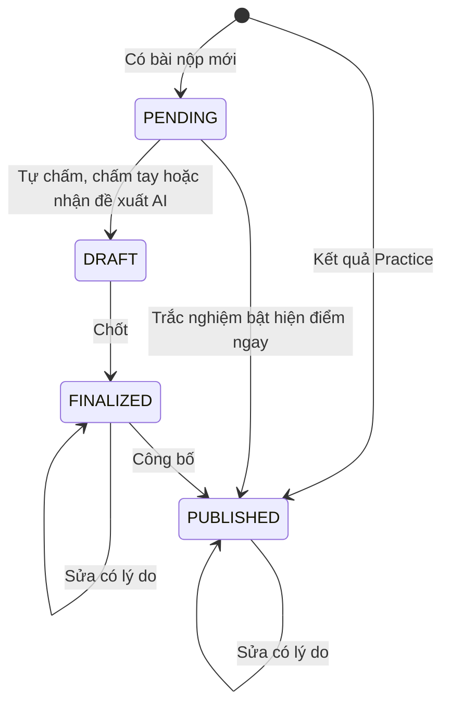

# U15 Grading - Domain Entities

**Bản tài liệu 2026-10-08**: UC 34, 35, 36, 37; primary stories: US-GRP-006, US-GRD-001, US-GRD-002, US-GRD-003, US-GRD-004, US-GRD-005. Quyền và supporting flows theo [current SRS contract](../../current-srs-contract.md); đây là thiết kế/kế hoạch, không xác nhận implementation mới.

Thiết kế độc lập công nghệ. Truy vết: `US-GRD-001`…`005`, `US-GRP-006`; UC 34, 35, 36, 37; lịch sử điểm trên Gradebook của UC 37 (U16 chủ trì). Bảng theo [mô hình dữ liệu của unit](domain-entities.md).

## 1. Tổng quan

| Entity | Thực thể ERD | Lưu ở | Unit ghi |
|---|---|---|---|
| `Evaluation` | `EVALUATION` (độc lập, cho `ATTEMPT` hoặc `GROUP_DOCUMENT`) | `evaluations` | U15 |
| `EvaluationHistory` | Phần tử chỉ thêm | `evaluations.history` | U15 |
| Công bố điểm | Cột của `ASSIGNMENT` | `assignments.grades_released_at` | U15 (qua `AssignmentExtensionPort` của U08) |
| `GradebookView` | Kết quả tính (sổ điểm) | Không lưu | U15 |

Không có bảng `grades`, `grade_history` (database chỉ gồm bảng của ERD, quyết định 2026-10-03). U15 **không** sở hữu: bài nộp (U11, U14), rubric (U06), đề xuất AI và chạy code (U13).

## 2. `Evaluation`

| Cột | Kiểu | Ràng buộc |
|---|---|---|
| `id` | UUID | |
| `kind` | enum | `ATTEMPT` (lượt bài `GRADED` của U11), `GROUP_DOCUMENT` (bản nộp nhóm U14), `MEMBER` (một thành viên của bài nhóm), `PRACTICE` (kết quả luyện tập của Student, chỉ Student xem) |
| `attempt_id` | UUID/rỗng | Có với `ATTEMPT`, `PRACTICE`; unique `(kind, attempt_id)` |
| `group_document_id` | UUID/rỗng | Có với `GROUP_DOCUMENT`, `MEMBER` |
| `account_id` | UUID/rỗng | Người học nhận điểm: chủ lượt (`ATTEMPT`, `PRACTICE`) hoặc thành viên (`MEMBER`); rỗng với `GROUP_DOCUMENT`; unique `(kind, group_document_id, account_id)` |
| `method` | enum | `DETERMINISTIC` (tự chấm), `MANUAL` (giảng viên lưu, kể cả khi dùng đề xuất AI) |
| `max_score` | numeric(6,2) | Tổng điểm của bài (câu/rubric) |
| `score` | numeric(6,2)/rỗng | Điểm cuối giảng viên chốt (`MEMBER`: điểm đóng góp của thành viên, mặc định bằng điểm tài liệu chung); 0 ≤ `score` ≤ `max_score` |
| `rubric_checks` | JSON | Mục checklist đạt/không theo rubric (Text Essay: theo từng câu; Diagram Essay, bài nhóm: theo từng phần; kèm điểm từng câu/phần); trắc nghiệm: kết quả từng câu của `QuizScorer` |
| `feedback` | markdown ≤ 10 000 | |
| `ai_score`, `ai_feedback` | | Đề xuất AI (U13) giảng viên đã xem hoặc điểm AI của `PRACTICE`; chỉ tham khảo với bài `GRADED` |
| `status` | enum | `PENDING`, `DRAFT`, `FINALIZED`, `PUBLISHED` |
| `history` | JSON | `EvaluationHistory[]` |
| `published_at`, `version` | | Khóa lạc quan |

### Trạng thái

```mermaid
stateDiagram-v2
    [*] --> PENDING: Có bài nộp mới
    [*] --> PUBLISHED: Kết quả Practice
    PENDING --> DRAFT: Tự chấm, chấm tay hoặc nhận đề xuất AI
    PENDING --> PUBLISHED: Trắc nghiệm bật hiện điểm ngay
    DRAFT --> FINALIZED: Chốt
    FINALIZED --> PUBLISHED: Công bố
    FINALIZED --> FINALIZED: Sửa có lý do
    PUBLISHED --> PUBLISHED: Sửa có lý do
```

**Text alternative**: Bài nộp mới tạo đánh giá `PENDING`. Có điểm tự chấm, điểm chấm tay, hoặc giảng viên nhận đề xuất AI thì thành `DRAFT`; giảng viên chốt thì `FINALIZED`; công bố thì `PUBLISHED`. Bài trắc nghiệm bật "hiện điểm ngay sau nộp" chuyển thẳng từ `PENDING` sang `PUBLISHED`; kết quả `PRACTICE` được tạo ngay ở `PUBLISHED`. Sửa điểm đã chốt hoặc đã công bố cần lý do, giữ nguyên trạng thái và thêm một phần tử `history`.

## 3. `EvaluationHistory`

| Thuộc tính | Kiểu | Ràng buộc |
|---|---|---|
| `changedBy` | UUID hoặc `SYSTEM` | |
| `previous`, `next` | JSON | Điểm, trạng thái trước/sau |
| `reason` | chuỗi | Bắt buộc khi sửa điểm tự chấm hoặc điểm đã chốt/công bố; tùy chọn với điểm đóng góp thành viên |
| `changedAt` | thời gian | |

Chỉ thêm vào cuối mảng, không sửa phần tử cũ; mỗi thay đổi cũng ghi audit (U02).

## 4. Công bố điểm

| Thuộc tính | Ý nghĩa |
|---|---|
| Người công bố | Giảng viên công bố từng bài nộp hoặc công bố hàng loạt; ghi trong audit |
| `assignments.grades_released_at` | Thời điểm lần công bố đầu của bài; rỗng = chưa công bố điểm nào |

## 5. `GradebookView`

Sổ điểm lớp: chỉ bài `GRADED`, gom theo sinh viên (mỗi sinh viên một mục đóng/mở chứa các bài); mỗi bài là điểm lượt nộp cuối "x / tổng" và trạng thái (bài nhóm lấy đánh giá `MEMBER`). Không chứa `PRACTICE`, không tính điểm tổng. Tính khi đọc.

## 6. Contract

### Port U15 cung cấp

| Port | Dùng bởi | Mô tả |
|---|---|---|
| `GradeQueryPort` | U11 (`C`), U16 | Điểm đã công bố của một lượt/người học |
| `GradebookQueryPort` | U16 | Đọc theo lớp và người học: điểm cuối giảng viên chốt, trạng thái công bố, lượt tính điểm; không trả điểm AI đề xuất |
| Event `grade.published` | U16 | Báo người học |
| `SubmissionSubmittedPort` | U11 khai báo (`C`) | Trong transaction nộp: tạo `evaluations` `ATTEMPT` `PENDING`; trắc nghiệm chấm luôn; Code Lab gọi `CodeRunPort.grade` |
| `GroupSubmittedPort` | U14 khai báo (`C`) | Trong transaction nộp: tạo (hoặc giữ) `GROUP_DOCUMENT` và một `MEMBER` mỗi thành viên, `PENDING` |
| `CodeGradedPort` | U13 khai báo (`C`) | Ghi điểm Code Lab tự chấm |
| `PracticeResultPort` | U11, U13 khai báo (`C`) | `scoreQuiz(attemptId)` (U11: U15 chấm bằng `QuizScorer`), `record(attemptId, result)` (U13: test code hoặc điểm AI); ghi `evaluations` `kind = PRACTICE`, `PUBLISHED` ngay cho Student |

### Port U15 dùng

| Port | Unit | Mô tả |
|---|---|---|
| `ClassAccessPort` | U04 | Phân công dạy lớp R3/R4 cho Teacher/Subject Manager/Administrator, roster cho sổ điểm (P6) |
| `SubmissionQueryPort` | U11 | Lượt, nội dung, lượt được chấm |
| `GroupSubmissionQueryPort` | U14 | Bản nộp nhóm, mục theo tác giả |
| `BankQueryPort`, `RubricPort` | U06 | Đáp án (chấm trắc nghiệm), rubric, `score` |
| `AiGradingPort`, `CodeRunPort` | U13 (`C`) | Đề xuất chấm; yêu cầu chấm Code Lab |
| `AuthorizationPort` | U01 | Tài khoản `ACTIVE`, vai trò |
| `AuditPort` | U02 | Audit |
| `EventPublisherPort` | U03 | Event `grade.published` |
| `AssignmentQueryPort`, `AssignmentExtensionPort` | U08 | Bài, lịch; ghi `grades_released_at` |
| `TypeConfigPort`, `DocumentModelPort`, `DocxExportPort` | U09 | Cấu hình hiện điểm, xem/xuất tài liệu |
