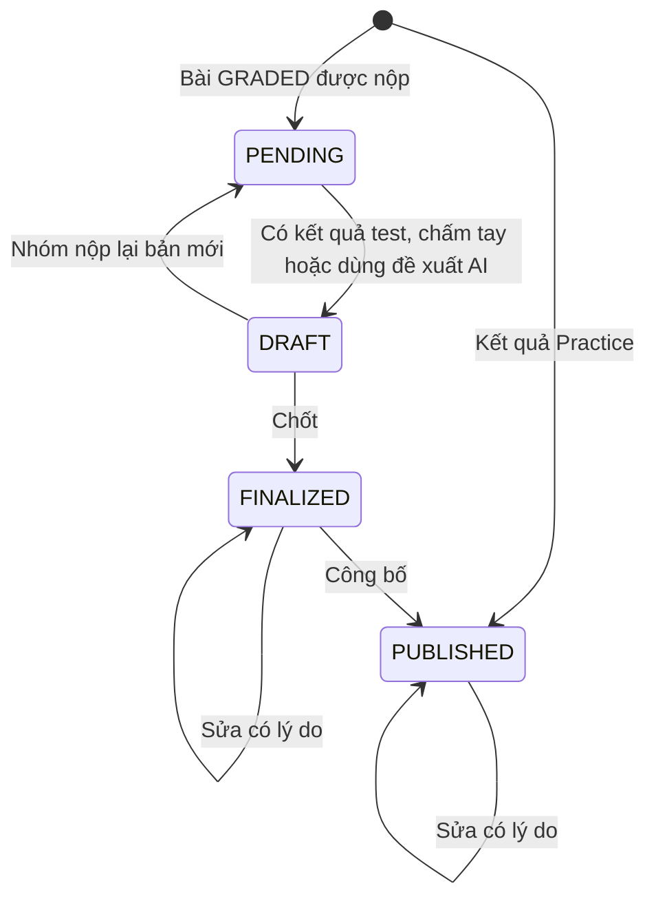

# U15 Grading - Domain Entities

**Bản tài liệu 2026-10-09**: UC 37, 38, 39, 40 (chốt và công bố là luồng phụ của UC 38, 39) theo [73 UC](../../../../docs/use-cases-73.md) và screen flow `docs/G21_Diagrams.drawio` (Page-2); primary stories: US-GRP-006, US-GRD-001, US-GRD-002, US-GRD-003, US-GRD-004, US-GRD-005. Quyền và supporting flows theo [current SRS contract](../../current-srs-contract.md); đây là thiết kế/kế hoạch, không xác nhận implementation mới.

Thiết kế độc lập công nghệ. Truy vết: `US-GRD-001`…`005`, `US-GRP-006`; UC 37–40; hỗ trợ UC 20, 21, 22, 23, 28, 29. Bảng theo [mô hình dữ liệu của unit](domain-entities.md).

Quyết định 2026-10-09: quiz chỉ là luyện tập (không có quiz `GRADED`); bài của môn được giảng viên từng lớp chấm và công bố cho lớp mình, nên thời điểm công bố của (bài, lớp) suy ra từ các đánh giá đã công bố của lớp đó, thay cho cột `assignments.grades_released_at` (U08 bỏ cột). Chỉ dùng bảng của ERD; U15 không thêm bảng.

## 1. Tổng quan

| Entity | Thực thể ERD | Lưu ở | Unit ghi |
|---|---|---|---|
| `Evaluation` | `EVALUATION` (cho `ATTEMPT`, `GROUP_DOCUMENT`, `MEMBER` hoặc `PRACTICE`) | `evaluations` | U15 |
| `EvaluationHistory` | Phần tử chỉ thêm | `evaluations.history` | U15 |
| `GradeReleaseView` | Kết quả tính: công bố điểm theo (bài, lớp) | Không lưu (suy từ `evaluations.published_at`) | U15 |
| `GradebookView` | Kết quả tính (sổ điểm) | Không lưu | U15 |

Không có bảng `grades`, `grade_history`. U15 **không** sở hữu: bài nộp (U11, U14), bài và lịch (U08), rubric (U06), đề xuất AI và chạy code (U13), tệp xuất bảng điểm (U16).

## 2. `Evaluation`

| Cột | Kiểu | Ràng buộc |
|---|---|---|
| `id` | UUID | |
| `kind` | enum | `ATTEMPT` (lượt bài `GRADED` của U11), `GROUP_DOCUMENT` (bản nộp nhóm U14), `MEMBER` (một thành viên của bài nhóm), `PRACTICE` (kết quả luyện tập của Student: quiz, Practice Code Lab, AI chấm Practice; chỉ Student xem) |
| `assignment_id` | UUID | Bài (một version); ghi lúc tạo, không đổi |
| `class_id` | UUID/rỗng | Lớp của sinh viên hoặc của nhóm; bắt buộc trừ `PRACTICE`. Với bài của môn, đây là lớp nơi giảng viên chấm |
| `attempt_id` | UUID/rỗng | Có với `ATTEMPT`, `PRACTICE`; unique `(kind, attempt_id)` |
| `group_document_id` | UUID/rỗng | Có với `GROUP_DOCUMENT`, `MEMBER` |
| `account_id` | UUID/rỗng | Người học nhận điểm: chủ lượt (`ATTEMPT`, `PRACTICE`) hoặc thành viên (`MEMBER`); rỗng với `GROUP_DOCUMENT`; unique `(kind, group_document_id, account_id)` |
| `method` | enum | `DETERMINISTIC` (đáp án quiz, test Code Lab), `MANUAL` (giảng viên lưu, kể cả khi dùng đề xuất AI) |
| `max_score` | numeric(6,2) | Tổng điểm của bài (câu/rubric/test) |
| `score` | numeric(6,2)/rỗng | Điểm cuối giảng viên lưu (`MEMBER`: điểm đóng góp, mặc định bằng điểm tài liệu chung); 0 ≤ `score` ≤ `max_score` |
| `rubric_checks` | JSON | Mục checklist đạt/không theo rubric (Text Essay: từng câu; Diagram Essay, bài nhóm: từng phần; kèm điểm từng câu/phần); Code Lab: kết quả test; quiz luyện tập: kết quả từng câu của `QuizScorer` |
| `feedback` | markdown ≤ 10 000 | |
| `ai_score`, `ai_feedback` | | Đề xuất AI (U13) cho bài `GRADED`, chỉ tham khảo; hoặc điểm AI của `PRACTICE` |
| `status` | enum | `PENDING`, `DRAFT`, `FINALIZED`, `PUBLISHED` |
| `history` | JSON | `EvaluationHistory[]` |
| `published_at`, `version` | | Khóa lạc quan |

### Trạng thái

```mermaid
stateDiagram-v2
    [*] --> PENDING: Bài GRADED được nộp
    [*] --> PUBLISHED: Kết quả Practice
    PENDING --> DRAFT: Có kết quả test, chấm tay hoặc dùng đề xuất AI
    DRAFT --> PENDING: Nhóm nộp lại bản mới
    DRAFT --> FINALIZED: Chốt
    FINALIZED --> PUBLISHED: Công bố
    FINALIZED --> FINALIZED: Sửa có lý do
    PUBLISHED --> PUBLISHED: Sửa có lý do
```

**Text alternative**: Bài `GRADED` được nộp tạo đánh giá `PENDING`. Có kết quả test Code Lab, điểm chấm tay, hoặc giảng viên lưu đề xuất AI thì thành `DRAFT`; nhóm nộp lại bản mới thì đánh giá nhóm về `PENDING` (điểm cũ vào lịch sử). Giảng viên chốt thì `FINALIZED`; công bố thì `PUBLISHED`. Kết quả `PRACTICE` được tạo ngay ở `PUBLISHED`. Sửa điểm đã chốt hoặc đã công bố cần lý do, giữ nguyên trạng thái và thêm một phần tử `history`. Không có đường từ `PENDING` thẳng sang `PUBLISHED` (không còn quiz `GRADED`).

## 3. `EvaluationHistory`

| Thuộc tính | Kiểu | Ràng buộc |
|---|---|---|
| `changedBy` | UUID hoặc `SYSTEM` | |
| `previous`, `next` | JSON | Điểm, trạng thái trước/sau |
| `reason` | chuỗi | Bắt buộc khi sửa điểm tự chấm hoặc điểm đã chốt/công bố; tùy chọn với điểm đóng góp thành viên |
| `changedAt` | thời gian | |

Chỉ thêm vào cuối mảng, không sửa phần tử cũ; mỗi thay đổi cũng ghi audit (U02).

## 4. `GradeReleaseView`

| Thuộc tính | Cách tính |
|---|---|
| `assignmentId`, `classId` | Bài (của lớp hoặc của môn) và lớp |
| `firstReleasedAt` | MIN `published_at` của `evaluations` cùng `assignment_id`, `class_id`, `status = PUBLISHED`, `kind` khác `PRACTICE` |
| `lastReleasedAt` | MAX `published_at` của cùng tập đánh giá |
| `releasedCount` | Số đánh giá đã công bố của tập đó |

Không lưu bảng riêng (chỉ dùng bảng của ERD). Không có đánh giá đã công bố = lớp chưa được công bố điểm nào của bài. Người công bố nằm trong audit. Bài của môn tính riêng cho từng lớp.

## 5. `GradebookView`

Sổ điểm lớp (UC 40): bài `GRADED` của lớp và bài `GRADED` của môn chứa lớp (`AssignmentQueryPort.listForClass`), gom theo sinh viên đang ghi danh (mỗi sinh viên một mục đóng/mở chứa các bài); mỗi bài là điểm lượt nộp cuối "x / tổng" và trạng thái (bài nhóm lấy đánh giá `MEMBER`), chỉ đánh giá có `class_id` là lớp đó. Không chứa quiz, `PRACTICE`, điểm AI đề xuất; không tính điểm tổng. Tính khi đọc.

## 6. Contract

### Port U15 cung cấp

| Port | Dùng bởi | Mô tả |
|---|---|---|
| `SubmissionSubmittedPort` | U11 khai báo (`C`) | Trong transaction nộp bài `GRADED`: tạo `evaluations` `ATTEMPT` `PENDING` kèm bài, lớp; Code Lab gọi `CodeRunPort.grade` |
| `GroupSubmittedPort` | U14 khai báo (`C`) | Trong transaction nộp: tạo (hoặc đưa về `PENDING`) `GROUP_DOCUMENT` và một `MEMBER` mỗi thành viên, kèm lớp của nhóm |
| `CodeGradedPort` | U13 khai báo (`C`) | Ghi điểm Code Lab `GRADED` tự chấm (`DRAFT`) |
| `PracticeResultPort` | U11, U13 khai báo (`C`) | `scoreQuiz(attemptId)` (U11: quiz luyện tập, U15 chấm bằng `QuizScorer`), `record(attemptId, result)` (U13: test Practice Code Lab hoặc điểm AI của UC 29); ghi `kind = PRACTICE`, `PUBLISHED` ngay cho Student |
| `GradeQueryPort` | U11, U16 | Điểm `PUBLISHED` của một lượt (gồm kết quả Practice), của một Student trong lớp; điểm `PUBLISHED` của một bài trong một lớp (cho phân bố điểm ẩn danh của U16) |
| `GradebookQueryPort` | U16 | Theo lớp, hoặc theo (bài, lớp): điểm cuối giảng viên lưu, trạng thái nộp/chấm/công bố, lượt tính điểm, thời điểm nộp, phản hồi; không trả điểm AI đề xuất |
| Event `grade.published` | U16 | Báo người học vừa có điểm (bài, lớp, danh sách người học) |

### Port U15 dùng

| Port | Unit | Mô tả |
|---|---|---|
| `ClassAccessPort` | U04 | Giảng viên chính của lớp (R3/R4), sinh viên đang ghi danh (sổ điểm) |
| `AssignmentQueryPort` | U08 | Bài, dạng, chế độ, phạm vi (lớp/môn), lịch; `listForClass` gồm bài của môn |
| `SubmissionQueryPort` | U11 | Lượt (bài, người học, lớp của lượt), nội dung, lượt được chấm |
| `GroupSubmissionQueryPort` | U14 | Bản nộp nhóm, lớp của nhóm, mục còn trống |
| `BankQueryPort`, `RubricPort` | U06 | Đáp án (chấm quiz luyện tập); rubric của bài, `score` |
| `AiGradingPort`, `CodeRunPort` | U13 (`C`) | Đề xuất chấm (từng bài, cả lô); yêu cầu chấm Code Lab |
| `DocumentModelPort`, `DocxExportPort` | U09 | Xem tài liệu, tải DOCX bài nộp |
| `AuthorizationPort` | U01 | Tài khoản `ACTIVE`, vai trò |
| `AuditPort` | U02 | Audit |
| `EventPublisherPort` | U03 | Event `grade.published` |

U15 không còn dùng `AssignmentExtensionPort` (U08) để ghi `grades_released_at`, và không đọc `TypeConfigPort` (không còn "hiện điểm ngay" cho bài `GRADED`).

## 7. API

| API | Dùng để | Màn, UC | Quyền |
|---|---|---|---|
| `GET /api/v1/classes/{classId}/assignments/{assignmentId}/evaluations` | Bài nộp của một bài trong lớp (gồm bài của môn), lọc trạng thái/trễ, số đã nộp | Submission Detail, UC 37 | R3/R4 của lớp |
| `GET /api/v1/evaluations/{id}` | Bài nộp (nội dung qua U11/U14), rubric, điểm, đề xuất AI, lịch sử | Submission Detail (xem nhanh), Grading Workspace, UC 37–39 | R3/R4 của lớp của đánh giá |
| `GET /api/v1/evaluations/{id}/document.docx` | Tải DOCX bài nộp Text/Diagram Essay hoặc bài nhóm | Grading Workspace, UC 37 | R3/R4 của lớp của đánh giá |
| `PUT /api/v1/evaluations/{id}` | Lưu checklist rubric, phản hồi, lý do sửa, điểm đóng góp thành viên (có `version`) | Grading Workspace, UC 38, 39 | R3/R4 của lớp của đánh giá |
| `POST /api/v1/evaluations/{id}/ai-proposal` | Nhờ AI đề xuất một bài | Grading Workspace (panel AI đề xuất), UC 38 | R3/R4 của lớp của đánh giá |
| `POST /api/v1/evaluations:ai-proposal-batch` | Chấm hàng loạt bằng AI | Submission Detail, UC 38 | R3/R4 với từng mục |
| `POST /api/v1/evaluations:finalize` | Chốt một hoặc nhiều bài, kết quả từng mục | Submission Detail, Grading Workspace, UC 38, 39 | R3/R4 với từng mục |
| `POST /api/v1/evaluations/{id}/publish` | Công bố một bài | Grading Workspace, UC 38, 39 | R3/R4 của lớp của đánh giá |
| `POST /api/v1/evaluations:publish` | Công bố hàng loạt bài đã chốt | Submission Detail, UC 38, 39 | R3/R4 với từng mục |
| `GET /api/v1/classes/{classId}/gradebook` | Sổ điểm theo sinh viên | Tab Evals → Sổ điểm, UC 40 | R3/R4 của lớp |
| `GET /api/v1/me/evaluations?classId=` | Điểm đã công bố của chính mình trong lớp | Student Assignments, Assignment Detail, UC 22, 23 | Student đang ghi danh lớp |

Dùng kèm của unit khác: `GET /api/v1/ai-suggestions/{id}`, `GET /api/v1/ai-suggestions?ids=` (U13, poll đề xuất); `GET /api/v1/classes/{classId}/gradebook/export` (U16, xuất CSV/XLSX của UC 40). Admin không gọi API nào ở trên.
