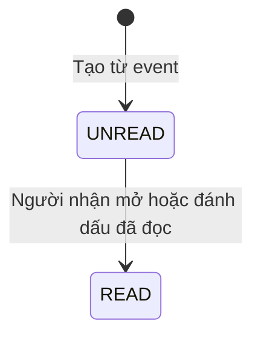
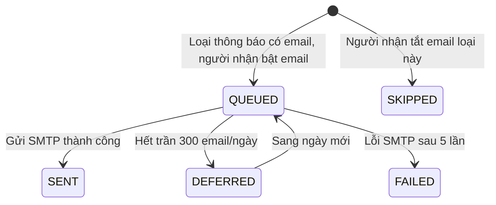

# U16 Reporting & Notification - Domain Entities

Thiết kế độc lập công nghệ. Truy vết: `US-NTF-001`, `US-RPT-001`…`003`; `UC-OPS-01`, `UC-RPT-01`…`03`.

## 1. Tổng quan

| Entity | Loại | Lưu ở | Unit ghi |
|---|---|---|---|
| `Notification` | Aggregate root | `notifications` | U16 |
| `EmailOutbox` | Entity | `email_outbox` | U16 |
| `NotificationPreference` | Entity | `notification_preferences` | U16 |
| `DeadlineReminder` | Job hẹn giờ | `jobs` (U02) | U16 tạo qua `JobPort` |
| `LearnerDashboard` | Kết quả tính | Không lưu | U16 |
| `GradebookExport` | Tệp CSV/XLSX tạo khi yêu cầu | Không lưu | U16 |
| `SubmissionProgress` | Kết quả tính (tiến độ nộp bài) | Không lưu | U16 |

U16 **không** sở hữu: email OTP tài khoản (U01 qua U02), điểm/bài nộp gốc (chỉ đọc qua port/event). Không có bảng điểm tổng riêng.

## 2. `Notification`

| Thuộc tính | Kiểu | Ràng buộc |
|---|---|---|
| `id` | UUID | |
| `recipientId` | UUID | |
| `type` | enum | `ENROLLED`, `ASSIGNMENT_OPENED`, `DEADLINE_REMINDER`, `GRADE_PUBLISHED`, `GROUP_LEADER_CHANGED`, `GROUP_MEMBERSHIP_CHANGED`, `GROUP_SUBMITTED`, `PAYMENT_PAID`, `CLASS_ANNOUNCEMENT`, `CLASS_QUESTION`, `CLASS_ANSWER` |
| `title`, `body` | chuỗi | Không chứa điểm số, dữ liệu người khác |
| `link` | chuỗi | Đường dẫn nội bộ |
| `sourceEventId` | UUID | Unique theo `(sourceEventId, recipientId, type)` (chống trùng) |
| `readAt`, `createdAt` | | `readAt` rỗng = chưa đọc |

### Trạng thái

**Text alternative**: Thông báo tạo ra chưa đọc; người nhận mở hoặc đánh dấu đã đọc thì ghi `readAt`. Thông báo trong app luôn bật, không tắt được.

## 3. `EmailOutbox`

| Thuộc tính | Kiểu | Ràng buộc |
|---|---|---|
| `id` | UUID | |
| `notificationId` | UUID | |
| `toAccountId` | UUID | Email tra từ U01 lúc gửi |
| `template` | enum | Theo `type` của thông báo |
| `status` | enum | `QUEUED`, `DEFERRED`, `SENT`, `FAILED`, `SKIPPED` |
| `scheduledFor`, `attempts`, `lastError`, `sentAt` | | |

### Trạng thái

**Text alternative**: Với loại thông báo có email, nếu người nhận tắt email loại đó thì bản ghi ở `SKIPPED`; ngược lại ở `QUEUED`. Gửi thành công thì `SENT`. Hết trần 300 email/ngày thì `DEFERRED` và được xếp lại vào ngày hôm sau. Lỗi SMTP sau 5 lần retry thì `FAILED`; không làm hỏng giao dịch nghiệp vụ gốc.

## 4. `NotificationPreference`

| Thuộc tính | Kiểu | Ràng buộc |
|---|---|---|
| `accountId` | UUID | |
| `type` | enum | Loại thông báo có email |
| `emailEnabled` | bool | Mặc định `true` |

## 5. `DeadlineReminder`

Mỗi publication có một job U02 `DEADLINE_REMINDER` (`idempotencyKey` = `publicationId:closesAt`, hẹn lúc `closesAt` − 24 giờ, payload `{publicationId, expectedClosesAt}`). Đổi hạn thì tạo job mới theo hạn mới; job cũ chạy thì so `expectedClosesAt` với hạn hiện tại, khác thì bỏ qua. Bài ngưng giao/đóng thì job tự bỏ qua khi chạy. Chỉ nhắc người học chưa nộp, một lần mỗi bài.

## 6. `LearnerDashboard`, `GradebookExport`, `SubmissionProgress`

| Kết quả | Nội dung |
|---|---|
| `LearnerDashboard` | Lớp đang ghi danh, bài sắp hạn, trạng thái lượt/bài nộp của chính người học, điểm `PUBLISHED`; phân bố điểm ẩn danh khi lớp bật và đủ mẫu (BR-U16-42) |
| `GradebookExport` | CSV/XLSX theo lớp/bài: người học, trạng thái nộp/chấm, thời gian nộp, điểm cuối đã chốt hoặc công bố, phản hồi; không có điểm tổng, không có đề xuất AI; stream, không lưu |
| `SubmissionProgress` | Theo lượt phát hành: đã nộp, chưa nộp, đang làm, nộp trễ, thời gian còn lại |

## 7. Contract

### Event U16 nghe

| Event | Nguồn | Tạo thông báo |
|---|---|---|
| `enrollment.activated` | U04 | `ENROLLED` (app + email) |
| `assignment.opened` | U08 | `ASSIGNMENT_OPENED` cho người học của lớp (app + email); tạo job nhắc hạn |
| `grade.published` | U15 | `GRADE_PUBLISHED` (app + email, không ghi điểm) |
| `group.leader-changed`, `group.membership-changed` | U12 | App |
| `group.submitted` | U14 | App cho thành viên nhóm |
| `payment.paid` | U07 | App |
| `class.announcement-posted`, `class.question-posted`, `class.answer-posted` | U05 | App cho người còn quyền trong lớp (BR-U16-06); không gửi email |

### Port U16 dùng

| Port | Unit | Mô tả |
|---|---|---|
| `AccountLookupPort` | U01 | Email tài khoản |
| `ClassAccessPort` | U04 | Lớp người học đang ghi danh, người quản lý lớp, `showGradeDistribution` |
| `AssignmentQueryPort` | U08 | Bài, publication, hạn |
| `SubmissionQueryPort` | U11 | Tiến độ nộp bài cá nhân |
| `GroupMembershipPort` | U12 | Thành viên nhóm để chọn người nhận |
| `GroupSubmissionQueryPort` | U14 | Tiến độ nộp bài nhóm |
| `GradebookQueryPort`, `GradeQueryPort` | U15 | Điểm cuối/trạng thái; không trả đề xuất AI |
| `JobPort`, `AuditPort` | U02 | Gửi email, nhắc hạn, audit xuất bảng điểm |
