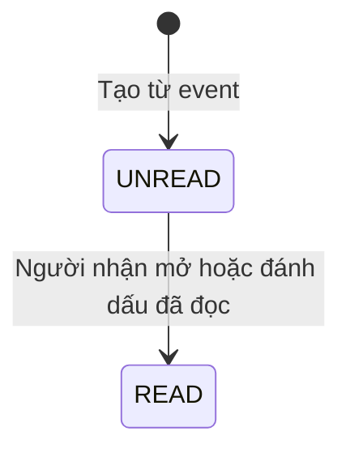
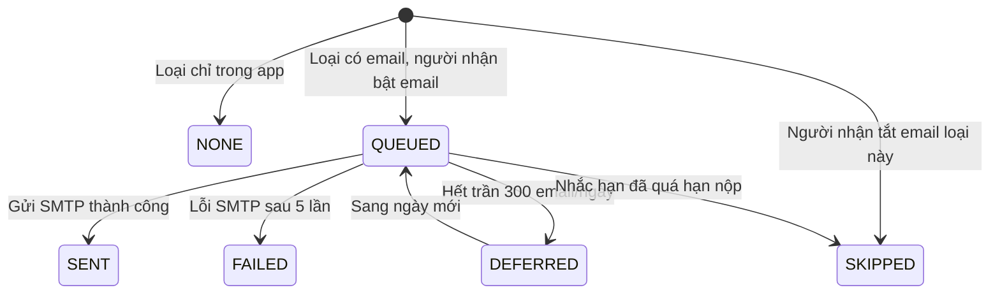

# U16 Reporting & Notification - Domain Entities

Thiết kế độc lập công nghệ. Truy vết: `US-NTF-001`, `US-RPT-001`…`003`; UC 18 View Statistics, UC 36, UC 38. Bảng theo [database](../../../../docs/database.md): U16 chỉ có bảng `notifications`; không có `email_outbox`, `notification_preferences` (quyết định 2026-10-03).

## 1. Tổng quan

| Entity | Loại | Lưu ở | Unit ghi |
|---|---|---|---|
| `Notification` | Aggregate root (`NOTIFICATION`) | `notifications` (kèm trạng thái email) | U16 |
| `EmailPreferences` | Value object của `Account` | `accounts.email_preferences` | U16 |
| `DeadlineReminder` | Việc theo thời gian | `assignments.reminder_sent_at`, `DeadlineReminderScanner` | U16 |
| `AdminStatistics` | Kết quả tính (thống kê quản trị) | Không lưu | U16 |
| `GradeDistribution` | Kết quả tính (phân bố điểm ẩn danh theo bài) | Không lưu | U16 |
| `GradebookExport` | Tệp CSV/XLSX tạo khi yêu cầu | Không lưu | U16 |
| `SubmissionProgress` | Kết quả tính (tiến độ nộp bài) | Không lưu | U16 |

U16 **không** sở hữu: email OTP tài khoản (U01 qua U03), điểm/bài nộp gốc (chỉ đọc qua port/event). Không có bảng điểm tổng riêng.

## 2. `Notification`

| Thuộc tính | Kiểu | Ràng buộc |
|---|---|---|
| `id` | UUID | |
| `account_id` | UUID | Người nhận |
| `type` | enum | `ENROLLED`, `ASSIGNMENT_OPENED`, `DEADLINE_REMINDER`, `GRADE_PUBLISHED`, `GROUP_LEADER_CHANGED`, `GROUP_LEADER_REQUESTED`, `GROUP_LEADER_REQUEST_REJECTED`, `GROUP_MEMBERSHIP_CHANGED`, `GROUP_SUBMITTED`, `PAYMENT_PAID`, `CLASS_ANNOUNCEMENT` |
| `title`, `body` | chuỗi | Không chứa điểm số, dữ liệu người khác |
| `link` | chuỗi | Đường dẫn nội bộ |
| `source_event_id` | UUID | Unique theo `(source_event_id, account_id, type)` (chống trùng) |
| `email_status` | enum | `NONE` (loại chỉ trong app), `QUEUED`, `DEFERRED`, `SENT`, `FAILED`, `SKIPPED` |
| `email_sent_at` | thời gian | |
| `readAt`, `createdAt` | | `readAt` rỗng = chưa đọc |

### Trạng thái

```mermaid
stateDiagram-v2
    [*] --> UNREAD: Tạo từ event
    UNREAD --> READ: Người nhận mở hoặc đánh dấu đã đọc
```

**Text alternative**: Thông báo tạo ra chưa đọc; người nhận mở hoặc đánh dấu đã đọc thì ghi `readAt`. Thông báo trong app luôn bật, không tắt được.

## 3. Email của thông báo

Trạng thái email nằm ngay trên dòng `notifications` (cột `email_status`).

```mermaid
stateDiagram-v2
    [*] --> NONE: Loại chỉ trong app
    [*] --> QUEUED: Loại có email, người nhận bật email
    [*] --> SKIPPED: Người nhận tắt email loại này
    QUEUED --> SENT: Gửi SMTP thành công
    QUEUED --> DEFERRED: Hết trần 300 email/ngày
    DEFERRED --> QUEUED: Sang ngày mới
    QUEUED --> FAILED: Lỗi SMTP sau 5 lần
    QUEUED --> SKIPPED: Nhắc hạn đã quá hạn nộp
```

**Text alternative**: Thông báo chỉ trong app có `email_status = NONE`. Với loại có email, nếu người nhận tắt email loại đó thì `SKIPPED`; ngược lại `QUEUED` và gửi việc `EMAIL_SEND` lên `jobs.email` sau commit. Gửi thành công thì `SENT`. Hết trần 300 email/ngày thì `DEFERRED`; `EmailDeferredScanner` xếp lại lúc 00:05 ngày sau. Lỗi SMTP sau 5 lần retry thì `FAILED`; không làm hỏng giao dịch nghiệp vụ gốc.

## 4. `EmailPreferences`

| Thuộc tính | Kiểu | Ràng buộc |
|---|---|---|
| `accounts.email_preferences` | JSON | `{type: bool}` cho các loại có email; thiếu khóa = `true` |

## 5. `DeadlineReminder`

Không có bảng hay job hẹn giờ riêng. `DeadlineReminderScanner` (U03 `ScheduledScanner`, mỗi phút) chọn bài `OPEN` có `closes_at − 24h <= now < closes_at`, `opens_at <= closes_at − 24h`, và `reminder_sent_at IS NULL OR reminder_sent_at < closes_at − 24h`; tạo thông báo cho người chưa nộp và ghi `assignments.reminder_sent_at = now()` trong cùng transaction (qua `AssignmentExtensionPort` của U08). Gia hạn làm mốc nhắc mới sau `reminder_sent_at` nên bài được nhắc lại một lần theo hạn mới; bài ngưng giao/đóng không được chọn.

## 6. `AdminStatistics`, `GradeDistribution`, `GradebookExport`, `SubmissionProgress`

| Kết quả | Nội dung |
|---|---|
| `AdminStatistics` | `accountsByRoleAndStatus` (vai trò × `PENDING`/`ACTIVE`/`DISABLED`), `totalAccounts`, `subjectsByStatus`, `classesByStatus`, `activeEnrollments`, `countedAt`; chỉ số đếm (BR-U16-40, 41) |
| `GradeDistribution` | Theo `assignmentId`: các khoảng điểm và số người trong khoảng; ẩn khoảng < 5 người, chỉ trả khi ≥ 20 điểm `PUBLISHED` và lớp bật cờ (BR-U16-42) |
| `GradebookExport` | CSV/XLSX theo lớp/bài: người học, trạng thái nộp/chấm, thời gian nộp, điểm cuối đã chốt hoặc công bố, phản hồi; không có điểm tổng, không có đề xuất AI; stream, không lưu |
| `SubmissionProgress` | Theo bài: đã nộp, chưa nộp, đang làm, nộp trễ, thời gian còn lại |

## 7. Contract

### Event U16 nghe

| Event | Nguồn | Tạo thông báo |
|---|---|---|
| `enrollment.activated` | U04 | `ENROLLED` (app + email) |
| `assignment.opened` | U08 | `ASSIGNMENT_OPENED` cho người học của lớp (app + email) |
| `grade.published` | U15 | `GRADE_PUBLISHED` (app + email, không ghi điểm) cho danh sách người học trong event (một event mỗi lần công bố từng bài hoặc hàng loạt) |
| `group.leader-changed`, `group.membership-changed` | U12 | `GROUP_LEADER_CHANGED`, `GROUP_MEMBERSHIP_CHANGED` (app) |
| `group.leader-requested` | U12 | `GROUP_LEADER_REQUESTED` (app) cho giảng viên lớp: có yêu cầu đổi trưởng nhóm mới |
| `group.leader-request-rejected` | U12 | `GROUP_LEADER_REQUEST_REJECTED` (app) cho người gửi yêu cầu, kèm lý do từ chối |
| `group.submitted` | U14 | `GROUP_SUBMITTED` (app) cho thành viên nhóm |
| `payment.paid` | U07 | App |
| `class.announcement-posted` | U05 | App cho người còn quyền trong lớp (BR-U16-06); không gửi email |

### Port U16 dùng

| Port | Unit | Mô tả |
|---|---|---|
| `AccountLookupPort` | U01 | Email tài khoản, `email_preferences`; `countByRoleAndStatus()` cho thống kê (UC 18) |
| `ClassAccessPort` | U04 | Lớp người học đang ghi danh, người quản lý lớp, `showGradeDistribution`; `countSubjectsByStatus()`, `countClassesByStatus()`, `countActiveEnrollments()` cho thống kê (UC 18) |
| `AssignmentQueryPort`, `AssignmentExtensionPort` | U08 | Bài, lịch, hạn; ghi `reminder_sent_at` |
| `SubmissionQueryPort` | U11 | Tiến độ nộp bài cá nhân |
| `GroupMembershipPort` | U12 | Thành viên nhóm để chọn người nhận |
| `GroupSubmissionQueryPort` | U14 | Tiến độ nộp bài nhóm |
| `GradebookQueryPort`, `GradeQueryPort` | U15 | Điểm cuối/trạng thái; không trả đề xuất AI |
| `AuthorizationPort` | U01 | Tài khoản `ACTIVE`, vai trò (thống kê chỉ `ADMIN`) |
| `AuditPort` | U02 | Audit xuất bảng điểm |
| `JobPort`, `PendingSweeper`, `ScheduledScanner` | U03 | Việc `EMAIL_SEND` trên `jobs.email`; gửi lại email `QUEUED` bị mất; quét nhắc hạn, email dời, xóa thông báo cũ |
| `SseHub`, fanout `platform.realtime` | U14 | Kênh SSE theo `accountId` cho chuông thông báo |
