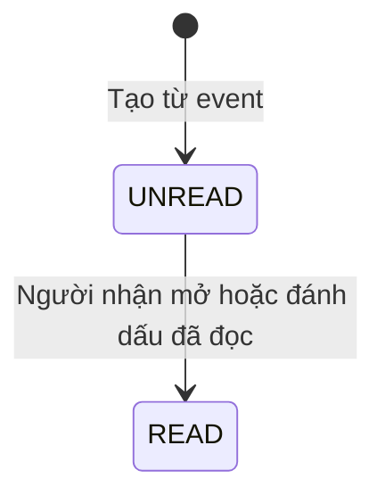
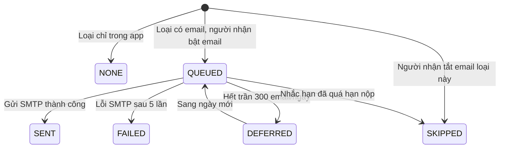

# U16 Reporting & Notification - Domain Entities

**Bản tài liệu 2026-10-09**: UC 12, 58 theo [73 UC](../../../../docs/use-cases-73.md) và screen flow `docs/G21_Diagrams.drawio` (Page-2); luồng phụ: phân bố điểm của UC 22, tiến độ nộp của UC 37, phần xuất tệp của UC 40; primary stories: US-NTF-001, US-RPT-001, US-RPT-002, US-RPT-003. Quyền và supporting flows theo [current SRS contract](../../current-srs-contract.md); đây là thiết kế/kế hoạch, không xác nhận implementation mới.

Thiết kế độc lập công nghệ. Truy vết: `US-NTF-001`, `US-RPT-001`…`003`; UC 12 View Notifications, UC 58 View Admin Dashboard; đóng góp cho UC 22, 37, 40. U16 chỉ có bảng `notifications`; không có `email_outbox`, `notification_preferences` (quyết định 2026-10-03).

## 1. Tổng quan

| Entity | Loại | Lưu ở | Unit ghi |
|---|---|---|---|
| `Notification` | Aggregate root (`NOTIFICATION`) | `notifications` (kèm trạng thái email) | U16 |
| `EmailPreferences` | Value object của `Account` | `accounts.email_preferences` | U16 |
| `DeadlineReminder` | Việc theo thời gian | `assignments.reminder_sent_at`, `DeadlineReminderScanner` | U16 |
| `AdminStatistics` | Kết quả tính (số liệu Admin Dashboard) | Không lưu | U16 |
| `GradeDistribution` | Kết quả tính (phân bố điểm ẩn danh theo bài, theo lớp) | Không lưu | U16 |
| `GradebookExport` | Tệp CSV/XLSX tạo khi yêu cầu | Không lưu | U16 |
| `SubmissionProgress` | Kết quả tính (tiến độ nộp theo bài, theo lớp) | Không lưu | U16 |

U16 **không** sở hữu: email OTP tài khoản (U01 qua U03), điểm/bài nộp gốc và màn Gradebook, Submission Detail (U15), Student Assignments (U11), các màn quản trị mở từ Admin Dashboard (U01, U02, U03, U04, U07). Không có bảng điểm tổng riêng.

## 2. `Notification`

| Thuộc tính | Kiểu | Ràng buộc |
|---|---|---|
| `id` | UUID | |
| `account_id` | UUID | Người nhận |
| `type` | enum | `ENROLLED`, `ASSIGNMENT_OPENED`, `QUIZ_PUBLISHED`, `DEADLINE_REMINDER`, `GRADE_PUBLISHED`, `GROUP_LEADER_CHANGED`, `GROUP_LEADER_REQUESTED`, `GROUP_LEADER_REQUEST_REJECTED`, `GROUP_MEMBERSHIP_CHANGED`, `GROUP_SUBMITTED`, `PAYMENT_PAID`, `ANNOUNCEMENT_POSTED` |
| `title`, `body` | chuỗi | Không chứa điểm số, dữ liệu người khác |
| `link` | chuỗi | Đường dẫn nội bộ theo bảng dưới |
| `source_event_id` | UUID | Unique theo `(source_event_id, account_id, type)` (chống trùng) |
| `email_status` | enum | `NONE` (loại chỉ trong app), `QUEUED`, `DEFERRED`, `SENT`, `FAILED`, `SKIPPED` |
| `email_sent_at` | thời gian | |
| `readAt`, `createdAt` | | `readAt` rỗng = chưa đọc |

| Loại | Màn mở từ `link` |
|---|---|
| `ENROLLED`, `GROUP_LEADER_CHANGED`, `GROUP_MEMBERSHIP_CHANGED`, `GROUP_LEADER_REQUEST_REJECTED` | Student Class Detail của lớp (nhóm của mình, UC 14, 16) |
| `ASSIGNMENT_OPENED`, `DEADLINE_REMINDER`, `GROUP_SUBMITTED` | Assignment Detail (UC 23) |
| `QUIZ_PUBLISHED` | Quiz Practice Detail (UC 19) |
| `GRADE_PUBLISHED` | Submission History của bài (UC 28) |
| `GROUP_LEADER_REQUESTED` | Teacher Class Detail của lớp (giảng viên xử lý yêu cầu, U12) |
| `PAYMENT_PAID` | My Credit Package (UC 08) |
| `ANNOUNCEMENT_POSTED` | Class Announcements lọc sẵn lớp (UC 30) |

### Trạng thái

```mermaid
stateDiagram-v2
    [*] --> UNREAD: Tạo từ event
    UNREAD --> READ: Người nhận mở hoặc đánh dấu đã đọc
```

**Text alternative**: Thông báo tạo ra chưa đọc; người nhận bấm mở hoặc đánh dấu đã đọc trong popup thông báo thì ghi `readAt`. Thông báo trong app luôn bật, không tắt được.

## 3. Email của thông báo

Trạng thái email nằm ngay trên dòng `notifications` (cột `email_status`).

```mermaid
stateDiagram-v2
    [*] --> NONE: Loại chỉ trong app
    [*] --> QUEUED: Loại có email, người nhận bật email
    [*] --> SKIPPED: Người nhận tắt email loại này
    QUEUED --> SENT: Gửi SMTP thành công
    QUEUED --> DEFERRED: Hết trần 300 email/ngày
    DEFERRED --> QUEUED: Sang ngày mới
    QUEUED --> FAILED: Lỗi SMTP sau 5 lần
    QUEUED --> SKIPPED: Nhắc hạn đã quá hạn nộp
```

**Text alternative**: Thông báo chỉ trong app (gồm `QUIZ_PUBLISHED`, `ANNOUNCEMENT_POSTED`, nhóm, thanh toán) có `email_status = NONE`. Với bốn loại có email, nếu người nhận tắt email loại đó thì `SKIPPED`; ngược lại `QUEUED` và gửi việc `EMAIL_SEND` lên `jobs.email` sau commit. Gửi thành công thì `SENT`. Hết trần 300 email/ngày thì `DEFERRED`; `EmailDeferredScanner` xếp lại lúc 00:05 ngày sau. Lỗi SMTP sau 5 lần retry thì `FAILED`; không làm hỏng giao dịch nghiệp vụ gốc.

## 4. `EmailPreferences`

| Thuộc tính | Kiểu | Ràng buộc |
|---|---|---|
| `accounts.email_preferences` | JSON | `{type: bool}` chỉ cho `ENROLLED`, `ASSIGNMENT_OPENED`, `GRADE_PUBLISHED`, `DEADLINE_REMINDER`; thiếu khóa = `true`; khóa khác bị từ chối `400` |

## 5. `DeadlineReminder`

Không có bảng hay job hẹn giờ riêng. `DeadlineReminderScanner` (U03 `ScheduledScanner`, mỗi phút) chọn bài tập `OPEN` có `type <> 'MULTIPLE_CHOICE_QUIZ'`, `closes_at IS NOT NULL`, `closes_at − 24h <= now < closes_at`, `opens_at <= closes_at − 24h`, và `reminder_sent_at IS NULL OR reminder_sent_at < closes_at − 24h`; tạo thông báo cho người chưa nộp (bài của lớp: lớp đó; bài của môn: mọi lớp `OPEN` của môn) và ghi `assignments.reminder_sent_at = now()` trong cùng transaction (qua `AssignmentExtensionPort` của U08). Gia hạn làm mốc nhắc mới sau `reminder_sent_at` nên bài được nhắc lại một lần theo hạn mới; bài ngưng giao/đóng không được chọn.

## 6. `AdminStatistics`, `GradeDistribution`, `GradebookExport`, `SubmissionProgress`

| Kết quả | Nội dung |
|---|---|
| `AdminStatistics` | `accountsByRoleAndStatus` (vai trò × `PENDING`/`ACTIVE`/`DISABLED`), `totalAccounts`, `subjectsByStatus`, `classesByStatus`, `activeEnrollments`, `countedAt`; chỉ số đếm (BR-U16-40, 41) |
| `GradeDistribution` | Theo `classId` và `assignmentId` (bài `GRADED` của lớp hoặc của môn giao cho lớp): các khoảng điểm và số người trong khoảng; ẩn khoảng < 5 người, chỉ trả khi lớp có ≥ 20 điểm `PUBLISHED` và bật cờ (BR-U16-42) |
| `GradebookExport` | CSV/XLSX theo lớp hoặc một bài của lớp: người học, trạng thái nộp/chấm, thời gian nộp, điểm cuối đã chốt hoặc công bố, phản hồi; không có điểm tổng, đề xuất AI, quiz; stream, không lưu |
| `SubmissionProgress` | Theo bài và lớp: đã nộp, chưa bắt đầu, đang làm, nộp trễ, thời gian còn lại; bài nhóm theo nhóm |

## 7. Contract

### Port U16 cung cấp

U16 không cung cấp port backend cho unit khác; các unit khác chỉ phát event cho U16. U16 cung cấp component frontend và cột dữ liệu:

| Port | Dùng bởi | Mô tả |
|---|---|---|
| `NotificationBell` (kèm `NotificationPopup`) | U01 (thanh điều hướng của shell) | Gắn trên thanh điều hướng của mọi vai trò (UC 12) |
| `GradeDistributionBadge` | U11 (Student Assignments) | Phân bố điểm ẩn danh của một bài (luồng phụ UC 22) |
| `SubmissionProgressPanel` | U15 (Submission Detail) | Tiến độ nộp của một bài trong một lớp (luồng phụ UC 37) |
| `GradebookExportAction` | U15 (Gradebook) | Nút xuất CSV/XLSX (phần xuất của UC 40) |
| Cột `accounts.email_preferences` | U01 (bảng `accounts`) | U16 thêm bằng migration của mình, chỉ U16 đọc/ghi |
| Queue `jobs.notification` | U03 (exchange `platform.events`), unit phát event | Nhận các event ở bảng dưới |

### Event U16 nghe

| Event | Nguồn | Tạo thông báo |
|---|---|---|
| `enrollment.activated` | U04 | `ENROLLED` (app + email) cho người được ghi danh |
| `assignment.opened` (bài tập) | U08 | `ASSIGNMENT_OPENED` (app + email): có `classId` → người học `ACTIVE` của lớp; có `subjectId` → người học `ACTIVE` của mọi lớp `OPEN` thuộc môn |
| `assignment.opened` (`type = MULTIPLE_CHOICE_QUIZ`) | U08 | `QUIZ_PUBLISHED` (chỉ app), người nhận như trên |
| `grade.published` | U15 | `GRADE_PUBLISHED` (app + email, không ghi điểm) cho danh sách người học trong event (bài của lớp hoặc từng lớp của bài của môn) |
| `group.leader-changed`, `group.membership-changed` | U12 | `GROUP_LEADER_CHANGED`, `GROUP_MEMBERSHIP_CHANGED` (app) cho thành viên liên quan |
| `group.leader-requested` | U12 | `GROUP_LEADER_REQUESTED` (app) cho giảng viên lớp: có yêu cầu đổi trưởng nhóm (UC 17) |
| `group.leader-request-rejected` | U12 | `GROUP_LEADER_REQUEST_REJECTED` (app) cho người gửi yêu cầu, kèm lý do từ chối |
| `group.submitted` | U14 | `GROUP_SUBMITTED` (app) cho thành viên nhóm |
| `payment.paid` | U07 | `PAYMENT_PAID` (app) cho người mua (Student, Teacher, Subject Manager; Admin không có ví) |
| `class.announcement-posted` | U05 | `ANNOUNCEMENT_POSTED` (app) cho người học `ACTIVE` của lớp trừ actor (BR-U16-06); không email |

### Port U16 dùng

| Port | Unit | Mô tả |
|---|---|---|
| `AccountLookupPort` | U01 | Email tài khoản, `email_preferences`; `countByRoleAndStatus()` cho Admin Dashboard (UC 58) |
| `AuthorizationPort` | U01 | Tài khoản `ACTIVE`, vai trò (Admin Dashboard chỉ `ADMIN`) |
| `ClassAccessPort` | U04 | `getClassRef` (môn, trạng thái, `showGradeDistribution`), `isActiveStudent`, `listActiveStudents`; `listOpenClassesOfSubject(subjectId)` (lớp `OPEN` của môn, cho bài/quiz của môn); `countSubjectsByStatus()`, `countClassesByStatus()`, `countActiveEnrollments()` cho UC 58 |
| `AiUsageStatsPort` | U13 | Số liệu sử dụng AI (số lượt, credit, chi phí trong ngày) cho Admin Dashboard |
| `ClassScopePort` | U04 | R3/R4: tài khoản được giao dạy lớp (tiến độ, xuất bảng điểm) |
| `AssignmentQueryPort`, `AssignmentExtensionPort` | U08 | Bài, phạm vi lớp/môn, dạng, lịch, hạn; ghi `reminder_sent_at` |
| `SubmissionQueryPort` | U11 | Tiến độ nộp bài cá nhân, người chưa nộp |
| `GroupMembershipPort` | U12 | Thành viên nhóm để chọn người nhận |
| `GroupSubmissionQueryPort` | U14 | Tiến độ nộp bài nhóm |
| `GradebookQueryPort`, `GradeQueryPort` | U15 | Điểm cuối/trạng thái công bố theo lớp (bài của môn theo từng lớp); không trả đề xuất AI, quiz, `PRACTICE` |
| `AuditPort` | U02 | Audit xuất bảng điểm |
| `JobPort`, `PendingSweeper`, `ScheduledScanner` | U03 | Việc `EMAIL_SEND` trên `jobs.email`; gửi lại email `QUEUED` bị mất; quét nhắc hạn, email dời, xóa thông báo cũ |
| `SseHub`, fanout `platform.realtime` | U14 | Kênh SSE theo `accountId` cho chuông thông báo |

## 8. API

| API | Dùng để | Màn, UC | Quyền |
|---|---|---|---|
| `GET /api/v1/me/notifications` | Thông báo của mình, mới nhất trước, phân trang 20 | Popup thông báo, UC 12 | Mọi tài khoản `ACTIVE`, chỉ của chính mình |
| `GET /api/v1/me/notifications/unread-count` | Số chưa đọc | Chuông trên thanh điều hướng, UC 12 | Như trên |
| `GET /api/v1/me/notifications/stream` | SSE báo có thông báo mới | Chuông, UC 12 | Như trên, kênh gắn phiên |
| `POST /api/v1/me/notifications/{id}/read` | Đánh dấu một thông báo đã đọc (cả khi bấm mở) | Popup thông báo, UC 12 | Chủ thông báo; của người khác `404` |
| `POST /api/v1/me/notifications/read-all` | Đánh dấu tất cả đã đọc | Popup thông báo, UC 12 | Mọi tài khoản `ACTIVE` |
| `GET`, `PUT /api/v1/me/email-preferences` | Xem, bật/tắt email bốn loại có email | Phần Email trong popup thông báo, UC 12 | Student, chỉ của chính mình; vai trò khác `403` |
| `GET /api/v1/assignments/{id}/progress?classId=` | Tiến độ nộp của bài trong một lớp | Submission Detail (U15), luồng phụ UC 37 | R3/R4 của lớp; `classId` bắt buộc với bài của môn |
| `GET /api/v1/me/classes/{classId}/grade-distribution` | Phân bố điểm ẩn danh các bài đủ điều kiện | Student Assignments (U11), luồng phụ UC 22 | Student ghi danh `ACTIVE` lớp |
| `GET /api/v1/admin/statistics` | Số liệu nền tảng | Admin Dashboard, UC 58 | `ADMIN` |
| `GET /api/v1/classes/{classId}/gradebook/export?format=csv\|xlsx&assignmentId=` | Xuất bảng điểm lớp hoặc một bài | Gradebook (U15), phần xuất của UC 40 | R3/R4 của lớp |
