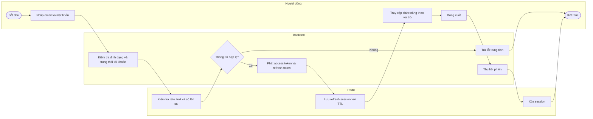
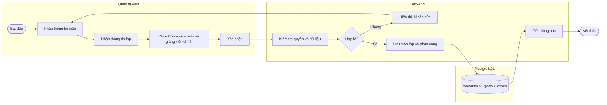
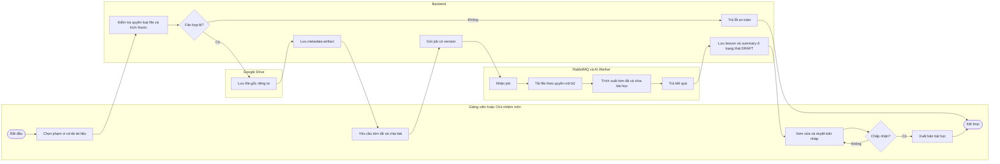
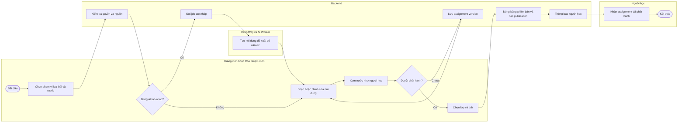
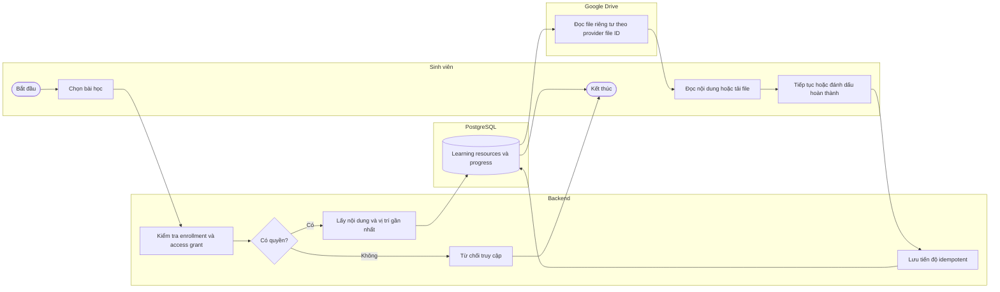
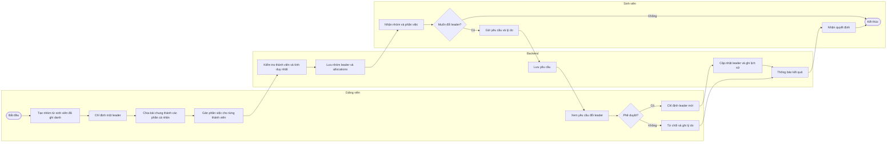
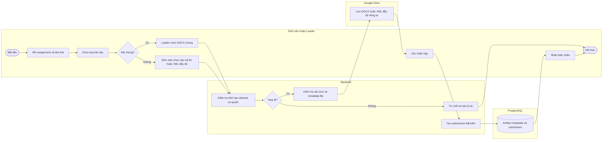
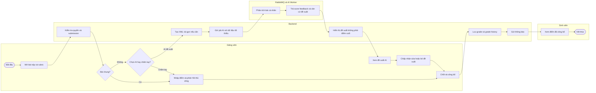
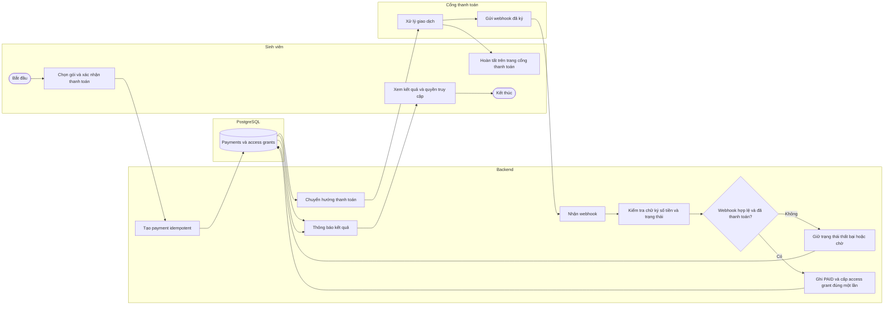

# 2. Main Business Flow

Tài liệu này mô tả các luồng nghiệp vụ đầu-cuối quan trọng của nền tảng. Swimlane thể hiện trách nhiệm của tác nhân, hệ thống và dịch vụ ngoài; các bước kỹ thuật không làm thay đổi kết quả nghiệp vụ được lược bỏ.

## 2.1 Đăng nhập và quản lý phiên (BF-01)

**Trigger:** Người dùng đã được nhà trường cấp tài khoản và nhập email trường cùng mật khẩu.

**End condition:** Người dùng vào được hệ thống với đúng vai trò, hoặc nhận lỗi an toàn; phiên hợp lệ được lưu trong Redis và có thể bị thu hồi.

**Text alternative:** Người dùng đăng nhập; backend kiểm tra tài khoản và giới hạn thử sai qua Redis. Nếu hợp lệ, backend tạo token và lưu refresh session có TTL. Khi đăng xuất, session bị xóa khỏi Redis.

## 2.2 Thiết lập môn học, lớp và phân công (BF-02)

**Trigger:** Quản trị viên cần mở môn/lớp mới hoặc thay đổi người phụ trách.

**End condition:** Môn và lớp hợp lệ được lưu; mỗi môn có một Chủ nhiệm môn, mỗi lớp có một giảng viên chính và các bên được thông báo.

**Text alternative:** Quản trị viên tạo môn, lớp và chọn người phụ trách. Backend kiểm tra role, dữ liệu trùng và phạm vi; dữ liệu hợp lệ được lưu rồi thông báo cho người được phân công.

## 2.3 Upload tài liệu, AI tóm tắt và chia bài học (BF-03)

**Trigger:** Giảng viên hoặc Chủ nhiệm môn tải DOCX/PDF lên môn hay lớp được phân công và yêu cầu AI xử lý.

**End condition:** File gốc được lưu riêng tư trên Google Drive; các bài học và bản tóm tắt ở trạng thái nháp được lưu để giảng viên duyệt, hoặc lỗi được báo an toàn.

**Text alternative:** File hợp lệ được lưu trên Google Drive và metadata được lưu trong `artifacts`. Backend gửi job qua RabbitMQ; worker tạo tóm tắt và các bài học. Backend lưu kết quả dưới dạng nháp để giảng viên chỉnh sửa, duyệt rồi mới xuất bản.

## 2.4 Soạn, duyệt và phát hành assignment (BF-04)

**Trigger:** Giảng viên hoặc Chủ nhiệm môn muốn tạo một assignment mới, thủ công hoặc có AI hỗ trợ.

**End condition:** Một phiên bản assignment bất biến đã được phát hành tới đúng lớp, hoặc bản nháp được giữ lại để chỉnh sửa.

**Text alternative:** Người có quyền chọn phạm vi, loại bài và rubric. AI có thể tạo bản nháp nhưng người dùng phải chỉnh sửa và duyệt. Khi phát hành, backend đóng băng phiên bản, gắn lịch và lớp rồi thông báo người học.

## 2.5 Truy cập bài học và ghi nhận tiến độ (BF-05)

**Trigger:** Sinh viên mở một bài học thuộc lớp đã ghi danh và có quyền truy cập.

**End condition:** Nội dung được hiển thị tại vị trí gần nhất; tiến độ mới được lưu hoặc truy cập bị từ chối rõ ràng.

**Text alternative:** Backend kiểm tra ghi danh và quyền truy cập. Khi hợp lệ, hệ thống lấy học liệu, file Google Drive nếu có và vị trí học gần nhất. Tiến độ mới được lưu idempotent vào PostgreSQL.

## 2.6 Tổ chức nhóm, phân việc và đổi leader (BF-06)

**Trigger:** Giảng viên cần chia lớp thành nhóm và phân công các phần cá nhân của một bài chung.

**End condition:** Mỗi nhóm có đúng một leader, mỗi thành viên có phần việc; yêu cầu đổi leader nếu có đã được giảng viên quyết định và lưu lịch sử.

**Text alternative:** Giảng viên tạo nhóm, chọn đúng một leader và gán phần riêng cho từng thành viên. Sinh viên có thể yêu cầu đổi leader; chỉ giảng viên được phê duyệt hoặc từ chối và hệ thống lưu quyết định.

## 2.7 Làm và nộp bài cá nhân hoặc bài chung (BF-07)

**Trigger:** Assignment đang mở và sinh viên muốn nộp phần cá nhân hoặc leader muốn nộp DOCX chung.

**End condition:** Một submission bất biến và biên nhận được tạo; file đầy đủ nằm trên Google Drive, hoặc yêu cầu bị từ chối vì không hợp lệ.

**Text alternative:** Sinh viên nộp phần cá nhân; chỉ leader được nộp DOCX chung. Backend kiểm tra quyền, thời hạn, số lần nộp và file. File đầy đủ được lưu riêng tư trên Google Drive, còn metadata và submission bất biến được lưu trong PostgreSQL.

## 2.8 Chọn phương pháp chấm và công bố điểm (BF-08)

**Trigger:** Giảng viên mở một submission hợp lệ chưa được chốt điểm.

**End condition:** Điểm cuối cùng do giảng viên quyết định được lưu, lịch sử thay đổi được bảo toàn, công bố cho đúng sinh viên; bài chung chỉ được chấm tay.

**Text alternative:** Giảng viên quyết định chấm tay hoặc yêu cầu AI sau khi nhận bài. Bài chung luôn chấm tay. Với Draw.io, XML đầy đủ được giữ nguyên, còn bản rút gọn chỉ tạo khi gọi AI. Đề xuất AI không tự trở thành điểm cuối; giảng viên chốt và công bố điểm.

## 2.9 Thanh toán và cấp quyền truy cập (BF-09)

**Trigger:** Sinh viên chọn một gói học hoặc nội dung yêu cầu thanh toán.

**End condition:** Payment được xác minh và access grant được cấp đúng một lần, hoặc giao dịch thất bại/hủy mà không cấp quyền.

**Text alternative:** Backend tạo payment idempotent và chuyển sinh viên tới cổng thanh toán. Chỉ webhook hợp lệ mới được dùng để đánh dấu `PAID` và tạo `access_grants` đúng một lần; kết quả redirect từ trình duyệt không tự cấp quyền.

## 2.10 Business Flow Coverage

| Business flow | Nghiệp vụ chính được bao phủ |
|---|---|
| BF-01 | Tài khoản được cấp sẵn, đăng nhập, session Redis, logout |
| BF-02 | Môn, lớp, Chủ nhiệm môn, giảng viên chính |
| BF-03 | Google Drive, artifact, AI tóm tắt và chia bài học |
| BF-04 | Assignment thủ công/AI, duyệt và phát hành |
| BF-05 | Enrollment, access grant, học liệu và tiến độ |
| BF-06 | Nhóm, leader, phần việc cá nhân và yêu cầu đổi leader |
| BF-07 | Bài cá nhân, XML Draw.io đầy đủ, DOCX chung và biên nhận |
| BF-08 | Giảng viên chọn AI/chấm tay, XML rút gọn, grade history |
| BF-09 | Payment webhook và access grant idempotent |

Các use case quản trị AI, báo cáo, audit và notification là luồng hỗ trợ hoặc luồng quản trị, được gọi từ các business flow chính khi cần và không tách thành Main Business Flow riêng.
