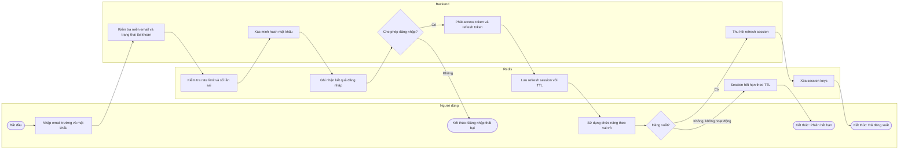
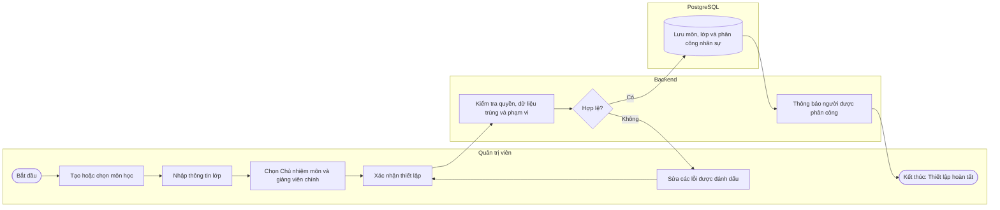
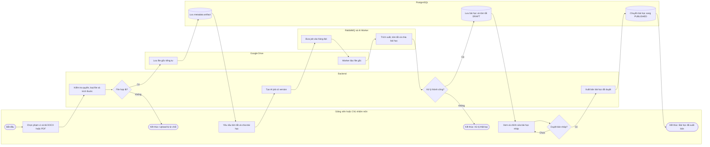
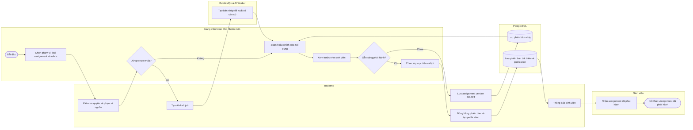
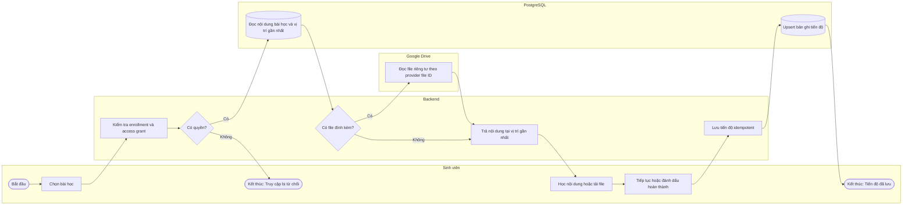
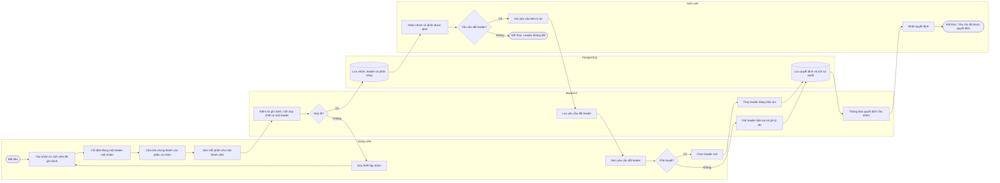
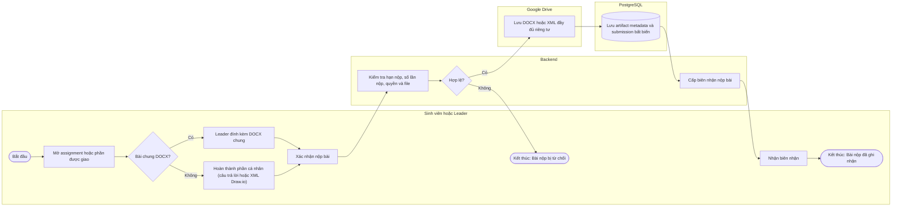
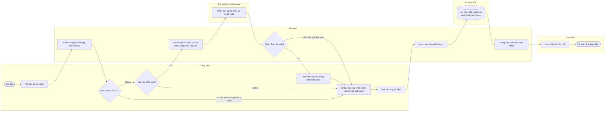
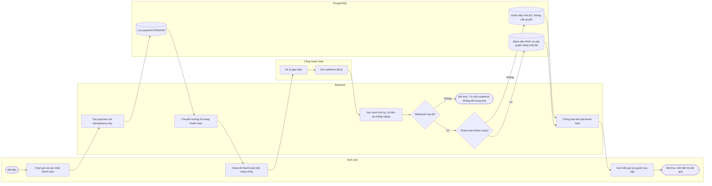

# 2. Main Business Flow

Tài liệu này mô tả các luồng nghiệp vụ đầu-cuối quan trọng của nền tảng. Swimlane thể hiện trách nhiệm của tác nhân, hệ thống và dịch vụ ngoài; các bước kỹ thuật không làm thay đổi kết quả nghiệp vụ được lược bỏ.

Sơ đồ Draw.io (nhãn tiếng Anh) và ảnh PNG dùng cho SRS nằm trong `../main-business-flows/`. Sơ đồ Mermaid dưới đây giữ cùng bước, nhánh quyết định và kết quả với các sơ đồ Draw.io đó.

Quy ước chung:

- Mỗi điểm kết thúc ghi rõ kết quả nghiệp vụ.
- Lane PostgreSQL xuất hiện khi luồng lưu kết quả nghiệp vụ lâu dài; Redis chỉ giữ trạng thái phiên tạm thời; RabbitMQ và AI Worker được gộp chung một lane.
- Chủ nhiệm môn (Subject Manager) được thực hiện chức năng giảng viên nhưng vẫn bị giới hạn bởi môn/lớp được phân công.

## 2.1 Đăng nhập và quản lý phiên (BF-01)

**Trigger:** Người dùng đã được nhà trường cấp tài khoản và nhập email trường cùng mật khẩu.

**End condition:** Người dùng vào được hệ thống với đúng vai trò, hoặc đăng nhập thất bại với lỗi trung tính; phiên kết thúc khi người dùng đăng xuất (session bị thu hồi) hoặc khi refresh session hết TTL trong Redis.

**Text alternative:** Người dùng nhập email trường và mật khẩu. Backend kiểm tra miền email và trạng thái tài khoản, Redis kiểm tra rate limit và số lần sai, sau đó backend xác minh hash mật khẩu và Redis ghi nhận kết quả (tăng hoặc đặt lại bộ đếm). Nếu không được phép đăng nhập, người dùng nhận lỗi trung tính không tiết lộ tài khoản có tồn tại hay không. Nếu hợp lệ, backend phát token và lưu refresh session có TTL. Phiên kết thúc khi người dùng đăng xuất (backend thu hồi và xóa session keys) hoặc khi session hết TTL do không hoạt động. Luồng quên mật khẩu bằng OTP là luồng hỗ trợ và không tách thành Main Business Flow riêng.

## 2.2 Thiết lập môn học, lớp và phân công (BF-02)

**Trigger:** Quản trị viên cần mở môn/lớp mới hoặc thay đổi người phụ trách.

**End condition:** Môn và lớp hợp lệ được lưu; mỗi môn có một Chủ nhiệm môn, mỗi lớp có một giảng viên chính và người được phân công được thông báo. Dữ liệu không hợp lệ được trả lại để quản trị viên sửa và xác nhận lại.

**Text alternative:** Quản trị viên tạo hoặc chọn môn, nhập lớp và chọn Chủ nhiệm môn cùng giảng viên chính rồi xác nhận. Backend kiểm tra role, dữ liệu trùng và phạm vi. Nếu có lỗi, quản trị viên sửa các trường được đánh dấu và xác nhận lại. Dữ liệu hợp lệ được lưu vào PostgreSQL và người được phân công nhận thông báo.

## 2.3 Upload tài liệu, AI tóm tắt và chia bài học (BF-03)

**Trigger:** Giảng viên hoặc Chủ nhiệm môn tải DOCX/PDF lên môn hay lớp được phân công và yêu cầu AI xử lý.

**End condition:** File gốc được lưu riêng tư trên Google Drive và các bài học được xuất bản sau khi người có quyền duyệt bản nháp; hoặc upload bị từ chối, hoặc xử lý AI thất bại mà không tạo bài học.

**Text alternative:** File hợp lệ được lưu riêng tư trên Google Drive và metadata được lưu trong `artifacts`. Khi người dùng yêu cầu, backend tạo job có version qua RabbitMQ; AI Worker đọc file gốc bằng quyền nội bộ, trích xuất, tóm tắt và chia bài học. Nếu xử lý thất bại, người dùng nhận thông báo an toàn và không có bài học nào được tạo. Nếu thành công, kết quả được lưu ở trạng thái `DRAFT` để người dùng chỉnh sửa; chỉ bài học đã duyệt mới được chuyển sang `PUBLISHED`.

## 2.4 Soạn, duyệt và phát hành assignment (BF-04)

**Trigger:** Giảng viên hoặc Chủ nhiệm môn muốn tạo một assignment mới, thủ công hoặc có AI hỗ trợ.

**End condition:** Một phiên bản assignment bất biến được phát hành tới các lớp mục tiêu và sinh viên nhận được thông báo; hoặc phiên bản nháp được lưu để tiếp tục chỉnh sửa.

**Text alternative:** Người có quyền chọn phạm vi, loại assignment và rubric; backend kiểm tra quyền và phạm vi nguồn. AI có thể tạo bản nháp nhưng người dùng luôn phải soạn hoặc chỉnh sửa và xem trước. Nếu chưa sẵn sàng, phiên bản được lưu dạng `DRAFT` rồi quay lại chỉnh sửa. Khi phát hành, người dùng chọn lớp mục tiêu và lịch: giảng viên chỉ chọn lớp được phân công, Chủ nhiệm môn có thể phát hành cho mọi lớp thuộc môn mà không cần giảng viên lớp duyệt lại. Backend đóng băng phiên bản, lưu publication và thông báo sinh viên.

## 2.5 Truy cập bài học và ghi nhận tiến độ (BF-05)

**Trigger:** Sinh viên mở một bài học thuộc lớp đã ghi danh.

**End condition:** Nội dung (và file đính kèm nếu có) được hiển thị tại vị trí học gần nhất và tiến độ mới được lưu; hoặc truy cập bị từ chối rõ ràng.

**Text alternative:** Backend kiểm tra ghi danh và access grant. Khi hợp lệ, backend đọc nội dung bài học và vị trí học gần nhất từ PostgreSQL; chỉ khi bài học có file đính kèm, backend mới đọc file riêng tư trên Google Drive theo provider file ID. Mọi truy cập dữ liệu đều đi qua backend. Tiến độ mới được lưu idempotent vào PostgreSQL.

## 2.6 Tổ chức nhóm, phân việc và đổi leader (BF-06)

**Trigger:** Giảng viên cần chia lớp thành nhóm và phân công các phần cá nhân của một bài chung.

**End condition:** Mỗi nhóm có đúng một leader và mỗi phần cá nhân được gán cho đúng một thành viên; nếu có yêu cầu đổi leader, giảng viên phê duyệt hoặc từ chối, quyết định được lưu kèm lịch sử audit và thông báo cho nhóm.

**Text alternative:** Giảng viên tạo nhóm từ sinh viên đã ghi danh, chỉ định đúng một leader và gán mỗi phần cá nhân cho một thành viên. Backend kiểm tra ghi danh, tính duy nhất và ràng buộc một leader; nếu không hợp lệ, giảng viên sửa thiết lập. Thành viên có thể gửi yêu cầu đổi leader kèm lý do; chỉ giảng viên được phê duyệt (chọn leader mới) hoặc từ chối (giữ leader và ghi lý do). Mọi quyết định được lưu lịch sử audit và thông báo cho nhóm.

## 2.7 Làm và nộp bài cá nhân hoặc bài chung (BF-07)

**Trigger:** Assignment đang mở và sinh viên muốn nộp phần cá nhân được giao hoặc leader muốn nộp DOCX chung.

**End condition:** Một submission bất biến được tạo, file đầy đủ được lưu riêng tư trên Google Drive và người nộp nhận biên nhận; hoặc bài nộp bị từ chối kèm lý do mà không lưu file.

**Text alternative:** Loại bài nộp do assignment quyết định. Với bài chung, chỉ leader hiện tại được đính kèm và nộp hoặc nộp lại DOCX chung; với phần cá nhân, chỉ thành viên được giao phần đó được nộp câu trả lời hoặc XML Draw.io đầy đủ. Sau khi người dùng xác nhận, backend kiểm tra hạn nộp, số lần nộp, quyền và file. Chỉ bài nộp hợp lệ mới được lưu file riêng tư lên Google Drive, nên không phát sinh file mồ côi khi người dùng không xác nhận hoặc bị từ chối. Metadata và submission bất biến được lưu trong PostgreSQL rồi backend cấp biên nhận.

## 2.8 Chọn phương pháp chấm và công bố điểm (BF-08)

**Trigger:** Giảng viên mở một submission hợp lệ chưa được chốt điểm.

**End condition:** Điểm cuối cùng do giảng viên nhập hoặc xác nhận được lưu kèm lịch sử thay đổi; điểm phần cá nhân và điểm bài chung được lưu riêng và công bố cho đúng sinh viên hoặc nhóm; bài chung chỉ được chấm tay.

**Text alternative:** Bài chung DOCX luôn được chấm tay; giảng viên xem bài chung cạnh các phần cá nhân để đối chiếu. Với phần cá nhân, giảng viên chọn chấm tay hoặc yêu cầu AI đề xuất. Với Draw.io, XML đầy đủ được giữ nguyên, bản rút gọn chỉ được tạo khi gọi AI. Nếu AI lỗi hoặc quá thời gian, giảng viên chuyển sang chấm tay. Đề xuất AI không tự trở thành điểm cuối: dù chấp nhận, sửa hay bỏ đề xuất, giảng viên luôn phải nhập hoặc xác nhận điểm và phản hồi cuối cùng trước khi chốt. Backend lưu grade cùng grade history, lưu riêng điểm phần cá nhân và bài chung, rồi thông báo sinh viên hoặc nhóm.

## 2.9 Thanh toán và cấp quyền truy cập (BF-09)

**Trigger:** Sinh viên chọn một gói học hoặc nội dung yêu cầu thanh toán.

**End condition:** Webhook hợp lệ báo thanh toán thành công thì payment chuyển `PAID` và access grant được cấp đúng một lần; thanh toán thất bại hoặc bị hủy thì payment chuyển `FAILED` và không cấp quyền; webhook không hợp lệ bị từ chối, ghi log và không làm đổi trạng thái payment.

**Text alternative:** Backend tạo payment với idempotency key, lưu trạng thái `PENDING` và chuyển sinh viên tới trang của cổng thanh toán. Sinh viên hoàn tất thanh toán trước, sau đó cổng mới xử lý giao dịch và gửi webhook đã ký. Backend xác minh chữ ký, số tiền và chống replay; webhook không hợp lệ bị từ chối, ghi log bảo mật và không làm đổi trạng thái. Webhook hợp lệ báo thất bại thì payment chuyển `FAILED`; báo thành công thì payment chuyển `PAID` và `access_grants` được tạo đúng một lần, kể cả khi webhook bị gửi lặp. Kết quả redirect từ trình duyệt không tự cấp quyền. Đối soát định kỳ với nhà cung cấp là luồng hỗ trợ.

## 2.10 Business Flow Coverage

| Business flow | Nghiệp vụ chính được bao phủ |
|---|---|
| BF-01 | Tài khoản được cấp sẵn, xác minh mật khẩu, rate limit, session Redis, đăng xuất và hết hạn phiên |
| BF-02 | Môn, lớp, Chủ nhiệm môn, giảng viên chính và sửa lỗi dữ liệu |
| BF-03 | Google Drive, artifact, AI tóm tắt và chia bài học, lỗi xử lý AI, duyệt và xuất bản |
| BF-04 | Assignment thủ công/AI, bản nháp, xem trước và phát hành tới lớp mục tiêu |
| BF-05 | Enrollment, access grant, học liệu, file đính kèm tùy chọn và tiến độ |
| BF-06 | Nhóm, leader, phần việc cá nhân, kiểm tra hợp lệ và yêu cầu đổi leader có audit |
| BF-07 | Bài cá nhân, XML Draw.io đầy đủ, DOCX chung, xác nhận trước khi lưu và biên nhận |
| BF-08 | Chấm tay hoặc AI đề xuất, fallback khi AI lỗi, XML rút gọn, điểm lưu riêng và grade history |
| BF-09 | Payment `PENDING`, webhook đã ký, `FAILED`/`PAID` và access grant idempotent |

Các use case quản trị AI, báo cáo, audit, notification, quên mật khẩu bằng OTP và đối soát thanh toán là luồng hỗ trợ hoặc luồng quản trị, được gọi từ các business flow chính khi cần và không tách thành Main Business Flow riêng.
