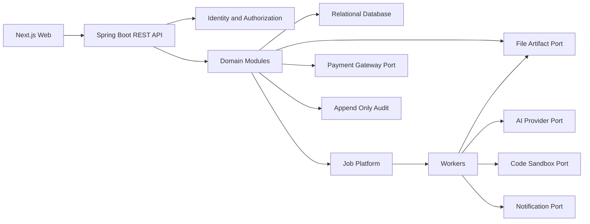

# Component Dependencies and Data Flow

## 1. Dependency principles

- Dependency đi từ adapter/controller vào application/domain, rồi ra port; domain không phụ thuộc SDK provider.
- Cross-module write phải qua public application service hoặc event contract.
- Database có thể cùng instance ở modular monolith nhưng schema/table ownership theo module.
- Worker dùng cùng module contracts và không vượt authorization/context scope của job nguồn.

## 2. Dependency matrix

| Consumer | Identity | Academic | Group | Content | Learning | Bank | Assessment | Submission | Grading | AI | Code Exec | Payment | Reporting | Notification | File | Job | Audit |
|---|---:|---:|---:|---:|---:|---:|---:|---:|---:|---:|---:|---:|---:|---:|---:|---:|---:|
| Identity & Access | O | - | - | - | - | - | - | - | - | - | - | - | - | - | - | W | W |
| Academic | R | O | - | - | - | - | - | - | - | - | - | R | - | - | - | - | W |
| Group | R | R | O | - | - | - | R | - | - | - | - | - | - | - | - | - | W |
| Content | R | R | - | O | - | - | - | - | - | - | - | - | - | - | W | W | W |
| Learning | R | R | - | R | O | - | - | - | - | - | - | - | - | - | - | - | W |
| Question Bank | R | R | - | - | - | O | - | - | - | - | - | - | - | - | - | - | W |
| Assessment | R | R | R | R | - | R | O | - | - | W | - | - | - | - | R | W | W |
| Submission | R | R | R | - | - | R | R | O | - | - | R | - | - | - | W | W | W |
| Grading | R | R | R | - | - | R | R | R | O | W | R | - | - | - | R | W | W |
| AI Orchestration | R | R | - | R | - | R | - | - | - | O | - | - | - | - | R | W | W |
| Code Execution | R | R | - | - | - | - | R | R | - | - | O | - | - | - | R | W | W |
| Payment | R | R | - | - | - | - | - | - | - | - | - | O | - | - | - | W | W |
| Reporting | R | R | R | - | - | - | R | R | R | - | - | - | O | - | R | W | W |
| Notification | R | R | R | - | - | - | R | R | R | - | - | - | - | O | - | W | W |
| File & Artifact | R | - | - | - | - | - | - | - | - | - | - | - | - | - | O | W | W |
| Job Platform | - | - | - | - | - | - | - | - | - | - | - | - | - | - | - | O | W |
| Audit | - | - | - | - | - | - | - | - | - | - | - | - | - | - | - | - | O |

`O`: owner; `R`: read/use public contract; `W`: invokes/writes through public contract; `-`: không phụ thuộc trực tiếp.

Ma trận liệt kê đủ 17 module ở cả hàng và cột. Identity & Access, File & Artifact, Job Platform và Audit là module nền: chúng không phụ thuộc module nghiệp vụ nào, và Job Platform cùng Audit không gọi ngược lên Identity để tránh tạo chu trình - controller truyền sẵn actor context xuống. Ba cột Learning, Reporting và Notification trống ngoài ô owner vì không module nào đọc chúng qua contract đồng bộ; chúng chỉ tiêu thụ event. Ma trận biểu diễn contract đồng bộ hoặc command trực tiếp; event/outbox gián tiếp không được tính là quyền đọc bảng của module khác. Learning chỉ kiểm Academic enrollment trước khi cấp nội dung; Payment chỉ cộng token AI.

AI Orchestration chỉ nhận request/context reference đã được Assessment hoặc Grading kiểm quyền. Nó đọc nguồn Content/Question Bank/File theo scope và ghi Job, rồi trả proposal qua contract cho module gọi; không đọc hoặc ghi trực tiếp dữ liệu Assessment, Submission hay Grading. Cách này giữ U03 độc lập với U04-U06. Content không gọi thẳng AI Orchestration: mọi tác vụ RAG, transcript hay tóm tắt đều được Content enqueue qua Job Platform, nên đồ thị không có chu trình hai chiều.

## 3. Sơ đồ dependency

### Text alternative

Next.js gọi REST API. API xác thực và chuyển vào domain modules. Domain lưu transactional data trong relational database, dùng artifact port cho file và job platform cho tác vụ dài. Worker gọi AI, code sandbox, notification và artifact ports. Payment dùng gateway port riêng. Mọi module phát audit event bất biến.

## 4. Data ownership

| Data | Owner | Tham chiếu bởi |
|---|---|---|
| User, role, scope, session | Identity & Access | Tất cả module qua actor/resource contract |
| Subject, class, enrollment | Academic | Group, Content, Learning, Assessment, Reporting |
| Group, leader, allocation | Group | Submission, Grading, Reporting |
| Material/content/source/transcript version | Content | Learning, AI, Assessment |
| QuestionVersion/RubricVersion | Question Bank | Assessment, Submission snapshot, Grading, AI |
| Assessment/template/copy assignment/version/publication/simulation policy | Assessment | Submission, Grading, Reporting |
| Attempt snapshot, draft/submission/composite/artifact refs | Submission | Grading, Reporting |
| Grade/proposal/publication state | Grading | Learning, Reporting, Notification |
| Object bytes/checksum/abuse check/derivation | File & Artifact | Content, Submission, AI, Reporting |
| Payment/event/entitlement | Payment | AI (số dư token AI) |
| Audit events | Audit | Admin query only |

## 5. Trust boundaries

- Browser, upload content, webhook và mọi provider response là untrusted input.
- API authorization chạy trước load/return resource nhạy cảm.
- Worker payload chỉ chứa ID/reference; worker tải dữ liệu qua scoped service.
- Signed artifact access có TTL, purpose và actor binding khi khả thi.
- Full Draw.io XML không được gửi thẳng sang AI; derived artifact được tạo trong trusted worker sau validation.

## 6. Change-specific communication contracts

- Content → Job: `YOUTUBE_TRANSCRIPT_INGEST` chỉ mang source/version reference đã được authorize; worker trả transcript artifact và timestamp metadata qua Content service contract.
- Assessment → Submission: `AttemptSnapshot` đóng băng assignment, question/rubric component versions và simulation policy khi attempt bắt đầu.
- Copy assignment/rubric chỉ đọc source version rồi tạo stable identity mới ở lớp đích; không sao chép khóa học/lớp. Assignment đã phát hành bị khóa nội dung; thay đổi bằng ngưng giao rồi tạo version mới, hoặc nhân bản.
- Submission → Job: `GROUP_COMPOSITE_GENERATE` mang danh sách part-version bất biến có thứ tự; kết quả là derived composite artifact/version.
- Submission → Grading: composite evidence và individual-part evidence là read-only. Grading lưu kết quả tách biệt và điểm cuối từng thành viên do giảng viên nhập.
