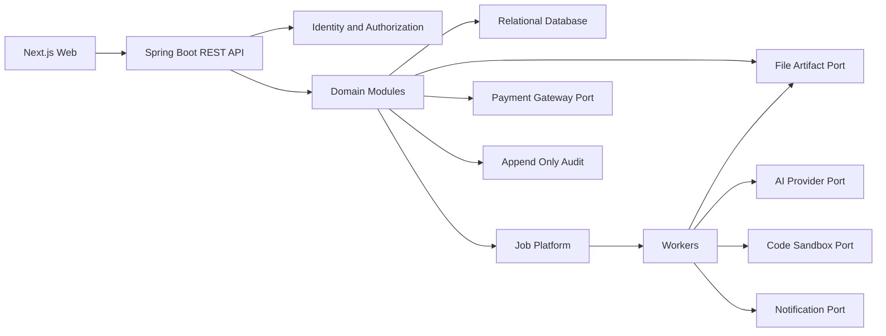

# Component Dependencies and Data Flow

## 1. Dependency principles

- Dependency đi từ adapter/controller vào application/domain, rồi ra port; domain không phụ thuộc SDK provider.
- Cross-module write phải qua public application service hoặc event contract.
- Database có thể cùng instance ở modular monolith nhưng schema/table ownership theo module.
- Worker dùng cùng module contracts và không vượt authorization/context scope của job nguồn.

## 2. Dependency matrix

| Consumer | Identity/Auth | Academic | Group | Content | Assessment | Submission | Grading | AI | File | Job | Audit |
|---|---:|---:|---:|---:|---:|---:|---:|---:|---:|---:|---:|
| Learning | R | R | - | R | - | - | - | - | - | - | W |
| Group | R | R | O | - | R | - | - | - | - | - | W |
| Content | R | R | - | O | - | - | - | W | W | W | W |
| Assessment | R | R | R | R | O | - | - | W | R | W | W |
| Submission | R | R | R | - | R | O | - | - | W | - | W |
| Grading | R | R | R | - | R | R | O | W | R | W | W |
| Reporting | R | R | R | - | R | R | R | - | R | W | W |
| Payment | R | R | - | - | - | - | - | - | - | W | W |
| Notification | R | R | R | - | R | R | R | - | - | W | W |

`O`: owner; `R`: read/use public contract; `W`: invokes/writes through public contract; `-`: không phụ thuộc trực tiếp.

## 3. Sơ đồ dependency

### Text alternative

Next.js gọi REST API. API xác thực và chuyển vào domain modules. Domain lưu transactional data trong relational database, dùng artifact port cho file và job platform cho tác vụ dài. Worker gọi AI, code sandbox, notification và artifact ports. Payment dùng gateway port riêng. Mọi module phát audit event bất biến.

## 4. Data ownership

| Data | Owner | Tham chiếu bởi |
|---|---|---|
| User, role, scope, session | Identity & Access | Tất cả module qua actor/resource contract |
| Subject, class, enrollment | Academic | Group, Content, Learning, Assessment, Reporting |
| Group, leader, allocation | Group | Submission, Grading, Reporting |
| Material/content metadata | Content | Learning, AI, Assessment |
| Assessment/publication/version | Assessment | Submission, Grading, Reporting |
| Draft/submission/artifact refs | Submission | Grading, Reporting |
| Grade/proposal/publication state | Grading | Learning, Reporting, Notification |
| Object bytes/checksum/scan | File & Artifact | Content, Submission, AI, Reporting |
| Payment/event/entitlement | Payment | Academic/access checks qua entitlement contract |
| Audit events | Audit | Admin query only |

## 5. Trust boundaries

- Browser, upload content, webhook và mọi provider response là untrusted input.
- API authorization chạy trước load/return resource nhạy cảm.
- Worker payload chỉ chứa ID/reference; worker tải dữ liệu qua scoped service.
- Signed artifact access có TTL, purpose và actor binding khi khả thi.
- Full Draw.io XML không được gửi thẳng sang AI; derived artifact được tạo trong trusted worker sau validation.
