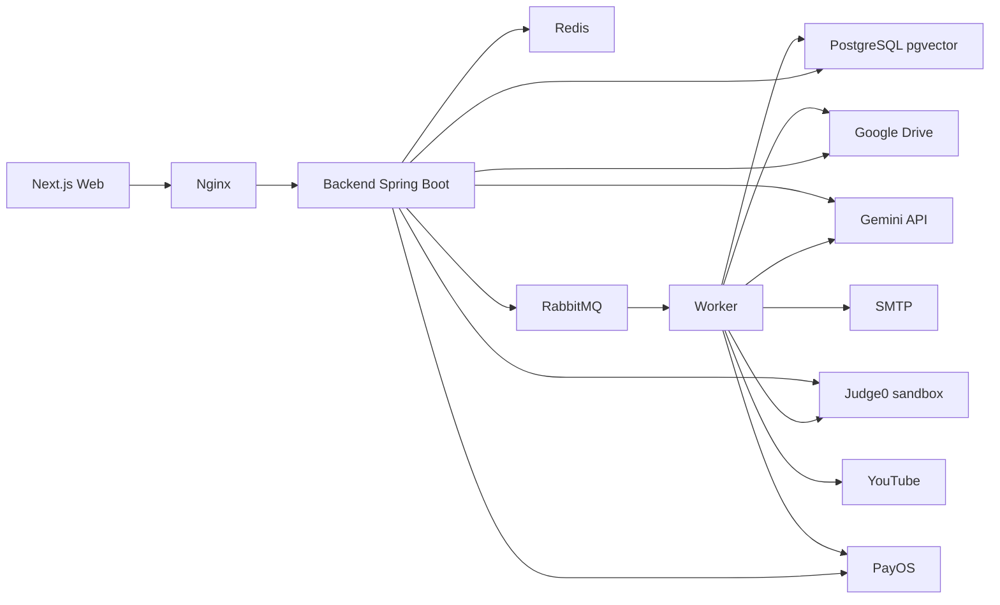

# Component Dependencies and Data Flow

## 1. Dependency principles

- Dependency đi từ controller/adapter vào application/domain rồi ra port; domain không phụ thuộc SDK provider.
- Ghi liên module chỉ qua port công khai hoặc event sau commit.
- Dùng chung một PostgreSQL nhưng mỗi bảng thuộc đúng một module (unit); không module nào đọc bảng của module khác.
- Worker dùng cùng contract và không vượt phạm vi quyền của job nguồn.

## 2. Dependency matrix

Ma trận phụ thuộc giữa module là ma trận 16 unit trong `unit-of-work-dependency.md` §2 (ký hiệu `H` phụ thuộc cứng, `C` contract qua port trung lập, `E` event), kèm hình đồ thị phụ thuộc.

## 3. Sơ đồ runtime

### Text alternative

Trình duyệt gọi Nginx, Nginx chuyển tới backend Spring Boot. Backend lưu dữ liệu trong PostgreSQL (có pgvector), dùng Redis cho phiên/bộ đếm/token, gửi job và event qua RabbitMQ cho worker. Backend và worker lưu file lên Google Drive, gọi Gemini cho AI và embedding, gọi Judge0 trong mạng sandbox để chạy code, gọi PayOS cho thanh toán. Worker gửi email qua SMTP và lấy playlist/caption từ YouTube.

## 4. Data ownership

| Dữ liệu | Owner | Dùng bởi (qua port/event) |
|---|---|---|
| Tài khoản, role, phiên, OTP | U01 | Mọi module |
| Audit, job | U02 | Mọi module |
| File (metadata, token tải) | U03 | U01, U05, U06, U09, U11, U14 |
| Môn, lớp, ghi danh, mã mời | U04 | U01, U05, U06, U08-U12, U14-U16 |
| Chương, bài, phiên bản, nguồn RAG, vector | U05 | U04, U06, U08, U13 |
| Câu hỏi, rubric (phiên bản) | U06 | U08-U11, U13, U15 |
| Giao dịch, ví credit, sổ cái credit | U07 | U13, U16 |
| Bài, thành phần, publication | U08 | U09-U12, U14-U16 |
| Cấu hình loại bài, khung tài liệu | U09 | U06, U08, U10, U11, U13-U15 |
| Template, lineage, chính sách thi thử | U10 | U11, U15 |
| Lượt làm, bài nộp | U11 | U13, U15, U16 |
| Bộ nhóm, thành viên, trưởng nhóm | U12 | U08, U14, U16 |
| Cấu hình AI, đề xuất AI, lần chạy code | U13 | U05, U08, U11, U15 |
| Tài liệu nhóm, mục, bản nộp nhóm | U14 | U13, U15, U16 |
| Điểm, lịch sử điểm | U15 | U11, U16 |
| Thông báo, email outbox, nhắc hạn | U16 | - |

## 5. Trust boundaries

- Trình duyệt, file upload, webhook PayOS, phản hồi Gemini/YouTube/Judge0 đều là đầu vào không tin cậy.
- Kiểm quyền chạy trước khi đọc/trả tài nguyên nhạy cảm.
- Payload job chỉ chứa ID; worker đọc dữ liệu qua service có kiểm phạm vi.
- Token tải file 5 phút gắn tài khoản; không lộ ID file Drive.
- XML Draw.io đầy đủ không gửi thẳng sang AI; chỉ bản rút gọn tạo trong worker sau khi kiểm.
- Judge0 nằm trong mạng `sandbox` không ra Internet, không chạm datastore của hệ thống.

## 6. Contract liên module quan trọng

- U11 → U15, U16: event `u11.submission.submitted` sau commit.
- U14 → U15, U16: event `u14.group.submitted`; realtime qua `platform.realtime`.
- U13 → U15: event `u13.code.graded`; `AiGradingPort` trả đề xuất, U15 quyết định.
- U07 ← U13: `CreditPort.reserve/settle/release` quanh mỗi lời gọi AI.
- U08 ← U09/U12/U13 (`C`): `TypeConfigPort`, `GroupReadinessPort`, `CodeLabCheckPort` khi duyệt/phát hành.
- U04 ← U05 (`C`): `PublishedContentPort` cho trang lớp của người học.
