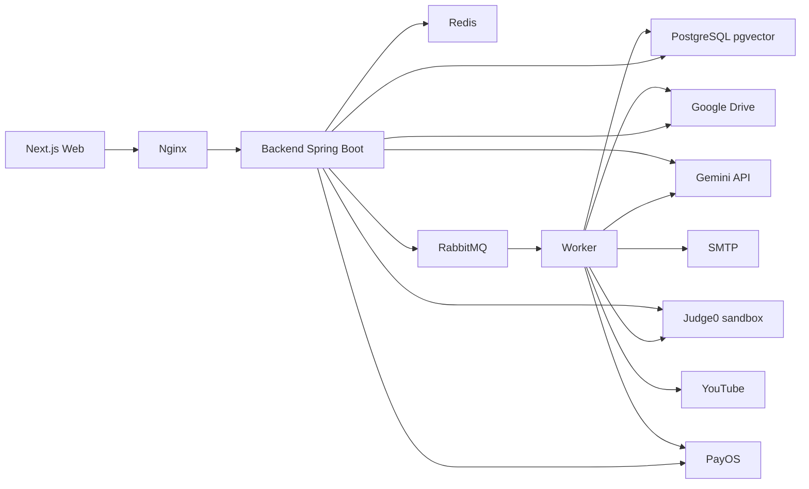

# Component Dependencies and Data Flow

## 1. Dependency principles

- Dependency đi từ controller/adapter vào application/domain rồi ra port; domain không phụ thuộc SDK provider.
- Ghi liên module chỉ qua port công khai hoặc event sau commit.
- Dùng chung một PostgreSQL (45 bảng). Mỗi bảng có một unit chủ tạo migration; phần lớn bảng chỉ unit chủ đọc/ghi. Năm bảng dùng chung (mục 4a) cho phép unit khác thêm cột của mình bằng migration riêng và ghi qua port của unit chủ; không unit nào đọc/ghi repository của unit khác trực tiếp.
- Worker dùng cùng contract và không vượt phạm vi quyền của job nguồn.

## 2. Dependency matrix

Ma trận phụ thuộc giữa module là ma trận 16 unit trong `unit-of-work-dependency.md` §2 (ký hiệu `H` phụ thuộc cứng, `C` contract qua port trung lập, `E` event), kèm hình đồ thị phụ thuộc.

## 3. Sơ đồ runtime

### Text alternative

Trình duyệt gọi Nginx, Nginx chuyển tới backend Spring Boot. Backend lưu dữ liệu trong PostgreSQL (có pgvector), dùng Redis cho phiên/bộ đếm/token, gửi job và event qua RabbitMQ cho worker. Backend và worker lưu file lên Google Drive, gọi Gemini cho AI và embedding, gọi Judge0 trong mạng sandbox để chạy code, gọi PayOS cho thanh toán. Worker gửi email qua SMTP và lấy playlist/caption từ YouTube.

## 3a. Bảng dùng chung

Theo quyết định gộp bảng (2026-09-26): chỉ giữ bảng bắt buộc đứng riêng, có use case liệt kê, hoặc gắn hệ thống ngoài; quan hệ 1-1 thành cột của bảng kia.

| Bảng | Unit chủ (tạo bảng) | Unit khác ghi | Phần ghi | Qua |
|---|---|---|---|---|
| `accounts` | U01 | U07 | Số dư credit | Migration U07 thêm cột; chỉ `CreditLedgerService` của U07 ghi |
| `app_settings` | U01 | U07, U13 | Khóa `u07.*`, `u13.*` | Mỗi unit chỉ ghi khóa có tiền tố của mình |
| `assignments` | U08 | U09, U10 | Cấu hình loại bài, khung (U09); lineage (U10) | `AssignmentExtensionPort` |
| `publications` | U08 | U10, U15 | Chính sách thi thử (U10); công bố điểm (U15) | `AssignmentExtensionPort` |
| `student_groups` | U12 | U14 | Tài liệu nhóm | `GroupDocumentStorePort` |

## 4. Data ownership

| Dữ liệu | Owner | Dùng bởi (qua port/event) |
|---|---|---|
| Tài khoản, role, phiên, OTP | U01 | Mọi module |
| Audit, job | U02 | Mọi module |
| File (metadata, token tải) | U03 | U01, U05, U06, U09, U11, U14 |
| Môn, lớp, ghi danh, mã mời | U04 | U01, U05, U06, U08-U12, U14-U16 |
| Chương, bài, phiên bản, nguồn RAG, vector, thông báo/hỏi đáp lớp | U05 | U04, U06, U08, U13, U16 (event lớp) |
| Câu hỏi, rubric (phiên bản) | U06 | U08-U11, U13, U15 |
| Giao dịch, ví credit, sổ cái credit | U07 | U05, U13, U16 |
| Bài, thành phần, publication | U08 | U09-U12, U14-U16 |
| Cấu hình loại bài, khung tài liệu | U09 | U06, U08, U10, U11, U13-U15 |
| Template, lineage, chính sách thi thử | U10 | U11, U15 |
| Lượt làm, bài nộp | U11 | U13, U15, U16 |
| Bộ nhóm, thành viên, trưởng nhóm | U12 | U08, U14, U16 |
| Cấu hình AI, đề xuất AI, lần chạy code | U13 | U05, U06, U08, U10, U11, U15 |
| Tài liệu nhóm, mục, bản nộp nhóm | U14 | U13, U15, U16 |
| Điểm, lịch sử điểm, sổ điểm đọc qua port | U15 | U11, U16 |
| Thông báo, email outbox, nhắc hạn, dashboard và xuất bảng điểm theo yêu cầu | U16 | - |

## 5. Trust boundaries

- Trình duyệt, file upload, webhook PayOS, phản hồi Gemini/YouTube/Judge0 đều là đầu vào không tin cậy.
- Kiểm quyền chạy trước khi đọc/trả tài nguyên nhạy cảm.
- Payload job chỉ chứa ID; worker đọc dữ liệu qua service có kiểm phạm vi.
- Token tải file 5 phút gắn tài khoản; không lộ ID file Drive.
- XML Draw.io đầy đủ không gửi thẳng sang AI; chỉ bản rút gọn tạo trong worker sau khi kiểm.
- Judge0 nằm trong mạng `sandbox` không ra Internet, không chạm datastore của hệ thống.

## 6. Contract liên module quan trọng

- U11 → U15, U16: event `u11.submission.submitted` sau commit.
- U14 → U15, U16: event `u14.group.submitted`; realtime qua `platform.realtime`.
- U05 → U16: event bài đăng/câu hỏi/trả lời của lớp sau commit; U16 tạo thông báo trong app theo thành viên lớp.
- U13 → U15: event `u13.code.graded`; `AiGradingPort` trả đề xuất, U15 quyết định.
- U07 ← U05/U13: `CreditPort.reserve/settle/release` quanh mỗi lời gọi Gemini, kể cả embedding. U05 ghi người tải/phát hành khi tạo nguồn học liệu; U13 truyền người yêu cầu khi truy xuất RAG. Hết hạn mức hệ thống thì trả "Hệ thống đang bận" và không trừ credit cho lời gọi bị từ chối.
- U08 ← U09/U12/U13 (`C`): `TypeConfigPort`, `GroupReadinessPort`, `CodeLabCheckPort` khi duyệt/phát hành.
- U04 ← U05 (`C`): `PublishedContentPort` cho trang lớp của người học.
