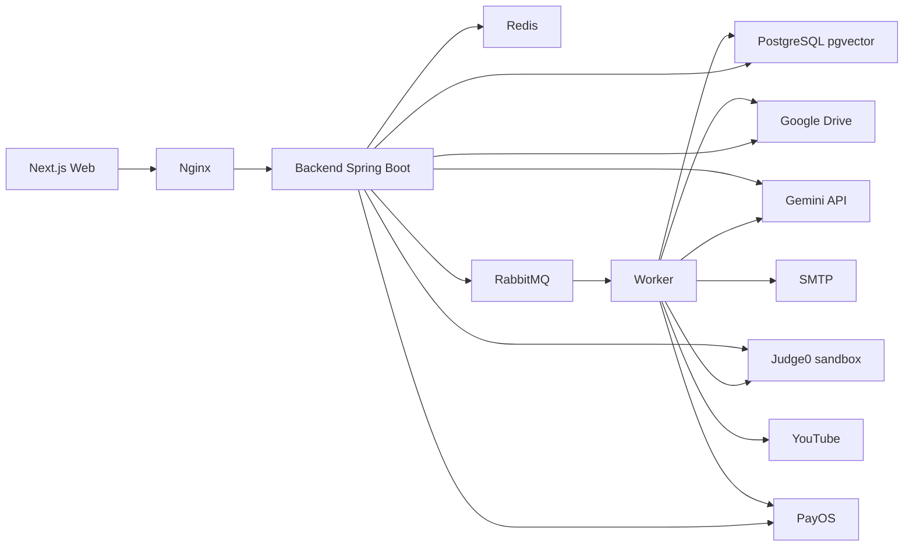

# Component Dependencies and Data Flow

## 1. Dependency principles

- Dependency đi từ controller/adapter vào application/domain rồi ra port; domain không phụ thuộc SDK provider.
- Ghi liên module chỉ qua port công khai hoặc event sau commit.
- Dùng chung PostgreSQL; danh sách bảng theo domain-entities/infrastructure-design của từng unit, không dùng số bảng/catalog database cũ. Unit khác đọc/ghi qua port của owner; accounts có cột credit/preferences, assignments có type config theo contract; system_settings do U03 sở hữu.
- Worker dùng cùng contract và không vượt phạm vi quyền của job nguồn.

## 2. Dependency matrix

Ma trận phụ thuộc giữa module là ma trận 15 unit trong `unit-of-work-dependency.md` §2 (ký hiệu `H` phụ thuộc cứng, `C` contract qua port trung lập, `E` event), kèm hình đồ thị phụ thuộc.

## 3. Sơ đồ runtime

```mermaid
flowchart LR
    Web["Next.js Web"] --> Nginx["Nginx"]
    Nginx --> Api["Backend Spring Boot"]
    Api --> Db["PostgreSQL pgvector"]
    Api --> Redis["Redis"]
    Api --> Mq["RabbitMQ"]
    Mq --> Worker["Worker"]
    Worker --> Db
    Api --> Drive["Google Drive"]
    Worker --> Drive
    Worker --> Gemini["Gemini API"]
    Api --> Gemini
    Worker --> Judge0["Judge0 sandbox"]
    Api --> Judge0
    Api --> PayOS["PayOS"]
    Worker --> PayOS
    Worker --> Smtp["SMTP"]
    Worker --> YouTube["YouTube"]
```

### Text alternative

Trình duyệt gọi Nginx, Nginx chuyển tới backend Spring Boot. Backend lưu dữ liệu trong PostgreSQL (có pgvector), dùng Redis cho phiên/bộ đếm/token, gửi job và event qua RabbitMQ cho worker. Backend và worker lưu file lên Google Drive, gọi Gemini cho AI và embedding, gọi Judge0 trong mạng sandbox để chạy code, gọi PayOS cho thanh toán. Worker gửi email qua SMTP và lấy tiêu đề, caption video từ YouTube.

## 3a. Bảng dùng chung

Theo quyết định gộp bảng (2026-09-26): chỉ giữ bảng bắt buộc đứng riêng, có use case liệt kê, hoặc gắn hệ thống ngoài; quan hệ 1-1 thành cột của bảng kia.

| Bảng | Unit chủ (tạo bảng) | Unit khác ghi | Phần ghi | Qua |
|---|---|---|---|---|
| `accounts` | U01 | U07, U16 | Số dư credit (U07); `email_preferences` (U16) | Migration của unit đó thêm cột; chỉ `CreditService` của U07 ghi số dư |
| `assignments` | U08 | U09 | Cấu hình dạng và khung của U09; lineage/copy do U08 giữ | AssignmentExtensionPort |
| `assignments` (cột `reminder_sent_at`) | U08 | U16 | Mốc nhắc hạn; công bố điểm theo evaluations của U15 tại (bài, lớp), không grades_released_at trên bài | AssignmentExtensionPort |

## 4. Data ownership

| Dữ liệu | Owner | Dùng bởi (qua port/event) |
|---|---|---|
| Tài khoản, role, phiên, OTP | U01 | Mọi module |
| Audit | U02 | Mọi module |
| Settings (`system_settings`, U07/U13 khai báo nhóm) | U03 | U07, U13; Settings Admin UI của U03 |
| Cơ chế việc nền, worker, sự kiện thông báo (không có bảng job) | U03 | Mọi module có việc nền hoặc thông báo |
| File (metadata trên Google Drive, `FileRef`, token tải; không có bảng) | U03 | U05, U06, U09, U11, U14 |
| Môn, lớp, ghi danh | U04 | U01, U05, U06, U08/U09/U11-U16 |
| Module của môn, học liệu tải lên (tệp/YouTube) kèm kết quả quét, summary và embedding, thông báo lớp | U05 | U04, U06, U08, U13, U16 (event lớp) |
| Câu hỏi, rubric (phiên bản) | U06 | U08/U09/U11, U13, U15 |
| Giao dịch, gói credit, số dư trên `accounts` (giữ/trừ nằm ở `ai_suggestions`) | U07 | U05, U13, U16 |
| Bài, câu của bài, lịch | U08 | U09/U11, U14-U16 |
| Cấu hình loại bài, khung tài liệu | U09 | U06, U08, U11, U13-U15 |
| Lượt làm, bài nộp | U11 | U13, U15, U16 |
| Nhóm của lớp, thành viên, trưởng nhóm | U12 | U08, U14, U16 |
| Đề xuất/số liệu/credit holds (`ai_suggestions`), code_runs (VERIFY/GRADE) | U13 | U05, U06, U08, U09, U11, U15, U16 |
| Tài liệu nhóm (mục, lịch sử, bản nộp trong `group_documents`) | U14 | U13, U15, U16 |
| Đánh giá (`evaluations`, lịch sử trong cột `history`), sổ điểm đọc qua port | U15 | U11, U16 |
| Thông báo (kèm trạng thái email), nhắc hạn, thống kê quản trị và xuất bảng điểm theo yêu cầu | U16 | - |

## 5. Trust boundaries

- Trình duyệt, file upload, webhook PayOS, phản hồi Gemini/YouTube/Judge0 đều là đầu vào không tin cậy.
- Kiểm quyền chạy trước khi đọc/trả tài nguyên nhạy cảm.
- Payload job chỉ chứa ID; worker đọc dữ liệu qua service có kiểm phạm vi.
- Token tải file 5 phút gắn tài khoản; không lộ ID file Drive.
- XML Draw.io đầy đủ không gửi thẳng sang AI; chỉ bản rút gọn tạo trong worker sau khi kiểm.
- Judge0 nằm trong mạng `sandbox` không ra Internet, không chạm datastore của hệ thống.

## 6. Contract liên module quan trọng

- Phản ứng bắt buộc giữa unit đi qua **port gọi trong transaction** (port do unit nhận cài, ghi dòng hoặc gửi việc của unit nhận), không qua event:
  - U11 → U15 (`C`): `SubmissionSubmittedPort` chỉ khi nộp bài `GRADED` → dòng `evaluations` `PENDING`.
  - U14 → U15 (`C`): `GroupSubmittedPort` khi nộp bài nhóm → dòng `evaluations` `GROUP_DOCUMENT`/`MEMBER`.
  - U13 → U15 (`C`): `CodeGradedPort` khi chấm Code Lab xong; `AiGradingPort` trả đề xuất, U15 quyết định.
  - U08 → U11, U14 (`C`): `AssignmentLifecyclePort.onOpened/onRetired` khi mở bài/ngưng giao → việc tạo tài liệu nhóm; tự nộp do scanner của U11/U14.
  - U12 → U14 (`C`): `GroupChangePort.onGroupCreated/onMemberRemoved` → việc tạo tài liệu nhóm, nhả khóa mục.
- Event trên `platform.events` chỉ dùng cho thông báo U16 (mất thì chấp nhận): `enrollment.activated`, `class.*`, `payment.paid`, `assignment.opened`, `group.*`, `grade.published`. U16 nghe bằng queue `jobs.notification`.
- U14 → U16: realtime qua `platform.realtime`.
- U07 ← U13: `CreditPort.reserve/settle/release` chỉ U13 gọi, trong transaction đổi `ai_suggestions.credit_status`. U13 → U07 (`C`): `CreditUsagePort.listUsage` cho bảng lần dùng credit trên màn My Credit Package (U07 khai báo, adapter rỗng tới khi có U13). U13 ← U05 (`C`): `AiUsagePort.quote/hold/begin/complete/fail/release` cho mọi lời gọi Gemini của U05 (quét học liệu, embedding): kill-switch, trần chi phí/ngày, tần suất và giữ credit của người bấm khi nhận yêu cầu tóm tắt, settle lượng thật và trả phần dư; U13 truyền người yêu cầu khi truy xuất RAG. Hết hạn mức hệ thống thì trả "Hệ thống đang bận" và không trừ credit cho lời gọi bị từ chối.
- U08 ← U09/U12/U13 (`C`): `TypeConfigPort`, `GroupReadinessPort`, `CodeLabCheckPort` khi duyệt/phát hành.
- U04 ← U05 (`C`): `PublishedContentPort` cho trang lớp của người học.

## Baseline 2026-10-09

73 UC/51 story/15 unit theo unit map; U10 đã bỏ, copy/version/bài của môn do U08 giữ. U03 Settings UC 70–71, U02 Audit UC 73; U13 khai báo nhóm AI qua SettingsPort của U03, lưu code_runs thay cho verification trên questions. U11 đọc ContentRefPort của U05 để kiểm học liệu quiz còn hiển thị; U16 đọc AiUsageStatsPort của U13 qua C. Admin không học thuật/ví/AI; toàn bộ object scope kiểm trước trả dữ liệu.
