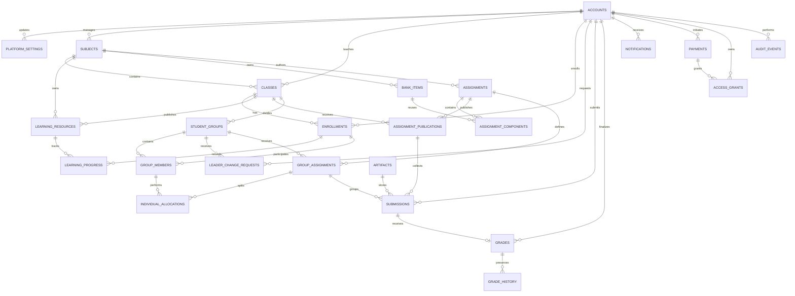

# 3. Conceptual Data Model

## 3.1 Design Principles

Thiết kế này là ERD tổng quan để duyệt nghiệp vụ, chưa phải migration cuối cùng. Các bảng được gộp khi vẫn bảo toàn lịch sử, phân quyền và tính bất biến.

- PostgreSQL; khóa chính dùng `uuid`, thời gian dùng `timestamptz` UTC.
- `created_at`, `updated_at` và optimistic `version` áp dụng cho bảng mutable khi cần.
- Không có bảng password riêng: password hash nằm trong `accounts`.
- Không có bảng role riêng: vai trò cao nhất được lưu trực tiếp tại `accounts.role`; `SUBJECT_MANAGER` kế thừa chức năng của `INSTRUCTOR`.
- Phiên đăng nhập, refresh token và OTP có TTL được lưu trong Redis; không tạo bảng session hoặc OTP trong PostgreSQL.
- Job AI/RAG/Code Lab được RabbitMQ lưu và chuyển tới worker, không tạo bảng `background_jobs` trong PostgreSQL.
- Mỗi dòng `submissions` là một draft/attempt; không cần bảng submission-version riêng.
- AI proposal và điểm cuối cùng cùng nằm trong `grades`; `grade_history` bảo toàn lịch sử thay đổi.
- File bytes được lưu trên Google Drive của tổ chức; PostgreSQL chỉ giữ metadata và Google Drive file ID tại `artifacts`.
- Full Draw.io XML là artifact gốc; compact XML là artifact dẫn xuất chỉ dùng cho AI.

## 3.2 Entity Relationship Diagram

### Text alternative

Accounts contain their role code, may manage subjects, teach classes and enroll in classes as learners. Subjects contain classes and own reusable learning resources, bank items and assignments. Assignments are published to classes; learners submit attempts that may reference artifacts and receive grades. Classes contain student groups; group assignments are split into individual allocations. RabbitMQ handles background jobs outside PostgreSQL. Payments grant access, while notifications and audit events preserve communication and accountability.

## 3.3 Detailed Entity Descriptions

### Entity: `accounts`

| Field | Type | Constraint/Meaning |
|---|---|---|
| account_id | uuid | PK |
| school_email | varchar(254) | Required, normalized, unique |
| display_name | varchar(150) | Required |
| role | varchar(30) | LEARNER, INSTRUCTOR, SUBJECT_MANAGER or ADMIN |
| password_hash | varchar(255) | Adaptive hash; never plaintext |
| password_changed_at | timestamptz | Last credential change |
| failed_login_count | integer | Brute-force control |
| locked_until | timestamptz | Nullable temporary lock |
| status | varchar(30) | PENDING_ACTIVATION, ACTIVE, LOCKED, DISABLED |
| credential_version | integer | Invalidates old access/session claims |
| created_at, updated_at | timestamptz | Audit timestamps |

Description: stores identity, current password credential and the account's highest role in one table. `role` is a stable machine-readable value used for authorization. `SUBJECT_MANAGER` inherits instructor capabilities, while actual subject and class access is determined by assignments in `subjects` and `classes`. No public registration is allowed.

### Entity: `platform_settings`

| Field | Type | Constraint/Meaning |
|---|---|---|
| setting_key | varchar(100) | PK, e.g. ALLOWED_EMAIL_DOMAINS |
| setting_value | jsonb | Schema-validated configuration |
| updated_by | uuid | FK accounts |
| updated_at | timestamptz | Required |

Description: stores small administrator-managed settings such as the school-domain allowlist, avoiding many one-purpose configuration tables.

### Entity: `subjects`

| Field | Type | Constraint/Meaning |
|---|---|---|
| subject_id | uuid | PK |
| manager_account_id | uuid | FK accounts; one Subject Manager may manage many subjects |
| subject_code | varchar(50) | Unique |
| title | varchar(200) | Required |
| description | text | Optional |
| status | varchar(20) | DRAFT, ACTIVE, ARCHIVED |

Description: represents one academic subject and its Subject Manager scope for shared resources and common assignments. The assigned account must have role `SUBJECT_MANAGER` or `ADMIN`.

### Entity: `classes`

| Field | Type | Constraint/Meaning |
|---|---|---|
| class_id | uuid | PK |
| subject_id | uuid | FK subjects |
| instructor_account_id | uuid | FK accounts; exactly one primary instructor |
| class_code | varchar(50) | Unique within subject |
| title | varchar(200) | Required |
| status | varchar(20) | DRAFT, PUBLISHED, ARCHIVED |
| invite_code_hash | varchar(255) | Nullable, Phase 2 |
| invite_expires_at | timestamptz | Nullable, Phase 2 |

Description: represents a class belonging to exactly one subject and managed by exactly one primary instructor. A Subject Manager may also be assigned as this instructor because that role inherits instructor capabilities.

### Entity: `enrollments`

| Field | Type | Constraint/Meaning |
|---|---|---|
| enrollment_id | uuid | PK |
| class_id | uuid | FK classes |
| account_id | uuid | FK accounts |
| status | varchar(20) | ACTIVE, COMPLETED, REMOVED |
| joined_at, ended_at | timestamptz | Effective period |

Description: records learner enrollment only. Instructor assignment is stored in `classes.instructor_account_id`, so no membership role is required. Each learner has at most one active enrollment per class.

### Entity: `artifacts`

| Field | Type | Constraint/Meaning |
|---|---|---|
| artifact_id | uuid | PK |
| owner_account_id | uuid | FK accounts |
| purpose | varchar(50) | MATERIAL, DRAWIO_FULL, DRAWIO_AI_COMPACT, DOCX_GROUP, etc. |
| scope_type, scope_id | varchar + uuid | Resource ownership |
| storage_provider | varchar(30) | GOOGLE_DRIVE |
| provider_file_id | varchar(255) | Google Drive file ID, required and unique |
| drive_id | varchar(255) | Shared Drive ID used by the organization |
| original_file_name | varchar(255) | Original uploaded filename |
| media_type | varchar(150) | Allowlisted |
| byte_size | bigint | Bounded |
| checksum | varchar(128) | Integrity verification |
| scan_status | varchar(20) | PENDING, CLEAN, INFECTED, ERROR |
| source_artifact_id | uuid | Nullable self-FK for derived artifacts |
| created_at | timestamptz | Immutable creation time |

Description: stores metadata and stable identifiers for private files held in the organization's Google Shared Drive. File bytes and public sharing URLs are not stored in PostgreSQL. Backend and worker use `provider_file_id` with controlled Google Drive credentials after authorization. Only CLEAN artifacts may be consumed. An artifact represents a physical file, while `learning_resources` represents business learning content that may reference that file.

### Entity: `learning_resources`

| Field | Type | Constraint/Meaning |
|---|---|---|
| resource_id | uuid | PK |
| scope_type | varchar(20) | SUBJECT or CLASS |
| subject_id, class_id | uuid | Exactly one effective owner scope |
| resource_type | varchar(30) | MATERIAL or CONTENT |
| title | varchar(200) | Required |
| body | text | Nullable authored content |
| artifact_id | uuid | Nullable FK artifacts |
| stable_key | uuid | Groups versions |
| version_no | integer | Unique per stable key |
| status | varchar(30) | DRAFT, PROCESSING, PUBLISHED, FAILED, ARCHIVED |

Description: represents learning content owned by a subject or class. It may contain authored text or reference an `artifacts` row when the content comes from an uploaded file.

### Entity: `learning_progress`

| Field | Type | Constraint/Meaning |
|---|---|---|
| progress_id | uuid | PK |
| enrollment_id | uuid | FK enrollments |
| resource_id | uuid | FK learning_resources |
| completion_percent | numeric(5,2) | 0 to 100 |
| last_position | jsonb | Schema-validated resume position |
| completed_at, updated_at | timestamptz | Progress state |

Description: stores one enrolled learner's current completion and resume position for one learning resource.

### Entity: `bank_items`

| Field | Type | Constraint/Meaning |
|---|---|---|
| bank_item_id | uuid | PK |
| subject_id | uuid | FK subjects |
| item_type | varchar(20) | QUESTION or RUBRIC |
| stable_key | uuid | Groups versions |
| version_no | integer | Unique per stable key |
| title | varchar(200) | Required |
| definition | jsonb | Type-specific validated content |
| status | varchar(20) | DRAFT, ACTIVE, RETIRED |

Description: combines reusable questions and rubrics because both use the same subject ownership, versioning and retirement lifecycle.

### Entity: `assignments`

| Field | Type | Constraint/Meaning |
|---|---|---|
| assignment_id | uuid | PK; each row is one immutable version |
| stable_key | uuid | Groups assignment versions |
| version_no | integer | Unique per stable key |
| scope_type, scope_id | varchar + uuid | SUBJECT or CLASS scope |
| title | varchar(200) | Required |
| assignment_type | varchar(30) | QUIZ, ESSAY, DRAWIO, CODE_LAB, GROUP |
| configuration | jsonb | Type-specific validated configuration |
| status | varchar(20) | DRAFT, REVIEWED, RETIRED |
| created_by | uuid | FK accounts |

Description: defines an immutable version of a task given to learners, including quizzes, essays, Draw.io exercises, code labs and group work. `Assignment` is used because it is clearer in this learning context than the broader term `Assessment`.

### Entity: `assignment_components`

| Field | Type | Constraint/Meaning |
|---|---|---|
| component_id | uuid | PK |
| assignment_id | uuid | FK assignments |
| bank_item_id | uuid | Nullable FK bank_items |
| component_type | varchar(30) | QUESTION, RUBRIC, INSTRUCTION, TEST_CASE |
| sequence_no | integer | Display order |
| configuration | jsonb | Snapshot/type-specific settings |

Description: lists the ordered questions, rubric criteria, instructions or test cases that compose an assignment.

### Entity: `assignment_publications`

| Field | Type | Constraint/Meaning |
|---|---|---|
| publication_id | uuid | PK |
| assignment_id | uuid | FK assignments |
| class_id | uuid | FK classes |
| opens_at, closes_at | timestamptz | Submission window |
| max_attempts | integer | Positive |
| status | varchar(20) | SCHEDULED, OPEN, CLOSED, RETIRED |
| published_by | uuid | FK accounts |

Description: releases one immutable assignment version to one class with its own submission window and attempt limit.

### Entity: `student_groups`

| Field | Type | Constraint/Meaning |
|---|---|---|
| group_id | uuid | PK |
| class_id | uuid | FK classes |
| name | varchar(100) | Unique within class |
| leader_group_member_id | uuid | FK group_members; exactly one active leader |
| status | varchar(20) | ACTIVE, ARCHIVED |

Description: represents a learner group inside one class and identifies exactly one active member as its current leader.

### Entity: `group_members`

| Field | Type | Constraint/Meaning |
|---|---|---|
| group_member_id | uuid | PK |
| group_id | uuid | FK student_groups |
| enrollment_id | uuid | FK enrollments |
| joined_at, left_at | timestamptz | Effective period |

Description: associates active learner enrollments with a group; a learner belongs to at most one active group per class.

### Entity: `leader_change_requests`

| Field | Type | Constraint/Meaning |
|---|---|---|
| request_id | uuid | PK |
| group_id | uuid | FK student_groups |
| requested_by | uuid | FK accounts |
| proposed_member_id | uuid | Nullable FK group_members |
| reason | varchar(1000) | Required |
| status | varchar(20) | PENDING, APPROVED, REJECTED |
| decided_by, decided_at | uuid + timestamptz | Instructor decision |

Description: preserves a learner's request to change the group leader together with the instructor's decision and reason.

### Entity: `group_assignments`

| Field | Type | Constraint/Meaning |
|---|---|---|
| group_assignment_id | uuid | PK |
| group_id | uuid | FK student_groups |
| assignment_id | uuid | FK assignments |
| deadline | timestamptz | Required |
| status | varchar(20) | ASSIGNED, SUBMITTED, GRADED |

Description: assigns one group-type assignment to a particular student group and tracks its shared deadline and state.

### Entity: `individual_allocations`

| Field | Type | Constraint/Meaning |
|---|---|---|
| allocation_id | uuid | PK |
| group_assignment_id | uuid | FK group_assignments |
| group_member_id | uuid | FK group_members |
| part_type | varchar(50) | USE_CASE_DIAGRAM, ACTIVITY_DIAGRAM, etc. |
| instructions | text | Required |
| status | varchar(20) | ASSIGNED, SUBMITTED, GRADED |

Description: assigns one independently deliverable part of a shared group assignment to one member, such as a use-case or activity diagram.

### Entity: `submissions`

| Field | Type | Constraint/Meaning |
|---|---|---|
| submission_id | uuid | PK; each row is one draft/attempt |
| publication_id | uuid | FK assignment_publications |
| submitter_id | uuid | FK accounts |
| group_assignment_id | uuid | Nullable FK group_assignments |
| allocation_id | uuid | Nullable FK individual_allocations |
| submission_kind | varchar(30) | INDIVIDUAL, GROUP_PART, GROUP_SHARED |
| attempt_no | integer | Unique per target and submitter/group |
| answer_payload | jsonb | Quiz/essay/metadata, bounded |
| artifact_id | uuid | Nullable FK artifacts |
| status | varchar(20) | DRAFT, SUBMITTED, LATE, WITHDRAWN |
| submitted_at | timestamptz | Nullable; immutable after submission |

Description: stores individual work, allocated group parts and shared group documents. Each row is one draft or attempt; only the current group leader may submit `GROUP_SHARED` work.

### Entity: `grades`

| Field | Type | Constraint/Meaning |
|---|---|---|
| grade_id | uuid | PK |
| submission_id | uuid | FK submissions, unique current grade |
| grading_method | varchar(20) | MANUAL, DETERMINISTIC, AI_ASSISTED |
| proposed_score, proposed_feedback | numeric + text | Nullable AI/deterministic proposal |
| final_score, final_feedback | numeric + text | Instructor-controlled result |
| proposal_status | varchar(20) | NONE, PENDING, ACCEPTED, REJECTED |
| finalized_by | uuid | Nullable FK accounts |
| status | varchar(20) | DRAFT, FINALIZED, PUBLISHED |

Description: stores the current AI/deterministic proposal and the instructor-controlled final result for one submission. Shared group documents must be graded manually.

### Entity: `grade_history`

| Field | Type | Constraint/Meaning |
|---|---|---|
| history_id | uuid | PK |
| grade_id | uuid | FK grades |
| changed_by | uuid | FK accounts |
| previous_value, new_value | jsonb | Redacted grade snapshot |
| reason | varchar(1000) | Required for override |
| changed_at | timestamptz | Immutable |

Description: is an immutable history of grade changes, including the previous value, new value, responsible account, reason and time. It differs from `assignments`, which define what learners must do.

### Entity: `notifications`

| Field | Type | Constraint/Meaning |
|---|---|---|
| notification_id | uuid | PK |
| recipient_id | uuid | FK accounts |
| event_key | varchar(150) | Idempotency per event/recipient/channel |
| channel | varchar(20) | EMAIL or IN_APP |
| template_code | varchar(100) | Required |
| template_data | jsonb | Redacted, schema-validated |
| status | varchar(20) | PENDING, SENT, FAILED |
| sent_at | timestamptz | Nullable |

Description: stores essential in-app or email notifications and their delivery outcomes without rolling back the source business transaction.

### Entity: `payments`

| Field | Type | Constraint/Meaning |
|---|---|---|
| payment_id | uuid | PK |
| learner_id | uuid | FK accounts |
| provider_transaction_id | varchar(200) | Unique when present |
| product_reference | varchar(150) | Purchased access product |
| amount | numeric(18,2) | Non-negative |
| currency | char(3) | ISO currency |
| status | varchar(20) | CREATED, PENDING, PAID, FAILED, REFUNDED |
| idempotency_key | varchar(150) | Unique by provider/scope |

Description: stores the payment lifecycle and verified provider transaction. A browser redirect alone never marks a payment as `PAID`.

### Entity: `access_grants`

| Field | Type | Constraint/Meaning |
|---|---|---|
| access_grant_id | uuid | PK |
| learner_id | uuid | FK accounts |
| payment_id | uuid | FK payments |
| product_reference | varchar(150) | Access target |
| status | varchar(20) | ACTIVE, EXPIRED, REVOKED |
| granted_at, expires_at | timestamptz | Access period |

Description: records the learner's access right granted exactly once after a verified payment event. The name describes its business meaning more clearly than `entitlements`.

### Entity: `audit_events`

| Field | Type | Constraint/Meaning |
|---|---|---|
| event_id | uuid | PK |
| actor_id | uuid | Nullable FK accounts for system actors |
| actor_type | varchar(20) | USER, WORKER, SYSTEM |
| action | varchar(100) | Stable business/security action code |
| resource_type, resource_id | varchar + uuid | Affected resource reference |
| result | varchar(20) | SUCCESS, DENIED, FAILURE |
| before_data, after_data | jsonb | Redacted snapshots |
| correlation_id | uuid | End-to-end trace |
| occurred_at | timestamptz | Immutable |

Description: stores append-only evidence for authentication failures, role changes, subject/class assignments, grades, publications, payments and privileged operations.

## 3.4 Non-Relational Runtime State

The following runtime state is intentionally outside PostgreSQL and therefore is not shown as an ERD entity:

| Component | Stored state | Reason |
|---|---|---|
| Redis | Refresh session/token hash, OTP hash, attempt counters, rate-limit counters, short-lived cache and temporary distributed locks | Native TTL, atomic counters, fast lookup and no permanent table required |
| RabbitMQ | Versioned AI/RAG/Code Lab job messages, delivery state, retry and dead-letter routing | Queue owns temporary work distribution; completed business results are saved in `grades`, `artifacts` or the relevant business table |

Redis keys must expire automatically. OTP must be stored as a hash, limited by attempt count and deleted immediately after successful use. Changing a password, disabling an account or detecting refresh-token reuse must revoke the relevant session keys. Cache and locks may be rebuilt or allowed to expire; Redis must not become the permanent source of grades, submissions, payments or access grants. RabbitMQ messages must be durable when required, acknowledged only after successful processing and protected with retry/dead-letter policies. RabbitMQ is not the permanent source of business results.

## 3.5 Consolidation Decisions

| Gộp | Lý do |
|---|---|
| Account + Password Credential → `accounts` | Chỉ cần current credential cho MVP; giảm join và bảng phụ |
| Account + Password Credential + Role → `accounts` | Mỗi account giữ một role cao nhất; role cấp trên kế thừa chức năng role cấp dưới |
| OTP and authentication session → Redis | Dữ liệu ngắn hạn dùng TTL; OTP chỉ lưu dạng hash và bị xóa sau khi sử dụng |
| Learner membership → `enrollments` | Chỉ lưu sinh viên; giảng viên chính được lưu trực tiếp trong `classes` |
| Material + Class Content Version → `learning_resources` | Chung scope/version/artifact/publication lifecycle |
| Question Version + Rubric Version → `bank_items` | Chung versioning và reuse; phân biệt bằng item type |
| Assignment + Assignment Version → `assignments` | Mỗi row là immutable version, nhóm bằng stable key |
| Draft + Submission + Submission Version → `submissions` | Mỗi row là một draft/attempt với state transition rõ |
| Grade Proposal + Final Grade → `grades` | Proposal và final thuộc cùng submission; lịch sử ở `grade_history` |

## 3.6 Tables Kept Separate

- `grade_history`: bắt buộc để bảo toàn lịch sử ghi đè điểm.
- `assignment_components`: cần biểu diễn nhiều thành phần có thứ tự trong một assignment.
- `group_members` và `individual_allocations`: cần thực thi đúng một leader và phần việc từng người.
- `payments` và `access_grants`: thanh toán không đồng nghĩa cấp quyền; webhook phải xác minh trước.
- `artifacts`: tách metadata file khỏi mọi nghiệp vụ sử dụng file.
- `audit_events`: append-only và có quyền lưu trữ khác dữ liệu nghiệp vụ.

## 3.7 Key Cross-Table Constraints

1. Mỗi account có email normalized duy nhất; password không bao giờ lưu plaintext.
2. Mỗi account có một `role`; `SUBJECT_MANAGER` kế thừa chức năng giảng viên và `ADMIN` có quyền quản trị toàn hệ thống.
3. Mỗi class thuộc đúng một subject, có đúng một giảng viên chính; mỗi learner có tối đa một active enrollment trong class.
4. Mỗi student group có đúng một leader là active member của chính group đó.
5. Chỉ leader hiện tại được tạo `GROUP_SHARED` submission.
6. Submitted row và artifact gốc là immutable; lần nộp lại tạo attempt mới.
7. Full Draw.io XML phải có purpose `DRAWIO_FULL`; compact XML tham chiếu source artifact và chỉ được AI job đọc.
8. `GROUP_SHARED` grade chỉ có `MANUAL`; AI chỉ có thể đề xuất cho phần cá nhân.
9. Worker cập nhật kết quả thông qua event/internal contract; không ghi trực tiếp bảng nghiệp vụ.
10. Access grant chỉ được tạo từ payment `PAID` sau verified, idempotent webhook.
11. Audit event không có application update/delete operation và phải redaction secret/PII.
12. Refresh session chỉ lưu trong Redis với TTL/revocation policy; PostgreSQL không có bảng session.
13. RabbitMQ chỉ lưu trạng thái xử lý tạm thời; kết quả nghiệp vụ hoàn tất phải được lưu vào bảng nghiệp vụ tương ứng.
14. OTP, rate-limit counter, cache và lock trong Redis phải có TTL; OTP không được lưu dạng rõ và không được tái sử dụng.
15. Google Drive file phải ở Shared Drive của tổ chức và không được đặt chế độ public; ứng dụng phân quyền trước khi backend hoặc worker truy cập bằng `provider_file_id`.
